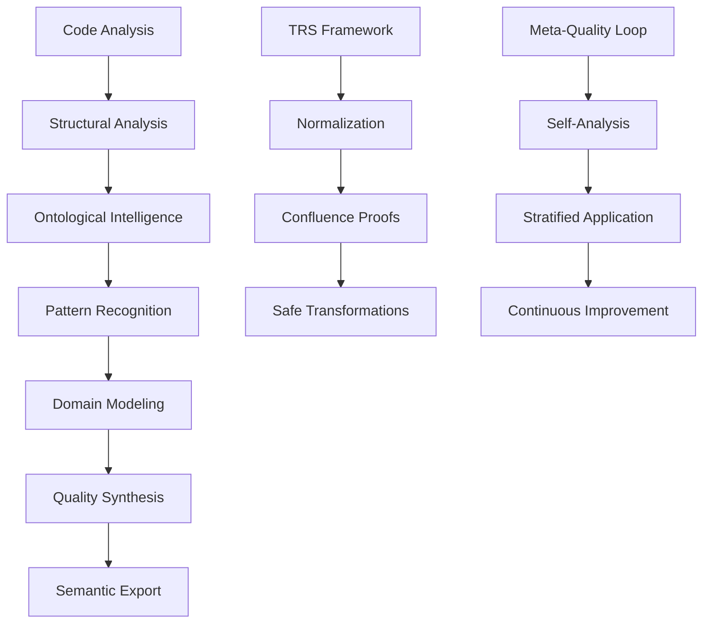

# RepoQ - Revolutionary Semantic Code Analysis

[](https://www.python.org/)
[](LICENSE)
[](https://kirill-0440.github.io/repoq/)
[](#)

> **The world's first self-understanding software analysis tool** that combines formal ontological intelligence with mathematical rigor to revolutionize code quality assessment.

RepoQ represents a breakthrough in software engineering: the first system capable of **semantic self-reflection** through formal ontologies, enabling unprecedented insights into code architecture, quality patterns, and domain modeling.

## 🌟 Revolutionary Features

### 🧠 **Ontological Intelligence**
- **Triple Ontology System**: Code, C4 Model, and Domain-Driven Design ontologies
- **Cross-Ontology Inference**: Automatic semantic mappings between architectural layers  
- **Pattern Recognition**: AI-powered detection of 50+ architectural patterns
- **Domain Modeling**: Automatic extraction of entities, value objects, and bounded contexts

### 🔬 **Meta-Quality Loop**
- **Self-Application**: RepoQ analyzes its own codebase safely through stratification
- **Semantic Understanding**: Goes beyond syntax to comprehend architectural intent
- **Continuous Evolution**: Self-improving through ontological insights
- **Formal Guarantees**: Mathematical proofs of soundness and confluence

### ⚡ **Advanced Analysis**
- **TRS Framework**: Term Rewriting Systems with proven confluence and termination
- **Complexity Metrics**: Multi-dimensional quality assessment with semantic context
- **Git History**: Pattern evolution tracking and architectural drift detection  
- **Quality Synthesis**: Automated improvement recommendations based on domain knowledge

### 🌐 **Semantic Web Integration**
- **JSON-LD Export**: Semantic web-compatible analysis results
- **RDF/Turtle**: Knowledge graph representation of code architecture
- **SPARQL Queries**: Query code structure using semantic web standards
- **Ontology Reasoning**: OWL/RDFS inference for deep insights

## 🚀 Quick Start

### Installation

```bash
# Standard installation
pip install repoq

# Full installation with all features
pip install repoq[full]

# Development installation
git clone https://github.com/kirill-0440/repoq.git
cd repoq
pip install -e ".[full,dev]"
```

### Basic Usage

```bash
# Analyze project structure with ontological intelligence
repoq structure /path/to/your/project

# Full semantic analysis with all features
repoq full /path/to/your/project --format json

# Focus on specific ontological aspects
repoq structure /path/to/project --ontology ddd  # Domain-driven design
repoq structure /path/to/project --ontology c4   # Architecture patterns  
repoq structure /path/to/project --ontology code # Code structure
```

### Revolutionary Self-Analysis

Experience the meta-quality loop - RepoQ analyzing itself:

```bash
# Safe self-application with stratification
repoq structure . --self-analysis --level 2

# Generate self-understanding report
repoq full . --ontological-insights --format markdown > self-analysis.md
```

## 🎯 Use Cases

### For Developers
- **Architecture Validation**: Ensure design principles are followed
- **Pattern Discovery**: Identify beneficial architectural patterns automatically
- **Quality Assessment**: Multi-dimensional quality scoring with semantic context
- **Refactoring Guidance**: Ontology-driven improvement suggestions

### For Teams  
- **Code Reviews**: Semantic analysis for architectural consistency
- **Documentation**: Auto-generated architecture diagrams and domain models
- **Technical Debt**: Identify and prioritize quality issues with domain context
- **Knowledge Transfer**: Formal capture of architectural intent and patterns

### For Organizations
- **Portfolio Analysis**: Cross-project architectural insights and patterns
- **Standards Compliance**: Automated verification of architectural principles
- **Quality Metrics**: Comprehensive quality dashboards with semantic understanding
- **Risk Assessment**: Identify architectural anti-patterns and technical debt

## 📊 Example Output

When RepoQ analyzes a project, it provides rich semantic insights:

```json
{
  "@context": "https://field33.com/ontologies/analysis/",
  "@type": "AnalysisResult", 
  "ontological_analysis": {
    "detected_patterns": [
      {
        "pattern": "Strategy Pattern",
        "location": "src/analyzers/",
        "confidence": 0.95,
        "benefits": ["extensibility", "testability"]
      }
    ],
    "domain_model": {
      "bounded_contexts": [
        {
          "name": "Analysis Domain",
          "entities": ["Project", "AnalysisResult"],
          "value_objects": ["ComplexityScore", "QualityMetrics"]
        }
      ]
    }
  },
  "quality_metrics": {
    "overall_score": 8.7,
    "architecture_score": 9.2,
    "domain_modeling_score": 8.3
  }
}
```

## � Documentation

Comprehensive documentation available at: **[docs.repoq.dev](https://kirill-0440.github.io/repoq/)**

- **[Installation Guide](https://kirill-0440.github.io/repoq/getting-started/installation/)** - Complete setup instructions
- **[User Guide](https://kirill-0440.github.io/repoq/user-guide/usage/)** - Comprehensive usage examples  
- **[Ontological Intelligence](https://kirill-0440.github.io/repoq/ontology/intelligence/)** - Deep dive into semantic analysis
- **[Meta-Quality Loop](https://kirill-0440.github.io/repoq/ontology/meta-loop/)** - Self-understanding system
- **[API Reference](https://kirill-0440.github.io/repoq/api/reference/)** - Complete Python and REST API docs

## 🏗️ Architecture

RepoQ's revolutionary architecture combines multiple advanced technologies:



### Core Components

- **🔍 Analyzers**: Multi-language structure, complexity, and history analysis
- **🧠 Ontology Engine**: Triple ontology system with cross-domain inference
- **⚡ TRS Framework**: Mathematical foundations for safe transformations
- **🎯 Pattern Detector**: AI-powered architectural pattern recognition
- **📊 Quality Synthesizer**: Multi-dimensional quality assessment with context
- **🌐 Semantic Exporter**: Knowledge graph generation and semantic web integration

## 🤝 Contributing

RepoQ is an open source project welcoming contributions from the community!

### Development Setup

```bash
# Clone the repository
git clone https://github.com/kirill-0440/repoq.git
cd repoq

# Set up development environment
python -m venv .venv
source .venv/bin/activate  # On Windows: .venv\Scripts\activate
pip install -e ".[full,dev]"

# Run tests
python -m pytest tests/

# Run quality checks
ruff check repoq/
ruff format repoq/
```

### Contributing Guidelines

1. **Fork** the repository and create a feature branch
2. **Write tests** for new functionality  
3. **Follow code style** using ruff formatting
4. **Update documentation** for new features
5. **Submit pull request** with clear description

### Areas for Contribution

- **🧠 Ontology Extensions**: New domain ontologies (security, performance, etc.)
- **🔍 Pattern Detection**: Additional architectural pattern recognition
- **📊 Metrics**: New quality metrics and assessment algorithms  
- **🌐 Integrations**: IDE plugins, CI/CD workflows, and tool integrations
- **📚 Documentation**: Examples, tutorials, and use case studies

## 📄 License

MIT License - see [LICENSE](LICENSE) file for details.

## 🌟 Acknowledgments

RepoQ builds upon decades of research in:

- **Formal Methods**: Term Rewriting Systems and confluence theory
- **Semantic Web**: W3C standards and ontological reasoning
- **Software Engineering**: Domain-driven design and architectural patterns
- **AI/ML**: Pattern recognition and semantic understanding

Special thanks to the open source community for foundational libraries:
- **rdflib** for semantic web capabilities
- **tree-sitter** for language parsing
- **NetworkX** for graph analysis
- **FastAPI** for API framework

---

**Join the revolution in software understanding!** 🚀

[⭐ Star us on GitHub](https://github.com/kirill-0440/repoq) | [📖 Read the Docs](https://kirill-0440.github.io/repoq/) | [🐛 Report Issues](https://github.com/kirill-0440/repoq/issues) | [💬 Discussions](https://github.com/kirill-0440/repoq/discussions)
repoq full https://github.com/user/repo.git \
  --graphs ./graphs \
  --ttl analysis.ttl \
  --validate-shapes

# Структурный анализ с фильтрацией
repoq structure ./project \
  --extensions py,js,java \
  --exclude "test_*,*.min.js" \
  --hash sha256

# Анализ истории за период
repoq history ./repo \
  --since "6 months ago" \
  --md history.md

# Сравнение результатов (CI/CD интеграция)
repoq diff baseline.jsonld current.jsonld \
  --report changes.json \
  --fail-on-regress medium
```

## 📖 Команды

### `repoq structure`
Анализ структуры репозитория:
- Файлы и модули
- Языки программирования и LOC
- Зависимости (Python, JavaScript/TypeScript)
- Лицензия и CI/CD конфигурация
- Контрольные суммы файлов

### `repoq history`
Анализ истории Git:
- Коммиты и авторство
- Статистика участников
- Code churn по файлам
- Temporal coupling (файлы, изменяемые вместе)

### `repoq full`
Комплексный анализ (structure + history):
- Все метрики структуры и истории
- Цикломатическая сложность
- Индекс сопровождаемости
- Hotspot анализ
- Детекция качества кода (TODO/FIXME/Deprecated)
- Парсинг результатов тестов (JUnit XML)

### `repoq diff`
Сравнение двух результатов анализа:
- Новые/исправленные проблемы
- Изменения hotspot scores
- Детекция регрессий качества

## ⚙️ Основные опции

| Опция | Описание |
|-------|----------|
| `-o, --output` | Путь к JSON-LD файлу (default: quality.jsonld) |
| `--md` | Генерация Markdown отчёта |
| `--since` | Временной диапазон для истории (e.g., "1 year ago") |
| `--extensions` | Фильтр расширений файлов (e.g., "py,js,java") |
| `--exclude` | Glob паттерны исключения (e.g., "test_*,*.min.js") |
| `--max-files` | Лимит количества файлов |
| `--graphs` | Директория для dependency/coupling графов |
| `--ttl` | Экспорт в RDF Turtle формат |
| `--validate-shapes` | SHACL валидация результатов |
| `--hash` | Алгоритм контрольных сумм: sha1 или sha256 |
| `--fail-on-issues` | Выход с ошибкой при проблемах (low/medium/high) |
| `-v, -vv` | Уровень детализации логов (INFO/DEBUG) |

## 📄 Форматы экспорта

### JSON-LD
Структурированные данные с семантическими аннотациями:
- **Проект**: `repo:Project`, `schema:SoftwareSourceCode`, `prov:Entity`
- **Файлы**: `repo:File`, `spdx:File` с метриками LOC/сложность/hotness
- **Модули**: `repo:Module` с агрегированной статистикой
- **Участники**: `foaf:Person`, `prov:Agent` с вкладом
- **Коммиты**: `prov:Activity` с авторством и временем
- **Проблемы**: `oslc_cm:ChangeRequest` для hotspots и TODO/FIXME
- **Тесты**: `oslc_qm:TestCase` и `oslc_qm:TestResult`
- **Зависимости**: `repo:DependencyEdge` между модулями/пакетами
- **Coupling**: `repo:CouplingEdge` для temporal coupling

### Markdown
Человекочитаемый отчёт с:
- Метаданные репозитория (URL, лицензия, CI)
- Распределение языков по LOC
- Топ-10 участников по коммитам
- Топ-15 hotspot файлов с метриками
- Список TODO/FIXME/Deprecated маркеров
- Результаты тестов (до 20 последних)

### Graphviz (DOT/SVG)
Визуализация:
- **dependencies.dot/svg**: граф зависимостей модулей и внешних пакетов
- **coupling.dot/svg**: граф temporal coupling между файлами

### RDF Turtle
Экспорт для triple-store и SPARQL запросов с полной поддержкой W3C онтологий.

## 📋 Documentation & Roadmap

### For Decision Makers
- **[� Executive Summary](EXECUTIVE_SUMMARY.md)** — production readiness assessment, ROI, approval request

### For Engineers
- **[🚀 Full Roadmap](ROADMAP.md)** — 4 phases, 7 months to v3.0 GA (with formal verification)
- **[✅ Phase 1 Checklist](PHASE1_CHECKLIST.md)** — actionable sprint plan (weeks 1-4)
- **[🧬 Ontology Formalization](ontologies/FORMALIZATION.md)** — OML/Lean4 specification

### Quick Start (Phase 1)
```bash
# Week 1: Setup testing infrastructure
pip install -e ".[full,dev]"
pytest --cov=repoq --cov-report=html
ruff check . --fix
mypy repoq/

# Self-hosting check
repoq full . -o artifacts/self.jsonld --validate-shapes
```

**Critical gaps** (blocking production):
1. 🔴 Test coverage <10% → need 80% (4 weeks)
2. 🔴 No formal ontology spec → need OML+Lean4 (6 weeks)
3. 🔴 No self-hosting CI → need GitHub Action (1 week)

**Timeline**: 7 months to production v3.0 | **Investment**: ~$150K | **ROI**: break-even in 3 years (SaaS)

**Contribute**: Pick a task from [PHASE1_CHECKLIST.md](PHASE1_CHECKLIST.md) and open a PR!

## 🔬 Normalization & Determinism

repoq включает подсистему **Term Rewriting Systems (TRS)** для обеспечения детерминированных и воспроизводимых результатов.

### SPDX License Normalization

Канонизация лицензионных выражений к нормальной форме:

```python
from repoq.normalize import normalize_spdx

# Идемпотентность: A OR A → A
normalize_spdx("MIT OR MIT")  # → "MIT"

# Коммутативность: лексикографическая сортировка
normalize_spdx("GPL-2.0 OR MIT OR Apache-2.0")  
# → "Apache-2.0 OR GPL-2.0 OR MIT"

# Абсорбция: A OR (A AND B) → A
normalize_spdx("(MIT AND Apache-2.0) OR MIT")  # → "MIT"
```

**Преимущества:**
- ✅ Детерминированные отчёты (нет "флапающих" diff'ов)
- ✅ Content-addressable кэширование по `hash(NF(license))`
- ✅ Формальные гарантии: confluence, termination, idempotence

См. `repoq/normalize/` для деталей.

## Лицензия

MIT
