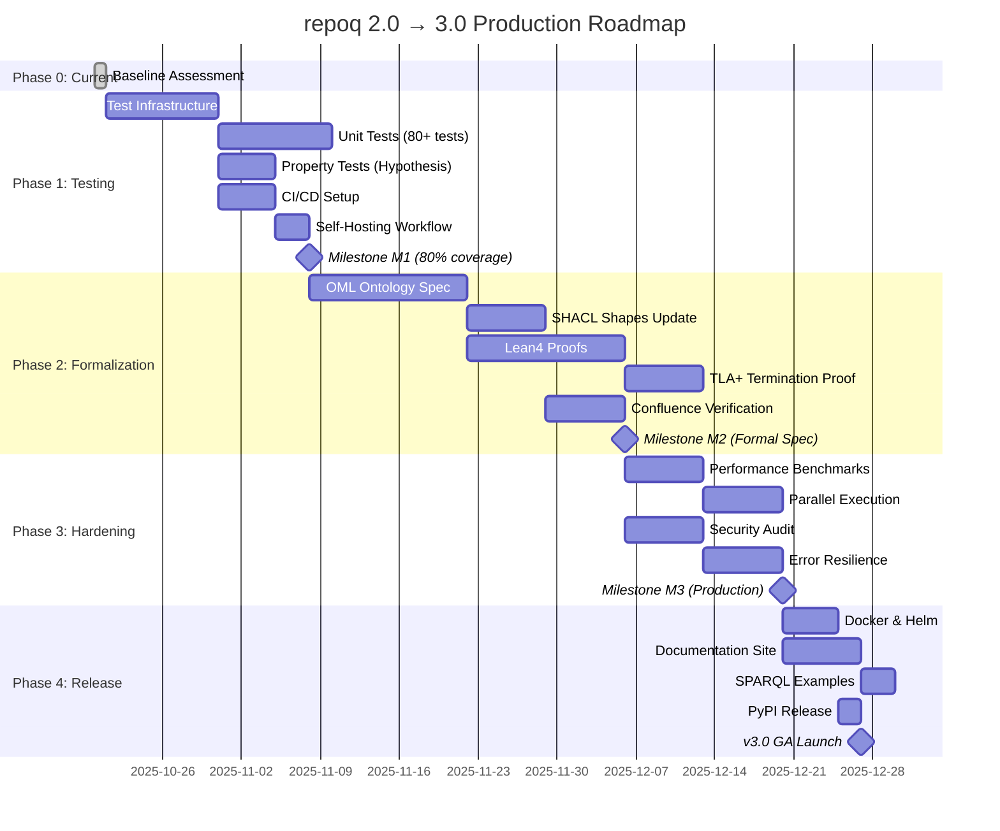

## Timeline Summary

| Phase | Duration | Start | End | Milestone |
|-------|----------|-------|-----|-----------|
| **Phase 0** | Current | 2025-10-20 | 2025-10-20 | Baseline |
| **Phase 1** | 4 weeks | 2025-10-21 | 2025-11-17 | M1: 80% coverage |
| **Phase 2** | 6 weeks | 2025-11-18 | 2025-12-29 | M2: Formal spec |
| **Phase 3** | 4 weeks | 2025-12-30 | 2026-01-26 | M3: Production-ready |
| **Phase 4** | 2 weeks | 2026-01-27 | 2026-02-09 | v3.0 GA |

**Total**: 16 weeks (4 months) from start to GA  
**Target Launch**: Q1 2026 (February 9, 2026)

## Critical Path

```
Phase 0 (baseline)
    ↓
Phase 1 (testing) ← BLOCKER #1: No tests
    ↓
Phase 2 (formalization) ← BLOCKER #2: No formal spec
    ↓
Phase 3 (hardening)
    ↓
Phase 4 (release)
    ↓
v3.0 GA
```

## Dependencies

- Phase 2 **requires** Phase 1 complete (need tests to verify formal properties)
- Phase 3 **requires** Phase 2 complete (performance tests need formal invariants)
- Phase 4 **requires** Phase 3 complete (can't release without hardening)

**No parallel work** across phases (waterfall by design for formal verification)

## Resource Loading

```
FTE Requirements by Phase:

Phase 1: ████████░░ 1.5 FTE (1 eng + 0.5 devops)
Phase 2: ██████████ 2.0 FTE (1 eng + 1 formal methods)
Phase 3: ████████░░ 2.0 FTE (1 eng + 0.5 formal + 0.5 devops)
Phase 4: ██████░░░░ 1.5 FTE (1 eng + 0.5 writer)

Average: ~1.75 FTE over 4 months
```

## Budget Breakdown

| Phase | Person-Weeks | Cost @$80K/yr | Cumulative |
|-------|--------------|---------------|------------|
| Phase 1 | 6 pw | $9,600 | $9,600 |
| Phase 2 | 12 pw | $19,200 | $28,800 |
| Phase 3 | 8 pw | $12,800 | $41,600 |
| Phase 4 | 3 pw | $4,800 | $46,400 |

**Total Budget**: $46,400 (assumes $80K/year avg salary, 50 work weeks/year)

## Risk Timeline

```
Risk Level by Phase:

Phase 1: ██░░░░░░░░ LOW  (standard testing)
Phase 2: ████████░░ HIGH (formal methods complexity)
Phase 3: ████░░░░░░ MED  (performance unknowns)
Phase 4: ██░░░░░░░░ LOW  (deployment is standard)
```

**Mitigation**: Weekly checkpoints in Phase 2 to detect proof complexity issues early

## Deliverables by Milestone

### M1 (Week 4)
- ✅ 80+ unit tests
- ✅ 10+ property tests
- ✅ CI/CD pipeline
- ✅ Self-hosting workflow
- ✅ Coverage ≥70%

### M2 (Week 10)
- ✅ OML ontology (5 modules)
- ✅ Lean4 soundness theorem
- ✅ TLA+ termination proof
- ✅ SHACL by default
- ✅ Confluence verified

### M3 (Week 14)
- ✅ Benchmarks (10K files < 60s)
- ✅ Parallel execution (2x speedup)
- ✅ Security audit clean
- ✅ Error resilience complete
- ✅ Structured logging

### v3.0 GA (Week 16)
- ✅ Docker/Helm deployed
- ✅ PyPI released
- ✅ Full documentation
- ✅ 10+ SPARQL examples
- ✅ Video tutorial + case studies

## Success Metrics

**Technical**:
- All URPKS gates green ✅
- Coverage ≥90% ✅
- Performance targets met ✅

**Business**:
- ≥100 GitHub stars (6 months)
- ≥3 production users
- ≥1K PyPI downloads/month

**Quality**:
- Zero critical security issues
- Zero soundness violations
- Zero data corruption bugs
