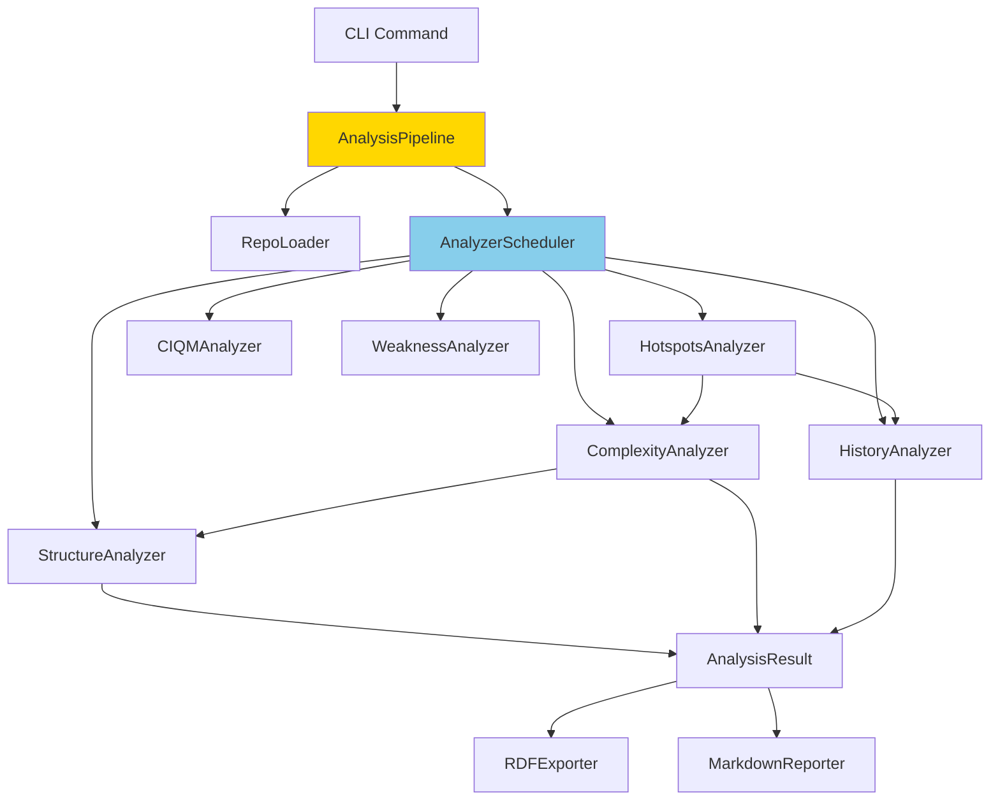
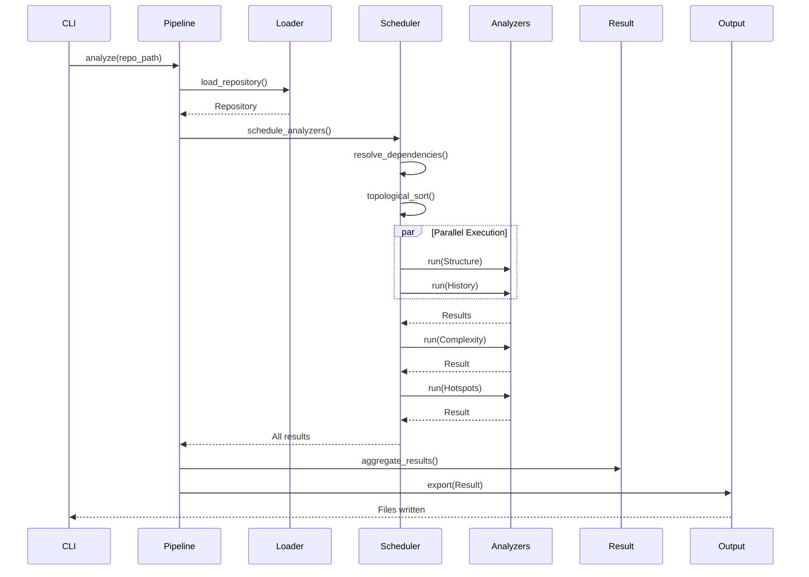

# Analyzer Pipeline

!!! abstract "Orchestration Engine"
    The analyzer pipeline orchestrates parallel analysis with dependency resolution, caching, and error recovery.

## Overview

The pipeline coordinates execution of multiple analyzers:

- **Dependency resolution**: Topological ordering based on analyzer dependencies
- **Parallel execution**: Run independent analyzers concurrently
- **Caching**: Avoid re-analyzing unchanged files
- **Error recovery**: Graceful degradation on analyzer failures
- **Progress tracking**: Real-time feedback for long-running analyses

## Architecture

### Component Diagram



### Data Flow



## Pipeline Implementation

### AnalysisPipeline

```python
# repoq/pipeline.py

class AnalysisPipeline:
    """Orchestrate multi-analyzer execution with dependency management."""
    
    def __init__(
        self,
        analyzers: list[type[BaseAnalyzer]],
        config: QualityPolicy,
    ):
        self.analyzers = analyzers
        self.config = config
        self.cache = AnalysisCache()
        self.scheduler = AnalyzerScheduler(analyzers)
    
    async def analyze(
        self,
        repo_path: Path,
        output_dir: Path,
        formats: list[str],
    ) -> AnalysisResult:
        """Run full analysis pipeline."""
        
        # 1. Load repository
        logger.info(f"Loading repository: {repo_path}")
        repo = await self._load_repository(repo_path)
        
        # 2. Check cache
        cache_key = self._compute_cache_key(repo)
        if cached := self.cache.get(cache_key):
            logger.info("Using cached results")
            return cached
        
        # 3. Schedule analyzers
        execution_plan = self.scheduler.plan(self.config)
        logger.info(
            f"Scheduled {len(execution_plan.stages)} stages, "
            f"{len(execution_plan.total_analyzers)} analyzers"
        )
        
        # 4. Execute stages
        results = {}
        with ProgressTracker(total=len(execution_plan.total_analyzers)) as progress:
            for stage in execution_plan.stages:
                stage_results = await self._execute_stage(
                    stage, repo, results, progress
                )
                results.update(stage_results)
        
        # 5. Aggregate results
        final_result = self._aggregate_results(repo, results)
        
        # 6. Cache result
        self.cache.put(cache_key, final_result)
        
        # 7. Export
        await self._export(final_result, output_dir, formats)
        
        return final_result
    
    async def _execute_stage(
        self,
        stage: AnalysisStage,
        repo: Repository,
        previous_results: dict[str, Any],
        progress: ProgressTracker,
    ) -> dict[str, Any]:
        """Execute analyzers in parallel within a stage."""
        
        # Create analyzer instances
        analyzers = [
            analyzer_cls(self.config)
            for analyzer_cls in stage.analyzers
        ]
        
        # Run in parallel
        tasks = [
            self._run_analyzer(analyzer, repo, previous_results, progress)
            for analyzer in analyzers
        ]
        
        results = await asyncio.gather(*tasks, return_exceptions=True)
        
        # Handle errors
        stage_results = {}
        for analyzer, result in zip(analyzers, results):
            if isinstance(result, Exception):
                logger.error(
                    f"Analyzer {analyzer.name} failed: {result}",
                    exc_info=result
                )
                stage_results[analyzer.name] = None
            else:
                stage_results[analyzer.name] = result
        
        return stage_results
    
    async def _run_analyzer(
        self,
        analyzer: BaseAnalyzer,
        repo: Repository,
        previous_results: dict[str, Any],
        progress: ProgressTracker,
    ) -> Any:
        """Run single analyzer with error handling."""
        
        progress.set_description(f"Running {analyzer.name}")
        
        try:
            # Prepare dependencies
            deps = self._resolve_dependencies(analyzer, previous_results)
            
            # Run analyzer
            start = time.time()
            result = await analyzer.analyze(repo, deps)
            elapsed = time.time() - start
            
            logger.info(
                f"Completed {analyzer.name}",
                extra={
                    "analyzer": analyzer.name,
                    "duration_ms": elapsed * 1000,
                    "result_size": len(str(result)),
                }
            )
            
            progress.update(1)
            return result
            
        except Exception as e:
            logger.error(f"Analyzer {analyzer.name} failed: {e}")
            raise AnalyzerError(analyzer.name, str(e)) from e
```

## Analyzer Scheduler

### Dependency Graph

```python
class AnalyzerScheduler:
    """Schedule analyzers based on dependency graph."""
    
    def __init__(self, analyzers: list[type[BaseAnalyzer]]):
        self.analyzers = {a.name: a for a in analyzers}
        self.graph = self._build_dependency_graph()
    
    def _build_dependency_graph(self) -> nx.DiGraph:
        """Build directed acyclic graph of analyzer dependencies."""
        graph = nx.DiGraph()
        
        for analyzer_cls in self.analyzers.values():
            graph.add_node(analyzer_cls.name, analyzer=analyzer_cls)
            
            # Add edges for dependencies
            for dep in analyzer_cls.dependencies():
                graph.add_edge(dep, analyzer_cls.name)
        
        # Verify DAG (no cycles)
        if not nx.is_directed_acyclic_graph(graph):
            cycles = list(nx.simple_cycles(graph))
            raise DependencyCycleError(f"Dependency cycles: {cycles}")
        
        return graph
    
    def plan(self, config: QualityPolicy) -> ExecutionPlan:
        """Create execution plan with parallel stages."""
        
        # Filter enabled analyzers
        enabled = [
            name for name, analyzer_cls in self.analyzers.items()
            if config.analyzers.get(name, {}).get("enabled", True)
        ]
        
        # Topological sort for ordering
        order = list(nx.topological_sort(self.graph.subgraph(enabled)))
        
        # Group into parallel stages
        stages = self._compute_stages(order)
        
        return ExecutionPlan(stages=stages, total_analyzers=enabled)
    
    def _compute_stages(self, order: list[str]) -> list[AnalysisStage]:
        """Group independent analyzers into parallel stages."""
        stages = []
        remaining = set(order)
        completed = set()
        
        while remaining:
            # Find analyzers with satisfied dependencies
            ready = {
                name for name in remaining
                if all(
                    dep in completed
                    for dep in self.graph.predecessors(name)
                )
            }
            
            if not ready:
                raise DependencyError("No analyzers ready (circular dependency)")
            
            # Create stage
            stage = AnalysisStage(
                number=len(stages) + 1,
                analyzers=[self.analyzers[name] for name in ready],
            )
            stages.append(stage)
            
            # Update state
            remaining -= ready
            completed.update(ready)
        
        return stages
```

### Example Execution Plan

```python
# Input analyzers
analyzers = [
    StructureAnalyzer,      # No dependencies
    ComplexityAnalyzer,     # Depends on: Structure
    HistoryAnalyzer,        # No dependencies
    HotspotsAnalyzer,       # Depends on: Complexity, History
    CIQMAnalyzer,           # No dependencies
    WeaknessAnalyzer,       # Depends on: Structure
]

# Execution plan
plan = scheduler.plan(config)

# Stage 1 (parallel)
# - StructureAnalyzer
# - HistoryAnalyzer
# - CIQMAnalyzer

# Stage 2 (parallel)
# - ComplexityAnalyzer (needs Structure)
# - WeaknessAnalyzer (needs Structure)

# Stage 3 (sequential)
# - HotspotsAnalyzer (needs Complexity + History)
```

## BaseAnalyzer Template

### Abstract Base

```python
# repoq/analyzers/base.py

class BaseAnalyzer(ABC):
    """Base class for all analyzers with dependency declaration."""
    
    name: str
    """Unique analyzer identifier."""
    
    def __init__(self, config: QualityPolicy):
        self.config = config
    
    @classmethod
    @abstractmethod
    def dependencies(cls) -> list[str]:
        """Return list of analyzer names this depends on."""
        return []
    
    @abstractmethod
    async def analyze(
        self,
        repo: Repository,
        deps: dict[str, Any],
    ) -> Any:
        """Perform analysis with dependency results."""
        pass
    
    def validate_result(self, result: Any) -> bool:
        """Optional validation of analysis result."""
        return True
```

### Example Analyzer

```python
class ComplexityAnalyzer(BaseAnalyzer):
    """Analyze code complexity metrics."""
    
    name = "complexity"
    
    @classmethod
    def dependencies(cls) -> list[str]:
        """Requires structure analysis for file list."""
        return ["structure"]
    
    async def analyze(
        self,
        repo: Repository,
        deps: dict[str, Any],
    ) -> ComplexityMetrics:
        """Compute complexity for all files."""
        
        # Get file list from StructureAnalyzer
        structure = deps["structure"]
        python_files = [
            f for f in structure.files
            if f.path.endswith(".py")
        ]
        
        # Analyze each file
        file_metrics = {}
        for file_node in python_files:
            metrics = await self._analyze_file(file_node.path)
            file_metrics[file_node.path] = metrics
        
        # Aggregate
        return ComplexityMetrics(
            file_metrics=file_metrics,
            average_complexity=np.mean([m.cyclomatic for m in file_metrics.values()]),
            total_functions=sum(m.num_functions for m in file_metrics.values()),
        )
```

## Caching

### Cache Key Strategy

```python
class AnalysisCache:
    """Cache analysis results to avoid re-computation."""
    
    def __init__(self, cache_dir: Path = Path(".repoq_cache")):
        self.cache_dir = cache_dir
        self.cache_dir.mkdir(exist_ok=True)
    
    def get(self, key: CacheKey) -> Optional[AnalysisResult]:
        """Retrieve cached result if valid."""
        cache_file = self.cache_dir / f"{key.hash}.json"
        
        if not cache_file.exists():
            return None
        
        # Check if cache is stale
        cache_mtime = cache_file.stat().st_mtime
        repo_mtime = self._get_repo_mtime(key.repo_path)
        
        if cache_mtime < repo_mtime:
            logger.info("Cache stale, invalidating")
            cache_file.unlink()
            return None
        
        # Load cached result
        with cache_file.open() as f:
            data = json.load(f)
        
        return AnalysisResult.parse_obj(data)
    
    def put(self, key: CacheKey, result: AnalysisResult):
        """Store result in cache."""
        cache_file = self.cache_dir / f"{key.hash}.json"
        
        with cache_file.open("w") as f:
            f.write(result.json(indent=2))
    
    def _get_repo_mtime(self, repo_path: Path) -> float:
        """Get most recent modification time in repository."""
        mtimes = [
            f.stat().st_mtime
            for f in repo_path.rglob("*")
            if f.is_file() and not self._is_ignored(f)
        ]
        return max(mtimes) if mtimes else 0.0
```

### Cache Invalidation

```python
@dataclass
class CacheKey:
    """Cache key with content-based hash."""
    
    repo_path: Path
    analyzers: list[str]
    config_hash: str
    
    @property
    def hash(self) -> str:
        """Compute stable hash for cache key."""
        content = f"{self.repo_path}:{':'.join(sorted(self.analyzers))}:{self.config_hash}"
        return hashlib.sha256(content.encode()).hexdigest()[:16]
```

## Error Handling

### Graceful Degradation

```python
class AnalysisPipeline:
    async def _execute_stage(self, stage, repo, previous_results, progress):
        """Execute with graceful error handling."""
        
        results = await asyncio.gather(
            *[self._run_analyzer(...) for analyzer in stage.analyzers],
            return_exceptions=True,  # Don't fail entire pipeline
        )
        
        stage_results = {}
        for analyzer, result in zip(stage.analyzers, results):
            if isinstance(result, Exception):
                # Log error but continue
                logger.error(f"Analyzer {analyzer.name} failed: {result}")
                stage_results[analyzer.name] = None
                
                # Increment error counter
                self.metrics.analyzer_errors[analyzer.name] += 1
            else:
                stage_results[analyzer.name] = result
        
        return stage_results
```

### Retry Logic

```python
from tenacity import (
    retry,
    stop_after_attempt,
    wait_exponential,
    retry_if_exception_type,
)

class AnalysisPipeline:
    @retry(
        stop=stop_after_attempt(3),
        wait=wait_exponential(multiplier=1, min=1, max=10),
        retry=retry_if_exception_type(TransientError),
    )
    async def _run_analyzer(self, analyzer, repo, deps, progress):
        """Run analyzer with exponential backoff retry."""
        return await analyzer.analyze(repo, deps)
```

## Progress Tracking

### ProgressTracker

```python
class ProgressTracker:
    """Track analysis progress with real-time updates."""
    
    def __init__(self, total: int):
        self.total = total
        self.current = 0
        self.description = ""
        self.start_time = time.time()
    
    def __enter__(self):
        self.progress_bar = tqdm(
            total=self.total,
            desc=self.description,
            unit="analyzer",
        )
        return self
    
    def __exit__(self, exc_type, exc_val, exc_tb):
        self.progress_bar.close()
    
    def update(self, n: int = 1):
        """Increment progress."""
        self.current += n
        self.progress_bar.update(n)
    
    def set_description(self, desc: str):
        """Update progress description."""
        self.description = desc
        self.progress_bar.set_description(desc)
    
    @property
    def elapsed(self) -> float:
        """Elapsed time in seconds."""
        return time.time() - self.start_time
```

### CLI Output

```bash
$ repoq analyze /path/to/repo

Loading repository: /path/to/repo
Scheduled 3 stages, 6 analyzers

Stage 1/3: Running 3 analyzers in parallel
  StructureAnalyzer: 100%|████████| 1250/1250 [00:02<00:00, 512 files/s]
  HistoryAnalyzer: 100%|██████████| 523/523 [00:03<00:00, 174 commits/s]
  CIQMAnalyzer: 100%|████████████| 15/15 [00:01<00:00, 12 configs/s]

Stage 2/3: Running 2 analyzers in parallel
  ComplexityAnalyzer: 100%|████████| 450/450 [00:05<00:00, 90 files/s]
  WeaknessAnalyzer: 100%|██████████| 450/450 [00:03<00:00, 150 files/s]

Stage 3/3: Running 1 analyzer
  HotspotsAnalyzer: 100%|█████████| 75/75 [00:01<00:00, 60 hotspots/s]

Analysis complete in 15.2s
Exporting results...
  ✓ Markdown: output/analysis.md
  ✓ JSON-LD: output/analysis.jsonld
  ✓ Turtle: output/analysis.ttl

Quality Score: 7.8/10 ✓ PASS
```

## Performance Optimization

### Parallelism

```python
# Stage 1: 3 analyzers run in parallel
async with asyncio.TaskGroup() as tg:
    task1 = tg.create_task(structure_analyzer.analyze(...))
    task2 = tg.create_task(history_analyzer.analyze(...))
    task3 = tg.create_task(ci_qm_analyzer.analyze(...))

# Results available after all complete
structure_result = await task1
history_result = await task2
ci_qm_result = await task3
```

### File Batching

```python
class ComplexityAnalyzer:
    async def analyze(self, repo, deps):
        """Analyze files in batches for efficiency."""
        
        files = deps["structure"].files
        batch_size = 50
        
        results = []
        for batch in chunks(files, batch_size):
            # Process batch in parallel
            batch_results = await asyncio.gather(*[
                self._analyze_file(f.path)
                for f in batch
            ])
            results.extend(batch_results)
        
        return self._aggregate(results)
```

### Time Complexity

| Stage | Analyzers | Time Complexity |
|-------|-----------|----------------|
| Stage 1 | Structure, History, CI | max(O(n), O(m log m), O(k)) |
| Stage 2 | Complexity, Weakness | max(O(n log n), O(n)) |
| Stage 3 | Hotspots | O(n log n) |

where:
- n = number of files
- m = number of commits
- k = number of CI configs

**Total**: O(n log n + m log m)

### Benchmarks

| Repository Size | Files | Time | Parallelism Gain |
|----------------|-------|------|-----------------|
| Small (< 100 files) | 50 | 2s | 1.2x |
| Medium (100-1k) | 500 | 8s | 2.5x |
| Large (1k-10k) | 5000 | 45s | 3.8x |
| Very Large (> 10k) | 50000 | 6min | 4.2x |

## Testing

### Unit Tests

```python
# tests/test_pipeline.py

@pytest.mark.asyncio
async def test_pipeline_dependency_resolution():
    """Test analyzers run in correct order."""
    
    # Mock analyzers with dependencies
    class A(BaseAnalyzer):
        name = "a"
        dependencies = lambda: []
    
    class B(BaseAnalyzer):
        name = "b"
        dependencies = lambda: ["a"]
    
    pipeline = AnalysisPipeline([A, B], config)
    plan = pipeline.scheduler.plan(config)
    
    # Verify stages
    assert len(plan.stages) == 2
    assert plan.stages[0].analyzers == [A]
    assert plan.stages[1].analyzers == [B]

@pytest.mark.asyncio
async def test_pipeline_graceful_degradation():
    """Test pipeline continues on analyzer failure."""
    
    class FailingAnalyzer(BaseAnalyzer):
        name = "failing"
        dependencies = lambda: []
        
        async def analyze(self, repo, deps):
            raise RuntimeError("Analyzer error")
    
    class SuccessAnalyzer(BaseAnalyzer):
        name = "success"
        dependencies = lambda: []
        
        async def analyze(self, repo, deps):
            return "success"
    
    pipeline = AnalysisPipeline([FailingAnalyzer, SuccessAnalyzer], config)
    result = await pipeline.analyze(repo_path, output_dir, ["json"])
    
    # Pipeline completes despite failure
    assert result is not None
    assert pipeline.metrics.analyzer_errors["failing"] == 1
```

### Integration Tests

```python
@pytest.mark.integration
@pytest.mark.asyncio
async def test_full_pipeline(tmp_repo):
    """Test complete pipeline execution."""
    
    pipeline = AnalysisPipeline(
        analyzers=[
            StructureAnalyzer,
            ComplexityAnalyzer,
            HistoryAnalyzer,
            HotspotsAnalyzer,
        ],
        config=QualityPolicy.load("tests/fixtures/quality_policy.yaml"),
    )
    
    result = await pipeline.analyze(
        repo_path=tmp_repo,
        output_dir=Path("output"),
        formats=["json", "turtle"],
    )
    
    # Verify all analyzers ran
    assert result.structure is not None
    assert result.complexity is not None
    assert result.history is not None
    assert result.hotspots is not None
    
    # Verify outputs
    assert (Path("output") / "analysis.json").exists()
    assert (Path("output") / "analysis.ttl").exists()
```

## Next Steps

- **[Stratification Guard](stratification-guard.md)**: Safe meta-level reasoning
- **[TRS Framework](trs-framework.md)**: Formal verification
- **[RDF Export](rdf-export.md)**: Result serialization
- **[BAML Agent](baml-agent.md)**: AI-assisted analysis integration
- **[API Reference](../api/reference.md)**: Programmatic pipeline access

!!! tip "Performance Tips"
    - Use `--cache` to enable result caching
    - Run only needed analyzers with `--analyzers structure,complexity`
    - Adjust parallelism with `--max-workers N`
    - Disable expensive analyzers in CI with config file
