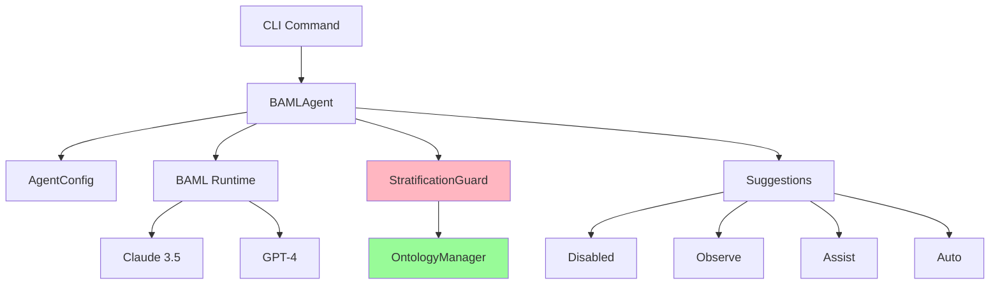

# BAML AI Agent

!!! abstract "AI-Assisted Analysis"
    BAML (Basically A Markup Language) agent provides multi-phase AI-powered insights with rollout safety controls.

## Overview

The BAML agent augments static analysis with LLM-powered reasoning:

- **Phase 0 (disabled)**: No AI, pure static analysis
- **Phase 1 (observe)**: AI suggestions logged, not executed
- **Phase 2 (assist)**: AI suggestions shown to user, manual approval
- **Phase 3 (auto)**: AI suggestions auto-applied with human oversight
- **Phase 4 (autopilot)**: Full AI autonomy (FUTURE)

## Architecture

### Components



### BAML Definition

```python
# repoq/ai/agent.baml

class CodeSuggestion {
    file_path: string
    line_number: int
    severity: "info" | "warning" | "error"
    category: string
    title: string
    description: string
    suggested_fix: string?
    confidence: float  // 0.0-1.0
}

class AnalysisInsight {
    insights: CodeSuggestion[]
    summary: string
    recommendations: string[]
}

function AnalyzeCode(
    code_context: string,
    metrics: map<string, float>,
    policy: map<string, any>
) -> AnalysisInsight {
    client Claude3Sonnet
    
    prompt #"
        You are a senior software engineer analyzing code quality.
        
        Context:
        {code_context}
        
        Metrics:
        {metrics}
        
        Quality Policy:
        {policy}
        
        Analyze the code and provide:
        1. Specific suggestions for improvement
        2. Priority ranking (high/medium/low)
        3. Actionable refactoring steps
        
        Focus on:
        - Complexity reduction
        - Maintainability improvements
        - Design pattern opportunities
        - Performance optimizations
        
        Return structured suggestions with confidence scores.
    "#
}
```

## Phase Rollout

### Phase 0: Disabled

```yaml
# quality_policy.yaml
ai_agent:
  phase: "disabled"
```

**Behavior:**
- AI agent not invoked
- Pure static analysis only
- Zero LLM API calls
- Baseline performance

**Use Case:** Production CI/CD where determinism is critical

### Phase 1: Observe

```yaml
ai_agent:
  phase: "observe"
  config:
    log_file: "ai_suggestions.jsonl"
```

**Behavior:**
- AI suggestions generated
- Logged to file (not shown to user)
- No impact on analysis output
- Collect data for evaluation

**Use Case:** Pilot testing AI quality before showing to users

**Log Format:**
```jsonl
{"timestamp": "2024-01-15T10:30:00Z", "phase": "observe", "suggestion": {...}, "confidence": 0.85}
{"timestamp": "2024-01-15T10:30:05Z", "phase": "observe", "suggestion": {...}, "confidence": 0.72}
```

### Phase 2: Assist

```yaml
ai_agent:
  phase: "assist"
  config:
    show_low_confidence: false
    min_confidence: 0.7
```

**Behavior:**
- AI suggestions shown in analysis output
- User decides whether to act
- Non-intrusive recommendations
- Confidence scores displayed

**Use Case:** Daily development workflow with AI assistance

**Output:**
```markdown
## AI Suggestions 🤖

### High Priority

**src/auth.py:42** (confidence: 0.92)
- **Category:** Complexity Reduction
- **Issue:** Function `authenticate_user` has cyclomatic complexity of 18
- **Suggestion:** Extract token validation into separate function
- **Fix:** 
  ```python
  def validate_token(token):
      # Extract validation logic
      pass
  ```

### Medium Priority

**src/utils.py:15** (confidence: 0.78)
- **Category:** Error Handling
- **Issue:** Bare except clause catches all exceptions
- **Suggestion:** Catch specific exception types
```

### Phase 3: Auto

```yaml
ai_agent:
  phase: "auto"
  config:
    auto_apply_threshold: 0.9
    require_confirmation: true
```

**Behavior:**
- High-confidence suggestions (>0.9) auto-applied
- User confirmation prompt before changes
- Dry-run mode shows diff
- Rollback mechanism

**Use Case:** Trusted AI assistance with human oversight

**Workflow:**
```bash
$ repoq analyze /path/to/repo

RepoQ AI Agent (Phase 3: Auto) 🤖
Found 3 high-confidence suggestions:

1. src/auth.py:42 - Reduce complexity (confidence: 0.95)
2. src/utils.py:15 - Improve error handling (confidence: 0.92)
3. src/models.py:88 - Add type hints (confidence: 0.91)

Apply all? [y/N/preview] p

--- Diff Preview ---
src/auth.py
@@ -40,15 +40,8 @@
 def authenticate_user(username, password, token):
-    if username and password:
-        user = db.get_user(username)
-        if user and verify_password(password, user.password_hash):
-            if token:
-                if validate_token(token):
-                    return user
+    if not (username and password):
+        raise AuthError("Missing credentials")
+    
+    user = db.get_user(username)
+    if not user or not verify_password(password, user.password_hash):
+        raise AuthError("Invalid credentials")
+    
+    if token and not validate_token(token):
+        raise AuthError("Invalid token")
+    
+    return user

Apply? [y/N] y
✓ Applied 3 suggestions
```

### Phase 4: Autopilot (FUTURE)

**NOT IMPLEMENTED** - Reserved for future full autonomy

**Planned Behavior:**
- AI makes and commits changes autonomously
- Human review post-facto
- Requires extensive safety validation
- Meta-loop self-improvement

## Implementation

### AgentConfig

```python
# repoq/ai/baml_agent.py

@dataclass
class AgentConfig:
    """Configuration for BAML AI agent."""
    
    phase: AgentPhase
    """Rollout phase (disabled/observe/assist/auto)."""
    
    model: str = "claude-3-5-sonnet-20241022"
    """LLM model identifier."""
    
    temperature: float = 0.2
    """Sampling temperature (0=deterministic, 1=creative)."""
    
    max_tokens: int = 4096
    """Maximum response tokens."""
    
    min_confidence: float = 0.7
    """Minimum confidence to show suggestions (assist/auto)."""
    
    auto_apply_threshold: float = 0.9
    """Confidence threshold for auto-apply (phase 3+)."""
    
    timeout_seconds: int = 30
    """LLM API timeout."""
    
    log_file: Optional[Path] = None
    """Log file for observe phase."""
    
    require_confirmation: bool = True
    """Require user confirmation before applying (phase 3)."""
```

### BAMLAgent

```python
class BAMLAgent:
    """BAML-powered AI agent for code analysis."""
    
    def __init__(self, config: AgentConfig):
        self.config = config
        self.runtime = baml_init()
        self.guard = StratificationGuard()
    
    async def analyze(
        self,
        result: AnalysisResult,
        context: dict[str, Any]
    ) -> list[CodeSuggestion]:
        """Generate AI-powered suggestions."""
        
        if self.config.phase == AgentPhase.DISABLED:
            return []
        
        # 1. Prepare context
        code_context = self._build_context(result)
        metrics = self._extract_metrics(result)
        policy = context.get("quality_policy", {})
        
        # 2. Call LLM via BAML
        try:
            insight = await self.runtime.AnalyzeCode(
                code_context=code_context,
                metrics=metrics,
                policy=policy,
            )
        except Exception as e:
            logger.error(f"BAML agent error: {e}")
            return []
        
        # 3. Filter by confidence
        suggestions = [
            s for s in insight.insights
            if s.confidence >= self.config.min_confidence
        ]
        
        # 4. Phase-specific handling
        return await self._handle_phase(suggestions, result)
    
    async def _handle_phase(
        self,
        suggestions: list[CodeSuggestion],
        result: AnalysisResult
    ) -> list[CodeSuggestion]:
        """Phase-specific suggestion handling."""
        
        if self.config.phase == AgentPhase.OBSERVE:
            # Log only, don't return
            self._log_suggestions(suggestions)
            return []
        
        elif self.config.phase == AgentPhase.ASSIST:
            # Show to user, no auto-apply
            return suggestions
        
        elif self.config.phase == AgentPhase.AUTO:
            # Auto-apply high-confidence
            auto_apply = [
                s for s in suggestions
                if s.confidence >= self.config.auto_apply_threshold
            ]
            
            if auto_apply and self.config.require_confirmation:
                # Show diff and prompt
                if self._prompt_confirmation(auto_apply):
                    self._apply_suggestions(auto_apply, result)
            
            return suggestions
        
        else:
            return []
    
    def _build_context(self, result: AnalysisResult) -> str:
        """Build code context for LLM."""
        context_parts = []
        
        # Repository info
        context_parts.append(f"Repository: {result.repository.name}")
        context_parts.append(f"Language: {result.repository.language}")
        
        # High-complexity files
        if result.complexity:
            hotspots = sorted(
                result.complexity.file_metrics.items(),
                key=lambda x: x[1].cyclomatic_complexity,
                reverse=True
            )[:5]
            
            context_parts.append("\nHigh-complexity files:")
            for path, metrics in hotspots:
                context_parts.append(
                    f"- {path}: complexity={metrics.cyclomatic_complexity}, "
                    f"maintainability={metrics.maintainability_index:.1f}"
                )
        
        # Recent changes
        if result.history:
            context_parts.append(f"\nRecent commits: {len(result.history.commits)}")
            context_parts.append(f"Active contributors: {len(result.history.authors)}")
        
        return "\n".join(context_parts)
```

## Stratification Safety

### Meta-Level Reasoning

The AI agent operates at **meta-level** (reasoning about code), while code is **object-level**:

```python
# Meta-level (AI Agent)
suggestion = agent.analyze(code)  # Reasoning ABOUT code

# Object-level (Code being analyzed)
def user_function():  # The CODE itself
    pass
```

### Russell's Paradox Prevention

**Problem**: What if AI suggests modifying the agent itself?

```python
# DANGEROUS: Self-modification
suggestion = CodeSuggestion(
    file_path="repoq/ai/baml_agent.py",
    suggested_fix="..."  # AI modifying itself!
)
```

**Solution**: StratificationGuard

```python
class StratificationGuard:
    """Prevent self-reference paradoxes."""
    
    PROTECTED_PATHS = {
        "repoq/ai/",
        "repoq/core/stratification_guard.py",
        "repoq/ontologies/ontology_manager.py",
    }
    
    def check_suggestion(self, suggestion: CodeSuggestion) -> bool:
        """Verify suggestion doesn't violate stratification."""
        
        # Block self-modification
        if any(
            suggestion.file_path.startswith(path)
            for path in self.PROTECTED_PATHS
        ):
            logger.warning(
                f"Blocked self-modification attempt: {suggestion.file_path}"
            )
            return False
        
        return True
```

### Quote/Unquote

Safe meta-programming requires explicit quote/unquote:

```python
# Object-level (code)
code_ast = ast.parse(source_code)

# Meta-level (reasoning about code)
quoted_ast = Quote(code_ast)  # Lift to meta-level

# Analyze at meta-level
suggestion = agent.analyze(quoted_ast)

# Apply back to object-level
if safe_to_apply(suggestion):
    modified_code = Unquote(suggestion.apply(quoted_ast))
```

## Observability

### Metrics

```python
@dataclass
class AgentMetrics:
    """AI agent performance metrics."""
    
    phase: AgentPhase
    total_suggestions: int
    high_confidence: int  # >= 0.9
    medium_confidence: int  # 0.7-0.9
    low_confidence: int  # < 0.7
    auto_applied: int
    user_accepted: int
    user_rejected: int
    avg_confidence: float
    llm_latency_ms: float
    llm_tokens: int
    errors: int
```

### Telemetry

```python
# Log agent activity
logger.info(
    "BAML agent analysis",
    extra={
        "phase": config.phase.value,
        "suggestions": len(suggestions),
        "avg_confidence": np.mean([s.confidence for s in suggestions]),
        "latency_ms": elapsed * 1000,
        "tokens": response.usage.total_tokens,
    }
)
```

## Testing

### Mock BAML Responses

```python
# tests/ai/test_baml_agent.py

@pytest.fixture
def mock_baml_runtime(monkeypatch):
    """Mock BAML runtime for testing."""
    
    async def mock_analyze_code(code_context, metrics, policy):
        return AnalysisInsight(
            insights=[
                CodeSuggestion(
                    file_path="src/test.py",
                    line_number=10,
                    severity="warning",
                    category="Complexity",
                    title="High cyclomatic complexity",
                    description="Function has complexity of 25",
                    suggested_fix="Extract helper functions",
                    confidence=0.85,
                )
            ],
            summary="Found 1 complexity issue",
            recommendations=["Refactor complex function"],
        )
    
    monkeypatch.setattr("baml_runtime.AnalyzeCode", mock_analyze_code)
    yield

@pytest.mark.asyncio
async def test_agent_observe_phase(mock_baml_runtime, tmp_path):
    """Test observe phase logs suggestions."""
    log_file = tmp_path / "suggestions.jsonl"
    
    config = AgentConfig(
        phase=AgentPhase.OBSERVE,
        log_file=log_file,
    )
    agent = BAMLAgent(config)
    
    result = AnalysisResult(...)
    suggestions = await agent.analyze(result, {})
    
    # Observe phase returns empty (not shown to user)
    assert len(suggestions) == 0
    
    # But logs to file
    assert log_file.exists()
    logs = [json.loads(line) for line in log_file.read_text().splitlines()]
    assert len(logs) == 1
    assert logs[0]["phase"] == "observe"
```

### Property-Based Testing

```python
from hypothesis import given, strategies as st

@given(
    phase=st.sampled_from([p for p in AgentPhase]),
    confidence=st.floats(min_value=0.0, max_value=1.0),
)
def test_confidence_filtering(phase, confidence):
    """Suggestions filtered by confidence threshold."""
    config = AgentConfig(phase=phase, min_confidence=0.7)
    agent = BAMLAgent(config)
    
    suggestion = CodeSuggestion(
        file_path="test.py",
        line_number=1,
        severity="info",
        category="Test",
        title="Test",
        description="Test",
        confidence=confidence,
    )
    
    filtered = agent._filter_by_confidence([suggestion])
    
    if confidence >= 0.7:
        assert len(filtered) == 1
    else:
        assert len(filtered) == 0
```

## Security

### API Key Management

```bash
# Environment variables
export ANTHROPIC_API_KEY="sk-ant-..."
export OPENAI_API_KEY="sk-..."

# Or in quality_policy.yaml (NOT RECOMMENDED)
ai_agent:
  config:
    api_key: "${ANTHROPIC_API_KEY}"  # Use env var substitution
```

### Rate Limiting

```python
from aiolimiter import AsyncLimiter

class BAMLAgent:
    def __init__(self, config: AgentConfig):
        # 10 requests per minute
        self.rate_limiter = AsyncLimiter(10, 60)
    
    async def analyze(self, result, context):
        async with self.rate_limiter:
            return await self._analyze_impl(result, context)
```

### PII Redaction

```python
def _sanitize_context(self, context: str) -> str:
    """Remove PII before sending to LLM."""
    
    # Remove emails
    context = re.sub(r'\b[\w.-]+@[\w.-]+\.\w+\b', '[EMAIL]', context)
    
    # Remove API keys
    context = re.sub(r'\b(sk|pk)_[a-zA-Z0-9]{20,}\b', '[API_KEY]', context)
    
    # Remove file paths with usernames
    context = re.sub(r'/home/\w+/', '/home/[USER]/', context)
    
    return context
```

## CLI Integration

### Commands

```bash
# Analyze with AI assistance (Phase 2)
repoq analyze /path/to/repo --ai-phase assist

# Auto-apply high-confidence suggestions (Phase 3)
repoq analyze /path/to/repo --ai-phase auto

# Observe mode (collect data)
repoq analyze /path/to/repo --ai-phase observe --ai-log suggestions.jsonl

# Disable AI
repoq analyze /path/to/repo --ai-phase disabled
```

### Configuration

```yaml
# quality_policy.yaml
ai_agent:
  phase: "assist"  # disabled | observe | assist | auto
  config:
    model: "claude-3-5-sonnet-20241022"
    temperature: 0.2
    max_tokens: 4096
    min_confidence: 0.7
    auto_apply_threshold: 0.9
    timeout_seconds: 30
    require_confirmation: true
```

## Performance

### Latency

| Phase | LLM Calls | Latency |
|-------|-----------|---------|
| Disabled | 0 | 0ms |
| Observe | 1 per analysis | +2-5s |
| Assist | 1 per analysis | +2-5s |
| Auto | 1 per analysis | +2-5s + user prompt |

### Cost

| Model | Input (1M tokens) | Output (1M tokens) |
|-------|-------------------|-------------------|
| Claude 3.5 Sonnet | $3.00 | $15.00 |
| GPT-4 Turbo | $10.00 | $30.00 |
| GPT-4o | $5.00 | $15.00 |

**Typical analysis**: 500-2000 input tokens, 200-800 output tokens
**Cost per analysis**: $0.001-0.005 (Claude 3.5)

## Future Work

### Phase 4: Autopilot

- Autonomous code modifications
- Commit and PR creation
- Test-driven development loop
- Self-improvement via meta-loop

### Advanced Features

- **Multi-agent collaboration**: Specialized agents for different concerns
- **Retrieval-augmented generation**: Query codebase documentation
- **Semantic code search**: Find similar patterns across repos
- **Automated testing**: Generate test cases for suggestions

## Next Steps

- **[Analyzer Pipeline](analyzer-pipeline.md)**: Integration with analysis flow
- **[Stratification Guard](stratification-guard.md)**: Detailed safety mechanisms
- **[TRS Framework](trs-framework.md)**: Formal verification of suggestions
- **[API Reference](../api/reference.md)**: Programmatic agent access

!!! warning "Production Readiness"
    - **Phase 0-1**: Production-ready ✅
    - **Phase 2**: Beta (user feedback loop) ⚠️
    - **Phase 3**: Alpha (careful rollout) 🚧
    - **Phase 4**: Research (not implemented) 🔬

!!! tip "Gradual Adoption"
    Start with Phase 1 (observe) to collect data, then Phase 2 (assist) for non-critical repos, and Phase 3 (auto) only for mature AI trust.
