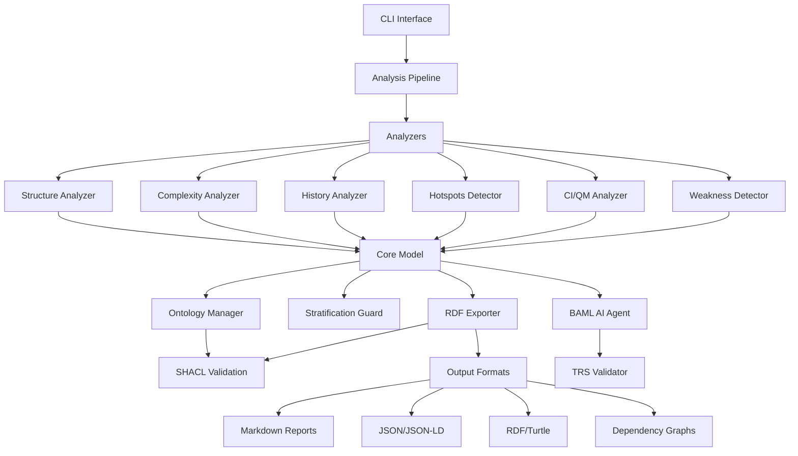
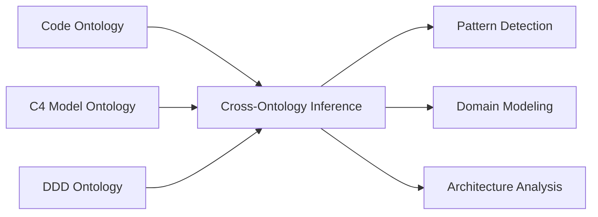
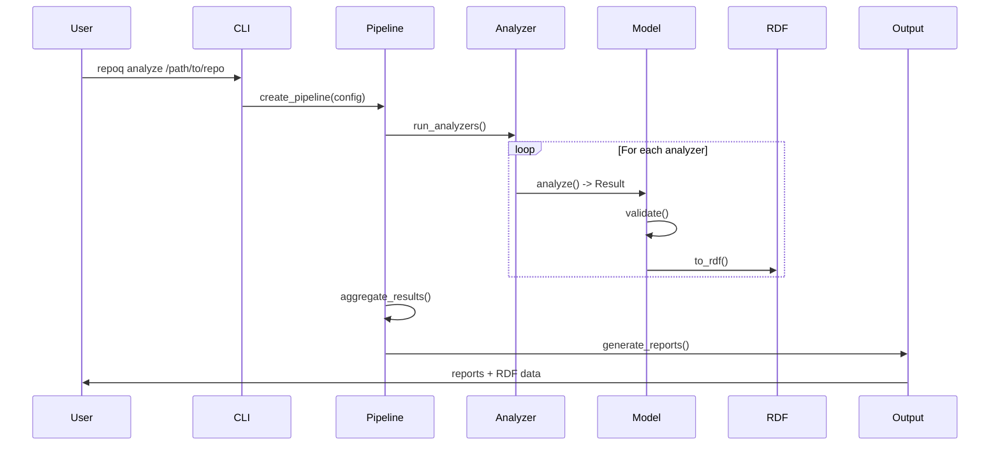
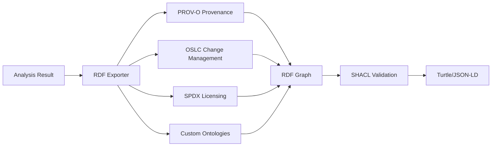

# Architecture Overview

!!! abstract "System Architecture"
    RepoQ is built on a foundation of formal methods, semantic web technologies, and AI-assisted validation. This document provides a deep dive into the core architectural components.

## High-Level Architecture



## Core Components

### 1. Analysis Pipeline

The central orchestrator that coordinates all analyzers:

```python
# repoq/pipeline.py
class AnalysisPipeline:
    """Orchestrates analysis workflow with dependency resolution."""
    
    def __init__(self, config: Config):
        self.config = config
        self.analyzers = self._load_analyzers()
    
    def run(self, repo_path: Path) -> AnalysisResult:
        """Execute analysis pipeline with error handling."""
        results = {}
        
        for analyzer in self._resolve_dependencies():
            try:
                result = analyzer.analyze(repo_path)
                results[analyzer.name] = result
            except Exception as e:
                self._handle_error(analyzer, e)
        
        return self._aggregate_results(results)
```

**Key Features:**
- **Dependency Resolution**: Ensures analyzers run in correct order
- **Parallel Execution**: Runs independent analyzers concurrently
- **Error Isolation**: Analyzer failures don't crash entire pipeline
- **Resource Management**: Controls memory and CPU usage

### 2. Analyzer Architecture

Base analyzer interface with template pattern:

```python
# repoq/analyzers/base.py
class BaseAnalyzer(ABC):
    """Abstract base for all analyzers."""
    
    @abstractmethod
    def analyze(self, repo_path: Path) -> AnalysisResult:
        """Perform analysis and return structured result."""
        pass
    
    def validate_input(self, repo_path: Path) -> bool:
        """Validate input before analysis."""
        return repo_path.exists() and repo_path.is_dir()
    
    def post_process(self, result: AnalysisResult) -> AnalysisResult:
        """Post-process results with ontological enrichment."""
        return self.ontology_manager.enrich(result)
```

**Analyzer Types:**
- **Static Analysis**: Structure, complexity, weakness
- **Dynamic Analysis**: History, hotspots
- **Meta Analysis**: CI/QM, quality metrics

### 3. Core Data Model

Immutable data structures with semantic annotations:

```python
# repoq/core/model.py
@dataclass(frozen=True)
class AnalysisResult:
    """Immutable analysis result with semantic context."""
    
    project: Project
    timestamp: datetime
    analyzer_version: str
    
    # Analysis data
    metrics: Dict[str, float]
    findings: List[Finding]
    recommendations: List[Recommendation]
    
    # Semantic annotations
    ontology_context: Optional[OntologyContext]
    rdf_graph: Optional[Graph]
    
    def to_rdf(self) -> Graph:
        """Export to RDF/Turtle with PROV-O provenance."""
        return self.rdf_exporter.export(self)
```

### 4. Ontology Layer

Manages semantic ontologies and cross-domain inference:



### 5. Stratification Guard

Prevents Russell's paradox in self-referential analysis:

```python
# repoq/core/stratification_guard.py
class StratificationGuard:
    """Enforces stratification to prevent self-reference paradoxes."""
    
    def check_analysis_depth(self, current_depth: int, max_depth: int) -> bool:
        """Verify analysis depth stays within safe bounds."""
        if current_depth > max_depth:
            raise StratificationViolation(
                f"Analysis depth {current_depth} exceeds maximum {max_depth}"
            )
        return True
    
    def validate_meta_operation(self, operation: MetaOperation) -> bool:
        """Ensure meta-operations don't create cycles."""
        return self._check_acyclicity(operation)
```

## Data Flow

### Analysis Flow



### RDF Export Flow



## Key Design Principles

### 1. Soundness First

All transformations are mathematically sound:

- **TRS (Term Rewriting)**: Confluent + terminating
- **Ontology Reasoning**: RDFS/OWL-DL compliant
- **Stratification**: Prevents self-reference paradoxes

### 2. Semantic Enrichment

Everything is semantically annotated:

```turtle
# Example RDF output
@prefix repoq: <http://repoq.dev/ontology#> .
@prefix prov: <http://www.w3.org/ns/prov#> .

<analysis/20241022/001> a repoq:AnalysisResult ;
    prov:wasGeneratedBy <activity/analyze-repo> ;
    prov:startedAtTime "2024-10-22T10:00:00Z"^^xsd:dateTime ;
    repoq:qualityScore 8.2 ;
    repoq:analyzedProject <project/myproject> .
```

### 3. Extensibility

Plugin architecture for custom analyzers:

```python
# Custom analyzer
from repoq.analyzers.base import BaseAnalyzer

class SecurityAnalyzer(BaseAnalyzer):
    """Custom security analyzer."""
    
    def analyze(self, repo_path: Path) -> AnalysisResult:
        # Custom analysis logic
        return AnalysisResult(...)

# Register
from repoq.analyzers import registry
registry.register("security", SecurityAnalyzer)
```

### 4. Performance Optimization

- **Lazy Evaluation**: Compute only what's needed
- **Caching**: Results cached with TTL
- **Parallel Processing**: Independent analyzers run concurrently
- **Incremental Analysis**: Only analyze changed files

## Technology Stack

### Core Technologies

| Component | Technology | Purpose |
|-----------|-----------|---------|
| Language | Python 3.9+ | Core implementation |
| Type System | Pydantic | Data validation |
| RDF Processing | rdflib | Semantic web |
| Graph Analysis | NetworkX | Dependency graphs |
| Term Rewriting | SymPy | TRS normalization |
| AI Validation | BAML | LLM-powered checks |

### Analysis Tools

| Tool | Purpose |
|------|---------|
| PyDriller | Git history analysis |
| Lizard | Complexity metrics |
| Radon | Maintainability index |
| tree-sitter | AST parsing |
| PyShacl | RDF validation |

### Output Formats

| Format | Use Case |
|--------|----------|
| Markdown | Human-readable reports |
| JSON | Machine processing |
| JSON-LD | Semantic web integration |
| Turtle | RDF knowledge graphs |
| GraphViz | Dependency visualization |

## Component Details

### [TRS Framework](trs-framework.md)

Term rewriting system for normalization with confluence and termination guarantees.

### [RDF Export](rdf-export.md)

Semantic web export with PROV-O, OSLC, SPDX ontologies and SHACL validation.

### [BAML AI Agent](baml-agent.md)

AI-assisted validation with 4-phase rollout strategy (DISABLED → EXPERIMENTAL → ADVISORY → ACTIVE → DEFAULT_ON).

### [Analyzer Pipeline](analyzer-pipeline.md)

Orchestration of multiple analyzers with dependency resolution and error handling.

### [Stratification Guard](stratification-guard.md)

Prevents Russell's paradox in self-referential meta-analysis.

## Performance Characteristics

### Time Complexity

| Analyzer | Time Complexity | Notes |
|----------|----------------|-------|
| Structure | O(n) | Linear in file count |
| Complexity | O(n × m) | n files, m functions |
| History | O(c × f) | c commits, f files |
| Hotspots | O(n log n) | Sorting bottleneck |
| CI/QM | O(n) | Linear in file count |
| Weakness | O(n × p) | n files, p patterns |

### Memory Usage

| Component | Memory | Notes |
|-----------|--------|-------|
| Analyzer | ~50MB | Per analyzer instance |
| RDF Graph | ~100MB | Per 10k triples |
| Git History | ~200MB | Per 1k commits |
| Cache | ~512MB | Configurable |

### Scalability

- **Small Projects** (< 1k files): < 10s
- **Medium Projects** (1k-10k files): 30s-2min
- **Large Projects** (10k-100k files): 2-10min
- **Very Large Projects** (> 100k files): 10-30min

**Optimization strategies:**
- Incremental analysis (only changed files)
- Parallel execution (multiple cores)
- Depth limiting (--max-depth)
- Exclusion patterns (--exclude)

## Error Handling

### Error Hierarchy

```
AnalysisError
├── ConfigurationError
│   ├── InvalidConfigError
│   └── MissingConfigError
├── AnalyzerError
│   ├── StructureAnalyzerError
│   ├── ComplexityAnalyzerError
│   └── HistoryAnalyzerError
├── ValidationError
│   ├── SHACLValidationError
│   └── StratificationViolationError
└── OutputError
    ├── RDFExportError
    └── ReportGenerationError
```

### Error Recovery

1. **Graceful Degradation**: Continue with other analyzers
2. **Partial Results**: Return what succeeded
3. **Error Logging**: Detailed logs for debugging
4. **User Feedback**: Clear error messages

## Next Steps

- **[TRS Framework](trs-framework.md)**: Term rewriting system details
- **[RDF Export](rdf-export.md)**: Semantic web export
- **[BAML AI Agent](baml-agent.md)**: AI-assisted validation
- **[Analyzer Pipeline](analyzer-pipeline.md)**: Pipeline orchestration
- **[Stratification Guard](stratification-guard.md)**: Self-reference safety

!!! tip "Deep Dive"
    Each component has its own detailed documentation page. Follow the links above for in-depth technical details.
