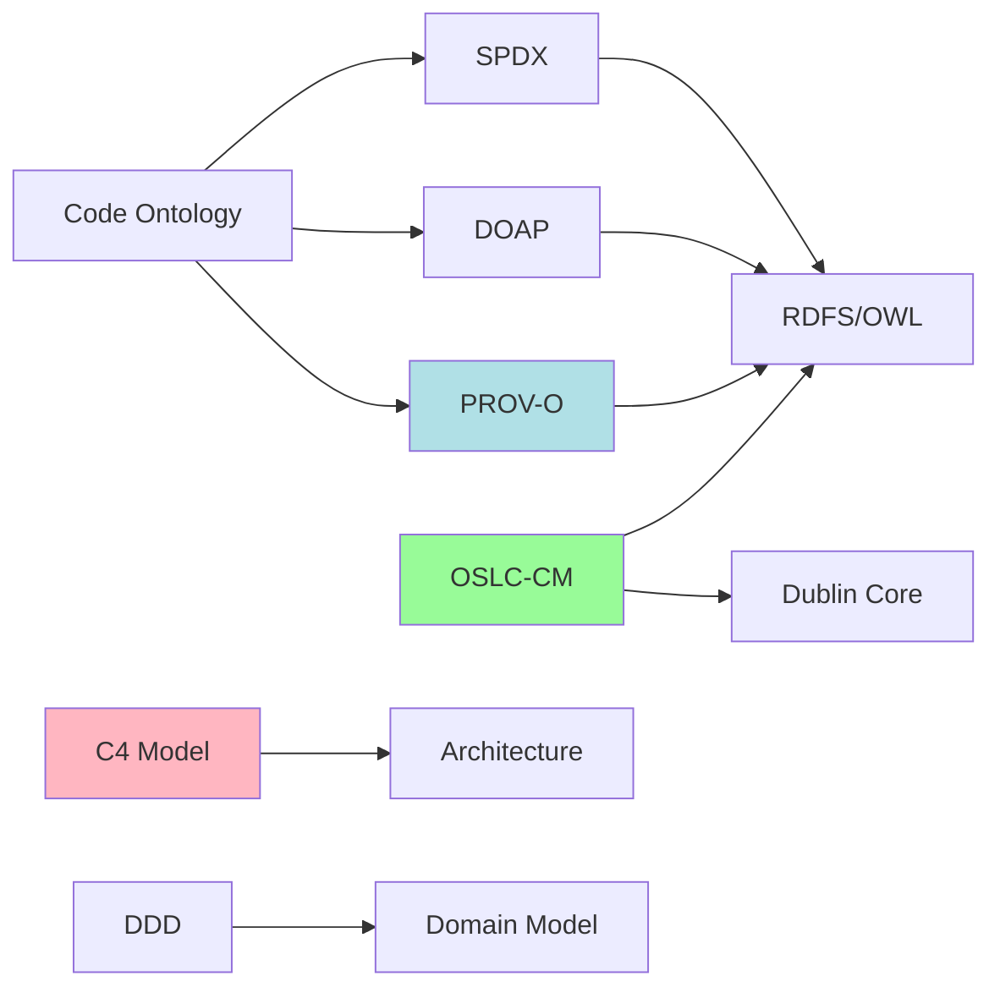
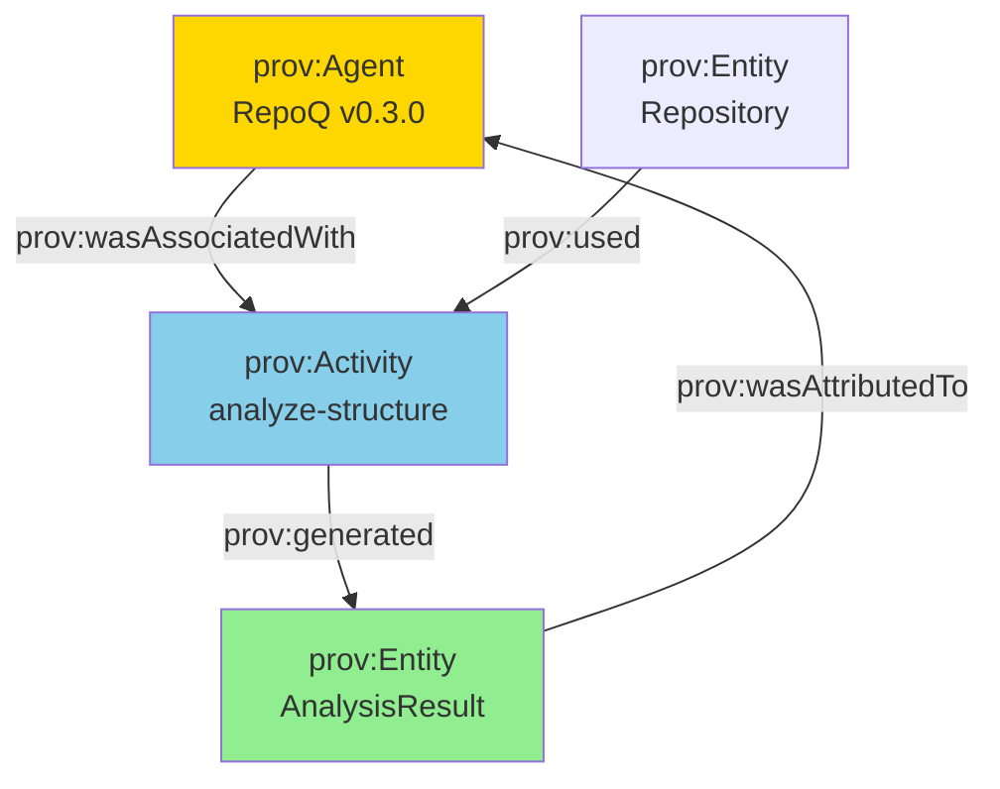
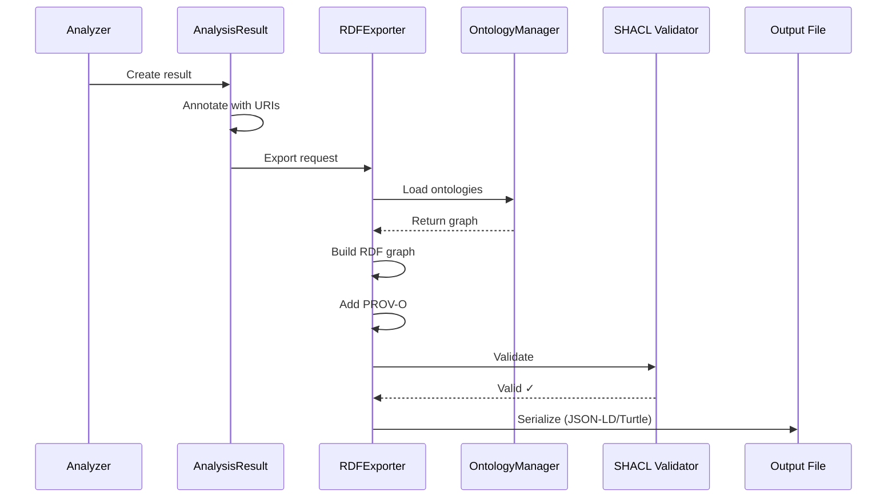

# RDF Export Architecture

!!! abstract "Semantic Web Integration"
    RepoQ exports all analysis results as RDF graphs with PROV-O provenance, OSLC-CM compliance, and SPDX/DOAP annotations.

## Overview

Every analysis result is:
- **RDF-annotated**: Linked data with URIs
- **Provenance-tracked**: PROV-O entities, activities, agents
- **Standards-compliant**: OSLC-CM, SPDX, DOAP, C4, DDD
- **SHACL-validated**: Shapes ensure data quality

## RDF Stack

### Core Technologies

| Component | Purpose | Specification |
|-----------|---------|--------------|
| **rdflib** | RDF graph manipulation | RDF 1.1 |
| **JSON-LD** | Serialization format | JSON-LD 1.1 |
| **Turtle** | Human-readable RDF | Turtle 1.1 |
| **SPARQL** | Query language | SPARQL 1.1 |
| **PyShacl** | Validation | SHACL W3C |

### Ontologies



## Data Model

### Core Classes

```turtle
# repoq/ontologies/field33.context.jsonld

@prefix repoq: <https://field33.com/ontologies/repoq#> .
@prefix prov: <http://www.w3.org/ns/prov#> .
@prefix oslc: <http://open-services.net/ns/cm#> .
@prefix spdx: <http://spdx.org/rdf/terms#> .

# Analysis Result
repoq:AnalysisResult a owl:Class ;
    rdfs:subClassOf prov:Entity ;
    rdfs:label "Analysis Result" ;
    rdfs:comment "Output from a RepoQ analyzer" .

# Repository
repoq:Repository a owl:Class ;
    rdfs:subClassOf prov:Entity, doap:Project ;
    rdfs:label "Git Repository" .

# File Node
repoq:FileNode a owl:Class ;
    rdfs:subClassOf prov:Entity ;
    rdfs:label "Source Code File" ;
    oslc:instanceShape repoq:FileNodeShape .

# Complexity Metrics
repoq:ComplexityMetrics a owl:Class ;
    rdfs:subClassOf prov:Entity ;
    rdfs:label "Code Complexity Metrics" .

# Hotspot
repoq:Hotspot a owl:Class ;
    rdfs:subClassOf prov:Entity ;
    rdfs:label "Complexity + Change Hotspot" .
```

### Properties

```turtle
# Structural properties
repoq:hasFile a owl:ObjectProperty ;
    rdfs:domain repoq:Repository ;
    rdfs:range repoq:FileNode .

repoq:hasLicense a owl:DatatypeProperty ;
    rdfs:domain repoq:Repository ;
    rdfs:range spdx:LicenseExpression .

# Complexity metrics
repoq:cyclomaticComplexity a owl:DatatypeProperty ;
    rdfs:domain repoq:ComplexityMetrics ;
    rdfs:range xsd:integer .

repoq:maintainabilityIndex a owl:DatatypeProperty ;
    rdfs:domain repoq:ComplexityMetrics ;
    rdfs:range xsd:float .

# Provenance
repoq:generatedBy a owl:ObjectProperty ;
    rdfs:subPropertyOf prov:wasGeneratedBy ;
    rdfs:domain repoq:AnalysisResult ;
    rdfs:range repoq:AnalysisActivity .
```

## PROV-O Integration

### Provenance Model



### Example

```turtle
# Analysis activity
<analysis/abc123> a prov:Activity, repoq:AnalysisActivity ;
    prov:startedAtTime "2024-01-15T10:30:00Z"^^xsd:dateTime ;
    prov:endedAtTime "2024-01-15T10:30:05Z"^^xsd:dateTime ;
    prov:wasAssociatedWith <agent/repoq-0.3.0> ;
    prov:used <repo/myproject> ;
    prov:generated <result/abc123> .

# Agent
<agent/repoq-0.3.0> a prov:Agent, prov:SoftwareAgent ;
    rdfs:label "RepoQ v0.3.0" ;
    repoq:version "0.3.0" ;
    doap:homepage <https://github.com/field33/repoq> .

# Result
<result/abc123> a prov:Entity, repoq:AnalysisResult ;
    prov:wasGeneratedBy <analysis/abc123> ;
    prov:wasAttributedTo <agent/repoq-0.3.0> ;
    repoq:analysisTimestamp "2024-01-15T10:30:05Z"^^xsd:dateTime ;
    repoq:hasMetrics <metrics/abc123> .
```

## OSLC-CM Compliance

### Change Management

OSLC-CM defines resources for change management:

```turtle
@prefix oslc_cm: <http://open-services.net/ns/cm#> .

# Defect (for weaknesses)
<defect/todo-123> a oslc_cm:Defect ;
    dcterms:title "TODO: Refactor authentication logic" ;
    dcterms:description "Found in src/auth.py:42" ;
    oslc_cm:severity "minor" ;
    oslc_cm:status "open" ;
    repoq:detectedByAnalyzer repoq:WeaknessAnalyzer ;
    repoq:inFile <file/src/auth.py> ;
    repoq:atLine 42 .

# Task (for refactoring recommendations)
<task/refactor-456> a oslc_cm:Task ;
    dcterms:title "Reduce complexity in calculate_metrics()" ;
    dcterms:description "Cyclomatic complexity: 42 (threshold: 15)" ;
    oslc_cm:priority "high" ;
    oslc_cm:status "proposed" ;
    repoq:affectsFile <file/src/metrics.py> .
```

### Resource Shapes

```turtle
# OSLC Resource Shape for FileNode
<shape/FileNode> a oslc:ResourceShape ;
    oslc:describes repoq:FileNode ;
    dcterms:title "File Node Shape" ;
    oslc:property [
        oslc:name "path" ;
        oslc:occurs oslc:Exactly-one ;
        oslc:propertyDefinition repoq:path ;
        oslc:valueType xsd:string
    ] ;
    oslc:property [
        oslc:name "complexity" ;
        oslc:occurs oslc:Zero-or-one ;
        oslc:propertyDefinition repoq:cyclomaticComplexity ;
        oslc:valueType xsd:integer
    ] .
```

## SPDX Integration

### License Annotations

```turtle
@prefix spdx: <http://spdx.org/rdf/terms#> .

# SPDX Document
<spdx/myproject> a spdx:SpdxDocument ;
    spdx:specVersion "SPDX-2.3" ;
    spdx:creationInfo [
        spdx:created "2024-01-15T10:30:00Z"^^xsd:dateTime ;
        spdx:creator "Tool: RepoQ-0.3.0" ;
        spdx:licenseListVersion "3.21"
    ] ;
    spdx:describesPackage <package/myproject> .

# Package
<package/myproject> a spdx:Package ;
    spdx:name "myproject" ;
    spdx:versionInfo "1.2.3" ;
    spdx:downloadLocation "https://github.com/user/myproject" ;
    spdx:licenseConcluded "MIT" ;
    spdx:licenseDeclared "MIT" ;
    spdx:copyrightText "Copyright 2024 User" ;
    spdx:hasFile <file/src/main.py>, <file/src/utils.py> .

# File with license
<file/src/main.py> a spdx:File ;
    spdx:fileName "./src/main.py" ;
    spdx:fileType spdx:fileType_source ;
    spdx:licenseConcluded "MIT" ;
    spdx:licenseInfoInFile "MIT" ;
    spdx:copyrightText "Copyright 2024 User" .
```

## Export Process

### Pipeline



### Implementation

```python
# repoq/core/rdf_export.py

class RDFExporter:
    """Export AnalysisResult to RDF with PROV-O provenance."""
    
    def __init__(self, ontology_manager: OntologyManager):
        self.ontology = ontology_manager
        self.graph = Graph()
        self._load_contexts()
    
    def export(
        self,
        result: AnalysisResult,
        format: Literal["turtle", "json-ld", "nt"] = "turtle"
    ) -> str:
        """Export result as RDF."""
        # 1. Create provenance entities
        activity_uri = self._create_activity(result)
        agent_uri = self._create_agent()
        result_uri = self._create_result_entity(result)
        
        # 2. Link with PROV-O
        self.graph.add((result_uri, PROV.wasGeneratedBy, activity_uri))
        self.graph.add((activity_uri, PROV.wasAssociatedWith, agent_uri))
        self.graph.add((result_uri, PROV.wasAttributedTo, agent_uri))
        
        # 3. Add domain entities
        self._add_repository(result.repository)
        self._add_files(result.structure.files)
        self._add_metrics(result.complexity)
        
        # 4. Validate with SHACL
        self._validate_graph()
        
        # 5. Serialize
        return self.graph.serialize(format=format)
    
    def _create_activity(self, result: AnalysisResult) -> URIRef:
        """Create prov:Activity for analysis."""
        uri = URIRef(f"urn:repoq:analysis:{result.id}")
        
        self.graph.add((uri, RDF.type, PROV.Activity))
        self.graph.add((uri, RDF.type, REPOQ.AnalysisActivity))
        self.graph.add((uri, PROV.startedAtTime, 
                       Literal(result.timestamp, datatype=XSD.dateTime)))
        self.graph.add((uri, REPOQ.analyzers, 
                       Literal(",".join(result.analyzers))))
        
        return uri
    
    def _create_agent(self) -> URIRef:
        """Create prov:SoftwareAgent for RepoQ."""
        uri = URIRef(f"urn:repoq:agent:{__version__}")
        
        self.graph.add((uri, RDF.type, PROV.Agent))
        self.graph.add((uri, RDF.type, PROV.SoftwareAgent))
        self.graph.add((uri, RDFS.label, Literal(f"RepoQ v{__version__}")))
        self.graph.add((uri, REPOQ.version, Literal(__version__)))
        
        return uri
    
    def _validate_graph(self):
        """Validate RDF graph with SHACL shapes."""
        shacl_graph = Graph()
        shacl_graph.parse("repoq/shapes/shacl_project.ttl")
        
        conforms, results_graph, results_text = validate(
            self.graph,
            shacl_graph=shacl_graph,
            inference="rdfs",  # RDFS reasoning
            abort_on_first=False,
        )
        
        if not conforms:
            raise ValidationError(f"SHACL validation failed:\n{results_text}")
```

### URI Strategy

**Stable URIs** for resources:

```python
# Repository
f"urn:repoq:repo:{repo_hash}"

# File (content-addressed)
f"urn:repoq:file:{file_path_hash}"

# Analysis result
f"urn:repoq:analysis:{uuid4()}"

# Metrics
f"urn:repoq:metrics:{analysis_id}:{analyzer_name}"
```

## SHACL Validation

### Shapes

```turtle
# repoq/shapes/shacl_project.ttl

@prefix sh: <http://www.w3.org/ns/shacl#> .

# FileNode shape
repoq:FileNodeShape a sh:NodeShape ;
    sh:targetClass repoq:FileNode ;
    sh:property [
        sh:path repoq:path ;
        sh:datatype xsd:string ;
        sh:minCount 1 ;
        sh:maxCount 1 ;
        sh:pattern "^[a-zA-Z0-9_/.-]+$"  # Valid file path
    ] ;
    sh:property [
        sh:path repoq:cyclomaticComplexity ;
        sh:datatype xsd:integer ;
        sh:minInclusive 1 ;
        sh:maxInclusive 1000  # Sanity bound
    ] ;
    sh:property [
        sh:path repoq:maintainabilityIndex ;
        sh:datatype xsd:float ;
        sh:minInclusive 0.0 ;
        sh:maxInclusive 100.0
    ] .

# AnalysisResult shape
repoq:AnalysisResultShape a sh:NodeShape ;
    sh:targetClass repoq:AnalysisResult ;
    sh:property [
        sh:path prov:wasGeneratedBy ;
        sh:class prov:Activity ;
        sh:minCount 1 ;
        sh:maxCount 1
    ] ;
    sh:property [
        sh:path prov:wasAttributedTo ;
        sh:class prov:Agent ;
        sh:minCount 1
    ] ;
    sh:property [
        sh:path repoq:analysisTimestamp ;
        sh:datatype xsd:dateTime ;
        sh:minCount 1 ;
        sh:maxCount 1
    ] .
```

### Validation Reports

```python
from pyshacl import validate

# Validate graph
conforms, results_graph, results_text = validate(
    data_graph,
    shacl_graph=shacl_graph,
    inference="rdfs",
    abort_on_first=False,
)

if not conforms:
    print(results_text)
    # Output:
    # Validation Report
    # Conforms: False
    # Results (1):
    # Constraint Violation in FileNodeShape:
    #   Severity: sh:Violation
    #   Focus Node: <file/src/main.py>
    #   Result Path: repoq:cyclomaticComplexity
    #   Message: Value 1500 exceeds maxInclusive of 1000
```

## Query Interface

### SPARQL Queries

```python
from rdflib.plugins.sparql import prepareQuery

# Find high-complexity files
query = prepareQuery("""
    PREFIX repoq: <https://field33.com/ontologies/repoq#>
    
    SELECT ?file ?complexity
    WHERE {
        ?file a repoq:FileNode ;
              repoq:path ?path ;
              repoq:cyclomaticComplexity ?complexity .
        FILTER (?complexity > 15)
    }
    ORDER BY DESC(?complexity)
""")

results = graph.query(query)
for row in results:
    print(f"{row.file}: {row.complexity}")
```

### GraphQL-like Traversal

```python
# Find hotspots (high complexity + high change frequency)
query = prepareQuery("""
    PREFIX repoq: <https://field33.com/ontologies/repoq#>
    
    SELECT ?file ?complexity ?changes
    WHERE {
        ?file a repoq:FileNode ;
              repoq:cyclomaticComplexity ?complexity .
        
        OPTIONAL {
            ?file repoq:changeFrequency ?changes .
        }
        
        FILTER (?complexity > 10 && ?changes > 5)
    }
    ORDER BY DESC(?complexity * ?changes)
""")
```

## Performance

### Serialization

| Format | Time (1000 triples) | Size |
|--------|-------------------|------|
| **Turtle** | 50ms | 100KB |
| **JSON-LD** | 80ms | 150KB |
| **N-Triples** | 30ms | 120KB |
| **RDF/XML** | 120ms | 180KB |

### Memory

- **In-memory graph**: ~1MB per 10k triples
- **Streaming**: O(1) memory for large exports
- **Indexed**: BerkeleyDB backend for > 1M triples

## Integration Examples

### Export to Triplestore

```python
from rdflib.plugins.stores import sparqlstore

# Export to Fuseki
store = sparqlstore.SPARQLUpdateStore()
store.open("http://localhost:3030/repoq/update")

# Add triples
for triple in graph:
    store.add(triple)

store.close()
```

### Federated Queries

```python
# Query across multiple repositories
federated_query = """
    PREFIX repoq: <https://field33.com/ontologies/repoq#>
    
    SELECT ?repo ?avgComplexity
    WHERE {
        SERVICE <http://sparql-endpoint-1/sparql> {
            ?repo a repoq:Repository ;
                  repoq:averageComplexity ?avgComplexity .
        }
        
        FILTER (?avgComplexity > 20)
    }
"""
```

## Standards Compliance

### Specifications

- ✅ **RDF 1.1**: [W3C Recommendation](https://www.w3.org/TR/rdf11-concepts/)
- ✅ **JSON-LD 1.1**: [W3C Recommendation](https://www.w3.org/TR/json-ld11/)
- ✅ **PROV-O**: [W3C Recommendation](https://www.w3.org/TR/prov-o/)
- ✅ **OSLC-CM 3.0**: [OASIS Standard](https://open-services.net/spec/cm/latest)
- ✅ **SPDX 2.3**: [ISO/IEC 5962:2021](https://spdx.github.io/spdx-spec/)
- ✅ **SHACL**: [W3C Recommendation](https://www.w3.org/TR/shacl/)

### Validation

```bash
# Validate JSON-LD context
repoq validate jsonld repoq/ontologies/field33.context.jsonld

# Validate SHACL shapes
repoq validate shacl repoq/shapes/shacl_project.ttl

# Validate RDF graph
repoq validate rdf output/analysis.ttl
```

## Next Steps

- **[BAML AI Agent](baml-agent.md)**: AI-assisted RDF reasoning
- **[Analyzer Pipeline](analyzer-pipeline.md)**: Data flow to RDF
- **[Stratification Guard](stratification-guard.md)**: Safe meta-level reasoning
- **[API Reference](../api/reference.md)**: Programmatic RDF export

!!! success "Linked Data Ready"
    All RepoQ outputs are valid RDF graphs with provenance, ready for SPARQL queries, triplestore storage, and federated reasoning.
