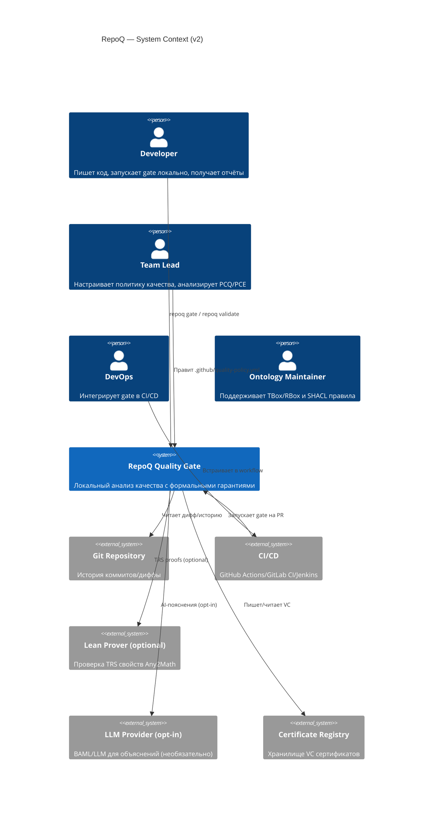
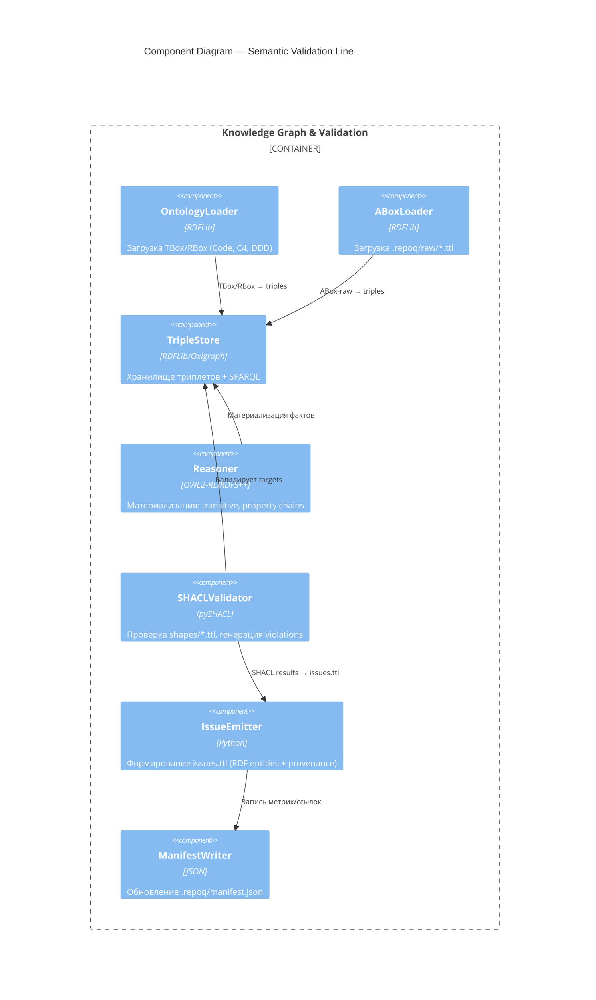
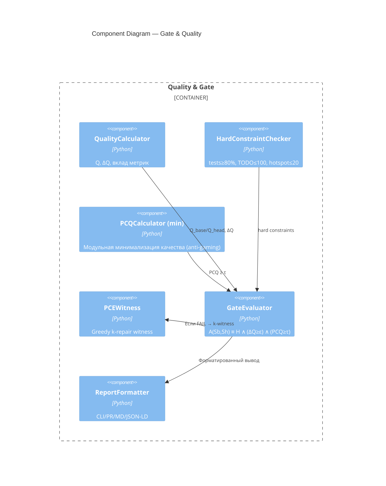

# RepoQ — C4 Architecture Diagrams (v2): ABox/TBox/SHACL слойность

**Status**: ✅ ACTIVE  
**Model**: C4 Model by Simon Brown  
**Updated**: 2025‑10‑22

> Цель v2 — отразить строгую слойность **ABox (raw/validated)**, **TBox (онтологии + RBox)** и **SHACL (валидация)**, чтобы устранить смешение слоёв и сделать **issues** единственной «точкой истины» после декларативной проверки, с версионированием через `.repoq/manifest.json`.

---

## Что изменилось по сравнению с v1

1) **Явная трёхслойность**:  
   - **Input (ABox‑raw)** — только сырые факты (AST, метрики, git, deps) в `.repoq/raw/*.ttl`.  
   - **TBox + RBox** — онтологии (Code/C4/DDD, property chain, transitive props).  
   - **Validation (SHACL)** — правила качества и архитектурные инварианты → генерируют **issues.ttl**.  

2) **Единая точка истины для issues**: только **SHACL violations** → RDF‑сущности с provenance.  

3) **Повторная валидация без ре‑анализа**: изменение онтологии/шейпов требует лишь шага reason+validate (используя `.repoq/raw` кеш).  

4) **Версионирование артефактов**: `.repoq/manifest.json` хранит контрольные суммы онтологий/шейпов и версию raw‑фактов.  

5) **TBox‑guardian**: `AnalyzerRegistry/OntologistAgent` валидирует консистентность TBox/RBox/SHACL при регистрации анализаторов.  

---

## Level 1 — System Context



---

## Level 2 — Container Diagram (v2)

```mermaid
C4Container
    title RepoQ — Container Diagram (v2)

    Person(user, "User", "Developer/Lead/DevOps")
    System_Ext(git, "Git Repository", "Код + история")
    System_Ext(lean, "Lean Prover", "Опционально")
    System_Ext(llm, "LLM Provider", "Опционально")

    Container_Boundary(repoq, "RepoQ") {
        Container(cli, "CLI", "Python/Click", "Команды: extract, validate, gate, export, meta-self")
        Container(pipe, "Pipeline Orchestrator", "Python", "Оркестрация шагов: Extract → Reason → SHACL → Quality → Reports")
        
        Container(extract, "Fact Extractors", "Python", "AST, метрики, git, deps → ABox-raw (TTL)")
        ContainerDb(raw, ".repoq/raw", "TTL files", "ABox‑raw: ast.ttl, metrics.ttl, git-history.ttl, deps.ttl")
        
        Container(kg, "Knowledge Graph Engine", "Python + RDFLib/Oxigraph", "TripleStore + SPARQL")
        Container(reason, "Reasoner", "OWL2‑RL/RDFS++", "Материализация: транзитивность, property chains")
        Container(shacl, "SHACL Validator", "pySHACL", "Валидация правил качества/архитектуры → issues.ttl")
        
        ContainerDb(validated, ".repoq/validated", "TTL files", "facts.ttl (raw+inferred), issues.ttl, quality-report.ttl")
        Container(quality, "Quality Engine", "Python", "Q/ΔQ, PCQ (min), PCE (k‑witness), hard constraints")
        Container(reports, "Report Exporter", "Python", "Markdown/JSON‑LD отчёты")
        Container(vc, "VC Generator", "cryptography", "W3C Verifiable Credentials, ECDSA")
        
        Container(reg, "AnalyzerRegistry + OntologistAgent", "Python", "Регистрация анализаторов, проверка TBox/SHACL ссылочной целостности")
        ContainerDb(ws, ".repoq/manifest.json", "JSON", "Версии сырья/онтологий/шейпов/валидаций")
        ContainerDb(certstore, ".repoq/certificates", "JSON‑LD", "Подписанные VC")
        ContainerDb(cache, "Metric Cache", "Disk-backed LRU", "Кэш метрик по SHA+policy")
    }

    Rel(user, cli, "Запускает команды")
    Rel(cli, pipe, "Конфиг/режимы анализа")
    Rel(pipe, extract, "Запускает экстракторы")
    Rel(extract, raw, "Пишет ABox‑raw *.ttl")

    Rel(pipe, kg, "Загружает TBox + raw")
    Rel(kg, reason, "Материализация")
    Rel(reason, kg, "Inferred triples")
    Rel(kg, shacl, "Проверка шейпов")
    Rel(shacl, validated, "issues.ttl / facts.ttl")

    Rel(pipe, quality, "Читает validated/facts")
    Rel(quality, validated, "quality-report.ttl")
    Rel(pipe, reports, "Рендер отчётов")
    Rel(reports, certstore, "Ссылки на VC")
    Rel(pipe, vc, "Выпуск VC")
    Rel(vc, certstore, "Сохранение VC")

    Rel(reg, kg, "Проверка онтологий/шейпов")
    Rel(pipe, cache, "Кэш метрик")
    Rel(pipe, ws, "Обновляет манифест")

    Rel(lean, pipe, "Proofs (Any2Math)", "optional")
    Rel(llm, pipe, "AI‑объяснения", "optional")
    Rel(git, extract, "История/диффы")

    UpdateLayoutConfig($c4ShapeInRow="3", $c4BoundaryInRow="1")
```



**Ключевые изменения контейнеров**  

- **Fact Extractors → ABox‑raw** (immutable)  
- **KG Engine + Reasoner + SHACL** — единая «семантическая линия»: TBox (онтологии) применяется к raw, затем декларативная валидация формирует **issues.ttl**.  
- **Quality Engine** работает **поверх validated RDF** (а не поверх внутренних Python‑объектов).  
- **manifest.json** фиксирует версии сырья/онтологий/шейпов и результаты валидации.  

---

## Level 3 — Component Diagram: Semantic Line (KG+Reason+SHACL)



---

## Level 3 — Component Diagram: Gate & Quality (PCQ/PCE)



---

## Workspace / Artefact Flow (в помощь внедрению)

```
repo/
  .repoq/
    raw/             # ABox‑raw (immutable)
      ast.ttl
      metrics.ttl
      git-history.ttl
      dependencies.ttl
    validated/       # (derived)
      facts.ttl
      issues.ttl
      quality-report.ttl
    reports/
      quality.md
      quality.jsonld
    certificates/
      <sha>.json     # W3C VC (ECDSA)
    manifest.json    # commit, analyzer versions, TBox/SHACL checksums, violations count
```

---

## Требования и трассируемость (v2 → FR/NFR)

- **Единая точка истины (issues от SHACL)** → улучшает *Transparency/Actionability* в выводе gate (FR‑01) и даёт основу для **PCE** (FR‑11).  
- **PCQ (min) и PCE k‑witness** остаются в Gate (FR‑04/05/11).  
- **Повторная валидация без экстракции** сокращает время (NFR‑01) и повышает воспроизводимость (NFR‑03/09).  
- **Any2Math/Lean** остаётся опциональной оптимизацией детерминизма на шаге Extract (FR‑06/07).  

---

## Миграция (пошагово)

1. `repoq extract .  →  .repoq/raw/*.ttl`  
2. `repoq validate .repoq/raw --shapes repoq/shapes → .repoq/validated/*.ttl`  
3. `repoq gate --validated .repoq/validated` (Q/PCQ/PCE поверх facts/issues)  
4. `repoq export --reports .repoq/reports` (MD, JSON‑LD, графы)  

---

## Примечания по производительности

- Для <100k триплетов достаточно RDFLib (in‑memory).  
- Для больших графов включайте Oxigraph + инкрементальную валидацию SHACL.  
- Кешируйте `.repoq/raw` по SHA коммита в CI, чтобы ускорить ревалидацию при изменении только TBox/SHACL.
