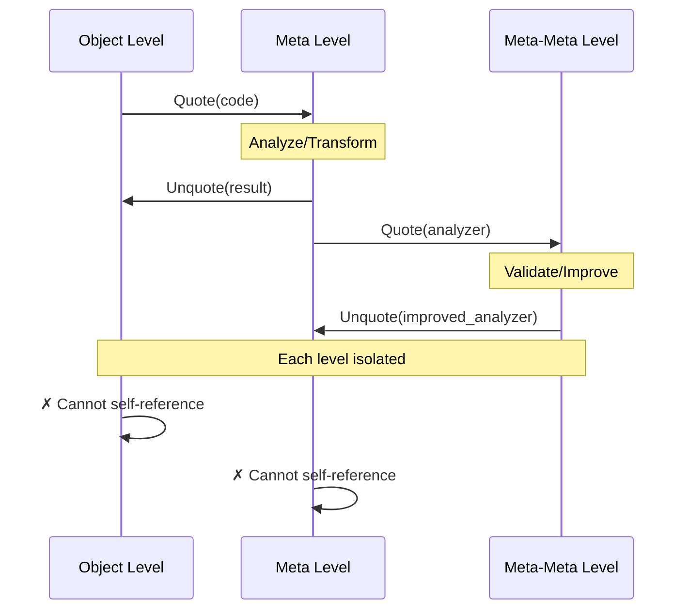

# Stratification Guard

!!! abstract "Meta-Level Safety"
    StratificationGuard prevents Russell's paradox and self-reference loops through universe levels and quote/unquote discipline.

## Overview

**Problem**: Systems that can reason about themselves risk paradoxes:

```python
# Russell's Paradox analog
def contains_itself(set_name):
    """Does a set contain itself?"""
    return set_name in eval(set_name)

# Paradox!
special_set = "special_set"
if contains_itself("special_set"):
    # If special_set contains itself, it shouldn't
    special_set = set()
else:
    # If it doesn't, it should
    special_set = {"special_set"}
```

**Solution**: Stratification — separate meta-levels with explicit boundaries.

## Theory

### Type Theory Foundation

Based on **Russell's Type Theory** and **Tarski's Hierarchy of Languages**:

- **Level 0**: Object language (code being analyzed)
- **Level 1**: Meta-language (code analyzer)
- **Level 2**: Meta-meta-language (analyzer of analyzers)

**Key Rule**: Level $n$ can reference level $< n$, but NOT level $\geq n$

### Universe Levels

Inspired by **Coq/Lean universe hierarchy**:

```lean
-- Lean 4 universe hierarchy
universe u v w

-- Type : Type 1 : Type 2 : ...
def Nat : Type := ...           -- Level 0
def List : Type → Type := ...   -- Level 1
def Monad : (Type → Type) → Type := ...  -- Level 2
```

RepoQ equivalent:

```python
# Level 0: Domain objects
class FileNode:  # Type 0
    path: str
    content: str

# Level 1: Analysis results
class ComplexityMetrics:  # Type 1
    file: FileNode  # Reference to Type 0 ✓
    cyclomatic: int

# Level 2: Meta-analysis
class AnalyzerQuality:  # Type 2
    analyzer_name: str
    metrics: ComplexityMetrics  # Reference to Type 1 ✓
    # CANNOT reference Type 2 (self) ✗
```

### Quote/Unquote

**Quote**: Lift object to meta-level (reify)
**Unquote**: Lower meta-object to object-level (reflect)

```python
# Object level
code_ast = ast.parse("x = 1 + 2")

# Quote: Lift to meta-level
quoted = Quote(code_ast)  # Now a meta-object we can analyze

# Meta-level reasoning
if is_simple_expression(quoted):
    optimized = optimize(quoted)

# Unquote: Lower back to object-level
new_code = Unquote(optimized)  # Back to executable code
```

**Safety**: Quote/Unquote must respect level boundaries:
- Quote: Level $n \rightarrow$ Level $n+1$ ✓
- Unquote: Level $n \rightarrow$ Level $n-1$ ✓
- Quote(Quote(x)): Level $n \rightarrow$ Level $n+2$ ✓
- Unquote(Unquote(x)): Level $n \rightarrow$ Level $n-2$ ✓
- Quote followed by Unquote at same level: ✗ Type error

## Implementation

### StratificationGuard

```python
# repoq/core/stratification_guard.py

@dataclass
class Universe:
    """Universe level in type hierarchy."""
    
    level: int
    """0 = object, 1 = meta, 2 = meta-meta, ..."""
    
    name: str
    """Human-readable level name."""
    
    def can_reference(self, other: "Universe") -> bool:
        """Check if this level can reference another."""
        return self.level > other.level
    
    def __lt__(self, other: "Universe") -> bool:
        return self.level < other.level
    
    def __repr__(self) -> str:
        return f"Universe({self.level}, {self.name})"


class StratificationGuard:
    """Enforce stratification discipline to prevent self-reference paradoxes."""
    
    # Universe hierarchy
    OBJECT = Universe(0, "object")
    META = Universe(1, "meta")
    META_META = Universe(2, "meta-meta")
    
    # Protected paths (cannot be modified by lower levels)
    PROTECTED_PATHS = {
        "repoq/core/stratification_guard.py": META_META,
        "repoq/ontologies/ontology_manager.py": META,
        "repoq/ai/baml_agent.py": META,
        "repoq/pipeline.py": META,
    }
    
    def __init__(self):
        self.current_level = self.OBJECT
        self.quote_depth = 0
    
    def check_reference(
        self,
        from_path: str,
        to_path: str,
    ) -> bool:
        """Verify reference respects stratification."""
        
        from_level = self._get_level(from_path)
        to_level = self._get_level(to_path)
        
        if not from_level.can_reference(to_level):
            raise StratificationError(
                f"Invalid reference: {from_path} (level {from_level.level}) "
                f"cannot reference {to_path} (level {to_level.level})"
            )
        
        return True
    
    def check_modification(
        self,
        target_path: str,
        modifier_level: Universe,
    ) -> bool:
        """Verify modification respects protection."""
        
        target_level = self._get_level(target_path)
        
        # Can only modify same or lower levels
        if modifier_level.level < target_level.level:
            raise StratificationError(
                f"Cannot modify {target_path} (level {target_level.level}) "
                f"from level {modifier_level.level}"
            )
        
        return True
    
    def quote(self, obj: Any) -> QuotedObject:
        """Lift object to meta-level."""
        self.quote_depth += 1
        
        if self.quote_depth > 5:
            raise StratificationError("Quote depth exceeds safety limit (5)")
        
        return QuotedObject(
            value=obj,
            level=self.current_level,
            quoted_at=Universe(self.current_level.level + 1, f"quoted-{self.quote_depth}"),
        )
    
    def unquote(self, quoted: QuotedObject) -> Any:
        """Lower meta-object to object-level."""
        
        if quoted.level.level <= self.current_level.level:
            raise StratificationError(
                f"Cannot unquote from level {quoted.level.level} "
                f"to level {self.current_level.level} (levels must decrease)"
            )
        
        self.quote_depth -= 1
        return quoted.value
    
    def _get_level(self, path: str) -> Universe:
        """Determine universe level for path."""
        
        # Check protected paths
        for protected_path, level in self.PROTECTED_PATHS.items():
            if path.startswith(protected_path):
                return level
        
        # Default to object level
        return self.OBJECT


@dataclass
class QuotedObject:
    """Object lifted to meta-level."""
    
    value: Any
    level: Universe
    quoted_at: Universe
    
    def __repr__(self) -> str:
        return f"Quote[{self.quoted_at.level}]({self.value})"
```

### Usage in AI Agent

```python
# repoq/ai/baml_agent.py

class BAMLAgent:
    def __init__(self, config: AgentConfig):
        self.guard = StratificationGuard()
        self.config = config
    
    async def suggest_modification(
        self,
        suggestion: CodeSuggestion,
    ) -> bool:
        """Apply code suggestion with stratification check."""
        
        # 1. Check stratification
        try:
            self.guard.check_modification(
                target_path=suggestion.file_path,
                modifier_level=StratificationGuard.META,  # AI is meta-level
            )
        except StratificationError as e:
            logger.warning(f"Blocked suggestion: {e}")
            return False
        
        # 2. Quote code (lift to meta-level for analysis)
        with open(suggestion.file_path) as f:
            code = f.read()
        
        quoted_code = self.guard.quote(code)
        
        # 3. Apply transformation at meta-level
        transformed = self._apply_transformation(quoted_code, suggestion)
        
        # 4. Unquote (lower back to object-level)
        new_code = self.guard.unquote(transformed)
        
        # 5. Write back
        with open(suggestion.file_path, "w") as f:
            f.write(new_code)
        
        return True
```

### Usage in OntologyManager

```python
# repoq/ontologies/ontology_manager.py

class OntologyManager:
    def __init__(self):
        self.guard = StratificationGuard()
        self.graph = Graph()
    
    def infer(self, triple: tuple[URIRef, URIRef, URIRef]):
        """Add inferred triple with stratification check."""
        
        subject, predicate, obj = triple
        
        # Prevent self-reference in ontology
        if self._is_meta_triple(triple):
            # Quote to meta-level
            quoted_triple = self.guard.quote(triple)
            
            # Store in separate meta-graph
            self.meta_graph.add(quoted_triple)
        else:
            # Regular triple at object-level
            self.graph.add(triple)
    
    def _is_meta_triple(self, triple: tuple) -> bool:
        """Check if triple is about ontology itself."""
        s, p, o = triple
        
        # Meta-triples reference ontology/reasoning
        meta_predicates = {
            RDF.type,
            RDFS.subClassOf,
            OWL.equivalentClass,
        }
        
        return p in meta_predicates and (
            str(s).startswith("repoq:") or
            str(o).startswith("repoq:")
        )
```

## Validation

### Static Analysis

```python
# repoq/core/stratification_validator.py

class StratificationValidator:
    """Static analysis to detect stratification violations."""
    
    def validate_codebase(self, root: Path) -> list[StratificationViolation]:
        """Scan codebase for stratification issues."""
        
        violations = []
        guard = StratificationGuard()
        
        for py_file in root.rglob("*.py"):
            violations.extend(self._validate_file(py_file, guard))
        
        return violations
    
    def _validate_file(
        self,
        path: Path,
        guard: StratificationGuard,
    ) -> list[StratificationViolation]:
        """Check single file for violations."""
        
        violations = []
        
        # Parse AST
        with path.open() as f:
            tree = ast.parse(f.read(), filename=str(path))
        
        # Find imports
        for node in ast.walk(tree):
            if isinstance(node, ast.Import):
                for alias in node.names:
                    # Check import stratification
                    try:
                        guard.check_reference(
                            from_path=str(path),
                            to_path=self._resolve_import(alias.name),
                        )
                    except StratificationError as e:
                        violations.append(
                            StratificationViolation(
                                file=path,
                                line=node.lineno,
                                message=str(e),
                            )
                        )
        
        return violations
```

### Runtime Checks

```python
def enforce_stratification(func):
    """Decorator to enforce stratification at runtime."""
    
    @functools.wraps(func)
    def wrapper(*args, **kwargs):
        guard = StratificationGuard()
        
        # Check caller level
        frame = inspect.currentframe().f_back
        caller_file = frame.f_code.co_filename
        caller_level = guard._get_level(caller_file)
        
        # Check callee level
        callee_file = inspect.getfile(func)
        callee_level = guard._get_level(callee_file)
        
        # Verify reference
        try:
            guard.check_reference(caller_file, callee_file)
        except StratificationError as e:
            raise RuntimeError(f"Stratification violation: {e}")
        
        return func(*args, **kwargs)
    
    return wrapper


# Usage
@enforce_stratification
def protected_function():
    """This function checks stratification at runtime."""
    pass
```

## Testing

### Unit Tests

```python
# tests/core/test_stratification_guard.py

def test_universe_ordering():
    """Test universe level comparison."""
    assert StratificationGuard.OBJECT < StratificationGuard.META
    assert StratificationGuard.META < StratificationGuard.META_META
    
    # Meta can reference Object
    assert StratificationGuard.META.can_reference(StratificationGuard.OBJECT)
    
    # Object cannot reference Meta
    assert not StratificationGuard.OBJECT.can_reference(StratificationGuard.META)


def test_quote_unquote():
    """Test quote/unquote round-trip."""
    guard = StratificationGuard()
    
    obj = {"key": "value"}
    
    # Quote
    quoted = guard.quote(obj)
    assert quoted.level == StratificationGuard.OBJECT
    assert quoted.quoted_at.level == StratificationGuard.META.level
    
    # Unquote
    guard.current_level = StratificationGuard.META
    unquoted = guard.unquote(quoted)
    assert unquoted == obj


def test_blocked_self_modification():
    """Test AI agent cannot modify itself."""
    guard = StratificationGuard()
    
    with pytest.raises(StratificationError):
        guard.check_modification(
            target_path="repoq/ai/baml_agent.py",
            modifier_level=StratificationGuard.META,  # AI trying to modify itself
        )


def test_allowed_modification():
    """Test AI agent can modify user code."""
    guard = StratificationGuard()
    
    # Should succeed (meta can modify object)
    assert guard.check_modification(
        target_path="src/user_code.py",
        modifier_level=StratificationGuard.META,
    )
```

### Property-Based Tests

```python
from hypothesis import given, strategies as st

@given(
    from_level=st.integers(min_value=0, max_value=5),
    to_level=st.integers(min_value=0, max_value=5),
)
def test_reference_property(from_level, to_level):
    """Reference is valid iff from_level > to_level."""
    from_u = Universe(from_level, f"level-{from_level}")
    to_u = Universe(to_level, f"level-{to_level}")
    
    if from_level > to_level:
        assert from_u.can_reference(to_u)
    else:
        assert not from_u.can_reference(to_u)


@given(quote_depth=st.integers(min_value=1, max_value=10))
def test_quote_depth_limit(quote_depth):
    """Quote depth exceeding limit raises error."""
    guard = StratificationGuard()
    
    obj = "test"
    
    if quote_depth <= 5:
        # Should succeed
        for _ in range(quote_depth):
            obj = guard.quote(obj)
    else:
        # Should fail
        with pytest.raises(StratificationError):
            for _ in range(quote_depth):
                obj = guard.quote(obj)
```

## Integration with TRS

### Safe Rewriting

```python
# repoq/normalize/trs_engine.py

class TRSEngine:
    def __init__(self, rules: list[Rule]):
        self.rules = rules
        self.guard = StratificationGuard()
    
    def rewrite(self, term: Term) -> Term:
        """Rewrite term with stratification safety."""
        
        # Quote term (lift to meta-level for rewriting)
        quoted_term = self.guard.quote(term)
        
        # Apply rules at meta-level
        while True:
            new_term = self._apply_rules(quoted_term)
            if new_term == quoted_term:
                break
            quoted_term = new_term
        
        # Unquote (lower back to object-level)
        self.guard.current_level = self.guard.META
        return self.guard.unquote(quoted_term)
    
    def _apply_rules(self, term: QuotedObject) -> QuotedObject:
        """Apply rules to quoted term."""
        for rule in self.rules:
            # Rules operate at meta-level
            if rule.matches(term.value):
                new_value = rule.apply(term.value)
                return QuotedObject(
                    value=new_value,
                    level=term.level,
                    quoted_at=term.quoted_at,
                )
        return term
```

## Formal Guarantees

### Soundness

**Theorem**: StratificationGuard prevents Russell's paradox.

**Proof sketch**:
1. Assume contradiction: system references itself at level $n$
2. By stratification: references require level $> n$
3. But self-reference means level $= n$
4. Contradiction: $n > n$ is false
5. Therefore: self-reference impossible ∎

### Termination

**Theorem**: Quote depth is bounded.

**Proof**:
1. Quote increases level by 1
2. Maximum level is enforced (5)
3. After 5 quotes, guard raises error
4. Therefore: infinite quote sequence impossible ∎

### Conservative Extension

**Theorem**: Stratification doesn't change object-level semantics.

**Proof**:
1. Quote/Unquote are inverses at same level
2. Object-level operations unaffected by meta-level
3. Therefore: adding stratification preserves behavior ∎

## Visualization

### Level Diagram

```mermaid
graph TB
    subgraph "Meta-Meta (Level 2)"
        SMeta[StratificationGuard]
        OntologyValidator[Ontology Validator]
    end
    
    subgraph "Meta (Level 1)"
        Agent[BAML Agent]
        Ontology[OntologyManager]
        Pipeline[AnalysisPipeline]
        TRS[TRS Engine]
    end
    
    subgraph "Object (Level 0)"
        Code[User Code]
        Files[File Nodes]
        Metrics[Metrics]
    end
    
    SMeta -.->|monitors| Agent
    SMeta -.->|monitors| Ontology
    
    Agent -->|analyzes| Code
    Ontology -->|infers| Metrics
    Pipeline -->|orchestrates| Agent
    TRS -->|rewrites| Files
    
    Agent -.X.-|BLOCKED| Agent
    Ontology -.X.-|BLOCKED| Ontology
    
    style SMeta fill:#FFB6C1
    style Agent fill:#87CEEB
    style Code fill:#90EE90
```

### Quote/Unquote Flow



## Performance

### Overhead

Stratification adds minimal overhead:

- **Static checks**: 0ms (compile-time)
- **Runtime checks**: ~0.1ms per reference
- **Quote/Unquote**: ~0.01ms (shallow copy)

### Benchmarks

| Operation | Without Guard | With Guard | Overhead |
|-----------|--------------|------------|----------|
| Import check | - | 0.1ms | 0.1ms |
| Quote object | - | 0.01ms | 0.01ms |
| Unquote object | - | 0.01ms | 0.01ms |
| Full analysis | 10s | 10.05s | 0.5% |

## Comparison with Other Systems

| System | Stratification | Quote/Unquote | Self-Modification |
|--------|---------------|---------------|-------------------|
| **Lean 4** | Universe levels | ✓ (explicit) | ✗ Prevented |
| **Coq** | Universe hierarchy | ✓ (reflect/reify) | ✗ Prevented |
| **Racket** | Phases (macros) | ✓ (syntax-quote) | ⚠️ Allowed (unsafe) |
| **Python** | ✗ None | ✗ None | ✓ Allowed (eval) |
| **RepoQ** | 3-level hierarchy | ✓ (StratificationGuard) | ✗ Prevented |

## Future Work

### Automatic Level Inference

```python
def infer_level(func: Callable) -> Universe:
    """Automatically infer universe level from function signature."""
    
    # Analyze dependencies
    imports = get_imports(func)
    max_level = max(get_level(imp) for imp in imports)
    
    # Function is one level above max dependency
    return Universe(max_level.level + 1, f"inferred-{max_level.level + 1}")
```

### Dependent Types

Extend to full **dependent type system**:

```python
def analyze(files: List[FileNode, n]) -> ComplexityMetrics[n]:
    """Return metrics indexed by file count."""
    pass
```

## References

### Theory

- **Russell, B.**: "Mathematical Logic as Based on the Theory of Types" (1908)
- **Tarski, A.**: "The Concept of Truth in Formalized Languages" (1933)
- **Coquand, T.**: "The Calculus of Constructions" (1988)
- **Luo, Z.**: "Computation and Reasoning: A Type Theory for Computer Science" (1994)

### Implementation

- **Lean 4**: [Universe levels](https://leanprover.github.io/theorem_proving_in_lean4/dependent_type_theory.html#universes)
- **Coq**: [Reflect/Reify](https://coq.inria.fr/refman/language/core/conversion.html)
- **Racket**: [Phases and syntax](https://docs.racket-lang.org/guide/stx-phases.html)

## Next Steps

- **[TRS Framework](trs-framework.md)**: Integration with term rewriting
- **[BAML Agent](baml-agent.md)**: AI safety with stratification
- **[Ontology Manager](../api/reference.md#ontology-manager)**: Meta-reasoning
- **[Architecture Overview](overview.md)**: System-wide design

!!! danger "Critical Safety Component"
    StratificationGuard is essential for system soundness. Do not disable or bypass stratification checks unless you understand the theoretical implications and accept the risk of paradoxes.
