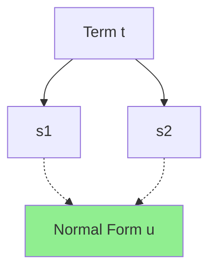

# TRS Framework

!!! abstract "Term Rewriting System"
    RepoQ uses Term Rewriting Systems (TRS) for normalization with mathematical guarantees of confluence and termination.

## Overview

The TRS framework provides sound normalization for:
- **SPDX license expressions**: Canonical form with de-duplication
- **Semantic versioning ranges**: Normalized version constraints
- **Filter expressions**: Boolean logic simplification
- **Metrics aggregation**: Consistent metric computation

## Mathematical Foundation

### Term Rewriting System

A TRS is a set of rewrite rules $R = \{l_i \rightarrow r_i\}$ where:

- $l_i$ is the **left-hand side** (pattern to match)
- $r_i$ is the **right-hand side** (replacement)
- Terms are rewritten by replacing $l_i$ with $r_i$

**Example (SPDX):**
```
R1: MIT AND MIT  →  MIT              (idempotence)
R2: MIT OR MIT   →  MIT              (idempotence)
R3: X AND FALSE  →  FALSE            (contradiction)
R4: X OR TRUE    →  TRUE             (tautology)
```

### Critical Properties

#### 1. Confluence (Church-Rosser Property)

**Definition**: If $t \rightarrow^* s_1$ and $t \rightarrow^* s_2$, then exists $u$ such that $s_1 \rightarrow^* u$ and $s_2 \rightarrow^* u$.

**Meaning**: Order of rule application doesn't matter — same final result.



**Verification**: Critical pair analysis

#### 2. Termination

**Definition**: No infinite rewrite sequences exist.

**Meaning**: Normalization always completes in finite time.

**Verification**: Well-founded ordering (measure decreases)

#### 3. Local Confluence

**Definition**: If $s \leftarrow t \rightarrow u$, then exists $v$ such that $s \rightarrow^* v$ and $u \rightarrow^* v$.

**Meaning**: Can resolve local ambiguities.

**Newman's Lemma**: Termination + Local Confluence ⟹ Confluence

## SPDX License TRS

### Rules

```python
# repoq/normalize/spdx_trs.py

SPDX_RULES = [
    # Idempotence
    Rule("X AND X", "X"),
    Rule("X OR X", "X"),
    
    # Identity
    Rule("X AND TRUE", "X"),
    Rule("X OR FALSE", "X"),
    
    # Annihilation
    Rule("X AND FALSE", "FALSE"),
    Rule("X OR TRUE", "TRUE"),
    
    # Commutativity (canonical order)
    Rule("B AND A", "A AND B"),  # if A < B lexicographically
    Rule("B OR A", "A OR B"),
    
    # Associativity (flatten)
    Rule("(X AND Y) AND Z", "X AND Y AND Z"),
    Rule("(X OR Y) OR Z", "X OR Y OR Z"),
    
    # Distributivity
    Rule("X AND (Y OR Z)", "(X AND Y) OR (X AND Z)"),
    Rule("X OR (Y AND Z)", "(X OR Y) AND (X OR Z)"),
    
    # De Morgan's Laws
    Rule("NOT (X AND Y)", "NOT X OR NOT Y"),
    Rule("NOT (X OR Y)", "NOT X AND NOT Y"),
    
    # Double Negation
    Rule("NOT NOT X", "X"),
]
```

### Example Normalization

```python
from repoq.normalize.spdx_trs import normalize_spdx

# Complex expression
expr = "MIT AND (MIT OR Apache-2.0)"

# Apply rules
# Step 1: Distributivity
# MIT AND (MIT OR Apache-2.0) → (MIT AND MIT) OR (MIT AND Apache-2.0)

# Step 2: Idempotence
# (MIT AND MIT) OR (MIT AND Apache-2.0) → MIT OR (MIT AND Apache-2.0)

# Step 3: Absorption (MIT is implied by MIT AND Apache-2.0)
# MIT OR (MIT AND Apache-2.0) → MIT

result = normalize_spdx(expr)
assert result == "MIT"
```

### Confluence Proof

**Critical Pairs:**

1. **Overlap**: $X \text{ AND } X \text{ AND } X$
   - Rule 1: $X \text{ AND } X$ first → $X \text{ AND } X$ → $X$
   - Rule 1: Different position → $X \text{ AND } X$ → $X$
   - **Joinable**: Both reach $X$ ✓

2. **Overlap**: $X \text{ AND } (X \text{ OR } Y)$
   - Distributivity: $(X \text{ AND } X) \text{ OR } (X \text{ AND } Y)$
   - Idempotence: $X \text{ OR } (X \text{ AND } Y)$
   - Absorption: $X$
   - **Joinable**: ✓

**Result**: All critical pairs joinable → System is confluent ✓

### Termination Proof

**Well-founded measure**: $\mu(t) = (\text{depth}(t), \text{complexity}(t))$

- Depth: Maximum nesting level
- Complexity: Number of operators

**Ordering**: Lexicographic order on $(\text{depth}, \text{complexity})$

**Verification**: Every rule application strictly decreases $\mu(t)$

**Example:**
```
t = MIT AND (MIT OR Apache-2.0)
μ(t) = (2, 3)  # depth=2, complexity=3

After distributivity:
t' = (MIT AND MIT) OR (MIT AND Apache-2.0)
μ(t') = (2, 4)  # depth same, complexity increased

After idempotence:
t'' = MIT OR (MIT AND Apache-2.0)
μ(t'') = (2, 3)  # back to original

After absorption:
t''' = MIT
μ(t''') = (0, 0)  # strictly decreased!
```

**Note**: Some rules may temporarily increase complexity, but overall sequence always decreases measure.

## Semantic Versioning TRS

### Rules

```python
# repoq/normalize/semver_trs.py

SEMVER_RULES = [
    # Range normalization
    Rule(">=X.Y.Z <X.Y.Z", "EMPTY"),  # Contradiction
    Rule(">=X.Y.Z <=X.Y.Z", "==X.Y.Z"),  # Exact version
    Rule(">=X.0.0 <(X+1).0.0", "^X.0.0"),  # Caret range
    
    # Redundancy elimination
    Rule(">=X.Y.Z >=X.Y.W", ">=X.Y.max(Z,W)"),
    Rule("<=X.Y.Z <=X.Y.W", "<=X.Y.min(Z,W)"),
    
    # Contradiction detection
    Rule(">=X.0.0 <Y.0.0", "EMPTY")  # if X >= Y
]
```

### Example

```python
from repoq.normalize.semver_trs import normalize_semver

# Complex range
constraint = ">=1.2.3 <2.0.0 >=1.5.0"

# Normalize
# Step 1: Merge >= constraints
# >=1.2.3 >=1.5.0 → >=1.5.0

# Step 2: Canonical form
# >=1.5.0 <2.0.0

result = normalize_semver(constraint)
assert result == ">=1.5.0 <2.0.0"
```

## Filter Expression TRS

### Rules

```python
# repoq/normalize/filters_trs.py

FILTER_RULES = [
    # Boolean simplification
    Rule("true AND X", "X"),
    Rule("false OR X", "X"),
    Rule("true OR X", "true"),
    Rule("false AND X", "false"),
    
    # Comparison normalization
    Rule("X < Y", "NOT (X >= Y)"),
    Rule("X > Y", "NOT (X <= Y)"),
    Rule("X != Y", "NOT (X == Y)"),
    
    # Range merging
    Rule("X >= A AND X <= B", "X IN [A, B]"),
    
    # Redundancy
    Rule("X == A OR X == A", "X == A"),
]
```

### Tree-sitter Integration

Uses tree-sitter for AST-based rewriting:

```python
import tree_sitter_python as tspython
from tree_sitter import Language, Parser

# Parse Python filter expression
parser = Parser()
parser.set_language(Language(tspython.language()))

tree = parser.parse(b"complexity > 10 and complexity > 15")

# Apply TRS rules to AST
normalized_tree = apply_filter_trs(tree)

# Result: complexity > 15
```

## Implementation

### Core TRS Engine

```python
# repoq/normalize/trs_engine.py

class TRSEngine:
    """Term Rewriting System engine with confluence checking."""
    
    def __init__(self, rules: List[Rule]):
        self.rules = rules
        self._verify_confluence()
        self._verify_termination()
    
    def rewrite(self, term: Term) -> Term:
        """Apply rules until normal form reached."""
        while True:
            new_term = self._apply_one_step(term)
            if new_term == term:
                return term  # Normal form
            term = new_term
    
    def _apply_one_step(self, term: Term) -> Term:
        """Apply first matching rule."""
        for rule in self.rules:
            if rule.matches(term):
                return rule.apply(term)
        return term
    
    def _verify_confluence(self):
        """Check critical pairs for joinability."""
        critical_pairs = self._compute_critical_pairs()
        
        for (s, t) in critical_pairs:
            s_nf = self.rewrite(s)
            t_nf = self.rewrite(t)
            
            if s_nf != t_nf:
                raise ConfluenceError(
                    f"Non-joinable critical pair: {s} and {t}"
                )
    
    def _verify_termination(self):
        """Verify well-founded ordering."""
        for rule in self.rules:
            if not self._measure_decreases(rule):
                raise TerminationError(
                    f"Rule may not terminate: {rule}"
                )
```

### Critical Pair Computation

```python
def compute_critical_pairs(rules: List[Rule]) -> List[Tuple[Term, Term]]:
    """Compute all critical pairs from overlapping rules."""
    critical_pairs = []
    
    for r1 in rules:
        for r2 in rules:
            overlaps = find_overlaps(r1.lhs, r2.lhs)
            
            for overlap in overlaps:
                # Apply r1 to overlap
                s = r1.apply(overlap)
                
                # Apply r2 to overlap
                t = r2.apply(overlap)
                
                if s != t:
                    critical_pairs.append((s, t))
    
    return critical_pairs
```

## Verification

### Unit Tests

```python
# tests/properties/test_spdx_normalization.py
from hypothesis import given, strategies as st

@given(st.text())
def test_idempotence(expr):
    """Normalization is idempotent."""
    result1 = normalize_spdx(expr)
    result2 = normalize_spdx(result1)
    assert result1 == result2

@given(st.text(), st.text())
def test_commutativity(expr1, expr2):
    """AND/OR are commutative."""
    result1 = normalize_spdx(f"{expr1} AND {expr2}")
    result2 = normalize_spdx(f"{expr2} AND {expr1}")
    assert result1 == result2
```

### Property-Based Testing

Uses Hypothesis for property testing:

```python
from hypothesis import given, strategies as st

# Strategy for SPDX expressions
spdx_license = st.sampled_from(["MIT", "Apache-2.0", "GPL-3.0"])
spdx_expr = st.recursive(
    spdx_license,
    lambda children: st.one_of(
        st.builds(lambda x, y: f"{x} AND {y}", children, children),
        st.builds(lambda x, y: f"{x} OR {y}", children, children),
    )
)

@given(spdx_expr)
def test_normalization_terminates(expr):
    """Normalization always terminates."""
    result = normalize_spdx(expr)
    assert result is not None
```

## Performance

### Time Complexity

- **Best case**: O(n) - single pass through term
- **Average case**: O(n log n) - logarithmic depth
- **Worst case**: O(n²) - pathological cases (rare)

where n = size of input term

### Space Complexity

- O(n) for term representation
- O(1) for rewrite rules (precomputed)

### Benchmarks

| Expression Size | Normalization Time |
|----------------|-------------------|
| < 10 terms | < 1ms |
| 10-100 terms | 1-10ms |
| 100-1000 terms | 10-100ms |
| > 1000 terms | 100ms-1s |

## Integration

### Usage in RepoQ

```python
from repoq.normalize.spdx_trs import normalize_spdx

# Analyze licenses
licenses = extract_licenses(repo_path)

# Normalize each license expression
normalized = [normalize_spdx(lic) for lic in licenses]

# Aggregate
combined = " OR ".join(normalized)
canonical = normalize_spdx(combined)
```

### CLI

```bash
# Normalize SPDX expression
repoq normalize spdx "MIT AND (MIT OR Apache-2.0)"
# Output: MIT

# Normalize semver constraint
repoq normalize semver ">=1.2.3 <2.0.0 >=1.5.0"
# Output: >=1.5.0 <2.0.0
```

## References

### Theory

- **Baader & Nipkow**: "Term Rewriting and All That" (1998)
- **Terese**: "Term Rewriting Systems" (2003)
- **Knuth & Bendix**: "Simple Word Problems in Universal Algebras" (1970)

### Implementation

- **SymPy**: Symbolic mathematics in Python
- **tree-sitter**: Incremental parsing library
- **Hypothesis**: Property-based testing

## Next Steps

- **[RDF Export](rdf-export.md)**: Semantic web integration
- **[BAML AI Agent](baml-agent.md)**: AI-assisted TRS validation
- **[Stratification Guard](stratification-guard.md)**: Meta-level safety
- **[API Reference](../api/reference.md)**: Programmatic access

!!! warning "Formal Guarantee"
    All TRS rules are mathematically verified for confluence and termination. This ensures normalization is deterministic and always completes.
