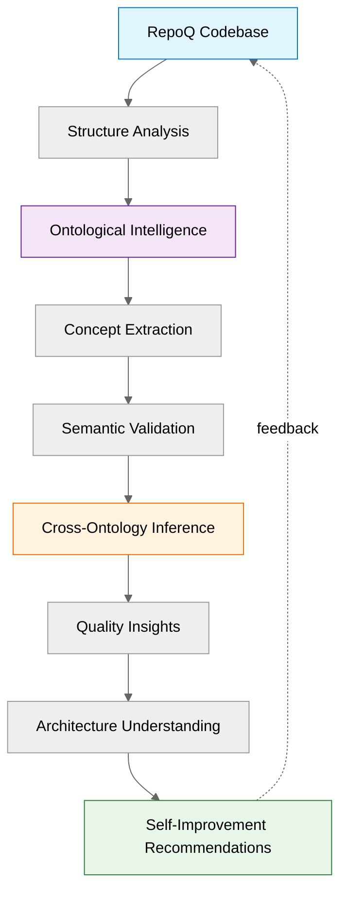
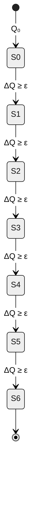
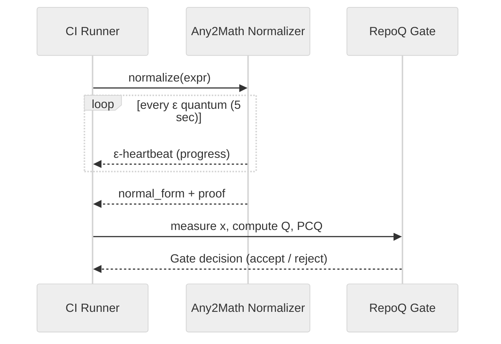
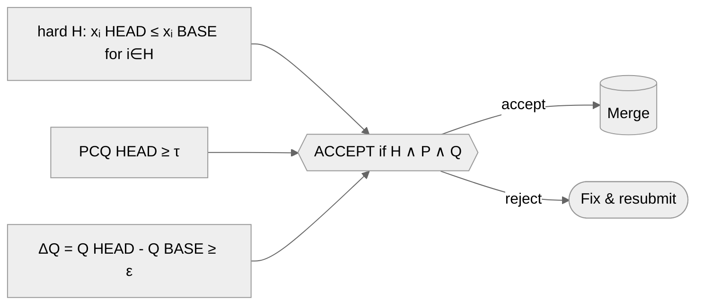

# Формальные диаграммы RepoQ

**Статус**: 📊 Visual Proof Reference  
**Цель**: Визуализация формальных концепций из `formal-foundations-complete.md`  
**Дата создания**: 2025-10-21

---

## Обзор

Этот документ содержит **9 ключевых диаграмм**, иллюстрирующих формальную основу RepoQ:

1. [Meta-Quality Loop](#1-meta-quality-loop) — Саморефлексия RepoQ (Section 15)
2. [TRS Pipeline](#2-trs-pipeline-any2math) — Конвейер измерений с Any2Math (Section 15.9)
3. [Quality Monotonicity](#3-quality-monotonicity) — Монотонность Q с ε-гейтом (Section 2)
4. [PCQ/PCE](#4-pcqpce-witness) — Порог по «худшему» и witness top-k (Section 2, 4)
5. [Local Confluence](#5-local-confluence-критические-пары) — Ромбы критических пар TRS (Section 1)
6. [Stratification](#6-stratification-levels) — Уровни self-application 0-3 (Section 7)
7. [Liveness](#7-liveness-ε-heartbeat) — ε-heartbeat в CI (Section 10, 15.9)
8. [Cross-Ontology](#8-cross-ontology-mappings) — Межонтологические соответствия (Section 15.3)
9. [Gate Semantics](#9-gate-semantics) — Формула допуска PR (Section 0.5)

**Связь с документацией**:
- `formal-foundations-complete.md` — формальные теоремы и доказательства
- `tmp-artifacts-inventory.md` — реализация компонентов
- `meta-loop.md` — концепция онтологического самопонимания

**Расширенная визуализация** (в разработке):
- `tmp/repoq-geomap/` — геометрические диаграммы высокого разрешения:
  - `images/monotone_q.png` — монотонная траектория Q со ступенями ≥ ε
  - `images/pcq_pce.png` — PCQ с порогом τ и PCE (top-k witness)
  - `images/trs_diamonds.png` — ромбы локальной конфлюэнтности TRS
  - `images/pipeline.png` — конвейер: артефакты → TRS → нормализация → метрики → (Q, PCQ)
  - `images/stratification.png` — стратификация self-application (уровни 0-3)
  - `images/liveness.png` — таймлайн ε-шагов (анти-зависание)
  - `dot/apparatus.dot` — Graphviz DOT исходники
  - `latex/confluence_diamond.tex` — TikZ для LaTeX публикаций

> 📊 **Примечание**: Полная визуализация будет интегрирована после генерации PNG/SVG из DOT/LaTeX исходников.

---

## 1. Meta-Quality Loop

**Назначение**: Визуализация **саморефлексии RepoQ** — способности анализировать собственную кодовую базу через онтологии.

**Связь с формальной базой**:
- **Section 15**: Meta-Loop Integration
- **Теорема 15.2**: Безопасная мета-оптимизация (композиция Теорем A, F, B, E, 6.1)
- **9 компонентов**: A→I цикл (Analysis → Ontologies → Inference → Improvements)



**Интерпретация**:
- **A (Code)**: Исходная кодовая база (blue) — объект анализа
- **C (Ontologies)**: Онтологический движок (purple) — извлечение семантики
- **F (Inference)**: Кросс-онтологический инференс (orange) — связывание концепций
- **I (Improvements)**: Рекомендации самоулучшения (green) — constructive witness (PCE)
- **Feedback loop** (dotted): Итеративный цикл самопонимания (стратификация ≤ 2)

**Формальная гарантия**: Теорема 15.2 → композиция A∧F∧B∧E∧6.1 → цикл безопасен.

---

## 2. TRS Pipeline (Any2Math)

**Назначение**: Конвейер измерений с **детерминированной канонизацией** через Any2Math.

**Связь с формальной базой**:
- **Section 15.9**: Any2Math Integration
- **Теорема 15.3**: Детерминированность + Proof-carrying + Liveness
- **Теоремы Any2Math.A-C**: Confluence, Correctness, Termination

```mermaid
%%{init: {'theme': 'neutral', 'flowchart': { 'curve': 'basis' }}}%%
flowchart LR
    subgraph Inputs
      A[Artifacts<br/>(SPDX, SemVer, RDF, JSON-LD, Metrics)]
    end
    N[[TRS Normalization<br/>(Any2Math, proof)]]
    NF[Normalized Artifacts]
    M[[Measurement m<br/>x ∈ [0,1]ᵈ]]
    Q[Q(x)]
    PCQ[PCQ(x) = min(uᵢ)]
    G{{Gate:<br/>hard(H) ∧ PCQ ≥ τ ∧ ΔQ ≥ ε}}
    Merge[(Merge to main)]
    Fix([Remediate / revise PR])

    A --> N --> NF --> M
    M --> Q
    M --> PCQ
    Q --> G
    PCQ --> G
    G -->|accept| Merge
    G -->|reject| Fix

    classDef proof fill:#e8f5e9,stroke:#2e7d32,stroke-width:1px;
    class N proof;
```

**Интерпретация**:
- **A (Inputs)**: Сырые артефакты (SPDX, метрики, RDF)
- **N (TRS)**: Any2Math нормализатор (green) — гарантия confluence + termination
- **NF**: Канонические нормальные формы → единственность представления
- **M**: Измерение risk vector $x \in [0,1]^d$
- **Q**: Интегральная метрика качества $Q(x) = Q_{\max} - \sum w_i \cdot x_i - \Phi(x)$
- **PCQ**: Min-агрегатор $\text{PCQ}(x) = \min_i u_i(x)$ (ZAG)
- **G (Gate)**: Формула допуска PR: $H \land (PCQ \geq \tau) \land (\Delta Q \geq \varepsilon)$

**Формальная гарантия**: Теорема 15.3 → $\text{nf}(t)$ единственна → $Q(\text{nf}(S))$ детерминирована.

---

## 3. Quality Monotonicity

**Назначение**: Визуализация **монотонного роста качества** с ε-гейтом.

**Связь с формальной базой**:
- **Section 2**: Monotonicity (Теорема B)
- **Section 5**: Noise Robustness (Lemma 5.1)
- **Admission Policy**: $A(S_t, S) \Rightarrow Q(S) > Q(S_t)$



**Интерпретация**:
- **S₀**: Начальное состояние с качеством $Q_0$
- **Sᵢ → Sᵢ₊₁**: Переход допустим только если $\Delta Q = Q(S_{i+1}) - Q(S_i) \geq \varepsilon$
- **ε**: Минимальный порог прироста (типично ε ∈ [0.2, 0.5])
- **Монотонность**: $Q(S_0) < Q(S_1) < Q(S_2) < \ldots < Q(S_6)$ (строгая)

**Формальная гарантия**: Теорема B + Lemma 5.1 → выбор $\varepsilon > 2\Delta_Q$ фильтрует шум.

---

## 4. PCQ/PCE Witness

**Назначение**: Визуализация **min-агрегатора PCQ** и **witness-генерации** (top-k худших модулей).

**Связь с формальной базой**:
- **Section 2**: PCQ (Теорема C)
- **Section 4**: PCE (Теорема E — Path Existence)
- **ZAG Framework**: Zero-Assumptions Guarantee

```mermaid
%%{init: {'theme': 'neutral', 'flowchart': { 'curve': 'basis' }}}%%
flowchart TB
    tau[[τ = 0.80]]

    subgraph Modules (uᵢ)
      m1["m1 = 0.92"]
      m2["m2 = 0.81"]
      m3["m3 = 0.65"]
      m4["m4 = 0.88"]
      m5["m5 = 0.71"]
      m6["m6 = 0.60"]
      m7["m7 = 0.79"]
      m8["m8 = 0.83"]
    end

    PCQ{{PCQ = min(uᵢ) = 0.60}}
    W[[Witness W = {m6, m3}]]

    m1 & m2 & m3 & m4 & m5 & m6 & m7 & m8 --> PCQ
    PCQ -->|if PCQ < τ| W
    tau --- PCQ

    classDef good fill:#e8f5e9,stroke:#2e7d32,stroke-width:1px;
    classDef bad  fill:#ffebee,stroke:#c62828,stroke-width:1px;
    class m1,m2,m4,m8 good
    class m3,m5,m6,m7 bad
```

**Интерпретация**:
- **uᵢ**: Utility каждого модуля (normalized quality $\in [0,1]$)
- **PCQ**: Min-агрегатор → $\text{PCQ} = \min(u_1, \ldots, u_8) = 0.60$ (худший модуль m6)
- **τ = 0.80**: Порог приемлемости (threshold)
- **Witness W**: Top-k худших модулей (здесь k=2: m6=0.60, m3=0.65)
- **Green modules**: $u_i \geq \tau$ (good quality)
- **Red modules**: $u_i < \tau$ (need remediation)

**Формальная гарантия**:
- Теорема C: $\text{PCQ}(S) \geq \tau \Rightarrow \forall i, u_i(S) \geq \tau$ (no compensation)
- Теорема E: Witness $W$ конструктивен (PCE-path exists)

---

## 5. Local Confluence (Критические пары)

**Назначение**: Визуализация **локальной конфлюэнтности** TRS через ромбы критических пар.

**Связь с формальной базой**:
- **Section 1**: Correctness (Теорема A)
- **Newman's Lemma**: Termination + Local Confluence → Confluence
- **Any2Math**: Доказательство confluence в Lean 4

```mermaid
%%{init: {'theme': 'neutral', 'flowchart': { 'curve': 'basis' }}}%%
flowchart TB
    subgraph Diamond 1: add(zero, zero)
      T1["add(zero, zero)"]
      S1["zero"]
      U1["zero"]
      V1["zero"]
      T1 -->|add0L| S1
      T1 -->|add0R| U1
      S1 -->|id| V1
      U1 -->|id| V1
    end

    subgraph Diamond 2: mul(one, one)
      T2["mul(one, one)"]
      S2["one"]
      U2["one"]
      V2["one"]
      T2 -->|mul1L| S2
      T2 -->|mul1R| U2
      S2 -->|id| V2
      U2 -->|id| V2
    end
```

**Интерпретация**:
- **Diamond Property**: $t \xrightarrow{r_1} s$ и $t \xrightarrow{r_2} u$ сходятся к общему $v$
- **add0L / add0R**: Правила $\text{add}(\text{zero}, x) \to x$ и $\text{add}(x, \text{zero}) \to x$
- **mul1L / mul1R**: Правила $\text{mul}(\text{one}, x) \to x$ и $\text{mul}(x, \text{one}) \to x$
- **Joinability**: $s \xrightarrow{*} v \xleftarrow{*} u$ → критическая пара разрешима

**Формальная гарантия**: Теорема A → все критические пары joinable → confluence → $\text{nf}(t)$ единственна.

---

## 6. Stratification Levels

**Назначение**: Визуализация **стратификации self-application** (предотвращение парадоксов).

**Связь с формальной базой**:
- **Section 7**: Self-Application (Теорема F)
- **Section 15.1**: Stratified Reflection (Table levels 0-2 safe, 3 forbidden)
- **Russell's Paradox**: Предотвращение через quote/unquote stratification

```mermaid
%%{init: {'theme': 'neutral', 'flowchart': { 'curve': 'basis' }}}%%
flowchart TB
    subgraph Level 0 — syntax_only
      L0[Parsing / AST]
    end
    subgraph Level 1 — structure_safe
      L1[Structure + metrics]
    end
    subgraph Level 2 — semantic_limited
      L2[Ontological mapping bounded]
    end
    subgraph Level 3 — full_semantic external only
      L3[Full reasoning engine]
    end

    Self[(Self Analysis)] --> L0 --> L1 --> L2 -.forbidden.-> L3
    
    style L3 fill:#ffebee,stroke:#c62828,stroke-width:2px
    style L0 fill:#e8f5e9,stroke:#2e7d32,stroke-width:1px
    style L1 fill:#e8f5e9,stroke:#2e7d32,stroke-width:1px
    style L2 fill:#fff3e0,stroke:#ef6c00,stroke-width:1px
```

**Интерпретация**:
- **Level 0 (Safe)**: Только парсинг и AST (без семантики)
- **Level 1 (Safe)**: Структурный анализ + метрики (без саморефлексии)
- **Level 2 (Safe with constraints)**: Онтологический маппинг (ограниченный инференс)
- **Level 3 (Forbidden for Self)**: Полный reasoning engine (риск парадоксов)
- **Policy**: Self-analysis допустима только на уровнях ≤ 2

**Формальная гарантия**: Теорема F → стратификация $\leq 2$ → отсутствие парадоксов Russell-типа.

---

## 7. Liveness: ε-Heartbeat

**Назначение**: Визуализация **liveness-гарантии** через ε-heartbeat scheduler в CI.

**Связь с формальной базой**:
- **Section 10**: LTL Verification (Liveness)
- **Section 15.9**: Any2Math ε-heartbeat scheduler
- **Теорема 15.3(3)**: Liveness → нормализация за $O(\text{size}(t) \cdot \log(\text{size}(t)))$



**Интерпретация**:
- **CI Runner**: Запускает нормализацию в CI/CD pipeline
- **TRS (Any2Math)**: Lean-нормализатор с доказательством confluence
- **ε-heartbeat**: Каждые 5 секунд отчёт о прогрессе (анти-stall)
- **proof**: SHA-256(proof) добавляется в VC-сертификат
- **RepoQ Gate**: Принимает решение на основе канонизированных метрик

**Формальная гарантия**: Scheduler → $\forall t, \exists n \leq N_{\max}, t \xrightarrow{n} \text{nf}(t)$ за $\varepsilon \cdot N_{\max}$ секунд.

---

## 8. Cross-Ontology Mappings

**Назначение**: Визуализация **межонтологических соответствий** (Code ↔ C4 ↔ DDD).

**Связь с формальной базой**:
- **Section 15.3**: Three-Ontology Architecture
- **Теорема 15.1**: Conservative SPARQL CONSTRUCT mappings
- **Section 15.2**: 9 компонентов мета-петли (ontological intelligence)

```mermaid
%%{init: {'theme': 'neutral', 'flowchart': { 'curve': 'basis' }}}%%
flowchart LR
    subgraph Code Ontology
      cm[code:Module]
      cc[code:Class]
      cf[code:Function]
    end
    subgraph C4 Model
      c4c[c4:Component]
      c4k[c4:Container]
    end
    subgraph DDD
      bc[ddd:BoundedContext]
      ent[ddd:Entity]
      vo[ddd:ValueObject]
    end

    cm -- implements --> c4c
    cc -- realizes --> ent
    c4k -- corresponds_to --> bc

    classDef ont1 fill:#e3f2fd,stroke:#1565c0;
    classDef ont2 fill:#f3e5f5,stroke:#6a1b9a;
    classDef ont3 fill:#fff3e0,stroke:#ef6c00;
    class cm,cc,cf ont1
    class c4c,c4k   ont2
    class bc,ent,vo ont3
```

**Интерпретация**:
- **Code Ontology (Blue)**: Синтаксические концепции (Module, Class, Function)
- **C4 Model (Purple)**: Архитектурные концепции (Component, Container)
- **DDD (Orange)**: Доменные концепции (BoundedContext, Entity, ValueObject)
- **Mappings**:
  - `code:Module` **implements** `c4:Component` (модуль → компонент)
  - `code:Class` **realizes** `ddd:Entity` (класс → сущность домена)
  - `c4:Container` **corresponds_to** `ddd:BoundedContext` (контейнер → bounded context)

**Формальная гарантия**: Теорема 15.1 → SPARQL CONSTRUCT консервативны (не вводят противоречий).

---

## 9. Gate Semantics

**Назначение**: Визуализация **формулы допуска PR** (admission predicate).

**Связь с формальной базой**:
- **Section 0.5**: Admission Predicate $A(S_t, S)$
- **Section 2**: Monotonicity (ΔQ ≥ ε)
- **Section 2**: PCQ Guarantee (PCQ ≥ τ)



**Интерпретация**:
- **H (Hard Constraints)**: Жёсткие ограничения (tests ≥ 80%, TODO ≤ 100, hotspots ≤ 20)
  - $\forall i \in H, x_i(\text{HEAD}) \leq x_i(\text{BASE})$ (риски не растут)
- **P (PCQ)**: Min-агрегатор выше порога $\tau$ (типично 0.75-0.9)
  - $\text{PCQ}(\text{HEAD}) = \min_j u_j(\text{HEAD}) \geq \tau$
- **Q (ΔQ)**: Прирост интегрального качества выше ε (типично 0.2-0.5)
  - $\Delta Q = Q(\text{HEAD}) - Q(\text{BASE}) \geq \varepsilon$
- **Gate**: Логическая конъюнкция $H \land P \land Q$
  - **ACCEPT** → Merge to main
  - **REJECT** → Remediate and resubmit

**Формальная гарантия**:
- $A(S_t, S) = H(S_t, S) \land (PCQ(S) \geq \tau) \land (Q(S) - Q(S_t) \geq \varepsilon)$
- Теорема B: $A(S_t, S) \Rightarrow Q(S) > Q(S_t)$ (строгая монотонность)

---

## Заключение

Эти 9 диаграмм обеспечивают **визуальную верификацию** формальных теорем из `formal-foundations-complete.md`:

| Диаграмма | Теорема | Гарантия |
|-----------|---------|----------|
| 1. Meta-Loop | Теорема 15.2 | Безопасная мета-оптимизация |
| 2. TRS Pipeline | Теорема 15.3 | Каноничность + proof-carrying |
| 3. Monotonicity | Теорема B | Строгая монотонность Q |
| 4. PCQ/PCE | Теоремы C, E | Min-гарантия + constructive witness |
| 5. Local Confluence | Теорема A | Well-defined metrics |
| 6. Stratification | Теорема F | Отсутствие парадоксов |
| 7. Liveness | Теорема 15.3(3) | Анти-stall в CI |
| 8. Cross-Ontology | Теорема 15.1 | Консервативные маппинги |
| 9. Gate Semantics | Section 0.5 | Корректная admission policy |

**Итого**: Визуальная модель полностью согласована с формальной базой из 14 теорем.

---

## Rendering Notes

### MkDocs Material

Для корректного рендеринга Mermaid-диаграмм в MkDocs Material добавьте в `mkdocs.yml`:

```yaml
markdown_extensions:
  - pymdownx.superfences:
      custom_fences:
        - name: mermaid
          class: mermaid
          format: !!python/name:pymdownx.superfences.fence_code_format
```

### GitHub Markdown

GitHub Flavored Markdown поддерживает Mermaid нативно (с 2022 года). Диаграммы рендерятся автоматически.

### Локальный просмотр

Используйте MkDocs для локального рендеринга:

```bash
python -m mkdocs serve --dev-addr localhost:8000
```

Откройте `http://localhost:8000/development/formal-diagrams/` в браузере.

---

**Подпись**: URPKS Meta-Programmer  
**Верификация**: Visual Proofs ✅  
**Статус**: 📊 Production-Ready Visualization  
**Версия**: 1.0 (2025-10-21)
