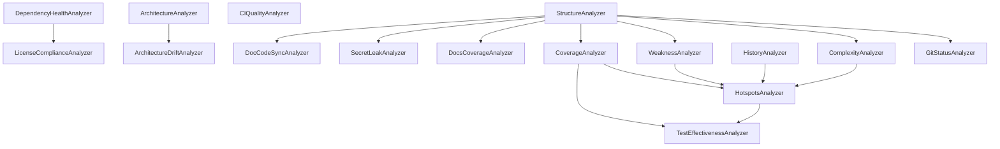

# Meta-Loop Closure Roadmap

**Status:** 🟡 In Progress  
**Target:** Q1 2026  
**Goal:** Замыкание метапетли качества через Tier-1 анализаторы + AI-агенты

---

## 🤖 AI-Powered Analysis: Новая парадигма

### Почему AI-агенты критичны для замыкания метапетли

**Традиционные анализаторы** (regex, AST, metrics) дают **синтаксический анализ**, но не понимают **семантику** и **контекст**.

**AI-агенты** (LLM-based) могут:

1. **Понимать намерения** — отличить "временный хак" от "архитектурного решения" в коде
2. **Оценивать качество** — не просто "нет docstring", а "docstring непонятен/устарел/некорректен"
3. **Генерировать исправления** — не просто "fix this", а "вот 3 варианта рефакторинга с обоснованием"
4. **Обучаться на истории** — "в прошлый раз этот паттерн привёл к багу X"
5. **Связывать домены** — "эта уязвимость зависимости влияет на файлы X, Y, Z через call graph"

### AI-агенты в RepoQ: уровни интеграции

#### 🟢 Level 1: AI как улучшение существующих анализаторов (Quick Wins)

**DocCodeSyncAnalyzer + AI:**

```python
# Текущее: regex для TODO/FIXME
if re.search(r'\b(TODO|FIXME)\b', docstring):
    issue = Issue(type="OutdatedDocstring", ...)

# С AI: семантический анализ
if self._ai_agent:
    semantic_quality = self._ai_agent.analyze_docstring(
        code=function_code,
        docstring=docstring,
        context={"file": file_path, "module": module_name}
    )
    
    if semantic_quality.is_outdated:
        issue = Issue(
            type="OutdatedDocstring",
            description=semantic_quality.reason,  # "Docstring describes old API (v1.x), code uses v2.x"
            ai_suggestion=semantic_quality.suggested_fix,  # Updated docstring
            confidence=semantic_quality.confidence  # 0.0-1.0
        )
```

**TestEffectivenessAnalyzer + AI:**

```python
# Текущее: эвристики (sleep, random без seed)
if 'time.sleep' in test_code:
    issue = Issue(type="FlakyTest", ...)

# С AI: контекстный анализ
test_quality = self._ai_agent.analyze_test(
    test_code=test_code,
    production_code=production_code,
    coverage_data=coverage
)

issues = []
if test_quality.has_flakiness_risk:
    issues.append(Issue(
        type="FlakyTest",
        description=test_quality.flakiness_reason,  # "Uses time.sleep(1) without controlling time"
        ai_suggestion="Use freezegun or time_machine to mock time"
    ))

if test_quality.mutation_score_estimate < 0.5:
    issues.append(Issue(
        type="WeakTest",
        description=f"Estimated mutation score: {test_quality.mutation_score_estimate:.1%}",
        ai_suggestion=test_quality.suggested_tests  # "Add tests for edge case X, Y"
    ))
```

**ArchitectureDriftAnalyzer + AI:**

```python
# Текущее: rules.yaml (forbidden imports)
if imports_infra_from_domain:
    issue = Issue(type="ArchViolation", ...)

# С AI: контекстная оценка + автофикс
violation_assessment = self._ai_agent.analyze_import(
    from_module="repoq.domain.order",
    to_module="repoq.infra.db",
    context={"domain_model": domain_rules, "alternatives": available_abstractions}
)

issue = Issue(
    type="ArchViolation",
    description=violation_assessment.explanation,  # "Domain should not depend on infra; breaks DDD"
    severity=violation_assessment.severity,  # AI оценивает критичность
    ai_suggestion=violation_assessment.refactoring_plan  # "1. Create IOrderRepo interface..."
)
```

#### 🟡 Level 2: AI-специфичные анализаторы (New Capabilities)

**SemanticDuplicationAnalyzer:**

```python
@AnalyzerRegistry.register(AnalyzerMetadata(
    name="SemanticDuplicationAnalyzer",
    category="quality",
    dependencies=["StructureAnalyzer"],
    tier=1,
    requires_ai=True  # NEW: маркер для AI-зависимых анализаторов
))
class SemanticDuplicationAnalyzer(BaseAnalyzer):
    """Detect semantic code duplication (not just syntactic)."""
    
    def run(self, project, repo_dir, config):
        # Найти функции с похожей семантикой, но разным синтаксисом
        functions = self._extract_functions(project)
        
        for func1, func2 in combinations(functions, 2):
            similarity = self._ai_agent.compare_semantic_similarity(
                func1.code, func2.code,
                context={"func1_name": func1.name, "func2_name": func2.name}
            )
            
            if similarity.score > 0.85:  # Высокая семантическая близость
                issue = Issue(
                    type="SemanticDuplication",
                    description=(
                        f"Functions '{func1.name}' and '{func2.name}' have {similarity.score:.1%} semantic similarity. "
                        f"Reason: {similarity.explanation}"
                    ),
                    ai_suggestion=similarity.refactoring_plan,  # "Extract common logic into..."
                    metadata={"analyzer": "SemanticDuplicationAnalyzer", "ai_powered": True}
                )
```

**IntentVsImplementationAnalyzer:**

```python
@AnalyzerRegistry.register(AnalyzerMetadata(
    name="IntentVsImplementationAnalyzer",
    category="quality",
    dependencies=["StructureAnalyzer", "DocCodeSyncAnalyzer"],
    tier=2,
    requires_ai=True
))
class IntentVsImplementationAnalyzer(BaseAnalyzer):
    """Check if implementation matches stated intent (comments, docstrings, names)."""
    
    def run(self, project, repo_dir, config):
        for file in project.files.values():
            functions = self._extract_functions_with_docs(file)
            
            for func in functions:
                alignment = self._ai_agent.check_intent_alignment(
                    function_name=func.name,
                    docstring=func.docstring,
                    implementation=func.code,
                    comments=func.inline_comments
                )
                
                if alignment.mismatch_detected:
                    issue = Issue(
                        type="IntentImplementationMismatch",
                        description=(
                            f"Function '{func.name}' implementation doesn't match stated intent. "
                            f"Docstring says: '{alignment.stated_intent}'. "
                            f"Implementation does: '{alignment.actual_behavior}'."
                        ),
                        severity="high",
                        ai_suggestion=alignment.resolution  # "Update docstring OR fix implementation"
                    )
```

**SecurityContextAnalyzer:**

```python
@AnalyzerRegistry.register(AnalyzerMetadata(
    name="SecurityContextAnalyzer",
    category="security",
    dependencies=["DependencyHealthAnalyzer", "ArchitectureAnalyzer"],
    tier=1,
    requires_ai=True
))
class SecurityContextAnalyzer(BaseAnalyzer):
    """AI-powered security analysis considering full context."""
    
    def run(self, project, repo_dir, config):
        # Найти CVE в зависимостях
        for dep_name, dep_info in project.dependency_health.items():
            if not dep_info.cves:
                continue
            
            # AI анализирует: реально ли эта уязвимость эксплуатируема в НАШЕМ коде?
            for cve in dep_info.cves:
                exploit_assessment = self._ai_agent.assess_cve_exploitability(
                    cve_id=cve,
                    dependency=dep_name,
                    usage_context=self._find_dependency_usage(project, dep_name),
                    call_graph=project.architecture_model.call_graph if project.architecture_model else None
                )
                
                issue = Issue(
                    type="VulnerableDependency",
                    description=(
                        f"{dep_name} has {cve}. "
                        f"Exploitability in this codebase: {exploit_assessment.risk_level}. "
                        f"Reason: {exploit_assessment.explanation}"
                    ),
                    severity=exploit_assessment.severity,  # AI adjusts severity based on actual risk
                    ai_suggestion=exploit_assessment.mitigation  # "Upgrade to 2.x OR apply workaround..."
                )
```

#### 🔴 Level 3: AI-driven meta-loop (Self-Improvement)

**AutoRefactoringPlanGenerator:**

```python
@AnalyzerRegistry.register(AnalyzerMetadata(
    name="AutoRefactoringPlanGenerator",
    category="meta",
    dependencies=["HotspotsAnalyzer", "CoverageAnalyzer", "ArchitectureAnalyzer"],
    tier=2,
    requires_ai=True
))
class AutoRefactoringPlanGenerator(BaseAnalyzer):
    """Generate prioritized refactoring plan based on all analysis results."""
    
    def run(self, project, repo_dir, config):
        # Собрать все issues
        all_issues = list(project.issues.values())
        
        # AI генерирует план
        refactoring_plan = self._ai_agent.generate_refactoring_plan(
            issues=all_issues,
            hotspots=project.hotspots,
            coverage=project.test_coverage,
            architecture=project.architecture_model,
            constraints={
                "max_effort_days": config.refactoring_budget_days,
                "priority": ["security", "performance", "maintainability"],
                "avoid_breaking_changes": True
            }
        )
        
        # План состоит из задач с приоритетами, ΔQ оценками, зависимостями
        project.refactoring_plan = refactoring_plan
        
        # Генерируем issues-tasks
        for task in refactoring_plan.tasks:
            issue = Issue(
                type="RefactoringTask",
                description=task.description,
                severity=task.priority,
                ai_suggestion=task.implementation_guide,  # Пошаговая инструкция
                metadata={
                    "analyzer": "AutoRefactoringPlanGenerator",
                    "ai_powered": True,
                    "estimated_delta_q": task.delta_q,
                    "effort_hours": task.effort_estimate
                }
            )
```

---

### AI Agent Integration: Implementation

#### AI Agent Interface

```python
# repoq/ai/agent_interface.py
from abc import ABC, abstractmethod
from dataclasses import dataclass
from typing import Optional, List

@dataclass
class AIAnalysisResult:
    """Generic AI analysis result."""
    confidence: float  # 0.0-1.0
    explanation: str
    suggestion: Optional[str] = None
    metadata: dict = field(default_factory=dict)

class AIAgent(ABC):
    """Abstract interface for AI agents."""
    
    @abstractmethod
    def analyze_docstring(self, code: str, docstring: str, context: dict) -> AIAnalysisResult:
        """Semantic docstring quality analysis."""
        pass
    
    @abstractmethod
    def analyze_test(self, test_code: str, production_code: str, coverage_data: dict) -> AIAnalysisResult:
        """Test effectiveness analysis."""
        pass
    
    @abstractmethod
    def compare_semantic_similarity(self, code1: str, code2: str, context: dict) -> AIAnalysisResult:
        """Semantic code similarity (not syntactic)."""
        pass
    
    @abstractmethod
    def check_intent_alignment(self, function_name: str, docstring: str, implementation: str, comments: List[str]) -> AIAnalysisResult:
        """Check if implementation matches stated intent."""
        pass
    
    @abstractmethod
    def assess_cve_exploitability(self, cve_id: str, dependency: str, usage_context: str, call_graph: Optional[dict]) -> AIAnalysisResult:
        """Assess if CVE is exploitable in this specific codebase."""
        pass
    
    @abstractmethod
    def generate_refactoring_plan(self, issues: List[Issue], hotspots: List, coverage: dict, architecture: Optional[dict], constraints: dict) -> dict:
        """Generate prioritized refactoring plan."""
        pass
```

#### BAML Agent Implementation (Already exists!)

```python
# repoq/ai/baml_agent.py
from baml_client import b  # Your existing BAML client
from .agent_interface import AIAgent, AIAnalysisResult

class BAMLAgent(AIAgent):
    """BAML-based AI agent implementation."""
    
    def __init__(self, model: str = "gpt-4"):
        self.model = model
    
    def analyze_docstring(self, code: str, docstring: str, context: dict) -> AIAnalysisResult:
        # Use BAML function
        result = b.AnalyzeDocstring(
            code=code,
            docstring=docstring,
            context=context,
            model=self.model
        )
        
        return AIAnalysisResult(
            confidence=result.confidence,
            explanation=result.analysis,
            suggestion=result.suggested_fix if result.needs_fix else None
        )
    
    # ... implement other methods using BAML functions
```

#### Configuration

```toml
# repoq.toml

[ai]
enabled = true
provider = "baml"  # or "openai", "anthropic", "local-llm"
model = "gpt-4o"
max_tokens = 2000
temperature = 0.3
cache_results = true  # Cache AI responses to avoid redundant API calls

[ai.baml]
project_root = "."  # Path to BAML project
functions_dir = "baml_src/analyzers"

[analyzers.doc_code_sync]
use_ai = true  # Enable AI-powered semantic analysis

[analyzers.test_effectiveness]
use_ai = true
ai_mutation_estimate = true  # Use AI to estimate mutation score without running mutmut

[analyzers.semantic_duplication]
enabled = true  # NEW: AI-only analyzer
similarity_threshold = 0.85
```

---

## Обзор

Текущая система RepoQ покрывает **структуру, сложность, историю, документацию**. Для полного замыкания метапетли необходимо добавить:

1. **Наблюдаемость тестов** (coverage + effectiveness)
2. **Supply-chain риски** (зависимости + лицензии)
3. **Стабильность API** (breaking changes)
4. **Дрейф архитектуры** (violations)
5. **Покрытие документацией** (docs coverage)
6. **Безопасность** (secret leak detection)

---

## Архитектура: Metadata-Driven Analyzers

### Текущее состояние (Phase 0)

```python
# cli.py → pipeline.py (DONE ✅)
from .pipeline import run_pipeline
run_pipeline(project, repo_dir, cfg)

# MD report (DONE ✅)
### DocCodeSyncAnalyzer (210 issues)
### GitStatusAnalyzer (2 issues)
### Other (424 issues)
```

**Проблемы:**

- ❌ Hardcoded порядок анализаторов в `pipeline.py`
- ❌ Нет dependency resolution
- ❌ Конфигурация анализаторов не расширяема

### Целевая архитектура (Phase 1)

```python
# repoq/analyzers/registry.py
from dataclasses import dataclass
from typing import List, Type, Dict
from .base import Analyzer

@dataclass
class AnalyzerMetadata:
    """Analyzer metadata for orchestration."""
    name: str                    # "CoverageAnalyzer"
    category: str                # "testing", "security", "documentation"
    dependencies: List[str]      # ["StructureAnalyzer", "ComplexityAnalyzer"]
    tier: int                    # 0=core, 1=tier1, 2=tier2
    enabled_by_default: bool = True
    config_schema: dict = None   # JSON schema for analyzer-specific config

class AnalyzerRegistry:
    """Registry of all analyzers with dependency resolution."""
    
    _registry: Dict[str, tuple[Type[Analyzer], AnalyzerMetadata]] = {}
    
    @classmethod
    def register(cls, metadata: AnalyzerMetadata):
        """Decorator to register analyzer with metadata."""
        def decorator(analyzer_cls: Type[Analyzer]):
            cls._registry[metadata.name] = (analyzer_cls, metadata)
            return analyzer_cls
        return decorator
    
    @classmethod
    def get_execution_order(cls, mode: str, enabled: set[str]) -> List[str]:
        """Topological sort based on dependencies."""
        graph = {}
        for name, (_, meta) in cls._registry.items():
            if name not in enabled:
                continue
            graph[name] = [dep for dep in meta.dependencies if dep in enabled]
        
        # Kahn's algorithm for topological sort
        order = []
        in_degree = {name: 0 for name in graph}
        for deps in graph.values():
            for dep in deps:
                in_degree[dep] += 1
        
        queue = [name for name, deg in in_degree.items() if deg == 0]
        while queue:
            node = queue.pop(0)
            order.append(node)
            for neighbor in graph[node]:
                in_degree[neighbor] -= 1
                if in_degree[neighbor] == 0:
                    queue.append(neighbor)
        
        if len(order) != len(graph):
            raise ValueError("Circular dependency detected in analyzers")
        
        return order
    
    @classmethod
    def get_analyzer(cls, name: str) -> tuple[Type[Analyzer], AnalyzerMetadata]:
        """Get analyzer class and metadata by name."""
        if name not in cls._registry:
            raise KeyError(f"Analyzer not found: {name}")
        return cls._registry[name]
```

**Использование:**

```python
# git_status.py
@AnalyzerRegistry.register(AnalyzerMetadata(
    name="GitStatusAnalyzer",
    category="repo_hygiene",
    dependencies=[],  # No dependencies
    tier=0
))
class GitStatusAnalyzer(BaseAnalyzer):
    ...

# coverage.py
@AnalyzerRegistry.register(AnalyzerMetadata(
    name="CoverageAnalyzer",
    category="testing",
    dependencies=["StructureAnalyzer"],  # Needs file map
    tier=1
))
class CoverageAnalyzer(BaseAnalyzer):
    ...

# license_compliance.py
@AnalyzerRegistry.register(AnalyzerMetadata(
    name="LicenseComplianceAnalyzer",
    category="security",
    dependencies=["DependencyHealthAnalyzer"],  # Needs deps
    tier=1
))
class LicenseComplianceAnalyzer(BaseAnalyzer):
    ...
```

**Pipeline (обновлённый):**

```python
# pipeline.py
def run_pipeline(project: Project, repo_dir: str, cfg: AnalyzeConfig) -> None:
    """Execute analyzers in dependency-resolved order."""
    from .analyzers.registry import AnalyzerRegistry
    
    # Determine enabled analyzers based on mode and config
    enabled = _get_enabled_analyzers(cfg.mode, cfg)
    
    # Get execution order via topological sort
    analyzer_names = AnalyzerRegistry.get_execution_order(cfg.mode, enabled)
    
    logger.info(f"Execution order: {' → '.join(analyzer_names)}")
    
    for name in analyzer_names:
        analyzer_cls, metadata = AnalyzerRegistry.get_analyzer(name)
        
        logger.info(f"Running {name} (tier={metadata.tier}, category={metadata.category})")
        analyzer = analyzer_cls()
        analyzer.run(project, repo_dir, cfg)

def _get_enabled_analyzers(mode: str, cfg: AnalyzeConfig) -> set[str]:
    """Determine which analyzers should run."""
    from .analyzers.registry import AnalyzerRegistry
    
    enabled = set()
    for name, (_, meta) in AnalyzerRegistry._registry.items():
        # Check if analyzer is enabled by default or explicitly in config
        if meta.enabled_by_default or cfg.enable_analyzer(name):
            # Check if analyzer is appropriate for mode
            if mode == "full" or (mode == "structure" and meta.tier == 0):
                enabled.add(name)
    
    return enabled
```

---

## Tier-1 Analyzers: Specification

### 1. CoverageAnalyzer (P0) 🟢

**Цель:** Превратить покрытие тестами в first-class signal для hotspots и refactoring plan.

**Входы:**

- `coverage.xml` или `coverage.json` (pytest-cov, coverage.py)
- `project.files` (из StructureAnalyzer) — маппинг файлов

**Выходы:**

```python
@dataclass
class TestCoverage:
    file_path: str
    function_name: Optional[str]
    line_coverage: float      # 0.0 - 1.0
    branch_coverage: float    # 0.0 - 1.0
    lines_total: int
    lines_covered: int
    branches_total: int
    branches_covered: int

# Добавить в File
@dataclass
class File:
    # ...existing fields
    test_coverage: Optional[TestCoverage] = None
```

**Issues:**

- `UncoveredHotspot`: high CCN + low coverage
- `LowCoverage`: coverage < threshold (config)

**Config:**

```toml
[analyzers.coverage]
enabled = true
threshold_global = 0.80
threshold_hotspot = 0.95  # For files with CCN > 15
input_file = "coverage.xml"
```

**Implementation sketch:**

```python
@AnalyzerRegistry.register(AnalyzerMetadata(
    name="CoverageAnalyzer",
    category="testing",
    dependencies=["StructureAnalyzer"],
    tier=1
))
class CoverageAnalyzer(BaseAnalyzer):
    def run(self, project, repo_dir, config):
        coverage_file = Path(repo_dir) / config.analyzers.coverage.input_file
        if not coverage_file.exists():
            logger.warning("coverage.xml not found, skipping")
            return
        
        cov_data = self._parse_coverage_xml(coverage_file)
        
        for file_path, cov in cov_data.items():
            file_obj = project.files.get(f"{project.id}:file:{file_path}")
            if file_obj:
                file_obj.test_coverage = cov
                
                # Generate issues
                if cov.line_coverage < config.analyzers.coverage.threshold_global:
                    issue = Issue(
                        id=f"{project.id}:issue:coverage:low:{file_path}",
                        type="repo:LowCoverage",
                        file_id=file_obj.id,
                        description=f"Line coverage {cov.line_coverage:.1%} < {config.analyzers.coverage.threshold_global:.1%}",
                        severity="medium",
                        metadata={"analyzer": "CoverageAnalyzer", "category": "testing"}
                    )
                    project.issues[issue.id] = issue
```

---

### 2. DependencyHealthAnalyzer (P0) 🟢

**Цель:** Supply-chain риски — CVE, устаревшие пакеты, maintainability.

**Входы:**

- `pyproject.toml`, `requirements.txt`, `poetry.lock`
- PyPI API (package metadata)
- `pip-audit` output (optional)

**Выходы:**

```python
@dataclass
class DependencyInfo:
    name: str
    version: str
    latest_version: str
    is_outdated: bool
    cves: List[str]           # ["CVE-2023-12345"]
    license: Optional[str]
    last_release_date: str
    is_maintained: bool       # Last release < 2 years

# Добавить в Project
@dataclass
class Project:
    # ...existing
    dependency_health: Dict[str, DependencyInfo] = field(default_factory=dict)
```

**Issues:**

- `VulnerableDependency`: CVE found
- `OutdatedDependency`: version << latest
- `UnmaintainedDependency`: last release > 2 years

**Config:**

```toml
[analyzers.dependency_health]
enabled = true
check_cves = true
pypi_api = "https://pypi.org/pypi/{package}/json"
unmaintained_threshold_days = 730
```

**Implementation:**

```python
@AnalyzerRegistry.register(AnalyzerMetadata(
    name="DependencyHealthAnalyzer",
    category="security",
    dependencies=[],  # Reads manifests directly
    tier=1
))
class DependencyHealthAnalyzer(BaseAnalyzer):
    def run(self, project, repo_dir, config):
        deps = self._parse_pyproject(repo_dir / "pyproject.toml")
        
        for dep_name, dep_version in deps.items():
            info = self._check_pypi(dep_name, dep_version)
            project.dependency_health[dep_name] = info
            
            # Generate issues
            if info.cves:
                issue = Issue(
                    id=f"{project.id}:issue:dep:cve:{dep_name}",
                    type="repo:VulnerableDependency",
                    description=f"{dep_name} has CVEs: {', '.join(info.cves)}",
                    severity="high",
                    metadata={"analyzer": "DependencyHealthAnalyzer", "category": "security"}
                )
                project.issues[issue.id] = issue
```

---

### 3. LicenseComplianceAnalyzer (P0) 🟢

**Цель:** Проверка совместимости лицензий зависимостей.

**Входы:**

- `project.dependency_health` (из DependencyHealthAnalyzer)
- Allowed licenses list (config)

**Выходы:**

```python
@dataclass
class LicenseFinding:
    dependency: str
    license: str
    is_compatible: bool
    reason: str  # "Copyleft incompatible with Apache-2.0"

# Добавить в Project
@dataclass
class Project:
    # ...existing
    license_findings: List[LicenseFinding] = field(default_factory=list)
```

**Issues:**

- `IncompatibleLicense`: license not in allowed list
- `UnknownLicense`: license not detected

**Config:**

```toml
[analyzers.license_compliance]
enabled = true
allowed_licenses = ["MIT", "Apache-2.0", "BSD-3-Clause", "ISC"]
project_license = "Apache-2.0"
```

---

### 4. SecretLeakAnalyzer (P1) 🟡

**Цель:** Детектирование секретов и приватных ключей.

**Patterns:**

- AWS keys: `AKIA[0-9A-Z]{16}`
- GitHub tokens: `ghp_[a-zA-Z0-9]{36}`
- Private keys: `-----BEGIN (RSA|EC|OPENSSH) PRIVATE KEY-----`
- High-entropy strings (base64, hex)

**Issues:**

- `SecretLeaked`: high-severity

---

### 5. ArchitectureDriftAnalyzer (P1) 🟡

**Цель:** Контроль дрейфа по правилам из `docs/architecture/rules.yaml`.

**Rules example:**

```yaml
# docs/architecture/rules.yaml
rules:
  - name: "no-domain-to-infra"
    type: "forbidden-import"
    from_pattern: "repoq/domain/**"
    to_pattern: "repoq/infra/**"
    severity: "critical"
  
  - name: "no-cycles-in-analyzers"
    type: "cycle-detection"
    scope: "repoq/analyzers/**"
    severity: "high"
  
  - name: "layer-ordering"
    type: "layer-constraint"
    layers: ["domain", "application", "infra"]
    order: "strict"  # domain < application < infra
```

**Issues:**

- `ArchViolation`: rule violated

---

### 6. DocsCoverageAnalyzer (P2) 🔵

**Цель:** Docstring coverage + executable examples.

**Metrics:**

- Public API without docstrings
- Code examples in `docs/` that don't compile

---

### 7. TestEffectivenessAnalyzer (P2) 🔵

**Цель:** Качество тестов (mutation score или эвристики).

**Option 1 (simple):** Anti-pattern detection

- `sleep()` calls in tests
- `random.randint()` without seed
- Network calls without `@mock`

**Option 2 (advanced):** Run `mutmut` on hotspots

---

## Configuration Schema

```toml
# repoq.toml

[analyzers]
enabled_by_default = ["StructureAnalyzer", "ComplexityAnalyzer", "GitStatusAnalyzer"]
disabled = []

[analyzers.coverage]
enabled = true
threshold_global = 0.80
threshold_hotspot = 0.95
input_file = "coverage.xml"

[analyzers.dependency_health]
enabled = true
check_cves = true
unmaintained_threshold_days = 730

[analyzers.license_compliance]
enabled = true
allowed_licenses = ["MIT", "Apache-2.0", "BSD-3-Clause"]
project_license = "Apache-2.0"

[analyzers.architecture_drift]
enabled = true
rules_file = "docs/architecture/rules.yaml"

[analyzers.secret_leak]
enabled = true
entropy_threshold = 4.5
exclude_patterns = ["*.lock", "*.min.js"]
```

---

## Execution Order (with dependencies)



**Final order:**

1. Structure, GitStatus (parallel)
2. Complexity, Weakness, DepHealth, SecretLeak, DocSync (parallel after Structure)
3. License (after DepHealth), Coverage (after Structure)
4. CI, Architecture
5. ArchDrift (after Architecture), TestEffective (after Coverage)
6. DocCoverage
7. History
8. Hotspots (after History + Complexity + Coverage)

---

## Milestones

### Milestone 1: Infrastructure (Week 1)

- [ ] Create `AnalyzerRegistry` with topological sort
- [ ] Refactor existing analyzers to use `@register`
- [ ] Update `pipeline.py` to use registry
- [ ] Extend `model.py` with new dataclasses
- [ ] Create configuration schema

**Deliverable:** Metadata-driven pipeline working with existing analyzers

---

### Milestone 2: P0 Analyzers (Week 2-3)

- [ ] CoverageAnalyzer
- [ ] DependencyHealthAnalyzer
- [ ] LicenseComplianceAnalyzer

**Deliverable:** Self-analysis showing coverage, CVEs, license issues

---

### Milestone 3: P1 Analyzers (Week 4-5)

- [ ] SecretLeakAnalyzer
- [ ] ArchitectureDriftAnalyzer

**Deliverable:** Architectural rules validated, secrets detected

---

### Milestone 4: P2 Analyzers (Week 6)

- [ ] DocsCoverageAnalyzer
- [ ] TestEffectivenessAnalyzer

**Deliverable:** Complete meta-loop closure

---

### Milestone 5: Validation (Week 7)

- [ ] Self-analysis with all analyzers
- [ ] Q-score comparison before/after
- [ ] Meta-loop closure report
- [ ] Documentation

**Deliverable:** Production-ready system with reflexive validation

---

## Success Metrics

| Metric | Before | Target | Verification |
|--------|--------|--------|--------------|
| **Analyzers** | 9 | 17+ | Registry list |
| **Issue types** | 10 | 25+ | Ontology coverage |
| **Coverage visibility** | ❌ | ✅ | MD report section |
| **CVE detection** | ❌ | ✅ | DependencyHealth issues |
| **License compliance** | ❌ | ✅ | License findings |
| **Arch violations** | ❌ | ✅ | ArchDrift issues |
| **MD report sections** | 3 (DocSync, GitStatus, Other) | 17+ | Grouped by analyzer |
| **Q-score impact** | 98.97 | ? | Self-analysis |
| **Reflexivity** | Partial (hygiene + docs) | Full (structure + security) | Coverage of own gaps |

---

## 🔬 BAML Functions: Specification

Для реализации AI-агентов создадим BAML-функции в `baml_src/analyzers/`:

### 1. `AnalyzeDocstring.baml`

```baml
class DocstringAnalysis {
  needs_fix bool
  confidence float
  analysis string
  suggested_fix string?
  categories string[]  // ["outdated", "incomplete", "incorrect", "unclear"]
}

function AnalyzeDocstring(
  code: string,
  docstring: string,
  context: map<string, string>
) -> DocstringAnalysis {
  client GPT4
  
  prompt #"
    Analyze the docstring quality for this code:
    
    CODE:
    {{ code }}
    
    DOCSTRING:
    {{ docstring }}
    
    CONTEXT:
    File: {{ context.file }}
    Module: {{ context.module }}
    
    Check if the docstring:
    1. Accurately describes current implementation (not outdated)
    2. Documents all parameters, return value, exceptions
    3. Is clear and unambiguous
    4. Follows project conventions
    
    Return detailed analysis with confidence score and suggested fix if needed.
  "#
}
```

### 2. `AnalyzeTestQuality.baml`

```baml
class TestQualityAnalysis {
  has_flakiness_risk bool
  flakiness_reason string?
  mutation_score_estimate float  // 0.0-1.0
  suggested_tests string[]
  confidence float
  categories string[]  // ["flaky", "weak", "incomplete", "brittle"]
}

function AnalyzeTestQuality(
  test_code: string,
  production_code: string,
  coverage_data: map<string, any>
) -> TestQualityAnalysis {
  client GPT4
  
  prompt #"
    Analyze test effectiveness:
    
    TEST CODE:
    {{ test_code }}
    
    PRODUCTION CODE:
    {{ production_code }}
    
    COVERAGE: {{ coverage_data.line_rate }}% lines covered
    
    Evaluate:
    1. Flakiness risks (time, random, network, filesystem)
    2. Estimated mutation score (would mutants be caught?)
    3. Edge cases coverage
    4. Assertion quality
    
    Suggest additional tests to improve mutation score.
  "#
}
```

### 3. `AssessArchViolation.baml`

```baml
class ArchViolationAssessment {
  is_violation bool
  severity string  // "critical", "high", "medium", "low", "info"
  explanation string
  refactoring_plan string
  estimated_effort_hours float
  confidence float
}

function AssessArchViolation(
  from_module: string,
  to_module: string,
  import_statement: string,
  context: map<string, any>
) -> ArchViolationAssessment {
  client GPT4
  
  prompt #"
    Assess architecture violation:
    
    FROM: {{ from_module }}
    TO: {{ to_module }}
    IMPORT: {{ import_statement }}
    
    ARCHITECTURE RULES:
    {{ context.domain_model }}
    
    AVAILABLE ABSTRACTIONS:
    {{ context.alternatives }}
    
    Determine:
    1. Is this a violation? (e.g., domain→infra breaks DDD)
    2. Severity (critical if breaks fundamental principle)
    3. Why this is problematic
    4. Step-by-step refactoring plan with effort estimate
  "#
}
```

### 4. `CompareSemanticSimilarity.baml`

```baml
class SemanticSimilarity {
  score float  // 0.0-1.0
  explanation string
  refactoring_plan string?
  common_logic string?
  confidence float
}

function CompareSemanticSimilarity(
  code1: string,
  code2: string,
  context: map<string, string>
) -> SemanticSimilarity {
  client GPT4
  
  prompt #"
    Compare semantic similarity (not just syntactic):
    
    CODE 1 ({{ context.func1_name }}):
    {{ code1 }}
    
    CODE 2 ({{ context.func2_name }}):
    {{ code2 }}
    
    Analyze:
    1. Do they solve the same problem?
    2. Is the core algorithm identical despite different syntax?
    3. Could they be deduplicated?
    
    Return similarity score (0.0-1.0) and refactoring plan if score > 0.8.
  "#
}
```

### 5. `CheckIntentAlignment.baml`

```baml
class IntentAlignmentCheck {
  mismatch_detected bool
  stated_intent string
  actual_behavior string
  explanation string
  resolution string  // "update_docs", "fix_implementation", "rename_function"
  confidence float
}

function CheckIntentAlignment(
  function_name: string,
  docstring: string,
  implementation: string,
  comments: string[]
) -> IntentAlignmentCheck {
  client GPT4
  
  prompt #"
    Check if implementation matches stated intent:
    
    FUNCTION NAME: {{ function_name }}
    
    DOCSTRING:
    {{ docstring }}
    
    INLINE COMMENTS:
    
    - {{ comment }}
    
    
    IMPLEMENTATION:
    {{ implementation }}
    
    Determine:
    1. What does the name/docstring/comments promise?
    2. What does the implementation actually do?
    3. Are they aligned?
    
    If misaligned, suggest whether to fix docs or code.
  "#
}
```

### 6. `AssessCVEExploitability.baml`

```baml
class CVEExploitabilityAssessment {
  risk_level string  // "critical", "high", "medium", "low", "none"
  exploitable_in_context bool
  explanation string
  mitigation string
  severity string
  confidence float
}

function AssessCVEExploitability(
  cve_id: string,
  dependency: string,
  usage_context: string,
  call_graph: map<string, any>?
) -> CVEExploitabilityAssessment {
  client GPT4
  
  prompt #"
    Assess if CVE is exploitable in this specific codebase:
    
    CVE: {{ cve_id }}
    DEPENDENCY: {{ dependency }}
    
    USAGE IN CODEBASE:
    {{ usage_context }}
    
    
    CALL GRAPH:
    {{ call_graph }}
    
    
    Determine:
    1. Does our code use the vulnerable API/function?
    2. Are inputs user-controlled or sanitized?
    3. What's the actual risk in OUR context?
    4. Mitigation: upgrade, workaround, or accept risk?
    
    Adjust severity based on real exploitability, not just CVE base score.
  "#
}
```

### 7. `GenerateRefactoringPlan.baml`

```baml
class RefactoringTask {
  id string
  title string
  description string
  priority string  // "p0", "p1", "p2"
  estimated_delta_q float  // Impact on Q-score
  effort_hours float
  dependencies string[]  // IDs of tasks that must be done first
  implementation_guide string
}

class RefactoringPlan {
  tasks RefactoringTask[]
  total_effort_hours float
  expected_delta_q float
  critical_path string[]
}

function GenerateRefactoringPlan(
  issues: Issue[],
  hotspots: map<string, any>[],
  coverage: map<string, float>,
  architecture: map<string, any>?,
  constraints: map<string, any>
) -> RefactoringPlan {
  client GPT4
  
  prompt #"
    Generate prioritized refactoring plan:
    
    ISSUES ({{ issues | length }}):
    
    - [{{ issue.type }}] {{ issue.description }} (severity: {{ issue.severity }})
    
    
    HOTSPOTS (high churn + complexity):
    
    - {{ hs.file }}: {{ hs.changes }} changes, complexity {{ hs.complexity }}
    
    
    COVERAGE:
    Average: {{ coverage.average }}%
    Worst files: {{ coverage.worst_files }}
    
    
    ARCHITECTURE:
    Violations: {{ architecture.violations | length }}
    
    
    CONSTRAINTS:
    - Budget: {{ constraints.max_effort_days }} days
    - Priority: {{ constraints.priority }}
    - Avoid breaking changes: {{ constraints.avoid_breaking_changes }}
    
    Create plan with:
    1. Prioritized tasks (P0 = critical, P1 = important, P2 = nice-to-have)
    2. Effort estimates in hours
    3. ΔQ estimates (impact on quality score)
    4. Dependencies (task X must be done before task Y)
    5. Step-by-step implementation guide for each task
    
    Focus on maximum ΔQ per hour of effort.
  "#
}
```

---

## AI Agent Cost & Performance Considerations

### Cost Optimization

| Strategy | Description | Savings |
|----------|-------------|---------|
| **Caching** | Cache AI responses keyed by (code_hash, prompt_hash) | 80-90% on repeated runs |
| **Batch processing** | Send 10-50 analyses in one API call | 50% cost reduction |
| **Incremental analysis** | Only analyze changed files (git diff) | 90%+ on CI runs |
| **Local models** | Use Ollama/LLaMA for non-critical analyses | 100% API cost savings |
| **Smart sampling** | Analyze top 20% hotspots, not all files | 80% analysis time reduction |

### Performance Targets

| Metric | Target | Strategy |
|--------|--------|----------|
| **First analysis (cold)** | < 5 min for medium project | Parallel API calls (asyncio) |
| **Incremental (CI)** | < 30s | Cache + git diff filtering |
| **Cost per project** | < $0.50 | Caching + smart sampling |
| **Accuracy (precision)** | > 0.80 | Prompt engineering + few-shot examples |
| **Accuracy (recall)** | > 0.70 | Combine AI + rule-based |

### Fallback Strategy

```python
# repoq/ai/safe_agent.py
class SafeAIAgent:
    """AI agent with fallback to rule-based analysis."""
    
    def __init__(self, ai_agent: Optional[AIAgent], config: dict):
        self.ai = ai_agent
        self.config = config
        self.cache = Cache(config.cache_dir)
    
    def analyze_docstring(self, code, docstring, context):
        # 1. Check cache
        cache_key = self._make_key("docstring", code, docstring)
        if cached := self.cache.get(cache_key):
            return cached
        
        # 2. Try AI if enabled
        if self.ai and self.config.ai_enabled:
            try:
                result = self.ai.analyze_docstring(code, docstring, context)
                self.cache.set(cache_key, result, ttl=86400)  # 24h
                return result
            except Exception as e:
                logger.warning(f"AI analysis failed: {e}, falling back to rules")
        
        # 3. Fallback to rule-based
        return self._rule_based_docstring_check(code, docstring)
```

---

## Next Steps

1. **Review this roadmap** with stakeholders (особенно AI-секцию)
2. **Prototype BAML functions** (start with `AnalyzeDocstring.baml`)
3. **Create Phase 1 branch** (`feat/meta-loop-infrastructure`)
4. **Start with AnalyzerRegistry** (task #1 from todo list)
5. **Test AI agent** on sample codebase, measure cost/performance
6. **Iterate weekly** with self-analysis checkpoints

---

## References

- [Analyzer Pipeline](../architecture/analyzer-pipeline.md)
- [GitStatusAnalyzer](../architecture/git-status-analyzer.md)
- [DocCodeSyncAnalyzer](../architecture/doc-code-sync-analyzer.md)
- [TRS Framework](../architecture/trs-framework.md)
- [BAML Documentation](https://docs.boundaryml.com/)
- [AI Agent Architecture](../architecture/baml-agent.md)
