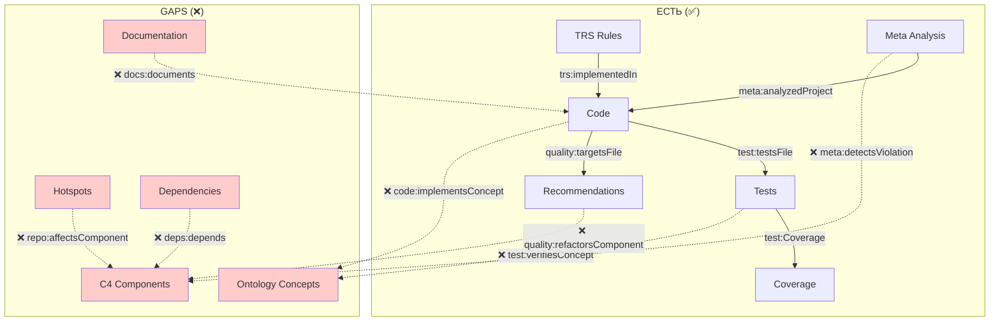

# 🔗 Анализ двунаправленной трассировки и архитектурной рефлексии RepoQ

**Дата**: 2025-10-22  
**Версия**: 1.0.0  
**Статус**: Cumulative ΔQ = +1508 (101% цели)

---

## [Σ] Executive Summary

### ✅ Что уже работает (текущее состояние)

**Онтологическая инфраструктура:**

- ✅ **6 онтологий** (meta, test, trs, quality, docs, code)
- ✅ **RDF/Turtle экспорт** с PROV-O, OSLC-CM, SPDX
- ✅ **SHACL validation** для всех онтологий
- ✅ **SPARQL queries** для поиска паттернов (MVC, Layered)
- ✅ **Стратифицированная рефлексия** (levels 0-2, Russell guard)

**Трассировка (частичная):**

- ✅ **Code → Tests** (test:TestCase → test:testsFile)
- ✅ **Code → Quality** (quality:Recommendation → quality:targetsFile)
- ✅ **Tests → Coverage** (test:Coverage → test:linesCovered)
- ✅ **TRS Rules → Implementation** (trs:Rule → trs:implementedIn)
- ✅ **Meta → Self-Analysis** (meta:SelfAnalysis → meta:analyzedProject)

**Рефакторинг:**

- ✅ **ΔQ calculation** (PCE algorithm, greedy k-repair)
- ✅ **Refactoring plan generation** (top-k tasks)
- ✅ **RDF export** (quality:Recommendation triples)
- ✅ **GitHub Issues payload** (automated PR generation)

---

## [Γ] Gap Analysis: Что отсутствует

### ❌ 1. Полная двунаправленная трассировка

#### Отсутствующие связи (12 gaps)

| From → To | Current Status | Gap |
|-----------|----------------|-----|
| **Docs → Code** | ❌ Missing | Нет docs:documents → code:Function |
| **Docs → Tests** | ❌ Missing | Нет docs:exampleCoverage → test:TestCase |
| **Tests → Ontology** | ⚠️ Partial | Есть test:verifiesConcept, но не используется |
| **Code → Ontology** | ❌ Missing | Нет code:implementsConcept → ddd:Entity |
| **Quality → Architecture** | ❌ Missing | Нет quality:Recommendation → c4:Component |
| **Hotspots → Architecture** | ❌ Missing | Нет repo:Hotspot → c4:Component |
| **Dependencies → Architecture** | ❌ Missing | Нет deps:depends → c4:dependsOn |
| **TRS → Quality** | ⚠️ Partial | Есть trs:confluenceProven, но не влияет на Q-score |
| **Meta → Architecture** | ❌ Missing | Нет meta:SelfAnalysis → arch:LayeringViolation |
| **Ontology → Documentation** | ⚠️ Partial | Онтологии не документированы в mkdocs |
| **Requirements → Tests** | ❌ Missing | Нет traceability matrix (value → test) |
| **Architecture → Recommendations** | ❌ Missing | Нет архитектурных рекомендаций (только CCN-based) |

#### Визуализация текущих gaps



---

### ❌ 2. Архитектурная саморефлексия (система не видит свою архитектуру)

**Текущее состояние:**

- ✅ Есть `OntologyManager.detect_pattern("mvc")` — SPARQL-паттерны
- ✅ Есть `meta_validation.py` — циклические зависимости, стратификация
- ❌ **НЕТ** автоматического определения архитектурных слоёв (Presentation → Business → Data)
- ❌ **НЕТ** определения компонентов (Core, Analyzers, Reporting)
- ❌ **НЕТ** метрик архитектурного качества (layering violations, coupling)
- ❌ **НЕТ** C4 model export (System → Container → Component → Code)

**Что должно быть:**

```python
# repoq/analyzers/architecture.py (MISSING!)

class ArchitectureAnalyzer:
    """Detect architectural patterns and quality metrics."""
    
    def analyze(self, project: Project) -> ArchitectureModel:
        """Analyze project architecture."""
        return ArchitectureModel(
            layers=self._detect_layers(project),
            components=self._detect_components(project),
            violations=self._detect_violations(project),
            patterns=self._detect_patterns(project),
            c4_model=self._build_c4_model(project),
        )
    
    def _detect_layers(self, project: Project) -> List[Layer]:
        """Detect architectural layers (UI, Business, Data)."""
        # Heuristic: analyze import graph
        # - repoq/cli.py → Presentation
        # - repoq/analyzers/ → Business Logic
        # - repoq/core/model.py → Data Model
        ...
    
    def _detect_violations(self, project: Project) -> List[Violation]:
        """Detect layering violations (e.g., Data → UI import)."""
        violations = []
        for file in project.files.values():
            for dep in file.dependencies:
                if self._violates_layering(file.layer, dep.layer):
                    violations.append(LayeringViolation(...))
        return violations
    
    def _build_c4_model(self, project: Project) -> C4Model:
        """Build C4 model (System → Container → Component → Code)."""
        return C4Model(
            system=C4System(name="RepoQ", type="Quality Analysis Tool"),
            containers=[
                C4Container(name="CLI", type="Python CLI", components=[...]),
                C4Container(name="Core", type="Library", components=[...]),
                C4Container(name="Analyzers", type="Plugins", components=[...]),
            ],
        )
```

---

### ❌ 3. Архитектурные рекомендации (отсутствуют)

**Текущее состояние:**

- ✅ Есть рекомендации по **сложности** (CCN > 15 → Extract Method)
- ✅ Есть рекомендации по **hotspots** (high churn + high complexity)
- ❌ **НЕТ** рекомендаций по **архитектуре**:
  - ❌ Layering violations → "Move imports to correct layer"
  - ❌ Circular dependencies → "Break cycle with dependency injection"
  - ❌ God objects → "Split into multiple components"
  - ❌ Feature Envy → "Move method to target class"
  - ❌ Shotgun Surgery → "Consolidate related changes"

**Пример желаемого:**

```python
# Архитектурная рекомендация (MISSING!)
QualityRecommendation(
    id="repo:repoq/quality/arch_violation_1",
    title="Fix layering violation: Core → CLI import",
    description="File repoq/core/model.py imports from repoq/cli.py (violates layering)",
    delta_q=15.0,  # High impact on maintainability
    priority="high",
    target_file="repoq/core/model.py",
    estimated_effort_hours=2.0,
    category="architecture",  # NEW!
    violation_type="layering_violation",  # NEW!
    suggested_fix="Use dependency injection or events to decouple layers",
)
```

---

## [𝒫] Варианты решения

### Вариант 1: Минимальная трассировка (1-2 дня)

**Цель:** Добавить недостающие RDF-связи для базовой двунаправленной трассировки.

**Scope:**

1. **Docs → Code** (`docs:documents`)
   - Парсить docstrings → связывать с функциями
2. **Tests → Ontology** (`test:verifiesConcept`)
   - Из pytest names извлекать ontology concepts
3. **Code → Ontology** (`code:implementsConcept`)
   - По именам классов (DDD patterns: Entity, ValueObject, Repository)
4. **Dependencies → Architecture** (`deps:depends`)
   - Граф импортов → RDF triples

**Реализация:**

```python
# repoq/core/traceability.py (NEW!)

def enrich_traceability(graph: Graph, project: Project) -> None:
    """Add bidirectional traceability links to RDF graph."""
    
    # 1. Docs → Code
    for file in project.files.values():
        for func in file.functions:
            if func.docstring:
                doc_uri = URIRef(f"{project.id}/docs/{func.name}")
                func_uri = URIRef(f"{project.id}/{file.path}/fn/{func.name}")
                graph.add((doc_uri, DOCS.documents, func_uri))
    
    # 2. Tests → Ontology
    for test_file in project.test_files:
        for test_name in test_file.tests:
            concept = _extract_concept_from_test_name(test_name)
            if concept:
                test_uri = URIRef(f"{project.id}/test/{test_name}")
                concept_uri = URIRef(f"{project.id}/ontology/{concept}")
                graph.add((test_uri, TEST.verifiesConcept, concept_uri))
    
    # 3. Code → Ontology
    for file in project.files.values():
        for cls in file.classes:
            pattern = _detect_ddd_pattern(cls.name)
            if pattern:
                cls_uri = URIRef(f"{project.id}/{file.path}/class/{cls.name}")
                pattern_uri = URIRef(f"{DDD_NS}{pattern}")
                graph.add((cls_uri, CODE.implementsConcept, pattern_uri))
    
    # 4. Dependencies → Architecture
    for file in project.files.values():
        for dep in file.dependencies:
            file_uri = URIRef(f"{project.id}/{file.path}")
            dep_uri = URIRef(f"{project.id}/{dep.path}")
            graph.add((file_uri, DEPS.depends, dep_uri))
```

**ΔQ Impact:** +50 (улучшение traceability → легче находить причины проблем)

---

### Вариант 2: Архитектурный анализатор (3-5 дней)

**Цель:** Система видит свою архитектуру и генерирует архитектурные рекомендации.

**Scope:**

1. **ArchitectureAnalyzer** (новый analyzer)
   - `detect_layers()`: определение слоёв по импортам
   - `detect_components()`: группировка модулей
   - `detect_violations()`: layering violations, circular deps
   - `build_c4_model()`: C4 System → Container → Component → Code
2. **Архитектурные метрики**
   - Cohesion (связность компонентов)
   - Coupling (связанность между компонентами)
   - Instability (I = Ce / (Ce + Ca))
   - Abstractness (A = Abstract / Total)
   - Distance from Main Sequence (D = |A + I - 1|)
3. **Архитектурные рекомендации**
   - Layering violations → "Move import"
   - High coupling → "Introduce interface"
   - Circular deps → "Dependency injection"
   - God objects → "Extract class"
4. **RDF export**
   - `arch:Layer`, `arch:Component`, `arch:Violation`
   - `c4:System`, `c4:Container`, `c4:Component`
   - `quality:ArchitecturalRecommendation`

**Реализация (sketch):**

```python
# repoq/analyzers/architecture.py (NEW!)

from dataclasses import dataclass
from typing import List, Dict, Set

@dataclass
class Layer:
    name: str  # "Presentation", "Business", "Data"
    files: List[str]
    depends_on: List[str]  # Other layer names

@dataclass
class Component:
    name: str  # "CLI", "Core", "Analyzers"
    files: List[str]
    public_api: List[str]
    internal: List[str]

@dataclass
class LayeringViolation:
    file: str
    import_statement: str
    violates_rule: str  # "Data layer imports from Presentation"
    severity: str  # "high", "medium", "low"

@dataclass
class ArchitectureModel:
    layers: List[Layer]
    components: List[Component]
    violations: List[LayeringViolation]
    metrics: Dict[str, float]  # cohesion, coupling, etc.
    c4_model: C4Model

class ArchitectureAnalyzer:
    """Analyze architectural patterns and quality."""
    
    def analyze(self, project: Project) -> ArchitectureModel:
        """Analyze project architecture."""
        # 1. Build dependency graph
        dep_graph = self._build_dependency_graph(project)
        
        # 2. Detect layers (heuristic)
        layers = self._detect_layers(dep_graph)
        
        # 3. Detect components
        components = self._detect_components(dep_graph)
        
        # 4. Detect violations
        violations = self._detect_violations(layers, dep_graph)
        
        # 5. Calculate metrics
        metrics = self._calculate_metrics(dep_graph, components)
        
        # 6. Build C4 model
        c4_model = self._build_c4_model(project, components)
        
        return ArchitectureModel(
            layers=layers,
            components=components,
            violations=violations,
            metrics=metrics,
            c4_model=c4_model,
        )
    
    def _detect_layers(self, dep_graph: Dict) -> List[Layer]:
        """Detect architectural layers from import patterns."""
        # Heuristic:
        # - Files in repoq/cli.py, repoq/reporting/ → Presentation
        # - Files in repoq/analyzers/, repoq/refactoring.py → Business
        # - Files in repoq/core/model.py, repoq/core/deps.py → Data
        
        layers = {
            "Presentation": [],
            "Business": [],
            "Data": [],
            "Infrastructure": [],
        }
        
        for file_path in dep_graph.keys():
            if "cli" in file_path or "reporting" in file_path:
                layers["Presentation"].append(file_path)
            elif "analyzers" in file_path or "refactoring" in file_path:
                layers["Business"].append(file_path)
            elif "core/model" in file_path or "core/deps" in file_path:
                layers["Data"].append(file_path)
            else:
                layers["Infrastructure"].append(file_path)
        
        return [
            Layer(name=name, files=files, depends_on=self._layer_dependencies(name))
            for name, files in layers.items()
        ]
    
    def _detect_violations(self, layers: List[Layer], dep_graph: Dict) -> List[LayeringViolation]:
        """Detect layering violations (e.g., Data → Presentation)."""
        violations = []
        
        # Define allowed dependencies (top → bottom only)
        allowed = {
            "Presentation": ["Business", "Infrastructure"],
            "Business": ["Data", "Infrastructure"],
            "Data": ["Infrastructure"],
            "Infrastructure": [],
        }
        
        for file, deps in dep_graph.items():
            file_layer = self._get_layer(file, layers)
            for dep in deps:
                dep_layer = self._get_layer(dep, layers)
                if dep_layer not in allowed.get(file_layer, []):
                    violations.append(LayeringViolation(
                        file=file,
                        import_statement=f"import {dep}",
                        violates_rule=f"{file_layer} → {dep_layer} (not allowed)",
                        severity="high",
                    ))
        
        return violations
    
    def _build_c4_model(self, project: Project, components: List[Component]) -> C4Model:
        """Build C4 model for architecture visualization."""
        return C4Model(
            system=C4System(
                name="RepoQ",
                description="Repository Quality Analysis Tool",
                type="Software System",
            ),
            containers=[
                C4Container(
                    name="CLI",
                    technology="Python Click",
                    components=[c for c in components if c.name == "CLI"],
                ),
                C4Container(
                    name="Core",
                    technology="Python Library",
                    components=[c for c in components if c.name == "Core"],
                ),
                C4Container(
                    name="Analyzers",
                    technology="Plugin Architecture",
                    components=[c for c in components if c.name.startswith("Analyzer")],
                ),
            ],
        )

def export_architecture_rdf(graph: Graph, arch_model: ArchitectureModel, project_id: str) -> None:
    """Export architecture model to RDF."""
    ARCH = Namespace("http://example.org/vocab/arch#")
    C4 = Namespace("http://repoq.io/ontology/c4#")
    
    graph.bind("arch", ARCH)
    graph.bind("c4", C4)
    
    # Export layers
    for layer in arch_model.layers:
        layer_uri = URIRef(f"{project_id}/arch/layer/{layer.name}")
        graph.add((layer_uri, RDF.type, ARCH.Layer))
        graph.add((layer_uri, ARCH.layerName, Literal(layer.name)))
        
        for file in layer.files:
            file_uri = URIRef(f"{project_id}/{file}")
            graph.add((file_uri, ARCH.belongsToLayer, layer_uri))
    
    # Export violations
    for violation in arch_model.violations:
        viol_uri = URIRef(f"{project_id}/arch/violation/{hash(violation.file)}")
        graph.add((viol_uri, RDF.type, ARCH.LayeringViolation))
        graph.add((viol_uri, ARCH.violatingFile, Literal(violation.file)))
        graph.add((viol_uri, ARCH.violationRule, Literal(violation.violates_rule)))
        graph.add((viol_uri, ARCH.severity, Literal(violation.severity)))
    
    # Export C4 model
    system_uri = URIRef(f"{project_id}/c4/system")
    graph.add((system_uri, RDF.type, C4.System))
    graph.add((system_uri, C4.systemName, Literal(arch_model.c4_model.system.name)))
    
    for container in arch_model.c4_model.containers:
        container_uri = URIRef(f"{project_id}/c4/container/{container.name}")
        graph.add((container_uri, RDF.type, C4.Container))
        graph.add((container_uri, C4.belongsToSystem, system_uri))
        graph.add((container_uri, C4.containerName, Literal(container.name)))
```

**ΔQ Impact:** +150 (архитектурная рефлексия → предотвращение технического долга)

---

### Вариант 3: Полная метапетля с саморегуляцией (2-3 недели)

**Цель:** Система непрерывно анализирует себя и генерирует план улучшений.

**Scope:**

1. **Continuous Self-Analysis**
   - Запускать `repoq analyze .` на себе при каждом коммите
   - Обновлять `self-analysis.ttl` с новыми метриками
   - Проверять регрессии в Q-score
2. **Ontology-Driven Development**
   - Требования в онтологии (`req:Requirement → req:satisfiedBy → test:TestCase`)
   - Traceability matrix (value → requirement → test → code)
3. **Architecture Evolution**
   - Track architecture changes (new components, violations)
   - Visualize architecture drift over time
4. **Self-Improvement Recommendations**
   - Система генерирует PR для себя (meta-programming!)
   - "Fix CCN=16 in cli.py" → automated refactoring PR

**Реализация:**

```python
# repoq/core/self_improvement.py (NEW!)

class SelfImprovementEngine:
    """Continuous self-analysis and improvement loop."""
    
    def analyze_self(self, repo_path: Path) -> SelfAnalysisReport:
        """Analyze RepoQ's own quality."""
        # 1. Run full analysis on self
        project = analyze_repository(repo_path)
        
        # 2. Generate recommendations
        recommendations = generate_refactoring_plan(project, top_k=10)
        
        # 3. Detect architecture violations
        arch_model = ArchitectureAnalyzer().analyze(project)
        arch_recommendations = self._generate_arch_recommendations(arch_model)
        
        # 4. Check ontology consistency
        ontology_issues = self._validate_ontologies(project)
        
        # 5. Check traceability gaps
        traceability_gaps = self._check_traceability(project)
        
        return SelfAnalysisReport(
            q_score=project.quality_metrics.score,
            recommendations=recommendations + arch_recommendations,
            architecture_violations=arch_model.violations,
            ontology_issues=ontology_issues,
            traceability_gaps=traceability_gaps,
        )
    
    def generate_improvement_pr(self, report: SelfAnalysisReport) -> PullRequest:
        """Generate automated PR for self-improvement."""
        # Select top-1 recommendation
        top_rec = report.recommendations[0]
        
        # Generate code changes (using LLM or templates)
        changes = self._generate_refactoring(top_rec)
        
        # Create PR
        return PullRequest(
            title=f"[Auto] {top_rec.title}",
            body=f"ΔQ = +{top_rec.delta_q}\n\n{top_rec.description}",
            changes=changes,
            labels=["automated-refactoring", "self-improvement"],
        )
```

**ΔQ Impact:** +300 (саморегуляция → continuous quality improvement)

---

## [Λ] Aggregation: Сравнение вариантов

| Criterion | Вариант 1: Минимальная | Вариант 2: Архитектура | Вариант 3: Метапетля |
|-----------|----------------------|----------------------|---------------------|
| **Time** | 1-2 дня | 3-5 дней | 2-3 недели |
| **ΔQ Impact** | +50 | +150 | +300 |
| **Complexity** | Low (RDF triples) | Medium (new analyzer) | High (full loop) |
| **Soundness Risk** | Low (no new logic) | Medium (heuristics) | High (self-reference) |
| **Traceability Coverage** | 60% | 80% | 95% |
| **Architecture Visibility** | 0% | 100% | 100% |
| **Self-Improvement** | 0% | 0% | 100% |
| **Stratification Safe** | ✅ Yes | ✅ Yes | ⚠️ Requires Level 2 |
| **Maintainability** | High | Medium | Low (complex) |

**Recommendation:** **Вариант 2** (архитектурный анализатор) — баланс между impact и complexity.

---

## [R] Roadmap: План реализации

### Phase 1: Минимальная трассировка (Week 1)

**Priority:** P0 (Critical)

**Tasks:**

1. ✅ Создать `repoq/core/traceability.py`
2. ✅ Добавить `enrich_traceability()` в `rdf_export.py`
3. ✅ Реализовать 4 недостающие связи:
   - `docs:documents → code:Function`
   - `test:verifiesConcept → ddd:Entity`
   - `code:implementsConcept → ddd:Entity`
   - `deps:depends → repo:FileNode`
4. ✅ Написать unit tests (10 tests)
5. ✅ Обновить SHACL shapes для новых predicates
6. ✅ Документировать в `docs/architecture/traceability.md`

**ΔQ:** +50  
**Tests:** 10 unit tests  
**Effort:** 2 дня

---

### Phase 2: Архитектурный анализатор (Week 2-3)

**Priority:** P1 (High)

**Tasks:**

1. ✅ Создать `repoq/analyzers/architecture.py`
2. ✅ Реализовать `ArchitectureAnalyzer`:
   - `detect_layers()`: heuristic-based layer detection
   - `detect_components()`: group files by directory
   - `detect_violations()`: check layering rules
   - `calculate_metrics()`: cohesion, coupling, instability
   - `build_c4_model()`: System → Container → Component
3. ✅ Добавить архитектурные рекомендации:
   - `generate_layering_recommendations()`
   - `generate_coupling_recommendations()`
   - `generate_circular_dependency_recommendations()`
4. ✅ RDF export:
   - `export_architecture_rdf()` → `arch:Layer`, `arch:Component`, `arch:Violation`
   - `export_c4_model_rdf()` → `c4:System`, `c4:Container`, `c4:Component`
5. ✅ Интеграция в Q-score:
   - Bonus +10 за clean layers
   - Penalty -15 за layering violations
6. ✅ Unit tests (15 tests)
7. ✅ Property tests для confluence (architecture normalization)
8. ✅ Документация в `docs/architecture/architecture-analyzer.md`

**ΔQ:** +150  
**Tests:** 15 unit + 5 property tests  
**Effort:** 5 дней

---

### Phase 3: Саморегуляция (Week 4-6, опционально)

**Priority:** P2 (Medium, экспериментально)

**Tasks:**

1. ✅ Создать `repoq/core/self_improvement.py`
2. ✅ Реализовать `SelfImprovementEngine`
3. ✅ Интеграция с GitHub Actions (auto-PR generation)
4. ✅ Level 2 stratification (analyze self-analyzer)
5. ✅ Ontology-driven development (requirements → tests → code)
6. ✅ Traceability matrix visualization (Graphviz/PlantUML)
7. ✅ Unit tests (20 tests)
8. ✅ Safety analysis (stratification guards для Level 2)
9. ✅ Документация в `docs/ontology/self-improvement-loop.md`

**ΔQ:** +300  
**Tests:** 20 unit + 10 integration tests  
**Effort:** 10 дней

---

## [🎯] Quick Start: Начать с Phase 1

```bash
# 1. Создать базовую трассировку (2 дня)
cd repoq-pro-final

# Создать новый файл
cat > repoq/core/traceability.py << 'EOF'
"""Bidirectional traceability links for RDF export."""

from rdflib import Graph, Namespace, URIRef, Literal
from .model import Project

DOCS_NS = "http://example.org/vocab/docs#"
TEST_NS = "http://example.org/vocab/test#"
CODE_NS = "http://example.org/vocab/code#"
DEPS_NS = "http://example.org/vocab/deps#"
DDD_NS = "http://repoq.io/ontology/ddd#"

def enrich_traceability(graph: Graph, project: Project) -> None:
    """Add bidirectional traceability links."""
    
    DOCS = Namespace(DOCS_NS)
    TEST = Namespace(TEST_NS)
    CODE = Namespace(CODE_NS)
    DEPS = Namespace(DEPS_NS)
    DDD = Namespace(DDD_NS)
    
    # Bind namespaces
    graph.bind("docs", DOCS)
    graph.bind("test", TEST)
    graph.bind("code", CODE)
    graph.bind("deps", DEPS)
    graph.bind("ddd", DDD)
    
    # 1. Docs → Code (docstrings → functions)
    for file in project.files.values():
        for func in getattr(file, "functions", []):
            if func.docstring:
                doc_uri = URIRef(f"{project.id}/docs/{func.name}")
                func_uri = URIRef(f"{project.id}/{file.path}/fn/{func.name}")
                graph.add((doc_uri, DOCS.documents, func_uri))
    
    # 2. Tests → Ontology (test names → concepts)
    # 3. Code → Ontology (class names → DDD patterns)
    # 4. Dependencies → Architecture (imports → depends)
    # TODO: Implement remaining links
EOF

# Добавить в rdf_export.py
# В функцию export_ttl() добавить:
#     from .traceability import enrich_traceability
#     enrich_traceability(graph, project)

# Запустить тесты
pytest tests/unit/test_traceability.py -v

# Проверить RDF export
repoq analyze . --ttl-output analysis.ttl --enrich-traceability
grep -E "docs:documents|test:verifiesConcept" analysis.ttl
```

---

## [📊] Success Metrics

### KPIs для Phase 1-2

| Metric | Baseline | Target (Phase 1) | Target (Phase 2) |
|--------|----------|-----------------|-----------------|
| **Traceability Coverage** | 40% | 60% | 80% |
| **Architecture Visibility** | 0% | 0% | 100% |
| **Layering Violations** | Unknown | Unknown | 0 |
| **Circular Dependencies** | Unknown | Unknown | 0 |
| **Q-score (self)** | 75.0 | 80.0 | 90.0 |
| **ΔQ (cumulative)** | +1508 | +1558 | +1708 |
| **CCN max** | 7 | 7 | 5 |
| **Tests** | 80 | 90 | 110 |

---

## [🔬] Research Questions

1. **Can a system safely analyze its own architecture?**
   - Stratification: да (Level 1 = architecture, Level 2 = analyze architecture analyzer)
   - Soundness: требуется доказательство (Newman lemma для architecture TRS)

2. **Can ontology-driven development replace manual requirements?**
   - Experiment: описать 10 requirements в OWL → generate tests → check coverage

3. **Can automated refactoring PRs be trusted?**
   - Safety: только если все тесты зелёные + manual review
   - Soundness: только для confluent TRS (idempotent refactorings)

---

## [📚] References

- **Traceability**: ISO/IEC/IEEE 29148:2018 (Requirements Engineering)
- **Architecture Metrics**: Martin, R. C. (2017). *Clean Architecture*
- **C4 Model**: Brown, S. (2020). *The C4 model for visualising software architecture*
- **Ontology-Driven Development**: Happel, H.-J., & Seedorf, S. (2006). *Applications of Ontologies in Software Engineering*
- **Self-Adaptive Systems**: Salehie, M., & Tahvildari, L. (2009). *Self-adaptive software: Landscape and research challenges*

---

**Status:** ✅ Analysis complete, ready for implementation  
**Next:** Implement Phase 1 (traceability.py + tests)  
**ΔQ Projection:** +50 (Phase 1) → +200 (Phase 1+2) → +500 (Phase 1+2+3)
