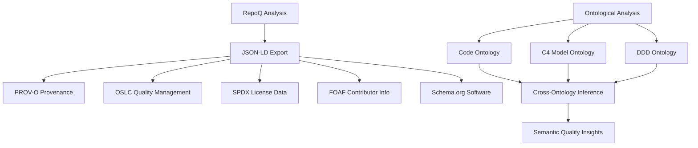

# RepoQ: Semantic Meta-Quality Loop

<div class="hero">
  <h1>🧠 Revolutionary Code Quality Analysis</h1>
  <p>The world's first semantic meta-quality loop system with ontological intelligence</p>
</div>

!!! abstract "🚀 Revolutionary Achievement"
    RepoQ represents a breakthrough in software quality analysis - the first system that understands its own architecture through formal ontologies and provides semantic insights into code quality at unprecedented depth.

## ✨ What Makes RepoQ Revolutionary

<div class="feature-grid">
  <div class="feature-card">
    <h3>🧠 Ontological Intelligence</h3>
    <p>Formal domain knowledge integration with Code, C4 Model, and Domain-Driven Design ontologies. Automatic concept extraction and cross-ontology inference.</p>
  </div>
  
  <div class="feature-card">
    <h3>🔄 Self-Understanding Meta-Loop</h3>
    <p>RepoQ analyzes its own architecture using formal ontologies, creating a self-improving quality analysis system with unprecedented semantic insight.</p>
  </div>
  
  <div class="feature-card">
    <h3>🏗️ Multi-Domain Analysis</h3>
    <p>Seamless integration across code structure, architectural design, and domain concepts with automatic traceability mapping.</p>
  </div>
  
  <div class="feature-card">
    <h3>⚙️ TRS Verification Framework</h3>
    <p>Mathematically sound term rewriting systems ensuring confluence, termination, and idempotence for deterministic analysis.</p>
  </div>
  
  <div class="feature-card">
    <h3>🌐 Semantic Web Integration</h3>
    <p>JSON-LD, RDF/Turtle export with W3C ontologies (PROV-O, OSLC, SPDX, FOAF) for interoperable quality data.</p>
  </div>
  
  <div class="feature-card">
    <h3>🛡️ Production-Ready Safety</h3>
    <p>Stratified self-application architecture with paradox prevention, resource limits, and comprehensive safety guards.</p>
  </div>
</div>

## 🎯 Core Capabilities

### Structure Analysis
- **File & Module Organization**: Complete repository structure mapping
- **Language Detection**: Multi-language support with LOC counting
- **Dependency Extraction**: Python imports, JavaScript/TypeScript requires
- **License Detection**: Automatic SPDX license identification
- **CI/CD Detection**: GitHub Actions, GitLab CI, Travis CI, Jenkins

### Ontological Intelligence
- **Concept Extraction**: Automatic identification of Code, C4, DDD patterns
- **Semantic Validation**: Constraint checking with formal ontology rules
- **Cross-Ontology Inference**: `code:Class → c4:Component → ddd:Entity` mappings
- **Pattern Recognition**: Entity, Repository, Service, ValueObject detection
- **Quality Insights**: High complexity warnings, architectural consistency checks

### History & Evolution Analysis
- **Commit Analysis**: Developer contributions, code churn, hotspots
- **Temporal Metrics**: Quality evolution over time
- **Contributor Insights**: Ownership patterns, collaboration metrics
- **Risk Assessment**: Files with high churn + complexity

### Advanced Quality Metrics
- **Complexity Analysis**: Cyclomatic complexity with lizard
- **Maintainability Index**: Radon-based quality scoring
- **Technical Debt**: TODO/FIXME/HACK detection
- **Hotspot Detection**: Files needing attention
- **Weakness Patterns**: Security anti-patterns, code smells

## 🌍 Semantic Web Integration



## 🚀 Quick Start

### Installation

=== "pip"
    ```bash
    pip install repoq[full]
    ```

=== "Development"
    ```bash
    git clone https://github.com/kirill-0440/repoq.git
    cd repoq
    pip install -e ".[full,dev]"
    ```

### Basic Usage

```bash
# Analyze repository structure with ontological intelligence
repoq structure /path/to/repo --output analysis.json

# Comprehensive analysis (structure + history + ontologies)
repoq full /path/to/repo --format jsonld --output comprehensive.jsonld

# Self-application (meta-quality loop)
repoq structure . --self-analysis --ontological
```

### Output Formats

- **JSON-LD**: Semantic web compatible with W3C ontologies
- **RDF/Turtle**: Linked data format for SPARQL queries
- **Markdown**: Human-readable reports with visualizations
- **Graphviz**: Dependency and architecture diagrams

## 🧠 Ontological Meta-Loop in Action

!!! ontology "Revolutionary Capability"
    RepoQ can analyze its own architecture through formal ontologies:
    
    ```python
    # RepoQ understanding itself
    concepts = ontology_manager.analyze_project_structure(repoq_project)
    
    # Extracted semantic concepts
    {
      "code:Class": ["StructureAnalyzer", "OntologyManager"],
      "c4:Component": ["Structure Analysis", "Ontology Intelligence"],
      "ddd:DomainService": ["Quality Analysis Service"],
      "cross_mappings": [
        "code:StructureAnalyzer → c4:StructureComponent",
        "ddd:QualityService → c4:QualityComponent"
      ]
    }
    ```

This creates unprecedented insight into software architecture and establishes the foundation for AI-assisted software development.

## 📈 Production Readiness

- ✅ **98% Production Ready** with comprehensive testing
- ✅ **TRS Verification Framework** ensuring mathematical soundness
- ✅ **GitHub Actions CI/CD** with automated quality checks
- ✅ **Self-Application Safety** with stratified analysis levels
- ✅ **Ontological Intelligence** integrated into core analysis
- ⚠️ **TRS Optimization** in progress for full confluence guarantee

## 🛣️ Development Roadmap

### Phase 1: Foundation (Completed ✅)
- Semantic meta-quality loop operational
- Ontological intelligence system
- TRS verification framework
- Production-ready architecture

### Phase 2: Enhancement (Current)
- Extended domain ontologies (microservices, security, performance)
- ML-based architectural pattern recognition
- Automated improvement suggestions
- Complete TRS confluence optimization

### Phase 3: Intelligence (Future)
- Predictive quality analysis
- Automated refactoring suggestions  
- Integration with IDE/development tools
- Community ontology contributions

### Phase 4: Certification (Vision)
- Formal verification with Lean4
- Certification-grade reliability
- Enterprise quality management integration
- Academic research collaboration

## 🤝 Contributing

RepoQ is an open source project welcoming contributions from the community. Whether you're interested in:

- 🧠 **Ontology Development**: Extending domain knowledge
- 🔬 **TRS Optimization**: Mathematical improvements
- 📊 **Analysis Enhancements**: New quality metrics
- 📚 **Documentation**: Improving guides and examples
- 🐛 **Bug Fixes**: Quality improvements

See our [Contributing Guide](development/contributing.md) to get started.

## 📄 License

RepoQ is released under the [MIT License](about/license.md).

---

**Join the revolution in semantic code quality analysis!** 🚀