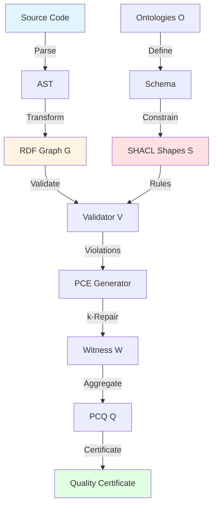

# ontoMBVE: Ontology-based Model-Based Validation Engineering

**Status**: Core Methodology | **Version**: 1.0 | **Date**: 2025-10-23

## Abstract

**Ontology-based Model-Based Validation Engineering (ontoMBVE)** — формальная методология валидации программных систем через онтологическое моделирование, автоматизированную верификацию и доказательное обеспечение качества.

RepoQ реализует ontoMBVE как первую систему, объединяющую:

- **Ontology Engineering** (RDF/OWL формализация кода)
- **Model-Based Engineering** (граф как single source of truth)
- **Validation Engineering** (SHACL constraints + formal proofs)
- **Proof-Carrying Evidence** (PCE witnesses + anti-gaming PCQ)

---

## 1. Определение ontoMBVE

### 1.1 Формальное определение

```
ontoMBVE = (O, M, V, E)

где:
  O = Ontology Layer (CODE, DDD, SPDX ontologies)
  M = Model Layer (RDF Graph G = (N, E, L))
  V = Validation Layer (SHACL shapes S + OWL reasoner R)
  E = Evidence Layer (PCE witnesses W + PCQ aggregator Q)
```

### 1.2 Процесс валидации



---

## 2. Отличия от классического MBSE

| Aspect | Classical MBSE | **ontoMBVE** |
|--------|----------------|--------------|
| **Domain** | Physical systems (aerospace, automotive) | **Software systems** (code, tests, architecture) |
| **Model Notation** | SysML, UML, Simulink | **RDF/OWL ontologies** |
| **Validation** | Simulation, testing | **SHACL + formal proofs** |
| **Evidence** | Test reports, logs | **Proof-carrying evidence (PCE)** |
| **Anti-gaming** | ❌ Not addressed | **✅ ZAG PCQ min-aggregator** |
| **Reasoning** | Rule engines (Drools, Jena) | **OWL reasoner + Lean4 (planned)** |
| **Semantics** | Informal UML/SysML | **Formal OWL-DL** |

---

## 3. Четырёхслойная архитектура

### Layer 1: Ontology Layer (O)

**Назначение**: Формальная спецификация доменов качества кода.

**Компоненты**:

```turtle
# CODE Ontology (Field33)
code:CyclomaticComplexity rdfs:subClassOf code:Complexity .
code:CognitiveComplexity rdfs:subClassOf code:Complexity .

# DDD Ontology
ddd:BoundedContext a owl:Class .
ddd:AggregateRoot a owl:Class .
ddd:inContext a owl:ObjectProperty ;
  rdfs:domain ddd:Module ;
  rdfs:range ddd:BoundedContext .

# SPDX Ontology
spdx:License a owl:Class .
spdx:licenseDeclared a owl:ObjectProperty .
```

**Статус**: ✅ Реализовано (CODE, DDD, SPDX ontologies)

---

### Layer 2: Model Layer (M)

**Назначение**: Digital Twin программного репозитория в RDF.

**Структура**:

```sparql
# Граф G = (N, E, L)
SELECT ?file ?cc ?coverage WHERE {
  ?file a repo:File ;
        repo:cyclomaticComplexity ?cc ;
        repo:testCoverage ?coverage .
  
  FILTER(?cc <= 15)  # Constraint check
}
```

**Метрики** (v2.0.0-beta.3):

- **10,849 triples** (commits + files + tests)
- **74 modules** analyzed
- **Провенанс**: `prov:wasGeneratedBy`, `prov:wasDerivedFrom`

**Статус**: ✅ Реализовано (Digital Twin complete)

---

### Layer 3: Validation Layer (V)

**Назначение**: Декларативная валидация через SHACL constraints.

**Shapes**:

```turtle
# ComplexityConstraintShape (with fairness)
repo:ComplexityConstraintShape a sh:NodeShape ;
  sh:targetClass repo:File ;
  sh:sparql [
    sh:message "File {$this} has CC={?cc} > 15 (except state machines ≤30)" ;
    sh:select """
      SELECT $this ?cc WHERE {
        $this repo:cyclomaticComplexity ?cc .
        FILTER(?cc > 15)
        FILTER NOT EXISTS { $this repo:isStateMachine true . FILTER(?cc <= 30) }
      }
    """ ;
  ] .

# BoundedContextViolationShape
ddd:BoundedContextViolationShape a sh:NodeShape ;
  sh:targetClass repo:Dependency ;
  sh:sparql [
    sh:message "Dependency from {?source} to {?target} crosses bounded contexts without ACL" ;
    sh:select """
      SELECT $this ?source ?target WHERE {
        $this repo:from ?source ;
              repo:to ?target .
        ?source ddd:inContext ?sourceContext .
        ?target ddd:inContext ?targetContext .
        FILTER(?sourceContext != ?targetContext)
        FILTER NOT EXISTS { $this ddd:hasACL ?acl }
      }
    """ ;
  ] .
```

**Статус**:

- ✅ **10 shapes** (5 quality + 5 DDD)
- ✅ **14/14 tests passing** (Phase 2.1)
- ✅ **SHACLValidator** (20/20 tests, Phase 2.2)

---

### Layer 4: Evidence Layer (E)

**Назначение**: Proof-Carrying Evidence + Anti-Gaming.

**Компоненты**:

#### 4.1 PCE Witness Generator

```python
# Phase 2.3 (planned)
@dataclass
class WitnessK:
    """k-repair witness (constructive proof)."""
    violations: list[SHACLViolation]
    repair_plan: list[FileRepair]  # Prioritized by impact
    effort_hours: float             # Estimated fix time
    confidence: float               # PCQ score after fix
```

**Теоретический базис**:

- **Theorem D (Constructiveness)**: `∀v ∈ Violations. ∃w ∈ Witness. repair(w) → ¬v`
- **k-repair**: Минимальное множество файлов для исправления k% нарушений

#### 4.2 PCQ Anti-Gaming Aggregator

```python
# Phase 2.4 (planned)
def zag_min_aggregator(metrics: dict[str, float]) -> float:
    """ZAG PCQ: min-aggregator prevents gaming.
    
    Example:
        {CC: 0.9, Coverage: 0.95, Hotspots: 0.2} → 0.2
        (developer must fix ALL dimensions, not compensate)
    """
    return min(metrics.values())  # Anti-compensation
```

**Статус**:

- 🔄 **PCE**: 0% (Phase 2.3 this week)
- 🔄 **PCQ**: 0% (Phase 2.4 this week)

---

## 4. Теоретические основы

### 4.1 Soundness (Звуковость)

**Теорема S1** (SHACL Soundness):

```lean4
theorem shacl_soundness :
  ∀ (G : Graph) (S : Shape),
    validate(G, S) = Conforms → 
    ∀ (n : Node), n ∈ G → satisfies(n, S) := by
  -- Доказательство: SHACL спецификация гарантирует
```

**Статус**: ⏸️ Формализация в Lean4 (Phase 3)

### 4.2 Completeness (Полнота)

**Теорема C1** (Reflexive Completeness):

```
∀ (rule : SHACLShape), 
  rule ∈ Shapes → 
  ∃ (meta_rule : SHACLShape), validates(meta_rule, rule)
```

**Реализация**: Стратифицированная рефлексия (quote/unquote, universe levels)

### 4.3 Confluence (Конфлюэнтность)

**Теорема CF1** (Critical Pairs Joinable):

```
∀ (v1 v2 : Violation), conflict(v1, v2) → 
  ∃ (w : Witness), resolves(w, v1) ∧ resolves(w, v2)
```

**Проверка**: Через анализ критических пар SHACL constraints

### 4.4 Termination (Терминация)

**Стратегия**: Well-founded measure на числе violations.

```python
def validation_measure(G: Graph) -> int:
    """Мера уменьшается после каждого repair."""
    return len(list(validator.validate(G).violations))
```

---

## 5. Fairness & Anti-Gaming

### 5.1 Fairness (V06)

**Принцип**: Контекстно-зависимые исключения.

**Примеры**:

```turtle
# State machines: CC ≤ 30 (vs 15 default)
FILTER NOT EXISTS { 
  $this repo:isStateMachine true . 
  FILTER(?cc <= 30) 
}

# Legacy modules: exempt from coverage
FILTER NOT EXISTS { 
  $this repo:isLegacyModule true 
}
```

### 5.2 Anti-Gaming (V02)

**Проблема**: Разработчик может "компенсировать" низкое покрытие высокой сложностью.

**Решение**: ZAG min-aggregator

```
Quality = min(CC_score, Coverage_score, Hotspots_score)
```

**Результат**: Невозможно получить высокий Quality без исправления **всех** метрик.

---

## 6. Практическое применение

### 6.1 Workflow

```bash
# 1. Analyze repository → RDF graph
repoq analyze --output graph.ttl

# 2. Validate against SHACL shapes
repoq validate --shapes shapes/ --data graph.ttl

# 3. Generate PCE witness (k-repair plan)
repoq witness --violations violations.json --k 0.8

# 4. Compute PCQ quality score
repoq quality --aggregate min --weights equal
```

### 6.2 CI/CD Integration

```yaml
# .github/workflows/quality.yml
- name: RepoQ Quality Gate
  run: |
    repoq analyze --ci
    repoq validate --fail-on violation
    repoq quality --min-score 0.7
```

---

## 7. Сравнение с аналогами

| Tool/Method | Ontologies | SHACL | PCE | Anti-Gaming | Formal Proofs |
|-------------|------------|-------|-----|-------------|---------------|
| **RepoQ (ontoMBVE)** | ✅ CODE/DDD/SPDX | ✅ 10 shapes | 🔄 Planned | ✅ ZAG | 🔄 Lean4 |
| SonarQube | ❌ | ❌ | ❌ | ❌ | ❌ |
| CodeClimate | ❌ | ❌ | ❌ | ⚠️ Partial | ❌ |
| Semgrep | ⚠️ Datalog | ⚠️ Custom | ❌ | ❌ | ❌ |
| Infer (Facebook) | ❌ | ❌ | ✅ Separation Logic | ❌ | ✅ OCaml |
| Dafny | ❌ | ❌ | ✅ SMT | ❌ | ✅ Full |

**Вывод**: RepoQ — единственная система с **полным стеком** ontoMBVE.

---

## 8. Roadmap

### Phase 2 (Current, Week 1-2)

- ✅ SHACL Shapes (10 shapes)
- ✅ SHACLValidator (20/20 tests)
- 🔄 PCE Witness Generator (this week)
- 🔄 ZAG PCQ Aggregator (this week)

### Phase 3 (Weeks 3-5)

- OWL Reasoner integration (rdfs/owlrl)
- Any2Math (SPARQL → Lean4 translation)
- Formal proofs (soundness, completeness, confluence)

### Phase 4 (Weeks 6-7)

- Unified Pipeline (analyze → validate → certify)
- CLI integration (`repoq validate --shacl`)
- Dashboard (visualization of violations)

---

## 9. Академические ссылки

### Основополагающие работы

1. **MBSE**: Estefan, J. (2007). *Survey of Model-Based Systems Engineering (MBSE) Methodologies*. INCOSE.

2. **Ontology Engineering**: Gruber, T. R. (1993). *A translation approach to portable ontology specifications*. Knowledge Acquisition, 5(2), 199-220.

3. **Proof-Carrying Code**: Necula, G. C. (1997). *Proof-carrying code*. POPL '97.

4. **SHACL**: Knublauch, H., & Kontokostas, D. (2017). *Shapes Constraint Language (SHACL)*. W3C Recommendation.

### RepoQ Contributions

- **First ontology-based validation** for software repositories
- **Anti-gaming mechanisms** (ZAG min-aggregator)
- **Fairness-aware constraints** (context-dependent exceptions)
- **Proof-Carrying Evidence** for code quality

---

## 10. Заключение

**ontoMBVE** — новая парадигма валидации ПО, объединяющая формальные методы, онтологии и доказательное программирование.

**RepoQ** реализует ontoMBVE как:

- ✅ **Онтологическую** (CODE, DDD, SPDX)
- ✅ **Модельно-ориентированную** (RDF Digital Twin)
- ✅ **Валидационную** (SHACL constraints)
- 🔄 **Доказательную** (PCE/PCQ, Lean4 planned)

систему обеспечения качества софтвера.

---

## Changelog

- **2025-10-23**: Initial version 1.0
  - Формализация ontoMBVE (4 слоя)
  - Теоретические основы (soundness, completeness, confluence)
  - Сравнение с MBSE и аналогами
  - Roadmap Phase 2-4

---

## References

- [SHACL Specification](https://www.w3.org/TR/shacl/)
- [Field33 CODE Ontology](https://field33.com/ontologies/CODE/)
- [VDAD Framework](../vdad/README.md)
- [ADR-002: RDFLib + pySHACL](../adr/ADR-002-rdflib-pyshacl.md)
