# Ontological Intelligence

!!! info "Revolutionary Technology"
    RepoQ's ontological intelligence represents the first implementation of **formal semantic understanding** in software analysis, utilizing three complementary domain ontologies to achieve unprecedented insight depth.

## 🧭 What is Ontological Intelligence?

Ontological intelligence is RepoQ's ability to understand code through **formal domain knowledge**, going far beyond syntax analysis to comprehend architectural patterns, design principles, and domain semantics.

```mermaid
graph TB
    subgraph "Raw Analysis"
        A[Syntax Parsing] --> B[AST Generation]
        B --> C[Basic Metrics]
    end
    
    subgraph "Ontological Intelligence"
        D[Code Ontology<br/>🔍 Syntax Semantics] 
        E[C4 Model Ontology<br/>🏗️ Architecture]
        F[DDD Ontology<br/>🎯 Domain Design]
    end
    
    subgraph "Semantic Understanding"
        G[Pattern Recognition]
        H[Design Validation]
        I[Quality Assessment]
        J[Improvement Suggestions]
    end
    
    C --> D
    C --> E  
    C --> F
    
    D --> G
    E --> H
    F --> I
    
    G --> J
    H --> J
    I --> J
    
    style D fill:#e3f2fd
    style E fill:#f3e5f5
    style F fill:#fff3e0
    style J fill:#e8f5e8
```



## 🎯 Three-Ontology Architecture

### 1. Code Ontology - Syntax Semantics 🔍

**Purpose**: Understanding programming language constructs and their relationships

```turtle
@prefix code: <https://field33.com/ontologies/code/> .
@prefix owl: <http://www.w3.org/2002/07/owl#> .

code:Module a owl:Class ;
    rdfs:label "Module" ;
    rdfs:comment "A cohesive unit of code organization" .

code:Function a owl:Class ;
    rdfs:label "Function" ;
    rdfs:comment "A callable code unit with parameters and return value" .

code:hasComplexity a owl:DatatypeProperty ;
    rdfs:domain code:Function ;
    rdfs:range xsd:integer ;
    rdfs:comment "Cyclomatic complexity of a function" .
```

**Key Concepts**:
- **Modules**: Organizational units (`repoq.analyzers`, `repoq.core`)
- **Classes**: Object-oriented structures (`StructureAnalyzer`, `TRSVerifier`)
- **Functions**: Callable units with complexity metrics
- **Dependencies**: Import and call relationships
- **Metrics**: Quantitative measurements (LOC, complexity, coupling)

### 2. C4 Model Ontology - Architecture 🏗️

**Purpose**: Understanding system architecture at multiple abstraction levels

```turtle
@prefix c4: <https://field33.com/ontologies/c4/> .

c4:System a owl:Class ;
    rdfs:label "System" ;
    rdfs:comment "Highest level of abstraction - complete software system" .

c4:Container a owl:Class ;
    rdfs:label "Container" ;
    rdfs:comment "Deployable/executable unit (app, microservice, database)" .

c4:Component a owl:Class ;
    rdfs:label "Component" ;
    rdfs:comment "Logical grouping of related functionality" .
```

**Architectural Levels**:
1. **System**: RepoQ as complete analysis platform
2. **Container**: Major subsystems (CLI, Core Engine, Web Interface)
3. **Component**: Functional modules (Analyzers, Exporters, Validators)
4. **Code**: Implementation classes and functions

**Example Mapping**:
```json
{
  "system": "RepoQ Analysis Platform",
  "containers": [
    {
      "name": "Core Engine",
      "technology": "Python",
      "components": ["StructureAnalyzer", "HistoryAnalyzer", "ComplexityAnalyzer"]
    },
    {
      "name": "CLI Interface", 
      "technology": "Click",
      "components": ["CommandProcessor", "OutputFormatter"]
    }
  ]
}
```

### 3. Domain-Driven Design (DDD) Ontology - Domain Design 🎯

**Purpose**: Understanding business domain concepts and design patterns

```turtle
@prefix ddd: <https://field33.com/ontologies/ddd/> .

ddd:BoundedContext a owl:Class ;
    rdfs:label "Bounded Context" ;
    rdfs:comment "Explicit boundary of domain model applicability" .

ddd:Entity a owl:Class ;
    rdfs:label "Entity" ;
    rdfs:comment "Domain object with unique identity" .

ddd:ValueObject a owl:Class ;
    rdfs:label "Value Object" ;
    rdfs:comment "Immutable object defined by its attributes" .
```

**Domain Concepts**:
- **Bounded Contexts**: Analysis, Ontology, Reporting domains
- **Entities**: Project, Repository, AnalysisResult (with identity)
- **Value Objects**: Metrics, Complexity scores (immutable values)
- **Services**: Analysis orchestration, validation logic
- **Repositories**: Data access abstractions

## ⚙️ Cross-Ontology Inference Engine

### Semantic Mappings

RepoQ automatically creates relationships between ontological concepts:

```python
class SemanticMapper:
    """Maps concepts across different ontological domains."""
    
    MAPPINGS = {
        # Code → C4 mappings
        ("code:Module", "c4:Component"): {
            "relationship": "implements",
            "confidence": 0.9,
            "conditions": ["cohesive_functionality", "clear_interface"]
        },
        
        # Code → DDD mappings  
        ("code:Class", "ddd:Entity"): {
            "relationship": "realizes",
            "confidence": 0.8,
            "conditions": ["has_identity", "mutable_state"]
        },
        
        # C4 → DDD mappings
        ("c4:Container", "ddd:BoundedContext"): {
            "relationship": "corresponds_to",
            "confidence": 0.85,
            "conditions": ["domain_boundary", "autonomous_deployment"]
        }
    }
```

### Inference Rules

**Rule 1: Component Coherence**
```prolog
component_coherent(C) :-
    c4:Component(C),
    high_cohesion(C),
    low_coupling(C),
    single_responsibility(C).
```

**Rule 2: Entity Recognition**
```prolog
likely_entity(Class) :-
    code:Class(Class),
    has_identity_field(Class),
    has_mutable_state(Class),
    represents_domain_concept(Class).
```

**Rule 3: Bounded Context Detection**
```prolog
bounded_context(Module) :-
    code:Module(Module),
    domain_focused(Module),
    minimal_external_deps(Module),
    coherent_vocabulary(Module).
```

## 🔍 Pattern Recognition

### Architectural Patterns

RepoQ automatically detects common design patterns:

#### **Strategy Pattern**
```json
{
  "@type": "ArchitecturalPattern",
  "pattern": "Strategy",
  "context": "repoq.analyzers",
  "detection": {
    "base_class": "BaseAnalyzer",
    "strategies": ["ComplexityAnalyzer", "HistoryAnalyzer", "HotspotsAnalyzer"],
    "polymorphic_usage": true,
    "confidence": 0.95
  },
  "benefits": ["extensibility", "testability", "separation_of_concerns"]
}
```

#### **Plugin Architecture**
```json
{
  "@type": "ArchitecturalPattern", 
  "pattern": "Plugin",
  "context": "repoq.ontologies",
  "detection": {
    "plugin_interface": "OntologyPlugin",
    "plugins": ["CodeOntologyPlugin", "C4ModelPlugin", "DDDOntologyPlugin"],
    "dynamic_loading": true,
    "confidence": 0.9
  },
  "benefits": ["modularity", "extensibility", "domain_separation"]
}
```

#### **Repository Pattern**
```json
{
  "@type": "ArchitecturalPattern",
  "pattern": "Repository", 
  "context": "repoq.core",
  "detection": {
    "abstraction": "RepoLoader",
    "implementations": ["GitRepoLoader", "LocalRepoLoader"],
    "data_access_encapsulation": true,
    "confidence": 0.8
  },
  "benefits": ["testability", "data_source_abstraction", "consistent_interface"]
}
```

### Domain-Driven Design Patterns

#### **Bounded Context Analysis**
```python
{
  "analysis_context": {
    "@type": "ddd:BoundedContext",
    "name": "Code Analysis Domain",
    "modules": ["repoq.analyzers", "repoq.core.model"],
    "vocabulary": ["complexity", "coupling", "cohesion", "metrics"],
    "boundaries": {
      "internal": ["analysis algorithms", "metric calculations"],
      "external": ["file system", "git repositories", "reporting"]
    }
  },
  
  "ontology_context": {
    "@type": "ddd:BoundedContext", 
    "name": "Knowledge Domain",
    "modules": ["repoq.ontologies", "repoq.core.jsonld"],
    "vocabulary": ["concepts", "relationships", "inference", "semantics"],
    "boundaries": {
      "internal": ["ontology management", "semantic reasoning"],
      "external": ["analysis results", "export formats"]
    }
  }
}
```

#### **Entity vs Value Object Classification**
```python
DOMAIN_OBJECTS = {
    # Entities (have identity, mutable)
    "entities": [
        {
            "class": "Project",
            "identity": "project_path", 
            "mutable_state": ["analysis_results", "last_analyzed"],
            "business_meaning": "Software project under analysis"
        },
        {
            "class": "AnalysisSession",
            "identity": "session_id",
            "mutable_state": ["progress", "results", "status"],
            "business_meaning": "Single analysis execution"
        }
    ],
    
    # Value Objects (immutable, equality by value)
    "value_objects": [
        {
            "class": "ComplexityScore",
            "attributes": ["cyclomatic", "cognitive", "lines"],
            "immutable": true,
            "business_meaning": "Quantified code complexity"
        },
        {
            "class": "DependencyRelation", 
            "attributes": ["from_module", "to_module", "type"],
            "immutable": true,
            "business_meaning": "Module relationship"
        }
    ]
}
```

## 🎯 Quality Assessment Through Ontologies

### Multi-Dimensional Quality Model

RepoQ evaluates quality across three ontological dimensions:

#### **1. Code Quality (Syntax Level)**
```python
code_quality_metrics = {
    "complexity": {
        "cyclomatic": {"threshold": 15, "weight": 0.3},
        "cognitive": {"threshold": 25, "weight": 0.25},
        "nesting": {"threshold": 4, "weight": 0.2}
    },
    "maintainability": {
        "length": {"threshold": 50, "weight": 0.15},
        "coupling": {"threshold": 7, "weight": 0.1}
    }
}
```

#### **2. Architectural Quality (C4 Level)**
```python
architectural_quality = {
    "layering": {
        "violations": 0,
        "dependency_direction": "correct",
        "abstraction_levels": "clear"
    },
    "modularity": {
        "cohesion": "high",
        "coupling": "low", 
        "interface_segregation": "good"
    },
    "scalability": {
        "plugin_architecture": "present",
        "extensibility_points": "identified",
        "flexibility": "high"
    }
}
```

#### **3. Domain Quality (DDD Level)**
```python
domain_quality = {
    "modeling": {
        "entity_design": "appropriate",
        "value_object_usage": "correct",
        "service_boundaries": "clear"
    },
    "boundaries": {
        "context_separation": "explicit",
        "vocabulary_consistency": "high",
        "dependency_management": "good"
    },
    "patterns": {
        "strategy_usage": "effective",
        "repository_abstraction": "present",
        "domain_events": "missing"  # Improvement opportunity
    }
}
```

## 🚀 Intelligent Insights

### Automatic Improvement Suggestions

Based on ontological analysis, RepoQ generates specific recommendations:

#### **Code Level Improvements**
```json
{
  "improvement_type": "code_structure",
  "location": "repoq/analyzers/complexity.py:calculate_cognitive_complexity()",
  "issue": "High cognitive complexity (32 > 25)",
  "suggestions": [
    {
      "action": "extract_method",
      "description": "Extract nested loop handling into separate method",
      "estimated_impact": "Reduce complexity by 8 points"
    },
    {
      "action": "introduce_value_object", 
      "description": "Create ComplexityContext value object for parameters",
      "estimated_impact": "Improve readability and reduce parameter coupling"
    }
  ]
}
```

#### **Architectural Improvements**
```json
{
  "improvement_type": "architecture",
  "context": "Plugin Loading Mechanism",
  "issue": "Direct plugin instantiation reduces testability",
  "suggestions": [
    {
      "pattern": "Abstract Factory",
      "description": "Introduce PluginFactory for plugin creation",
      "benefits": ["testability", "configuration_flexibility", "runtime_selection"]
    },
    {
      "pattern": "Dependency Injection",
      "description": "Inject plugin dependencies rather than hard-coding",
      "benefits": ["loose_coupling", "testability", "configuration"]
    }
  ]
}
```

#### **Domain Model Enhancements**
```json
{
  "improvement_type": "domain_modeling",
  "context": "Analysis Result Handling",
  "issue": "Missing domain events for analysis completion",
  "suggestions": [
    {
      "pattern": "Domain Events",
      "description": "Publish AnalysisCompleted event",
      "implementation": "Create event dispatcher and handlers",
      "benefits": ["decoupling", "extensibility", "audit_trail"]
    },
    {
      "pattern": "Aggregate Root",
      "description": "Make Project an aggregate root managing analysis lifecycle", 
      "benefits": ["consistency", "transactional_boundaries", "encapsulation"]
    }
  ]
}
```

## 🔬 Research Applications

### Semantic Software Engineering

RepoQ's ontological intelligence enables:

1. **Formal Architecture Validation**: Mathematical verification of design principles
2. **Pattern-Based Refactoring**: Semantic understanding guides safe transformations  
3. **Domain Knowledge Preservation**: Explicit capture of design intent and rationale
4. **Cross-Project Learning**: Transfer architectural insights between projects
5. **Automated Design Review**: AI-powered evaluation of architectural decisions

### Future Research Directions

- **Machine Learning Integration**: Train models on ontological representations
- **Predictive Architecture**: Forecast architectural evolution based on domain patterns
- **Semantic Debugging**: Use ontological understanding for intelligent debugging
- **Cross-Language Analysis**: Universal architectural concepts across programming languages
- **Self-Evolving Ontologies**: Ontologies that learn and adapt from analysis experience

---

Ontological intelligence represents a **paradigm shift** from syntax-based to **semantics-based software understanding** - enabling unprecedented depth in code analysis and architectural insight. 🌟