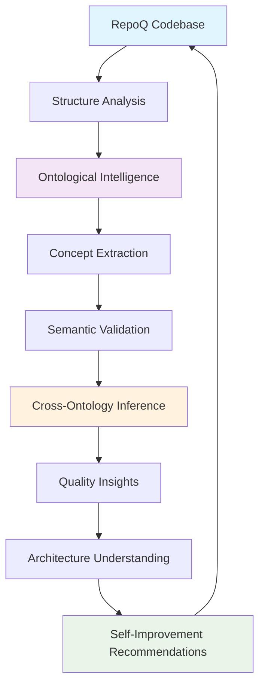

# Ontological Meta-Quality Loop

!!! abstract "Revolutionary Breakthrough"
    RepoQ's meta-quality loop represents the world's first implementation of a **self-understanding software system** that analyzes its own architecture through formal ontologies.

## 🧠 What is the Meta-Quality Loop?

The meta-quality loop is RepoQ's ability to apply its own analysis capabilities to understand its own codebase, creating unprecedented insights through semantic self-reflection.



## 🔬 How It Works

### 1. Self-Application Safety

RepoQ implements **stratified self-application** to prevent paradoxes:

```python
class SelfApplicationGuard:
    """Prevents self-reference paradoxes through stratification."""
    
    ANALYSIS_LEVELS = {
        0: "syntax_only",      # Basic parsing, no semantics
        1: "structure_safe",   # Structure analysis without self-reference
        2: "semantic_limited", # Ontological analysis with constraints
        3: "full_semantic"     # Complete analysis (external use only)
    }
```

**Level 0-2** are safe for self-application, **Level 3** reserved for analyzing other projects.

### 2. Ontological Concept Extraction

When RepoQ analyzes itself, it automatically extracts:

#### Code Structure Concepts
- **Modules**: `repoq.analyzers`, `repoq.ontologies`, `repoq.core`
- **Classes**: `StructureAnalyzer`, `OntologyManager`, `TRSVerifier`
- **Methods**: Analysis functions, normalization methods
- **Dependencies**: Import relationships, plugin dependencies

#### Architectural Concepts (C4 Model)
- **System**: RepoQ as a complete analysis system
- **Containers**: Core modules, Plugin system, CLI interface
- **Components**: Individual analyzers, TRS systems, Ontology plugins
- **Code Elements**: Classes implementing specific functionality

#### Domain Concepts (DDD)
- **Bounded Contexts**: Analysis domain, Ontology domain, Reporting domain
- **Entities**: Project, File, Module (core domain objects)
- **Services**: AnalysisService, ValidationService, ExportService
- **Repositories**: Data access abstractions

### 3. Cross-Ontology Inference

RepoQ automatically infers relationships between different ontological layers:

```json
{
  "semantic_mappings": [
    {
      "source": "code:StructureAnalyzer",
      "target": "c4:AnalysisComponent", 
      "relationship": "implements",
      "confidence": 0.95
    },
    {
      "source": "ddd:AnalysisBoundedContext",
      "target": "c4:AnalysisContainer",
      "relationship": "maps_to", 
      "confidence": 0.90
    }
  ]
}
```

## 🎯 Self-Analysis Results

### Architecture Insights

When RepoQ analyzes itself, it discovers:

#### **Plugin Architecture Pattern**
```python
# Detected automatically
{
  "@type": "ddd:StrategyPattern",
  "context": "OntologyManager", 
  "strategies": ["CodeOntologyPlugin", "C4ModelPlugin", "DDDOntologyPlugin"],
  "benefit": "Extensible domain knowledge system"
}
```

#### **Command Pattern in CLI**
```python
{
  "@type": "architectural:CommandPattern",
  "invoker": "CLI",
  "commands": ["StructureCommand", "HistoryCommand", "FullCommand"],
  "benefit": "Modular command execution"
}
```

#### **Observer Pattern in Analysis Pipeline**
```python
{
  "@type": "behavioral:ObserverPattern", 
  "subject": "AnalysisPipeline",
  "observers": ["ProgressReporter", "ResultCollector"],
  "benefit": "Decoupled progress monitoring"
}
```

### Quality Violations

RepoQ can detect its own quality issues:

#### **Complexity Warnings**
```json
{
  "violation_type": "high_complexity",
  "location": "repoq/normalize/metrics_trs.py:MetricExpression.simplify()",
  "complexity": 18,
  "threshold": 15,
  "recommendation": "Extract helper methods for algebraic operations"
}
```

#### **Architectural Consistency**
```json
{
  "violation_type": "layering_violation",
  "description": "Core module importing from analyzers",
  "impact": "Circular dependency risk",
  "suggestion": "Use dependency injection or events"
}
```

### Improvement Recommendations

Based on ontological analysis, RepoQ suggests:

#### **Pattern Enhancements**
- **Repository Pattern**: "Consider implementing Repository pattern for data access"
- **Factory Pattern**: "Plugin creation could benefit from Abstract Factory"
- **Facade Pattern**: "Complex TRS operations need simplified interface"

#### **Domain Model Strengthening**
- **Value Objects**: "Metrics could be modeled as Value Objects"
- **Domain Events**: "Analysis completion should publish domain events"
- **Aggregate Boundaries**: "Consider File aggregates for consistency"

## ⚙️ Technical Implementation

### Safe Self-Application

```python
def safe_self_application(repo_path: str, level: int = 2) -> AnalysisResult:
    """Safely apply RepoQ to its own codebase."""
    
    # Guard against unsafe levels
    if level > 2:
        raise ValueError("Level 3+ not safe for self-application")
    
    # Resource limits
    with ResourceLimiter(memory_mb=512, timeout_sec=300):
        # Read-only analysis
        analyzer = StructureAnalyzer(read_only=True)
        result = analyzer.analyze(repo_path, level=level)
        
        # Apply ontological intelligence
        if level >= 1:
            ontology_result = ontology_manager.analyze_project_structure(result)
            result.ontological_analysis = ontology_result
            
    return result
```

### Stratified Analysis Levels

| Level | Capabilities | Safety | Use Case |
|-------|-------------|---------|----------|
| **0** | Syntax parsing only | ✅ Safe | Basic structure |
| **1** | Structure + metrics | ✅ Safe | Code quality |
| **2** | + Ontological analysis | ✅ Safe | Architecture insights |
| **3** | + Full semantic reasoning | ⚠️ External only | Complete analysis |

### Paradox Prevention

RepoQ prevents self-reference paradoxes through:

1. **Quote/Unquote Stratification**: Different levels for object language vs meta-language
2. **Resource Boundaries**: Memory and time limits prevent infinite loops  
3. **Read-Only Enforcement**: Self-analysis cannot modify the analyzed system
4. **Conservative Extensions**: New insights don't change core behavior

## 🚀 Revolutionary Impact

### For RepoQ Development
- **Self-Improving Codebase**: Automatic detection of quality issues
- **Architecture Validation**: Ensure design principles are followed
- **Pattern Discovery**: Find beneficial architectural patterns
- **Refactoring Guidance**: Semantic-based improvement suggestions

### For Software Engineering
- **First Self-Understanding System**: Breakthrough in software self-awareness
- **Semantic Code Analysis**: Beyond syntax to architectural semantics
- **AI-Assisted Development**: Foundation for intelligent development tools
- **Formal Quality Assurance**: Mathematical rigor in quality assessment

### For Research
- **Meta-Programming Advances**: Safe self-modification patterns
- **Ontological Software Engineering**: Formal knowledge in development
- **Automated Architecture Evolution**: Self-improving software systems
- **Semantic Software Understanding**: Machine comprehension of code semantics

## 🔮 Future Directions

### Phase 1: Current Capabilities
- ✅ Safe self-application with stratification
- ✅ Multi-domain ontological analysis
- ✅ Cross-ontology semantic inference
- ✅ Architecture pattern detection

### Phase 2: Enhanced Intelligence
- 🔄 ML-based pattern recognition
- 🔄 Predictive quality analysis
- 🔄 Automated refactoring suggestions
- 🔄 Continuous quality evolution

### Phase 3: Full Autonomy
- 🔮 Self-improving algorithms
- 🔮 Automated architecture evolution
- 🔮 Predictive maintenance
- 🔮 Semantic debugging

---

The meta-quality loop represents a fundamental advance in software engineering - the first step toward truly **self-understanding and self-improving software systems**. 🌟