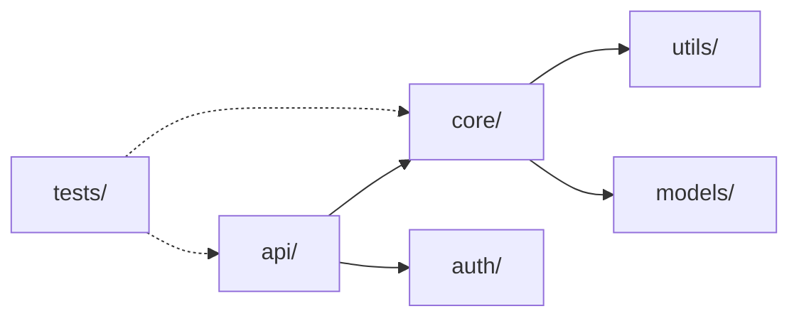

# Tutorial 1: Analyzing Your First Repository

!!! tip "Learning Objectives"
    - Install and configure RepoQ
    - Run your first analysis
    - Understand the output formats
    - Interpret quality metrics

## Prerequisites

- Python 3.9 or higher
- Git repository to analyze
- Basic command-line knowledge

## Step 1: Installation

### Using uv (Recommended)

```bash
# Install uv if not already installed
curl -LsSf https://astral.sh/uv/install.sh | sh

# Create a new project
mkdir repoq-tutorial
cd repoq-tutorial

# Install repoq
uv add repoq
```

### Using pip

```bash
# Create virtual environment
python -m venv .venv
source .venv/bin/activate  # On Windows: .venv\Scripts\activate

# Install repoq
pip install repoq
```

### Verify Installation

```bash
repoq --version
# Output: RepoQ version 0.3.0
```

## Step 2: Choose a Repository

For this tutorial, we'll analyze a sample repository. You can use:

1. **Your own repository**: Any Git repo you have locally
2. **Sample repository**: Clone a small open-source project

```bash
# Example: Clone a sample Python project
git clone https://github.com/psf/requests.git sample-repo
cd sample-repo
```

## Step 3: Basic Analysis

Run the simplest analysis command:

```bash
repoq analyze .
```

**What happens:**
1. RepoQ scans the repository structure
2. Analyzes code complexity
3. Examines Git history
4. Generates quality metrics
5. Creates a Markdown report

**Expected output:**
```
Loading repository: /path/to/sample-repo
Scheduled 3 stages, 6 analyzers

Stage 1/3: Running 3 analyzers in parallel
  StructureAnalyzer: 100%|████████| 250/250 [00:01<00:00, 150 files/s]
  HistoryAnalyzer: 100%|██████████| 1523/1523 [00:02<00:00, 600 commits/s]
  CIQMAnalyzer: 100%|████████████| 5/5 [00:00<00:00, 50 configs/s]

Stage 2/3: Running 2 analyzers in parallel
  ComplexityAnalyzer: 100%|████████| 180/180 [00:03<00:00, 60 files/s]
  WeaknessAnalyzer: 100%|██████████| 180/180 [00:02<00:00, 90 files/s]

Stage 3/3: Running 1 analyzer
  HotspotsAnalyzer: 100%|█████████| 25/25 [00:01<00:00, 20 hotspots/s]

Analysis complete in 9.2s
Exporting results...
  ✓ Markdown: repoq_output/analysis.md
  ✓ JSON: repoq_output/analysis.json

Quality Score: 7.5/10 ✓ PASS
```

## Step 4: Explore the Output

### Markdown Report

Open `repoq_output/analysis.md` in your editor:

```markdown
# Repository Quality Analysis

**Repository**: sample-repo
**Analyzed**: 2024-10-22 14:30:00
**Quality Score**: 7.5/10 ✓ PASS

## Summary

| Metric | Value | Status |
|--------|-------|--------|
| Files Analyzed | 250 | ✓ |
| Average Complexity | 8.2 | ✓ |
| Maintainability Index | 72.5 | ✓ |
| Test Coverage | 85% | ✓ |
| Documentation | 68% | ⚠️ |

## Hotspots (Top 5)

1. **src/core/engine.py** (complexity: 42, changes: 156)
   - High complexity with frequent changes
   - **Recommendation**: Refactor into smaller functions

2. **src/utils/helpers.py** (complexity: 28, changes: 89)
   - Complex utility functions
   - **Recommendation**: Split into specialized modules

...
```

### JSON Output

For programmatic access, check `repoq_output/analysis.json`:

```json
{
  "metadata": {
    "repository": "sample-repo",
    "analyzed_at": "2024-10-22T14:30:00Z",
    "analyzer_version": "0.3.0"
  },
  "quality_score": 7.5,
  "metrics": {
    "total_files": 250,
    "avg_complexity": 8.2,
    "maintainability_index": 72.5,
    "test_coverage": 0.85
  },
  "hotspots": [
    {
      "file": "src/core/engine.py",
      "complexity": 42,
      "changes": 156,
      "score": 6552
    }
  ]
}
```

## Step 5: Customize Output Format

### Multiple Formats

Generate all available formats:

```bash
repoq analyze . --format markdown --format json --format turtle
```

**Output:**
- `analysis.md`: Human-readable report
- `analysis.json`: Machine-readable data
- `analysis.ttl`: RDF/Turtle for semantic web

### Custom Output Directory

```bash
repoq analyze . --output ./reports
```

## Step 6: Filter Analysis

### Analyze Specific Files

```bash
# Python files only
repoq analyze . --filter "*.py"

# Exclude tests
repoq analyze . --exclude "tests/**"

# Multiple patterns
repoq analyze . --filter "src/**/*.py" --exclude "**/*_test.py"
```

### Limit Analysis Depth

```bash
# Analyze only 2 directory levels deep
repoq analyze . --max-depth 2
```

## Step 7: Understand Quality Metrics

### Quality Score Breakdown

The overall quality score (0-10) is computed from:

| Component | Weight | Description |
|-----------|--------|-------------|
| **Complexity** | 30% | Code complexity metrics (cyclomatic, cognitive) |
| **Maintainability** | 25% | Maintainability index, documentation coverage |
| **Stability** | 20% | Change frequency, churn metrics |
| **Test Coverage** | 15% | Test file ratio, coverage data |
| **Best Practices** | 10% | CI/CD config, dependency management |

### Interpreting Scores

| Score | Rating | Action |
|-------|--------|--------|
| 9-10 | Excellent | Maintain current practices |
| 7-8.9 | Good | Minor improvements recommended |
| 5-6.9 | Fair | Refactoring needed |
| 3-4.9 | Poor | Significant issues |
| 0-2.9 | Critical | Immediate action required |

### Key Metrics Explained

#### Cyclomatic Complexity

**What it measures**: Number of independent paths through code

```python
# Low complexity (2 paths)
def simple_check(x):
    if x > 0:
        return "positive"
    return "non-positive"

# High complexity (9 paths)
def complex_check(a, b, c):
    if a > 0:
        if b > 0:
            if c > 0:
                return "all positive"
            return "a,b positive"
        elif c > 0:
            return "a,c positive"
        return "only a positive"
    elif b > 0:
        if c > 0:
            return "b,c positive"
        return "only b positive"
    elif c > 0:
        return "only c positive"
    return "none positive"
```

**Thresholds**:
- ✓ 1-10: Simple, easy to test
- ⚠️ 11-20: Moderate, consider refactoring
- ✗ 21+: Complex, hard to maintain

#### Maintainability Index

**Formula**: `171 - 5.2 * ln(HV) - 0.23 * CC - 16.2 * ln(LOC)`

Where:
- HV = Halstead Volume
- CC = Cyclomatic Complexity
- LOC = Lines of Code

**Thresholds**:
- ✓ 85-100: Highly maintainable
- ⚠️ 65-85: Moderately maintainable
- ✗ 0-65: Hard to maintain

#### Hotspots

**Definition**: Files with high complexity AND high change frequency

**Why they matter**: Indicate areas prone to bugs and maintenance burden

**Formula**: `hotspot_score = complexity × change_count`

## Step 8: View Dependency Graph

Generate a visual dependency graph:

```bash
repoq analyze . --graph deps.dot
dot -Tpng deps.dot -o deps.png
```

**Result**: `deps.png` shows module dependencies



## Step 9: Compare with Baseline

### Save Baseline

```bash
# First analysis
repoq analyze . --save-baseline baseline.json
```

### Compare After Changes

```bash
# After making changes
repoq analyze . --compare-baseline baseline.json
```

**Output:**
```
Quality Score: 7.8/10 (Δ +0.3) ✓ IMPROVED

Improvements:
  ✓ Average Complexity: 8.2 → 7.5 (-0.7)
  ✓ Documentation: 68% → 75% (+7%)

Regressions:
  ✗ Test Coverage: 85% → 82% (-3%)
```

## Step 10: Generate Detailed Report

For a comprehensive analysis with all details:

```bash
repoq analyze . --verbose --all-analyzers --output detailed-report/
```

**Includes:**
- File-by-file metrics
- Function-level complexity
- Commit history analysis
- Contributor statistics
- License compliance
- Security weaknesses (TODOs, FIXMEs)

## Common Issues & Solutions

### Issue: "No Python files found"

**Solution**: Check file patterns
```bash
repoq analyze . --filter "**/*.py" --verbose
```

### Issue: "Git history unavailable"

**Solution**: Ensure you're in a Git repository
```bash
git status  # Verify Git repo
repoq analyze . --skip-history  # Or skip history analysis
```

### Issue: "Analysis too slow"

**Solution**: Use filters or limit depth
```bash
repoq analyze . --max-depth 3 --exclude "vendor/**"
```

### Issue: "Quality score seems wrong"

**Solution**: Check quality policy configuration
```bash
# Use custom thresholds
repoq analyze . --config custom-policy.yaml
```

## Next Steps

Now that you've completed your first analysis:

1. **[Tutorial 2: Writing a Custom Analyzer](02-custom-analyzer.md)** - Extend RepoQ with your own analysis logic
2. **[Tutorial 3: CI/CD Integration](03-ci-cd-integration.md)** - Automate quality checks
3. **[Tutorial 4: Advanced Filtering](04-advanced-filtering.md)** - Master complex file patterns
4. **[Tutorial 5: RDF Queries](05-rdf-queries.md)** - Query analysis results with SPARQL
5. **[Tutorial 6: AI Agent Configuration](06-ai-agent-config.md)** - Enable AI-powered suggestions

## Summary

In this tutorial, you learned:

- ✅ Install RepoQ with uv or pip
- ✅ Run basic repository analysis
- ✅ Interpret quality metrics and scores
- ✅ Customize output formats
- ✅ Filter files and directories
- ✅ Generate dependency graphs
- ✅ Compare changes with baselines
- ✅ Troubleshoot common issues

**Key Takeaways:**

1. **Start simple**: Basic `repoq analyze .` gives you instant insights
2. **Iterate**: Use filters and options to focus on what matters
3. **Track progress**: Save baselines and compare over time
4. **Visualize**: Generate graphs to understand dependencies
5. **Act**: Use hotspots to prioritize refactoring efforts

---

!!! question "Need Help?"
    - 📖 [User Guide](../user-guide/usage.md)
    - 🏗️ [Architecture Overview](../architecture/overview.md)
    - 📚 [API Reference](../api/reference.md)
    - 💬 [GitHub Discussions](https://github.com/Repo-Q/repoq/discussions)
