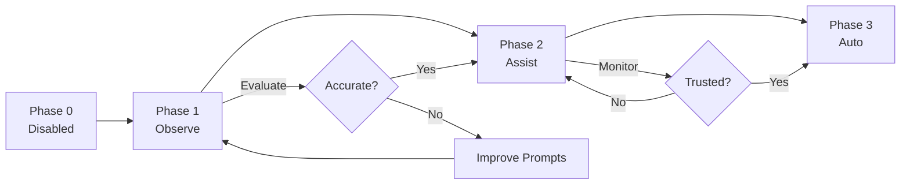

# Tutorial 6: AI Agent Configuration

!!! tip "Learning Objectives"
    - Understand the 4-phase AI rollout
    - Configure BAML agent safely
    - Set up API keys and rate limiting
    - Interpret AI suggestions
    - Implement gradual adoption strategy

## Prerequisites

- API key for Claude 3.5 or GPT-4
- Completed [Tutorial 1: First Analysis](01-first-analysis.md)
- Understanding of LLM capabilities and limitations

## 4-Phase Rollout Strategy

RepoQ implements a **gradual AI adoption** to ensure safety and trust:

| Phase | Mode | Behavior | Use Case |
|-------|------|----------|----------|
| **0** | Disabled | No AI, pure static analysis | Production CI/CD, deterministic builds |
| **1** | Observe | AI suggestions logged, not shown | Pilot testing, data collection |
| **2** | Assist | AI suggestions shown, user decides | Daily development, code review |
| **3** | Auto | High-confidence suggestions auto-applied | Trusted workflows, refactoring |
| **4** | Autopilot | Full autonomy (FUTURE, not implemented) | Research only |

## Phase 0: Disabled (Default)

By default, AI is completely disabled:

```yaml
# quality_policy.yaml
ai_agent:
  phase: "disabled"
```

```bash
repoq analyze .
# Pure static analysis, no LLM calls
```

**When to use:**
- CI/CD pipelines requiring deterministic results
- Compliance-sensitive environments
- No API keys available

## Phase 1: Observe

AI suggestions are generated but **not shown** to users. Used for pilot testing:

### Configuration

```yaml
# quality_policy.yaml
ai_agent:
  phase: "observe"
  config:
    model: "claude-3-5-sonnet-20241022"
    log_file: "ai_suggestions.jsonl"
    temperature: 0.2
```

### Run Analysis

```bash
export ANTHROPIC_API_KEY="sk-ant-..."
repoq analyze . --config quality_policy.yaml
```

**What happens:**
1. Analysis runs normally
2. AI suggestions generated silently
3. Logged to `ai_suggestions.jsonl`
4. **Not shown to user**
5. No impact on output

### Review Logged Suggestions

```bash
# View suggestions
cat ai_suggestions.jsonl | jq .

# Count by confidence
cat ai_suggestions.jsonl \
  | jq '.confidence' \
  | sort | uniq -c
```

**Example log entry:**
```json
{
  "timestamp": "2024-10-22T14:30:15Z",
  "phase": "observe",
  "file_path": "src/auth.py",
  "line_number": 42,
  "category": "Complexity Reduction",
  "title": "Reduce cyclomatic complexity",
  "description": "Function has complexity 42, threshold is 15",
  "suggested_fix": "Extract validation logic into separate function",
  "confidence": 0.85
}
```

### Analyze Pilot Data

```python
# analyze_pilot.py

import json
from collections import Counter

# Load logs
suggestions = []
with open("ai_suggestions.jsonl") as f:
    for line in f:
        suggestions.append(json.loads(line))

# Statistics
print(f"Total suggestions: {len(suggestions)}")

# By confidence
high_conf = [s for s in suggestions if s['confidence'] >= 0.9]
medium_conf = [s for s in suggestions if 0.7 <= s['confidence'] < 0.9]
low_conf = [s for s in suggestions if s['confidence'] < 0.7]

print(f"High confidence (>=0.9): {len(high_conf)}")
print(f"Medium confidence (0.7-0.9): {len(medium_conf)}")
print(f"Low confidence (<0.7): {len(low_conf)}")

# By category
categories = Counter(s['category'] for s in suggestions)
print("\nTop categories:")
for category, count in categories.most_common(5):
    print(f"  {category}: {count}")

# False positive rate (manual review needed)
# Review sample and mark as correct/incorrect
sample = suggestions[:10]
for s in sample:
    print(f"\n{s['file_path']}:{s['line_number']}")
    print(f"  {s['title']}")
    print(f"  Confidence: {s['confidence']}")
    response = input("  Correct? (y/n): ")
    s['review'] = response == 'y'

# Calculate accuracy
reviewed = [s for s in suggestions if 'review' in s]
accuracy = sum(s['review'] for s in reviewed) / len(reviewed)
print(f"\nAccuracy: {accuracy:.1%}")
```

**Decision criteria for Phase 2:**
- Accuracy > 80%
- False positive rate < 10%
- Suggestions actionable and relevant

## Phase 2: Assist

AI suggestions **shown to users** for manual review:

### Configuration

```yaml
# quality_policy.yaml
ai_agent:
  phase: "assist"
  config:
    model: "claude-3-5-sonnet-20241022"
    temperature: 0.2
    min_confidence: 0.7  # Show only confident suggestions
    show_low_confidence: false
    max_suggestions: 10  # Limit to avoid overwhelming
```

### Run Analysis

```bash
export ANTHROPIC_API_KEY="sk-ant-..."
repoq analyze . --config quality_policy.yaml
```

### Output Example

**Terminal output:**
```
Analysis complete in 12.5s (includes AI suggestions)

Quality Score: 7.5/10 ✓ PASS

━━━━━━━━━━━━━━━━━━━━━━━━━━━━━━━━━━━━━━━━━━━━━━━━━━
🤖 AI Suggestions (3)
━━━━━━━━━━━━━━━━━━━━━━━━━━━━━━━━━━━━━━━━━━━━━━━━━━

HIGH PRIORITY (confidence: 0.92)
📁 src/auth.py:42

  Issue: Cyclomatic complexity of 18 exceeds threshold (15)
  
  Suggestion: Extract token validation into separate function
  
  Proposed refactoring:
  
  def validate_token(token):
      """Validate authentication token."""
      if not token:
          raise AuthError("Missing token")
      
      if not is_valid_format(token):
          raise AuthError("Invalid token format")
      
      return decode_token(token)
  
  def authenticate_user(username, password, token):
      """Authenticate user with credentials."""
      user = validate_credentials(username, password)
      token_data = validate_token(token)
      return create_session(user, token_data)

━━━━━━━━━━━━━━━━━━━━━━━━━━━━━━━━━━━━━━━━━━━━━━━━━━

MEDIUM PRIORITY (confidence: 0.78)
📁 src/utils.py:15

  Issue: Bare except clause catches all exceptions
  
  Suggestion: Catch specific exception types
  
  Current:
    try:
        result = risky_operation()
    except:  # Too broad
        return None
  
  Recommended:
    try:
        result = risky_operation()
    except (ValueError, TypeError) as e:
        logger.error(f"Operation failed: {e}")
        return None

━━━━━━━━━━━━━━━━━━━━━━━━━━━━━━━━━━━━━━━━━━━━━━━━━━

View full report: repoq_output/analysis.md
```

**Markdown report (`analysis.md`):**
```markdown
## AI Suggestions 🤖

### High Priority

**src/auth.py:42** (confidence: 0.92)
- **Category:** Complexity Reduction
- **Issue:** Function `authenticate_user` has cyclomatic complexity of 18
- **Suggestion:** Extract token validation into separate function
- **Fix:** [see proposed code above]

### Medium Priority

**src/utils.py:15** (confidence: 0.78)
- **Category:** Error Handling
- **Issue:** Bare except clause catches all exceptions
- **Suggestion:** Catch specific exception types
```

### Apply Suggestions Manually

```bash
# User decides: Accept suggestion 1, reject suggestion 2
# Apply changes manually in editor

# Re-analyze to verify improvement
repoq analyze . --config quality_policy.yaml

# Output:
# Quality Score: 7.8/10 (Δ +0.3) ✓ IMPROVED
```

## Phase 3: Auto

High-confidence suggestions (>0.9) are **automatically applied** with user confirmation:

### Configuration

```yaml
# quality_policy.yaml
ai_agent:
  phase: "auto"
  config:
    model: "claude-3-5-sonnet-20241022"
    temperature: 0.2
    min_confidence: 0.7
    auto_apply_threshold: 0.9  # Only auto-apply if >= 0.9
    require_confirmation: true  # User must confirm
    create_backup: true  # Backup before changes
```

### Run Analysis

```bash
export ANTHROPIC_API_KEY="sk-ant-..."
repoq analyze . --config quality_policy.yaml
```

### Interactive Workflow

**Terminal output:**
```
Analysis complete in 12.5s

━━━━━━━━━━━━━━━━━━━━━━━━━━━━━━━━━━━━━━━━━━━━━━━━━━
🤖 AI Agent (Phase 3: Auto) - High-Confidence Suggestions
━━━━━━━━━━━━━━━━━━━━━━━━━━━━━━━━━━━━━━━━━━━━━━━━━━

Found 3 high-confidence suggestions (>= 0.9):

1. src/auth.py:42 - Reduce complexity (confidence: 0.95)
2. src/utils.py:15 - Improve error handling (confidence: 0.92)
3. src/models.py:88 - Add type hints (confidence: 0.91)

Apply all? [y/N/preview] 
```

**User types: `p` (preview)**

```
━━━━━━━━━━━━━━━━━━━━━━━━━━━━━━━━━━━━━━━━━━━━━━━━━━
Diff Preview
━━━━━━━━━━━━━━━━━━━━━━━━━━━━━━━━━━━━━━━━━━━━━━━━━━

src/auth.py
@@ -40,15 +40,20 @@
 def authenticate_user(username, password, token):
-    if username and password:
-        user = db.get_user(username)
-        if user and verify_password(password, user.password_hash):
-            if token:
-                if validate_token(token):
-                    return user
-            return user
-    return None
+    """Authenticate user with credentials and token."""
+    if not (username and password):
+        raise AuthError("Missing credentials")
+    
+    user = db.get_user(username)
+    if not user or not verify_password(password, user.password_hash):
+        raise AuthError("Invalid credentials")
+    
+    if token and not validate_token(token):
+        raise AuthError("Invalid token")
+    
+    return user

src/utils.py
@@ -13,5 +13,7 @@
 def parse_config(path):
     try:
         return json.load(open(path))
-    except:
+    except (FileNotFoundError, json.JSONDecodeError) as e:
+        logger.error(f"Failed to parse config {path}: {e}")
         return {}

Apply? [y/N] 
```

**User types: `y` (yes)**

```
✓ Created backup: .repoq_backup/2024-10-22_143015/
✓ Applied 3 suggestions

Changes applied to:
  - src/auth.py
  - src/utils.py
  - src/models.py

Re-running analysis to verify...

Quality Score: 7.8/10 (Δ +0.3) ✓ IMPROVED
```

### Rollback if Needed

```bash
# Restore from backup
cp .repoq_backup/2024-10-22_143015/src/auth.py src/auth.py
cp .repoq_backup/2024-10-22_143015/src/utils.py src/utils.py
cp .repoq_backup/2024-10-22_143015/src/models.py src/models.py
```

## API Configuration

### Anthropic Claude

```yaml
ai_agent:
  config:
    provider: "anthropic"
    model: "claude-3-5-sonnet-20241022"
    api_key: "${ANTHROPIC_API_KEY}"  # Use env var
    max_tokens: 4096
    temperature: 0.2
```

```bash
export ANTHROPIC_API_KEY="sk-ant-api03-..."
```

### OpenAI GPT-4

```yaml
ai_agent:
  config:
    provider: "openai"
    model: "gpt-4-turbo-preview"
    api_key: "${OPENAI_API_KEY}"
    max_tokens: 4096
    temperature: 0.2
```

```bash
export OPENAI_API_KEY="sk-..."
```

### Rate Limiting

```yaml
ai_agent:
  config:
    rate_limit:
      requests_per_minute: 10
      tokens_per_minute: 50000
    timeout_seconds: 30
```

### Cost Control

```yaml
ai_agent:
  config:
    max_cost_per_analysis: 0.10  # USD
    warn_on_cost: 0.05
```

## Security & Privacy

### PII Redaction

```yaml
ai_agent:
  config:
    redact_pii: true
    redact_patterns:
      - email: '\b[\w.-]+@[\w.-]+\.\w+\b'
      - api_key: '\b(sk|pk)_[a-zA-Z0-9]{20,}\b'
      - ip_address: '\b\d{1,3}\.\d{1,3}\.\d{1,3}\.\d{1,3}\b'
```

### Code Sanitization

```yaml
ai_agent:
  config:
    sanitize_code: true
    exclude_from_context:
      - "**/*_secret.py"
      - "**/*_private.py"
      - "**/credentials/**"
```

### Audit Logging

```yaml
ai_agent:
  config:
    audit_log: "ai_audit.log"
    log_requests: true
    log_responses: true
```

**Audit log format:**
```json
{
  "timestamp": "2024-10-22T14:30:15Z",
  "phase": "auto",
  "model": "claude-3-5-sonnet-20241022",
  "tokens_used": 1250,
  "cost_usd": 0.0037,
  "suggestions_generated": 3,
  "suggestions_applied": 2,
  "files_modified": ["src/auth.py", "src/utils.py"]
}
```

## Stratification Safety

The AI agent respects **meta-level boundaries** to prevent self-modification:

### Protected Paths

```python
# repoq/core/stratification_guard.py

PROTECTED_PATHS = {
    "repoq/ai/baml_agent.py",           # AI agent itself
    "repoq/core/stratification_guard.py",  # Safety guard
    "repoq/ontologies/",                # Ontology definitions
}
```

**What happens if AI tries to modify itself:**
```bash
repoq analyze . --config quality_policy.yaml

# Output:
🤖 AI Suggestions (2)

❌ BLOCKED (stratification violation)
📁 repoq/ai/baml_agent.py:150

  AI attempted to suggest modification to itself.
  This is blocked by StratificationGuard to prevent
  Russell's paradox and self-reference loops.
  
  See docs: architecture/stratification-guard.md
```

## Performance Considerations

### Latency

| Phase | LLM Calls | Added Latency |
|-------|-----------|---------------|
| 0 (Disabled) | 0 | 0ms |
| 1 (Observe) | 1 | +2-5s |
| 2 (Assist) | 1 | +2-5s |
| 3 (Auto) | 1 + user prompt | +2-5s + confirmation time |

### Cost Estimation

**Claude 3.5 Sonnet:**
- Input: $3.00 per million tokens
- Output: $15.00 per million tokens

**Typical analysis:**
- Input: 500-2000 tokens (code context)
- Output: 200-800 tokens (suggestions)
- **Cost per analysis: $0.001-0.005**

**Monthly cost for 100 analyses/day:**
- Daily: 100 × $0.003 = $0.30
- Monthly: $0.30 × 30 = **$9.00**

### Optimization Tips

```yaml
ai_agent:
  config:
    # Reduce context size
    max_files_in_context: 5
    max_lines_per_file: 50
    
    # Cache similar analyses
    enable_cache: true
    cache_ttl: 3600  # 1 hour
    
    # Rate limit to control costs
    max_analyses_per_hour: 10
```

## Troubleshooting

### Issue: "API key not found"

**Solution:**
```bash
# Check environment variable
echo $ANTHROPIC_API_KEY

# Set if missing
export ANTHROPIC_API_KEY="sk-ant-..."

# Or use .env file
echo "ANTHROPIC_API_KEY=sk-ant-..." >> .env
repoq analyze . --env-file .env
```

### Issue: "Rate limit exceeded"

**Solution:**
```yaml
ai_agent:
  config:
    rate_limit:
      requests_per_minute: 5  # Reduce from 10
      retry_after_seconds: 60
```

### Issue: "Low confidence suggestions"

**Solution:**
```yaml
ai_agent:
  config:
    temperature: 0.1  # More deterministic (was 0.2)
    min_confidence: 0.8  # Raise threshold (was 0.7)
```

### Issue: "Suggestions not relevant"

**Solution:** Improve context with better filters
```yaml
ai_agent:
  config:
    context_filters:
      include: ["src/**/*.py"]
      exclude: ["tests/**", "**/migrations/**"]
    
    focus_areas:
      - "complexity_reduction"
      - "error_handling"
      # Remove: "naming_conventions" (if not relevant)
```

## Best Practices

### 1. Gradual Rollout



### 2. Start with Low-Risk Files

```yaml
ai_agent:
  config:
    context_filters:
      include:
        - "src/utils/**"  # Utilities (low risk)
      exclude:
        - "src/core/**"   # Critical code
        - "src/auth/**"   # Security-sensitive
```

### 3. Review Auto-Applied Changes

```bash
# After auto-apply
git diff

# Run tests
pytest

# Commit if good
git add -A
git commit -m "Apply AI suggestions from RepoQ"
```

### 4. Monitor Accuracy

```python
# Track suggestion accuracy
accuracy_log = []

for suggestion in applied_suggestions:
    # Run tests
    test_result = run_tests()
    
    # Check if suggestion helped
    was_helpful = test_result.passed and quality_improved()
    
    accuracy_log.append({
        'suggestion_id': suggestion.id,
        'confidence': suggestion.confidence,
        'helpful': was_helpful,
    })

# Calculate accuracy
accuracy = sum(s['helpful'] for s in accuracy_log) / len(accuracy_log)
print(f"AI Accuracy: {accuracy:.1%}")
```

## Next Steps

- **[Architecture: BAML Agent](../architecture/baml-agent.md)** - Technical deep dive
- **[Architecture: Stratification Guard](../architecture/stratification-guard.md)** - Safety mechanisms
- **[User Guide: Configuration](../user-guide/configuration.md)** - Full config reference

## Summary

You learned how to:

- ✅ Understand the 4-phase AI rollout strategy
- ✅ Configure BAML agent for different phases
- ✅ Set up API keys and rate limiting
- ✅ Apply AI suggestions safely
- ✅ Monitor accuracy and costs
- ✅ Implement stratification safety

**Key Takeaways:**

1. **Gradual adoption**: Phase 0 → 1 → 2 → 3 over weeks/months
2. **Trust but verify**: Always review auto-applied changes
3. **Cost control**: Monitor token usage and set limits
4. **Security**: Redact PII, audit logging
5. **Safety**: Stratification prevents self-modification

---

!!! success "AI-Assisted Quality"
    You now have AI-powered suggestions integrated safely! Start with Phase 1 (observe), evaluate accuracy, then gradually enable Phase 2 (assist) and Phase 3 (auto).
