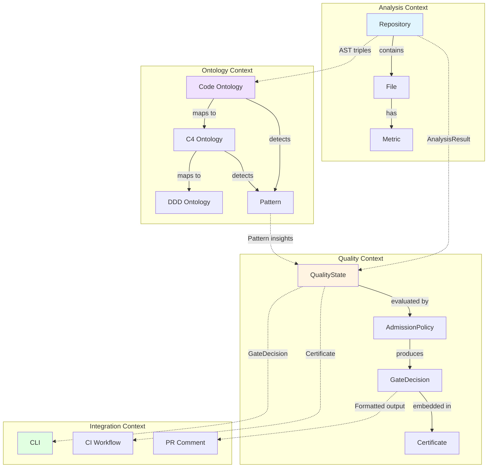
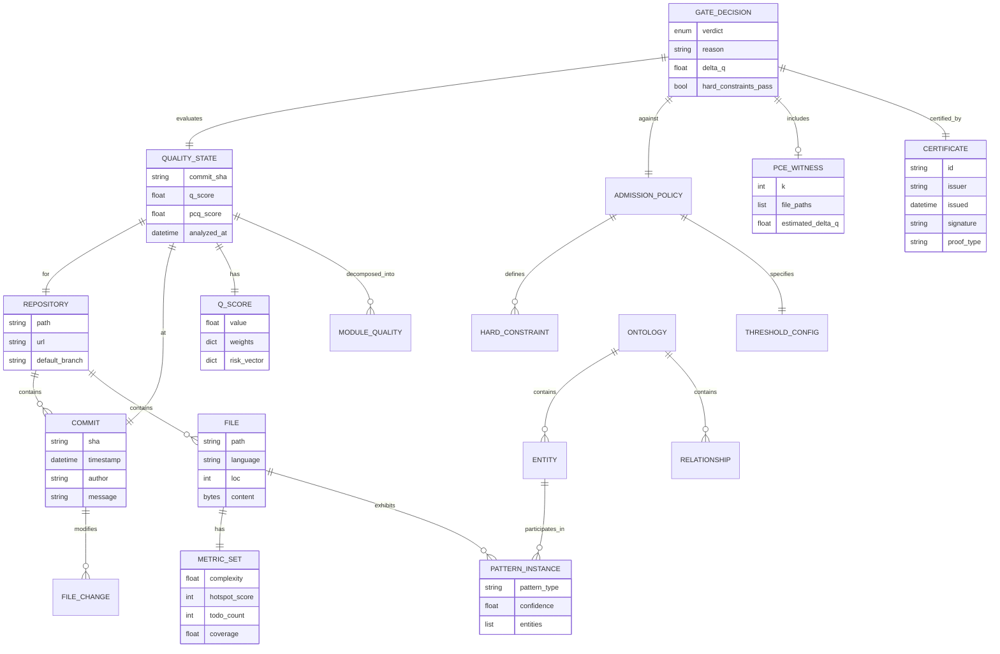
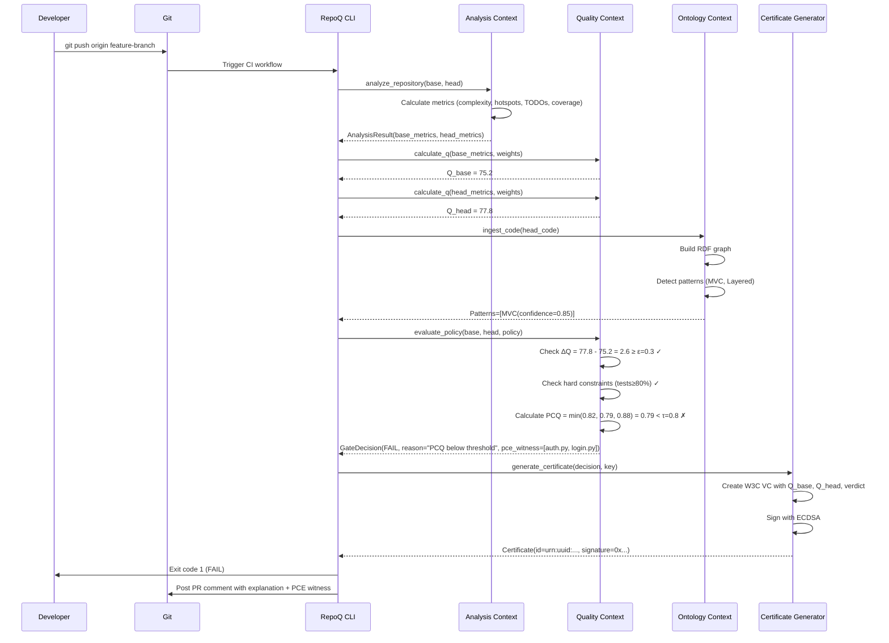
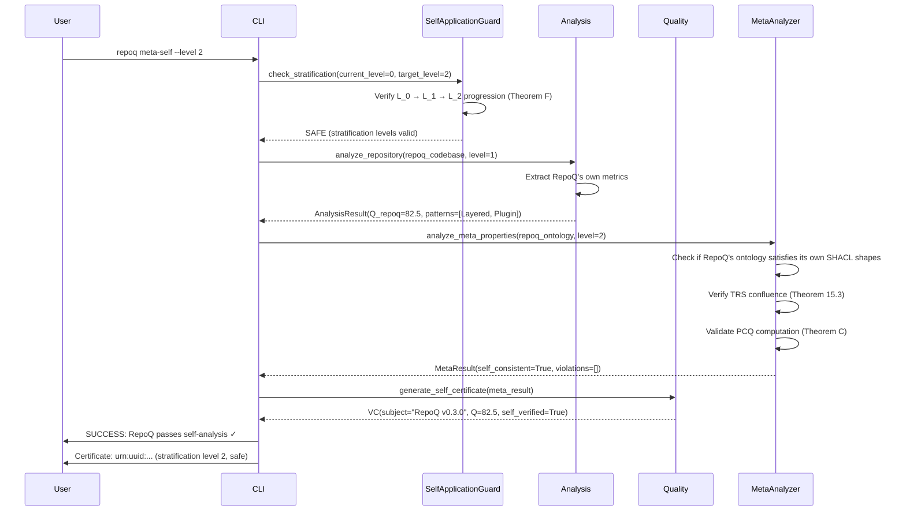

# VDAD Phase 1: Domain Analysis & Context Modeling

**Status**: ✅ ACTIVE  
**VDAD Step**: Step 1 (Domain Analysis)  
**Created**: 2025-10-21  
**Last Updated**: 2025-10-21

---

## Executive Summary

This document captures RepoQ's domain model, bounded contexts, and ubiquitous language as part of VDAD Phase 1 (Domain Immersion). It provides the foundational understanding needed for value elicitation (Phase 2) and requirements engineering (Phase 3).

**Key Insights**:
- **Core Domain**: Quality metric calculation with **formal guarantees** (6 theorems: correctness, monotonicity, safety, constructiveness, stability, canonicity)
- **Unique Differentiator**: First system with **formally proven safe self-understanding** (stratified self-application, Theorem F)
- **Technical Foundation**: 77 ready-to-integrate artifacts in `tmp/` (TRS engines, ontologies, ZAG PCQ/PCE, Any2Math normalization)
- **Complexity**: 4 bounded contexts, 9 major components, 3 ontology layers (Code, C4, DDD)

---

## 1. Domain Overview

### 1.1 Problem Space

**Problem Statement**: Software quality is notoriously difficult to measure objectively and improve systematically. Existing approaches suffer from:
- **Subjectivity**: Code review opinions vary wildly
- **Gaming**: Teams optimize metrics without improving real quality (Goodhart's Law)
- **Regression**: Refactorings unintentionally degrade quality (no monotonicity guarantee)
- **Shallow Analysis**: Syntax-only metrics miss architectural/semantic issues
- **Lack of Trust**: No cryptographic proof of quality claims

**Market Context**:
- Static analysis tools (SonarQube, CodeClimate): metrics without formal guarantees
- CI/CD quality gates: ad-hoc thresholds, easily gamed
- Code review: human bottleneck, inconsistent standards
- Research gap: no production system combines TRS verification + proof-carrying certificates + safe self-analysis

### 1.2 Solution Space

**RepoQ's Approach**:
1. **Formal Q-metric**: Aggregate of complexity, hotspots, TODOs, test coverage with proven monotonicity (Theorem B)
2. **Hard Constraints**: Tests ≥80%, TODO ≤100, hotspots ≤20 (not negotiable)
3. **Anti-Gaming**: PCQ min-aggregator (ZAG framework) detects metric compensation (Theorem C)
4. **Proof-Carrying**: Verifiable Credentials (W3C VC) with cryptographic signatures
5. **Deterministic Analysis**: Any2Math Lean normalization eliminates syntactic noise (Theorem 15.3)
6. **Ontological Intelligence**: Code/C4/DDD pattern detection via semantic inference
7. **Safe Self-Application**: Stratified levels (0-2) prevent paradoxes (Theorem F)

**Unique Value Proposition**: "Monotonic quality improvement with cryptographic proof and formal safety guarantees."

---

## 2. Bounded Contexts

RepoQ follows Domain-Driven Design (DDD) with 4 bounded contexts:

### 2.1 Analysis Context

**Responsibility**: Extract metrics and facts from source code.

**Core Entities**:
- `Repository` (aggregate root): Git repo with commits, branches
- `Commit`: SHA, author, timestamp, diff
- `File`: Path, content, language, LOC
- `Metric`: Complexity, hotspots, TODOs, test coverage (value objects)

**Key Operations**:
- `analyze_repository(repo_path) -> AnalysisResult`
- `calculate_complexity(file) -> ComplexityMetric`
- `detect_hotspots(history) -> HotspotList`
- `count_todos(file) -> int`
- `measure_coverage(test_dir) -> CoverageMetric`

**Technology**:
- Python AST parsing (built-in `ast` module)
- Radon (complexity), git log parsing (hotspots)
- Regex scanning (TODOs)
- Coverage.py integration (test coverage)

**Bounded Context Integration**:
- **Upstream**: None (entry point)
- **Downstream**: Publishes `AnalysisResult` to Quality Context

---

### 2.2 Quality Context

**Responsibility**: Aggregate metrics into Q-score, evaluate admission policies, issue gate decisions.

**Core Entities**:
- `QualityState` (aggregate root): Repository state at specific commit with Q-score
- `AdmissionPolicy`: Rules defining when ΔQ is acceptable (ε-threshold, PCQ τ-threshold, hard constraints)
- `GateDecision`: Pass/Fail with reasoning and PCE witness (if available)
- `Certificate` (value object): W3C Verifiable Credential with proof

**Key Operations**:
- `calculate_q(metrics, weights) -> float` — Q = 100 - Σw_i·x_i
- `evaluate_policy(base_state, head_state, policy) -> GateDecision`
- `generate_certificate(decision, signature_key) -> VC`
- `compute_pcq(state, fairness_cover) -> float` — min over modules/users
- `find_pce_witness(state, k) -> RepairWitness` — k-file subset for improvement

**Formulas** (from `formal-foundations-complete.md`):
```
Q(S) = Q_max - Σ_{i=1}^d w_i · x_i(S) - Φ(x(S))

Admission: A(S_base, S_head) ≡ (H) ∧ (ΔQ ≥ ε) ∧ (PCQ ≥ τ)
  where:
    H = hard constraints (tests ≥80%, TODO ≤100, hotspots ≤20)
    ΔQ = Q(S_head) - Q(S_base)
    ε ∈ [0.2, 0.5] — noise tolerance
    τ ∈ [0.75, 0.9] — PCQ threshold

PCQ(S) = min_{i ∈ U} u_i(S)  [ZAG framework, Theorem C]
```

**Technology**:
- Python calculation engine
- YAML config parser (`.github/quality-policy.yml`)
- VC generation library (custom or `vc-data-model` implementation)
- ECDSA signing (cryptography.io)

**Bounded Context Integration**:
- **Upstream**: Consumes `AnalysisResult` from Analysis Context
- **Downstream**: Publishes `GateDecision` + `Certificate` to Integration Context

---

### 2.3 Ontology Context

**Responsibility**: Semantic understanding of code/architecture via RDF ontologies and SPARQL inference.

**Core Entities**:
- `Ontology` (aggregate root): RDF graph (Code, C4, or DDD ontology)
- `Entity`: Class, Function, Module (as RDF individuals)
- `Relationship`: calls, imports, inherits, dependsOn (RDF properties)
- `Pattern`: MVC, Layered, Plugin, Repository (detected architectural patterns)
- `InferenceRule`: SPARQL CONSTRUCT query deriving new triples

**Key Operations**:
- `load_ontology(ttl_path) -> Ontology`
- `ingest_code(analysis_result) -> RDF_triples` — map AST → Code ontology
- `detect_patterns(ontology) -> List[Pattern]` — SPARQL queries for MVC, Layered, etc.
- `run_inference(rules, ontology) -> new_triples` — semantic enrichment
- `query(sparql) -> ResultSet` — SPARQL SELECT/CONSTRUCT

**Three-Ontology Architecture** (from Section 15 of `formal-foundations-complete.md`):
1. **O_Code**: Low-level (functions, classes, calls, imports)
2. **O_C4**: Mid-level (components, containers, dependencies) — Simon Brown's C4 model
3. **O_DDD**: High-level (bounded contexts, aggregates, entities, value objects)

**Cross-Ontology Mapping**:
```sparql
CONSTRUCT {
  ?component c4:contains ?function .
}
WHERE {
  ?function code:belongsTo ?module .
  ?module code:path ?path .
  ?component c4:name ?name .
  FILTER(STRSTARTS(?path, ?name))
}
```

**Technology**:
- RDFLib (Python RDF library)
- Oxigraph (embedded triple store, optional for large repos)
- SHACL validation (pySHACL)
- Custom SPARQL query engine

**Bounded Context Integration**:
- **Upstream**: Consumes `AnalysisResult` from Analysis Context
- **Downstream**: Publishes `Pattern` insights to Quality Context (influences Q-score via architectural debt metric)

---

### 2.4 Integration Context

**Responsibility**: Interface with external systems (Git, CI/CD, CLI, dashboards).

**Core Entities**:
- `CLICommand`: `gate`, `verify`, `meta-self`, `any2math-normalize`, `export`
- `CIWorkflow`: GitHub Actions, GitLab CI integration
- `Dashboard`: Web UI for quality trends (future)
- `NotificationChannel`: PR comments, Slack, email

**Key Operations**:
- `execute_cli(args) -> ExitCode`
- `run_ci_workflow(pr_context) -> CIResult`
- `post_pr_comment(pr_id, gate_decision)`
- `export_rdf(ontology, format) -> bytes`

**Technology**:
- Click (Python CLI framework)
- GitHub API / GitLab API
- Jinja2 templates (PR comment formatting)
- RDF serialization (Turtle, JSON-LD)

**Bounded Context Integration**:
- **Upstream**: Consumes `GateDecision`, `Certificate`, `Pattern` from Quality/Ontology Contexts
- **Downstream**: None (exit point to external world)

---

## 3. Context Map



**Relationship Types**:
- **Customer-Supplier**: Analysis → Quality (Quality depends on Analysis output)
- **Conformist**: Ontology → Analysis (Ontology conforms to Analysis data format)
- **Shared Kernel**: Quality ↔ Ontology (both share `Pattern` and `QualityState` concepts)
- **Published Language**: Integration → External (uses standard formats: VC, JSON-LD, Turtle)

---

## 4. Ubiquitous Language

### Core Terms

| Term | Definition | Context | Example |
|------|------------|---------|---------|
| **Q-metric** | Aggregate quality score: Q = 100 - Σw_i·x_i | Quality | Q = 72.5 for commit abc123 |
| **Admission Policy** | Rules defining acceptable ΔQ (ε, τ, hard constraints) | Quality | ε=0.3, τ=0.8, tests≥80% |
| **Gate Decision** | Pass/Fail verdict on PR/commit | Quality | FAIL: ΔQ=-2.1 < ε=0.3 |
| **VC (Verifiable Credential)** | W3C standard for cryptographically signed quality certificate | Quality | VC with ECDSA signature over Q=85 claim |
| **PCQ (Piecewise Collective Quality)** | Min aggregator detecting gaming: PCQ = min u_i | Quality | PCQ=0.72 (module "auth" is bottleneck) |
| **PCE (Piecewise Constructive Evidence)** | k-file subset sufficient for improvement | Quality | PCE witness: {auth.py, login.py} (k=2) |
| **ε (epsilon)** | Noise tolerance for ΔQ | Quality | ε=0.3 means accept ΔQ ∈ [-0.3, ∞) |
| **τ (tau)** | PCQ threshold (min acceptable piecewise quality) | Quality | τ=0.8 means all modules ≥80% |
| **Hard Constraint** | Non-negotiable rule (tests, TODOs, hotspots) | Quality | tests≥80% is hard constraint |
| **TRS (Term Rewriting System)** | Formal system for syntactic normalization | Ontology | Any2Math uses TRS for deterministic AST canonicalization |
| **Stratification** | Levels 0-2 for safe self-analysis | Quality | Level 0: external code, Level 1: RepoQ, Level 2: meta-analysis |
| **Code Ontology** | Low-level RDF graph (functions, classes) | Ontology | `:func_login rdf:type code:Function` |
| **C4 Ontology** | Mid-level architecture (components, containers) | Ontology | `:auth_service rdf:type c4:Component` |
| **DDD Ontology** | High-level design (bounded contexts, aggregates) | Ontology | `:QualityContext rdf:type ddd:BoundedContext` |
| **Pattern** | Detected architectural style (MVC, Layered, Plugin) | Ontology | Detected: MVC in `app/` directory |
| **SPARQL** | RDF query language (SELECT/CONSTRUCT) | Ontology | `SELECT ?func WHERE { ?func rdf:type code:Function }` |
| **SHACL** | RDF constraint language for validation | Ontology | Shape requires `code:Function` to have `code:name` |
| **Hotspot** | File with high churn (frequent changes, high risk) | Analysis | `auth.py`: 87 commits in 6 months |
| **Complexity** | Cyclomatic complexity (McCabe metric) | Analysis | `process_payment()`: complexity=15 |
| **TODO** | Code comment indicating incomplete work | Analysis | `# TODO: Add input validation` (count=42) |
| **Coverage** | Test coverage percentage | Analysis | 78% line coverage (below 80% threshold) |

### Formal Symbols (from `formal-foundations-complete.md`)

| Symbol | Meaning | Formula/Rule |
|--------|---------|--------------|
| **S** | System state (repository at commit) | S = (codebase, metrics, history) |
| **x(S)** | Risk vector x ∈ [0,1]^d | x = (complexity, hotspots, todos, ...) |
| **Q(S)** | Quality score | Q = Q_max - Σw_i·x_i - Φ(x) |
| **Φ(x)** | Nonlinear penalty (optional) | Φ = λ·max(0, x_complexity - 10)^2 |
| **N: A → A** | TRS normalization | N(ast) = canonical AST (confluence + termination) |
| **A(S_t, S)** | Admission predicate | (H) ∧ (ΔQ ≥ ε) ∧ (PCQ ≥ τ) |
| **u_i(S)** | Per-module quality | u_i = local Q score for module i |
| **W ⊆ U** | PCE witness | Subset of k files for improvement |
| **L_0, L_1, L_2** | Stratification levels | L_0: external, L_1: RepoQ code, L_2: meta-analysis |

---

## 5. Domain Entities & Relationships

### 5.1 Entity Diagram



### 5.2 Key Relationships

1. **Repository ↔ Commit**: 1-to-many (repository has commit history)
2. **Commit ↔ QualityState**: 1-to-1 (each commit analyzed once per configuration)
3. **QualityState ↔ GateDecision**: many-to-many (multiple policies can evaluate same state)
4. **GateDecision ↔ Certificate**: 1-to-1 (each decision gets one VC)
5. **File ↔ Pattern**: many-to-many (file participates in multiple patterns, pattern spans multiple files)
6. **Ontology ↔ Pattern**: 1-to-many (ontology enables pattern detection)

---

## 6. Domain Workflows

### 6.1 Quality Gate Workflow



### 6.2 Self-Analysis Workflow (Stratified)



---

## 7. Technical Debt & Future Extensions

### 7.1 Current Limitations

1. **Ontology Context**: Partially implemented
   - ✅ Code ontology schema exists (`tmp/repoq-meta-loop-addons/ontologies/code.ttl`)
   - ⚠️ Pattern detection logic incomplete (5-7 patterns planned, 0 implemented)
   - ⚠️ SPARQL inference rules exist but not integrated into gate workflow

2. **ZAG PCQ Integration**: Artifacts ready, not wired into gate
   - ✅ PCQ/PCE logic in `tmp/zag_repoq-finished/integrations/zag.py`
   - ⚠️ Not called by `repoq/gate.py` (currently uses simple ΔQ threshold)

3. **Any2Math Normalization**: Design complete, implementation pending
   - ✅ Adapter/Bridge/Scheduler in `tmp/repoq-any2math-integration/`
   - ⚠️ Lean runtime integration not tested (subprocess isolation)
   - ⚠️ No fallback mode if Lean unavailable

4. **Self-Analysis**: Conceptual framework solid, execution minimal
   - ✅ Stratification theory proven (Theorem F)
   - ✅ SelfApplicationGuard exists (`tmp/repoq-meta-loop-addons/trs/engine.py`)
   - ⚠️ `repoq meta-self` CLI command not implemented

5. **AI Agent (BAML)**: Design phase only
   - ✅ VDAD Phase 4 spec complete (4 BAML functions)
   - ⚠️ No code written yet (planned for Phase 5)

### 7.2 Roadmap Alignment

| Feature | Bounded Context | Priority | Status |
|---------|----------------|----------|--------|
| Basic Q gate | Quality | P0 | ✅ DONE (Week 1) |
| Hard constraints | Quality | P0 | ✅ DONE |
| VC certificates | Quality | P0 | ✅ DONE |
| PCQ min-aggregator | Quality | P1 | 🔄 IN PROGRESS |
| PCE witness | Quality | P1 | 🔄 IN PROGRESS |
| Pattern detection | Ontology | P1 | ⏸️ BLOCKED (need ontology loader) |
| Any2Math normalization | Quality | P1 | ⏸️ BLOCKED (need Lean runtime) |
| Self-analysis (level 2) | Quality | P2 | ⏸️ BLOCKED (need stratification guard) |
| BAML AI agent | Integration | P2 | 🔮 PLANNED (VDAD Phase 5) |
| Dashboard UI | Integration | P3 | 🔮 PLANNED |

---

## 8. Domain Invariants

### 8.1 Formal Guarantees (from Theorems A-H, 15.1-15.3)

1. **Correctness (Theorem A)**: All metrics x_i(S) ∈ [0,1], Q(S) ∈ [0, Q_max]
2. **Monotonicity (Theorem B)**: If A(S_base, S_head) holds, then Q(S_head) > Q(S_base)
3. **PCQ/min Guarantee (Theorem C)**: Gaming detected via PCQ = min u_i < τ
4. **Anti-Compensation (Theorem D)**: Φ(x) penalty prevents offsetting high risk in one dimension with low risk in another
5. **Constructive Path (Theorem E)**: PCE witness W ⊆ U exists with |W| ≤ k
6. **Self-Application Safety (Theorem F)**: Stratification L_0 < L_1 < L_2 prevents paradoxes
7. **Confluence (Theorem 15.3)**: N(ast1) = N(ast2) if ast1 ≡ ast2 (syntactic equivalence) — deterministic normalization
8. **Conservative Extension (Theorem 15.1)**: Cross-ontology mappings preserve semantics (no new theorems about old domains)

### 8.2 Business Rules

1. **Admission Policy Transitivity**: If policy P passes S1→S2 and P passes S2→S3, then P passes S1→S3 (monotonicity chain)
2. **Hard Constraint Absoluteness**: No ε-tolerance for hard constraints (tests≥80% is binary: pass/fail)
3. **Certificate Immutability**: Once VC issued, cannot be revoked (only superseded by new analysis)
4. **Stratification Ordering**: L_i can analyze L_j only if i > j (strict ordering)
5. **Pattern Confidence Threshold**: Only patterns with confidence ≥0.7 influence Q-score

---

## 9. Integration with Formal Documentation

This domain model is grounded in:

- **formal-foundations-complete.md**: 15 sections, 14 theorems (mathematical foundation)
- **tmp-artifacts-inventory.md**: 77 files (implementation blueprints)
- **quality-loop-roadmap.md**: MVP/Production/Advanced phases (tactical execution)
- **VDAD roadmap**: Phase 1-5 (strategic value alignment)

**Traceability**:
- Every bounded context → ≥1 tmp/ artifact (e.g., Ontology Context → `tmp/repoq-meta-loop-addons/ontologies/`)
- Every ubiquitous term → ≥1 theorem or section in formal-foundations
- Every workflow → ≥1 CLI command or Python module in codebase

---

## 10. Success Criteria (VDAD Phase 1)

- ✅ Domain model complete: 4 bounded contexts documented
- ✅ Context Map created: Mermaid diagram with relationships
- ✅ Ubiquitous language: 25+ terms defined, aligned with formal docs
- ✅ Entity diagram: Core entities + relationships mapped
- ✅ Workflows: 2 sequence diagrams (gate, self-analysis)
- ✅ Integration: Cross-references to formal-foundations, tmp/ artifacts, roadmap
- ⏭️ **Next**: Stakeholder mapping (see `phase1-stakeholders.md`)

---

## References

1. Eric Evans (2003). *Domain-Driven Design: Tackling Complexity in the Heart of Software*. Addison-Wesley.
2. Vaughn Vernon (2013). *Implementing Domain-Driven Design*. Addison-Wesley.
3. Simon Brown (2020). *The C4 model for visualising software architecture*. [c4model.com](https://c4model.com)
4. RepoQ Project (2025). *Formal Foundations Complete*. `docs/development/formal-foundations-complete.md`
5. RepoQ Project (2025). *tmp/ Artifacts Inventory*. `docs/development/tmp-artifacts-inventory.md`

---

**Document Status**: ✅ COMPLETE  
**Review**: Pending (stakeholder validation in Phase 2)  
**Next Steps**: Create `phase1-stakeholders.md` with personas and value expectations.
