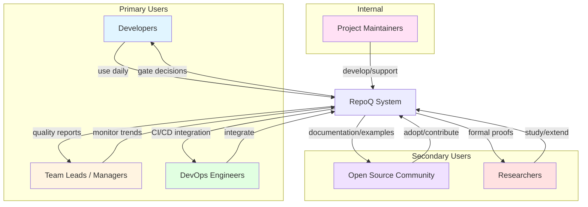

# VDAD Phase 1: Stakeholder Mapping & Value Expectations

**Status**: ✅ ACTIVE  
**VDAD Step**: Step 2 (Stakeholder Identification)  
**Created**: 2025-10-21  
**Last Updated**: 2025-10-21

---

## Executive Summary

This document identifies all stakeholder groups for RepoQ, creates personas for each group, and captures their initial value expectations. This foundation feeds into **Phase 2 (Value Elicitation)** where we'll formally build the Value Register.

**Key Findings**:
- **6 Stakeholder Groups**: Developers, Team Leads/Managers, DevOps Engineers, Open Source Community, Researchers, Project Maintainers
- **Primary Stakeholder**: Developers (direct users of quality gate)
- **Highest-Stakes Stakeholder**: Team Leads (accountable for team quality, risk of gaming metrics)
- **Most Underserved**: Researchers (few production systems with formal guarantees)

---

## 1. Stakeholder Identification

### 1.1 Stakeholder Map

### 1.2 Stakeholder Priority Matrix

| Group | Influence | Interest | Priority | Engagement Strategy |
|-------|-----------|----------|----------|---------------------|
| **Developers** | High | High | **Critical** | Co-design gate logic, usability testing, feedback loops |
| **Team Leads** | High | High | **Critical** | Validate metrics, review gaming protection, approve policies |
| **DevOps** | Medium | High | **High** | CI/CD integration workshops, performance benchmarks |
| **OSS Community** | Low | Medium | **Medium** | Clear docs, contribution guides, responsive issues |
| **Researchers** | Low | High | **Medium** | Publish papers, provide formal specs, invite collaboration |
| **Maintainers** | High | High | **Critical** | Architecture decisions, roadmap planning, code reviews |

---

## 2. Stakeholder Personas

### 2.1 Developers

#### Persona: Alex (Mid-Level Backend Developer)

**Demographics**:
- Role: Backend Developer (3 years experience)
- Team: 8-person product team
- Tech Stack: Python, FastAPI, PostgreSQL, Redis
- Daily Workflow: Feature branches → PR → Code review → Merge

**Goals**:
1. Ship features quickly without breaking quality
2. Get fast, actionable feedback on PRs (< 5 min CI time)
3. Understand *why* PR was blocked (not just "quality too low")
4. Avoid arbitrary gatekeeping ("My refactoring is good, why did the gate fail?")

**Pain Points**:
1. **Cryptic Error Messages**: SonarQube says "Code Smell: Cognitive Complexity 15" — what does that mean for *this* PR?
2. **False Positives**: Legitimate complexity (e.g., state machine logic) flagged as "bad"
3. **Gaming Temptation**: Teammates add trivial tests to hit 80% coverage without real validation
4. **Merge Conflicts**: PR blocked 2 days, now rebasing causes new metric failures

**Value Expectations**:
- **Transparency**: "Show me exactly which files/functions caused the failure"
- **Fairness**: "Don't penalize necessary complexity (with tests/docs)"
- **Speed**: "Gate runs in < 2 minutes for typical PR (10-50 files changed)"
- **Actionability**: "Tell me what to fix: 'Add 3 tests in auth.py to reach 80% coverage'"
- **Trust**: "If gate passes, I'm confident code is genuinely better"

**Interaction with RepoQ**:
- Triggers: `git push` → GitHub Actions runs `repoq gate --base main --head HEAD`
- Reads: PR comment with gate decision, ΔQ breakdown, PCE witness (if fail)
- Acts on: Fix suggested files, re-push, wait for re-run

**Quote**: *"I don't mind strict quality rules, but please tell me exactly what's wrong and how to fix it. And don't block me for good reasons (like refactoring complexity into smaller functions)."*

---

#### Persona: Jordan (Senior Frontend Developer)

**Demographics**:
- Role: Senior Frontend Developer (7 years experience)
- Team: 5-person UI team
- Tech Stack: TypeScript, React, Next.js, TailwindCSS
- Daily Workflow: Feature flags → incremental releases → A/B testing

**Goals**:
1. Maintain high code quality while moving fast (weekly releases)
2. Educate junior devs on best practices (quality gate as teaching tool)
3. Refactor legacy code incrementally (without triggering gate failures)
4. Ensure accessibility/performance standards (not just "no bugs")

**Pain Points**:
1. **Legacy Code Debt**: Refactoring old components triggers hotspot warnings (high churn)
2. **Metric Mismatch**: Frontend complexity differs from backend (cyclomatic complexity less meaningful for JSX)
3. **Flaky Tests**: Intermittent Cypress failures cause gate to block good PRs
4. **Team Inconsistency**: Some devs bypass gate with `--no-verify` git hooks

**Value Expectations**:
- **Context-Awareness**: "Understand that refactoring *increases* churn temporarily (it's good!)"
- **Customizability**: "Let me configure weights for frontend (lower complexity weight, higher test coverage weight)"
- **Education**: "Show juniors *why* their PR failed, not just 'Fix it'"
- **Incremental Improvement**: "Allow gradual refactoring (don't require 80% coverage on first PR touching legacy code)"
- **Team Accountability**: "Show dashboard: which devs/modules have lowest quality?"

**Interaction with RepoQ**:
- Triggers: Local `repoq gate --base origin/main --head .` before pushing
- Reads: CLI output with color-coded ΔQ, warnings, errors
- Acts on: Mentor juniors using gate output as teaching aid

**Quote**: *"Quality gates should be enablers, not blockers. Help my team learn, don't just reject their work. And give me flexibility for frontend-specific metrics."*

---

### 2.2 Team Leads / Managers

#### Persona: Morgan (Engineering Manager)

**Demographics**:
- Role: Engineering Manager (10 years experience, 2 years in management)
- Team: 15 developers (3 teams: backend, frontend, infra)
- Responsibility: Delivery speed + quality + team morale
- Metrics Tracked: Velocity, defect rate, cycle time, tech debt

**Goals**:
1. Maintain consistent quality across teams (no "cowboys")
2. Prevent gaming of metrics (e.g., trivial tests inflating coverage)
3. Identify high-risk areas (hotspots, architectural debt)
4. Justify quality investment to upper management (ROI of refactoring)
5. Balance speed vs quality (not too strict, not too lax)

**Pain Points**:
1. **Gaming Detection**: Developers add `assert True` tests to hit coverage targets
2. **Visibility Gap**: No centralized view of quality trends across teams
3. **False Sense of Security**: High metrics but still bugs in production
4. **Resistance to Quality Rules**: "Gate is too strict, slows us down"
5. **Lack of Evidence**: Can't prove quality improvements to stakeholders

**Value Expectations**:
- **Gaming Protection**: "Detect when coverage goes up but real test quality doesn't (PCQ min-aggregator)"
- **Trend Visualization**: "Show me quality over time: Are we improving or regressing?"
- **Fairness**: "Don't let one high-quality team compensate for another low-quality team (piecewise guarantees)"
- **Audit Trail**: "Cryptographic proof of quality for compliance (VC certificates)"
- **Actionable Insights**: "Which modules need refactoring? Which teams need training?"
- **ROI Evidence**: "Show defect rate correlation with Q-score (justify quality efforts)"

**Interaction with RepoQ**:
- Triggers: Weekly/monthly quality reports (planned dashboard)
- Reads: Aggregate metrics, PCQ bottlenecks, hotspot trends, VC certificate logs
- Acts on: Allocate refactoring time, adjust quality policy, training initiatives

**Quote**: *"I need to trust the metrics. If the gate says quality is high, I need confidence it's not gamed. And I need data to defend quality investment to executives."*

---

### 2.3 DevOps Engineers

#### Persona: Casey (DevOps Engineer)

**Demographics**:
- Role: DevOps Engineer (5 years experience)
- Team: 2-person platform team supporting 30 developers
- Tech Stack: GitHub Actions, GitLab CI, Kubernetes, Terraform, DataDog
- Responsibility: CI/CD pipelines, infrastructure, monitoring, cost optimization

**Goals**:
1. Integrate quality gate into CI/CD with minimal friction
2. Keep CI fast (< 5 min total pipeline time)
3. Ensure reliability (no flaky gates blocking deployments)
4. Monitor gate performance (CPU/memory usage, failure rates)
5. Standardize across multiple repos (don't customize per project)

**Pain Points**:
1. **CI Overhead**: SonarQube adds 3-5 minutes to every PR (developers complain)
2. **Configuration Hell**: Each repo has different `.sonarqube.yml` (hard to maintain)
3. **Flaky Gates**: Intermittent failures (network issues, resource limits) cause false blocks
4. **Security Concerns**: External tools (SonarCloud) send code to third-party servers
5. **Cost**: Per-seat pricing for commercial quality tools

**Value Expectations**:
- **Speed**: "Gate analysis < 2 minutes for 90% of PRs"
- **Reliability**: "No false negatives due to infrastructure issues (deterministic analysis)"
- **Simplicity**: "One `.github/quality-policy.yml` file, easy to copy across repos"
- **Self-Hosted**: "Run entirely on our infrastructure (no external data transmission)"
- **Observability**: "Expose metrics: gate pass rate, analysis time, resource usage"
- **Zero Maintenance**: "Updates via Dependabot, no manual upgrades"

**Interaction with RepoQ**:
- Triggers: Configure `.github/workflows/quality-gate.yml` once per repo
- Reads: GitHub Actions logs, gate exit codes (0=pass, 1=fail)
- Acts on: Tune resource limits (CPU/memory), adjust caching strategy, monitor alerts

**Quote**: *"Just make it fast, reliable, and easy to integrate. I don't have time to debug quality tools — they should 'just work'. And no external dependencies (our security team will block it)."*

---

### 2.4 Open Source Community

#### Persona: River (Open Source Contributor)

**Demographics**:
- Role: Independent OSS Contributor (hobbyist, evening/weekend coding)
- Projects: Contributes to 5-10 Python projects on GitHub
- Tech Stack: Python, pytest, Black, mypy, pre-commit hooks
- Motivation: Learn, build portfolio, give back to community

**Goals**:
1. Contribute quality PRs to interesting projects
2. Learn best practices from mature projects (quality gates as educational tool)
3. Adopt RepoQ for own projects (if valuable)
4. Build reputation (high-quality contributions)

**Pain Points**:
1. **Inconsistent Standards**: Each project has different quality requirements (hard to learn)
2. **Opaque Rejections**: PR rejected with "doesn't meet our standards" (no specifics)
3. **Tool Fatigue**: Too many linters/formatters to install (Black, isort, flake8, mypy, pylint, ...)
4. **Documentation Gap**: README says "high quality expected" but no objective definition
5. **Contribution Friction**: Want to help but frustrated by arbitrary gatekeeping

**Value Expectations**:
- **Clarity**: "Show me exactly what quality standards this project uses (transparency)"
- **Learning**: "Help me understand *why* my code is flagged (educational feedback)"
- **Reproducibility**: "Let me run the same gate locally before pushing (avoid surprises)"
- **Lightweight**: "Don't require complex setup (works with `pip install repoq`)"
- **Openness**: "Open source tool with visible algorithm (no black box)"
- **Community**: "Active community for questions, examples, best practices"

**Interaction with RepoQ**:
- Triggers: Discovers RepoQ in a project's CONTRIBUTING.md
- Reads: Installation docs, `repoq gate` local usage, example `.github/quality-policy.yml`
- Acts on: Run locally, fix issues, submit PR, see PR comment with gate result

**Quote**: *"I respect projects with clear quality standards. Just tell me what they are upfront, and help me learn if I miss something. Don't make me guess."*

---

### 2.5 Researchers

#### Persona: Dr. Taylor (PhD Student in Software Engineering)

**Demographics**:
- Role: PhD Student (3rd year, formal methods track)
- Institution: Research university with SE lab
- Research Focus: Software quality metrics, formal verification, empirical SE
- Publications: 2 conference papers (ICSE, FSE), 1 journal (TSE)

**Goals**:
1. Study real-world quality metrics in production systems
2. Validate formal theories (e.g., monotonicity guarantees)
3. Publish papers on novel approaches (TRS+VC+ZAG integration)
4. Build on RepoQ for thesis (extend with new metrics/proofs)
5. Transition research to practice (not just toy examples)

**Pain Points**:
1. **Toy Examples**: Most formal methods tools only work on small codebases (<1000 LOC)
2. **Lack of Ground Truth**: No datasets with "verified quality improvements"
3. **Reproducibility**: Published tools often broken/unmaintained (can't replicate results)
4. **Industrial Gap**: Industry doesn't adopt formal methods (too complex, slow)
5. **Theoretical-Only**: Papers with proofs but no implementation (can't validate empirically)

**Value Expectations**:
- **Formal Rigor**: "Provide complete formal specifications (theorems, proofs in Lean/Coq)"
- **Reproducibility**: "All experiments reproducible (datasets, scripts, Docker images)"
- **Open Science**: "Public repository, open issues, transparent development"
- **Extensibility**: "Clean architecture for adding new metrics/analyzers (plugin system)"
- **Benchmarks**: "Public dataset of repos with known quality changes (ground truth)"
- **Collaboration**: "Open to research collaborations (co-authorship, data sharing)"

**Interaction with RepoQ**:
- Triggers: Discovers RepoQ via academic paper or GitHub trending
- Reads: `formal-foundations-complete.md` (14 theorems), `tmp-artifacts-inventory.md`, codebase
- Acts on: Run experiments on open-source repos, extend with new analyzer, submit paper

**Quote**: *"Finally, a production-quality system with formal guarantees! Most tools are either rigorous but impractical, or practical but ad-hoc. RepoQ bridges the gap. I want to build on this for my thesis."*

---

### 2.6 Project Maintainers

#### Persona: You (Kirill, RepoQ Creator/Maintainer)

**Demographics**:
- Role: Software Engineer + Researcher (formal methods enthusiast)
- Experience: 5+ years in software engineering, deep interest in logic/verification
- Tech Stack: Python, Lean, RDF/SPARQL, TRS, DDD, VDAD methodology
- Motivation: Build the "right" way (formal correctness, not just heuristics)

**Goals**:
1. Create production-ready tool with formal guarantees (first of its kind)
2. Validate research ideas (Q-monotonicity, stratified self-analysis, PCQ/PCE)
3. Build sustainable project (community adoption, maintenance, funding)
4. Advance state of art (publish papers, influence industry practices)
5. Learn and grow (VDAD methodology, AI agents, ontology engineering)

**Pain Points**:
1. **Scope Creep**: Too many ideas (TRS, ontologies, ZAG, Any2Math, AI agents) — hard to prioritize
2. **Technical Debt**: 77 tmp/ artifacts not integrated (implementation backlog)
3. **Maintenance Burden**: Solo maintainer (no team for reviews, testing, support)
4. **Adoption Friction**: Tool requires understanding of formal methods (steep learning curve)
5. **Funding Gap**: Open source with no revenue model (unsustainable long-term)

**Value Expectations**:
- **Correctness**: "Every guarantee is formally proven (no hand-waving)"
- **Elegance**: "Clean architecture (DDD, bounded contexts, stratification)"
- **Innovation**: "Novel contributions (first safe self-analyzing system)"
- **Impact**: "Widely adopted (GitHub stars, citations, case studies)"
- **Sustainability**: "Active community or funding (not burning out)"
- **Learning**: "Use RepoQ as vehicle for mastering VDAD, AI agents, Lean proofs"

**Interaction with RepoQ**:
- Triggers: Daily development (coding, reviewing PRs, writing docs, planning roadmap)
- Reads: All docs (formal-foundations, tmp-artifacts, roadmap, VDAD phases)
- Acts on: Implement features, write tests, respond to issues, publish updates

**Quote**: *"I want RepoQ to be the 'proof of concept' that formal methods can be practical. If I can get 1000 GitHub stars and 5 academic citations, I'll consider it a success."*

---

## 3. Stakeholder Value Mapping (Preview)

This table previews values for each stakeholder group. Full Value Register created in **Phase 2**.

| Stakeholder | Top 3 Values | Example Requirement |
|-------------|--------------|---------------------|
| **Developers** | 1. Transparency 2. Speed 3. Fairness | "Show ΔQ breakdown per file in PR comment" |
| **Team Leads** | 1. Gaming Protection 2. Accountability 3. Audit Trail | "PCQ min-aggregator detects metric compensation" |
| **DevOps** | 1. Reliability 2. Speed 3. Simplicity | "Gate analysis < 2 min, zero config after initial setup" |
| **OSS Community** | 1. Clarity 2. Learning 3. Openness | "Comprehensive CONTRIBUTING.md with examples" |
| **Researchers** | 1. Formal Rigor 2. Reproducibility 3. Extensibility | "All theorems proven in Lean, experiments scripted" |
| **Maintainers** | 1. Correctness 2. Innovation 3. Sustainability | "14 theorems proven, 1000 GitHub stars, funding secured" |

---

## 4. Stakeholder Touchpoints

```mermaid
graph LR
    subgraph "Developer Journey"
        D1[Write Code] --> D2[Local repoq gate]
        D2 --> D3[git push]
        D3 --> D4[CI runs gate]
        D4 --> D5[PR comment]
        D5 --> D6[Fix issues]
        D6 --> D3
    end
    
    subgraph "Manager Journey"
        M1[Set Policy] --> M2[Monitor Dashboard]
        M2 --> M3[Identify Hotspots]
        M3 --> M4[Allocate Refactoring]
        M4 --> M5[Review VC Audit Trail]
    end
    
    subgraph "DevOps Journey"
        O1[Configure .github/quality-gate.yml] --> O2[Monitor CI Metrics]
        O2 --> O3[Tune Resource Limits]
        O3 --> O4[Update Across Repos]
    end
    
    subgraph "OSS Journey"
        C1[Discover RepoQ] --> C2[Read CONTRIBUTING.md]
        C2 --> C3[Install & Test Locally]
        C3 --> C4[Submit PR]
        C4 --> C5[Learn from Gate Feedback]
    end
    
    subgraph "Researcher Journey"
        R1[Read formal-foundations.md] --> R2[Run Experiments]
        R2 --> R3[Extend with Plugin]
        R3 --> R4[Publish Paper]
        R4 --> R5[Collaborate with Maintainers]
    end
```

---

## 5. Stakeholder Conflicts & Resolution Strategies

### 5.1 Speed vs Rigor

**Conflict**: Developers want fast gate (< 1 min), Researchers want comprehensive analysis (all 14 theorems verified).

**Resolution**:
- **Strategy**: Tiered analysis modes
  - `repoq gate --fast`: Basic Q metric only (< 30 sec)
  - `repoq gate` (default): Q + hard constraints + PCQ (< 2 min)
  - `repoq gate --rigorous`: Full ontology inference + Any2Math normalization (< 5 min)
- **Trade-off**: Default mode balances speed and rigor (acceptable to both groups)

### 5.2 Flexibility vs Consistency

**Conflict**: Developers want customizable weights per team, Managers want consistent standards across organization.

**Resolution**:
- **Strategy**: Hierarchical policies
  - Org-level `.github/quality-policy.yml` (base policy)
  - Team-level `.github/quality-policy-team-frontend.yml` (overrides allowed within bounds)
  - Constraints: ε ∈ [0.2, 0.5], τ ∈ [0.75, 0.9], tests ≥75% (hard floor)
- **Trade-off**: Flexibility within guardrails (both groups satisfied)

### 5.3 Innovation vs Stability

**Conflict**: Maintainers want to add cutting-edge features (AI agents, Any2Math), DevOps wants zero churn (stable APIs).

**Resolution**:
- **Strategy**: Feature flags + SemVer
  - Experimental features behind `--experimental-ai-agent` flag (opt-in)
  - Stable APIs versioned (v1.0.0 → v2.0.0 only with migration guide)
  - Deprecation policy: 6-month warning before breaking changes
- **Trade-off**: Innovation in experimental track, stability in main track

### 5.4 Openness vs Commercial Use

**Conflict**: OSS Community wants permissive license (MIT), Maintainers want revenue (dual licensing).

**Resolution**:
- **Strategy**: Apache 2.0 license (permissive + patent protection)
  - Free for all users (individuals, OSS projects, commercial)
  - Optional premium support/consulting (revenue model)
  - No dual licensing (avoid community fragmentation)
- **Trade-off**: Goodwill from community > short-term revenue (long-term adoption more valuable)

---

## 6. Success Criteria (VDAD Phase 1)

- ✅ Stakeholder groups identified: 6 groups (Developers, Team Leads, DevOps, OSS, Researchers, Maintainers)
- ✅ Personas created: 6 detailed personas with goals, pain points, value expectations
- ✅ Stakeholder map: Mermaid diagram showing relationships
- ✅ Priority matrix: Critical/High/Medium engagement strategies
- ✅ Touchpoint diagram: Journey maps for each group
- ✅ Conflict analysis: 4 conflicts with resolution strategies
- ⏭️ **Next**: Value elicitation (Phase 2) — formal Value Register with ≥20 values

---

## 7. AI Copilot Role (Phase 1 Retrospective)

**What AI Did**:
1. Generated stakeholder personas based on domain analysis
2. Identified conflicts and proposed resolution strategies
3. Created Mermaid diagrams for stakeholder map and touchpoints
4. Cross-referenced personas with formal documentation (formal-foundations, tmp-artifacts, roadmap)

**What AI Should Do Next (Phase 2)**:
1. Extract values from persona pain points/expectations → seed Value Register
2. Propose value-feature mapping (e.g., "Transparency" → PCE witness in PR comment)
3. Generate Value Impact Map showing which features support which stakeholder values
4. Suggest prioritization criteria (stakeholder count, strategic alignment, risk)

---

## References

1. Stefan Kapferer et al. (2024). *Value-Driven Analysis and Design (VDAD)*. [ethical-se.github.io](https://ethical-se.github.io) — Step 2: Stakeholder Identification
2. Alistair Cockburn (2001). *Writing Effective Use Cases*. Addison-Wesley — User persona techniques
3. Jeff Patton (2014). *User Story Mapping*. O'Reilly — Stakeholder journey mapping
4. RepoQ Project (2025). *Phase 1: Domain Context*. `docs/vdad/phase1-domain-context.md`

---

**Document Status**: ✅ COMPLETE  
**Review**: Pending (validate personas with real users in Phase 2)  
**Next Steps**: Create `phase2-value-register.md` with formal value elicitation.
