# VDAD Phase 2: Value Elicitation & Prioritization

**Status**: ✅ ACTIVE  
**VDAD Steps**: Step 3 (Value Identification), Step 4 (Value Prioritization)  
**Created**: 2025-10-21  
**Last Updated**: 2025-10-21

---

## Executive Summary

This document contains the **RepoQ Value Register**: a comprehensive catalog of stakeholder values, their descriptions, supporting features, and prioritization. This register drives all subsequent design decisions (Phase 3: Requirements) and architecture choices (Phase 4: Architecture Design).

**Key Findings**:
- **27 Values Identified** across 6 stakeholder groups
- **Tier 1 (Critical)**: 8 values — Transparency, Gaming Protection, Correctness, Monotonicity, Speed, Fairness, Reliability, Actionability
- **Tier 2 (Important)**: 11 values — Auditability, Constructiveness, Safety, Learning, Simplicity, Reproducibility, Extensibility, Privacy, Incrementality, Innovation, Openness
- **Tier 3 (Nice-to-Have)**: 8 values — Aesthetics, Community, Sustainability, Flexibility, Observability, Context-Awareness, Team Accountability, ROI Evidence

**Value Coverage**: Every stakeholder group has ≥3 Tier 1 values addressed.

---

## 1. Value Identification Methodology

### 1.1 Extraction Process

Values extracted from **Phase 1 artifacts**:
1. **Persona Goals** (phase1-stakeholders.md): What stakeholders want to achieve → aspirational values
2. **Persona Pain Points**: What frustrates stakeholders → problem-solving values
3. **Persona Value Expectations**: Explicitly stated values
4. **Domain Workflows** (phase1-domain-context.md): Quality attributes implied by workflows (e.g., fast gate → Speed value)
5. **Formal Guarantees** (formal-foundations-complete.md): Theorems A-H → foundational values (Correctness, Monotonicity, Safety)

### 1.2 Value Definition Criteria

A valid value must:
1. **Stakeholder-Centric**: Directly benefit ≥1 stakeholder group
2. **Verifiable**: Can be tested/measured (e.g., "Speed: analysis time <2 min")
3. **Distinct**: Not a duplicate or subset of another value
4. **Actionable**: Can be addressed through design/implementation decisions
5. **Ethical**: Aligns with IEEE 7000 principles (transparency, fairness, accountability, privacy)

---

## 2. Value Register

### Format Legend
- **Value Name**: Short identifier (1-3 words)
- **Description**: What this value means for RepoQ
- **Stakeholders**: Who cares (★★★ critical, ★★ high, ★ medium priority for that group)
- **Examples**: Concrete manifestations
- **Supporting Features**: Existing or planned features addressing this value
- **Status**: ✅ Addressed, 🔄 Partial, ⏸️ Planned, ❌ Not Addressed

---

### 2.1 Tier 1 Values (Critical)

#### V01: Transparency

**Description**: System explains *why* decisions were made, with full traceability from inputs to outputs. No "black box" verdicts.

**Stakeholders**:
- Developers ★★★ (need to understand gate failures)
- Team Leads ★★ (audit trail for quality decisions)
- OSS Community ★★ (learn from feedback)

**Examples**:
- Gate output shows ΔQ breakdown: "ΔQ = -1.2 (complexity +3.5, hotspots -0.8, TODOs +1.5)"
- PR comment includes file-level metrics: "auth.py: complexity 15→18 (+3)"
- VC certificate contains full proof chain (metrics → Q → decision)

**Supporting Features**:
- ✅ `repoq gate` CLI output with detailed metrics
- ✅ VC certificates with embedded evidence
- 🔄 PCE witness generation (shows *which files* to fix)
- ⏸️ PR comment bot with formatted breakdown (Planned)

**Verification**:
- Developer survey: "Can you understand why your PR was blocked?" (target: ≥90% yes)
- Time to comprehension: <30 seconds to identify issue from gate output

---

#### V02: Gaming Protection

**Description**: System detects and prevents metric manipulation (e.g., trivial tests to inflate coverage, compensating one bad metric with another).

**Stakeholders**:
- Team Leads ★★★ (accountable for real quality, not gamed metrics)
- Developers ★ (frustrated when teammates game metrics)
- Researchers ★★ (validate anti-Goodhart theory)

**Examples**:
- PCQ min-aggregator catches "one bad module" even if average Q is high
- Statistical noise filter (ε-guard) prevents accidental ΔQ fluctuations from blocking PRs
- Any2Math normalization eliminates syntactic gaming (whitespace, comment changes)

**Supporting Features**:
- 🔄 ZAG PCQ integration (`tmp/zag_repoq-finished/integrations/zag.py`)
- 🔄 ε-threshold with statistical validation (Theorem D: Anti-compensation)
- ⏸️ Any2Math Lean normalization (deterministic AST canonicalization)
- ⏸️ BAML AI agent detecting anomalous patterns (Phase 5)

**Verification**:
- False positive rate for gaming detection: <10% (don't block legitimate code)
- True positive rate: ≥80% (catch most gaming attempts in controlled experiments)

---

#### V03: Correctness

**Description**: All metrics, formulas, and guarantees are formally verified. No "trust us, it works" — prove it mathematically.

**Stakeholders**:
- Researchers ★★★ (core requirement for academic credibility)
- Maintainers ★★★ (foundational principle)
- Team Leads ★ (confidence in decisions)

**Examples**:
- Theorem A: Metrics well-defined, Q ∈ [0, Q_max]
- Theorem B: Monotonicity guarantee (ΔQ ≥ ε when policy passes)
- Theorem 15.3: Confluence (Any2Math normalization deterministic)

**Supporting Features**:
- ✅ 14 theorems proven in `formal-foundations-complete.md`
- ✅ 6 formal guarantees documented
- ⏸️ Lean 4 mechanized proofs (Phase 4: Any2Math integration)
- ⏸️ SHACL validation for ontology correctness

**Verification**:
- All theorems have complete proofs (no "proof sketches")
- Mechanized proofs in Lean for core TRS properties (confluence, termination)

---

#### V04: Monotonicity

**Description**: Quality strictly improves (or stays constant) over time when admission policy is followed. No regression surprises.

**Stakeholders**:
- Developers ★★★ (confidence that approved PRs improve quality)
- Team Leads ★★★ (track quality trends without fear of silent degradation)
- DevOps ★ (predictable CI outcomes)

**Examples**:
- If gate passes PR, then Q(HEAD) > Q(BASE) + ε (guaranteed)
- Quality timeline monotonically non-decreasing (modulo allowed ε noise)
- Self-application safe: RepoQ analyzing itself doesn't degrade its own Q

**Supporting Features**:
- ✅ Theorem B: Q-monotonicity proof
- ✅ Admission predicate A(S_base, S_head) = (H) ∧ (ΔQ ≥ ε) ∧ (PCQ ≥ τ)
- ✅ Hard constraints prevent catastrophic regressions (tests <80%)
- 🔄 PCQ ensures piecewise monotonicity (all modules improve, not just average)

**Verification**:
- Longitudinal study: Track Q over 100+ commits, verify no unexpected drops
- Self-application: Run `repoq meta-self` repeatedly, Q should never decrease

---

#### V05: Speed

**Description**: Fast feedback loop. Gate analysis completes quickly enough for developers to iterate without frustration.

**Stakeholders**:
- Developers ★★★ (won't use tool if it slows down workflow)
- DevOps ★★★ (CI pipeline budget: <5 min total)
- OSS Community ★ (low friction for contributors)

**Examples**:
- Analysis time <2 min for repos <1000 files (target: 90th percentile)
- Analysis time <5 min for repos <10,000 files
- Incremental analysis: Only re-analyze changed files (not full repo)

**Supporting Features**:
- ✅ Python-native analysis (no heavy external tools like SonarQube)
- 🔄 Caching layer for metrics (planned)
- 🔄 Incremental analysis (only diff, not full repo)
- ⏸️ Parallel analysis (multi-threaded metric calculation)

**Verification**:
- Benchmarks on repos of varying sizes (100, 1K, 10K, 100K files)
- Performance regression tests (track analysis time over releases)

**NFR**: Analysis time ≤2 min (P90) for repos <1000 files, ≤5 min for <10K files

---

#### V06: Fairness

**Description**: System doesn't arbitrarily penalize necessary complexity or legitimate design choices. Context-aware evaluation.

**Stakeholders**:
- Developers ★★★ (don't block good code for bad reasons)
- Senior Developers ★★ (refactoring shouldn't trigger false positives)
- Researchers ★ (fairness as ethical requirement)

**Examples**:
- High complexity allowed if justified (algorithm implementation, state machine) AND well-tested
- Refactoring old code doesn't immediately fail gate (incremental improvement path via PCE)
- Frontend vs backend metrics weighted differently (configurable policy)

**Supporting Features**:
- ✅ Configurable weights in `.github/quality-policy.yml`
- 🔄 PCE k-repair witness (suggests *which* k files to fix for pass)
- 🔄 Context-aware exemptions (e.g., `# repoq: ignore-complexity algorithm`)
- ⏸️ Ontology-based fairness (MVC controllers can have higher complexity than models)

**Verification**:
- Developer survey: "Do you feel the gate is fair?" (target: ≥80% agree)
- Case studies: Analyze 10+ refactoring PRs, verify none falsely blocked

---

#### V07: Reliability

**Description**: Gate produces consistent, deterministic results. No flaky failures, no non-determinism.

**Stakeholders**:
- DevOps ★★★ (cannot tolerate flaky CI)
- Developers ★★ (trust eroded by inconsistent outcomes)
- Researchers ★ (reproducibility requirement)

**Examples**:
- Same code → same metrics (deterministic analysis)
- No network calls (no external API failures)
- No race conditions (thread-safe or single-threaded)

**Supporting Features**:
- ✅ Deterministic Python AST parsing
- ✅ No external API calls (all analysis local)
- 🔄 Any2Math normalization (eliminates syntactic non-determinism)
- ✅ Statistical noise filter (ε-guard) handles minor ΔQ fluctuations

**Verification**:
- Run gate 100x on same commit → identical results every time
- Stress test: Concurrent gate runs → no race conditions

**NFR**: False negative rate <1% (very few missed quality issues), False positive rate <5% (few false blocks)

---

#### V08: Actionability

**Description**: When gate fails, output provides specific, concrete steps to fix the issue. No vague "improve quality" advice.

**Stakeholders**:
- Developers ★★★ (need clear next steps)
- Junior Developers ★★★ (learning from failures)
- OSS Community ★★ (low friction for first-time contributors)

**Examples**:
- PCE witness: "Fix these 3 files to pass gate: auth.py, login.py, session.py"
- Specific recommendations: "Add 5 tests in auth.py to reach 80% coverage"
- Diff-level feedback: "Function process_payment(): complexity 18 → reduce to <15"

**Supporting Features**:
- 🔄 PCE k-repair witness generation (ZAG integration)
- 🔄 File-level ΔQ breakdown (which files caused failure)
- ⏸️ BAML AI agent: Natural language improvement suggestions (Phase 5)
- ⏸️ Function-level complexity heatmap (Graphviz visualization)

**Verification**:
- Developer survey: "Can you fix the issue from gate output alone?" (target: ≥85% yes)
- Time to fix: Median time from gate failure to successful resubmit

---

### 2.2 Tier 2 Values (Important)

#### V09: Auditability

**Description**: Complete audit trail of quality decisions, cryptographically signed and tamper-proof.

**Stakeholders**:
- Team Leads ★★ (accountability, compliance)
- Researchers ★★ (reproducibility)
- Maintainers ★ (forensics for bugs)

**Examples**:
- VC certificates with ECDSA signatures (W3C Verifiable Credentials)
- Certificate log: All gate decisions stored immutably
- Metadata: Timestamp, commit SHA, policy version, RepoQ version

**Supporting Features**:
- ✅ VC certificate generation (`repoq/core/model.py`)
- ⏸️ Certificate registry/database (persistent storage)
- ⏸️ Blockchain anchoring (optional, for high-stakes projects)

**Verification**:
- Signature validation: All certificates verify with public key
- Tamper detection: Modified certificate → signature fails

---

#### V10: Constructiveness

**Description**: System not only rejects bad code but *helps* improve it (constructive criticism, not just "no").

**Stakeholders**:
- Developers ★★ (prefer help over rejection)
- Junior Developers ★★★ (learning tool)
- OSS Community ★★ (encourages contribution)

**Examples**:
- PCE witness: Constructive evidence for improvement path
- AI-generated suggestions: "Consider extracting helper function X"
- Incremental improvement: Allow multi-step refactoring (don't require perfection in one PR)

**Supporting Features**:
- 🔄 PCE k-repair witness (Theorem E: Constructive Path)
- ⏸️ BAML AI agent: Improvement suggestions (Phase 5)
- ⏸️ Gradual quality ramp: Lower initial thresholds, increase over time

**Verification**:
- PCE witness available for 100% of gate failures
- Developer satisfaction: "Gate helps me improve" (target: ≥75% agree)

---

#### V11: Safety

**Description**: System can safely analyze itself without paradoxes or infinite loops (self-reference handled correctly).

**Stakeholders**:
- Maintainers ★★★ (dogfooding: RepoQ analyzes RepoQ)
- Researchers ★★ (theoretical novelty: safe self-application)
- Developers ★ (confidence in correctness)

**Examples**:
- Stratification levels L_0 (external code) → L_1 (RepoQ code) → L_2 (meta-analysis)
- `repoq meta-self` command analyzes RepoQ at level 2 without paradoxes
- Theorem F: Self-application safety proof

**Supporting Features**:
- 🔄 SelfApplicationGuard (`tmp/repoq-meta-loop-addons/trs/engine.py`)
- ⏸️ `repoq meta-self` CLI command
- ✅ Theorem F: Formal safety proof (stratification)

**Verification**:
- Run `repoq meta-self` 100 times → no crashes, no paradoxes
- Formal proof mechanized in Lean (Part of Any2Math integration)

---

#### V12: Learning

**Description**: Tool serves as educational resource, teaching developers about quality practices (not just enforcing rules).

**Stakeholders**:
- Junior Developers ★★★ (primary learning audience)
- OSS Community ★★ (onboarding tool)
- Team Leads ★ (training resource)

**Examples**:
- Gate output explains *why* rule exists: "High complexity → bugs (McCabe 1976 study)"
- Docs with case studies: "How to refactor complexity: Before/After examples"
- AI agent as tutor: "Your code has pattern X, consider Y instead"

**Supporting Features**:
- ✅ Comprehensive documentation (formal-foundations, VDAD, tutorials)
- 🔄 Example repos with quality certificates (showcase best practices)
- ⏸️ BAML AI agent: Educational feedback (Phase 5)
- ⏸️ Interactive tutorials (JupyterLab notebooks with RepoQ)

**Verification**:
- User survey: "Did RepoQ help you learn?" (target: ≥70% yes for juniors)
- Knowledge retention: Pre/post assessment of quality concepts

---

#### V13: Simplicity

**Description**: Easy to install, configure, and use. Minimal cognitive overhead for developers/DevOps.

**Stakeholders**:
- DevOps ★★★ (zero maintenance burden)
- OSS Community ★★ (low barrier to entry)
- Developers ★ (don't want to learn complex tool)

**Examples**:
- Installation: `pip install repoq` (no external dependencies)
- Configuration: Single `.github/quality-policy.yml` file (copy-paste from examples)
- Usage: `repoq gate --base main --head .` (one command)

**Supporting Features**:
- ✅ Python package (pip installable)
- ✅ Minimal dependencies (radon, rdflib, coverage.py)
- 🔄 Sensible defaults (no config required for basic usage)
- ⏸️ Config wizard: `repoq init` generates quality-policy.yml

**Verification**:
- Time to first gate run: <5 minutes from discovery to execution
- Configuration lines: <20 lines YAML for typical project

**NFR**: Zero configuration mode (works with defaults), config file <20 lines

---

#### V14: Reproducibility

**Description**: Results reproducible across machines, environments, and time. Cornerstone of scientific validity.

**Stakeholders**:
- Researchers ★★★ (scientific requirement)
- DevOps ★★ (CI consistency)
- Maintainers ★ (bug reports reproducible)

**Examples**:
- Same code + policy → same Q score (no environment-specific variation)
- Docker image with pinned versions → bit-exact reproducibility
- Experiments scripted (no manual steps)

**Supporting Features**:
- ✅ Deterministic analysis (see V07: Reliability)
- 🔄 Docker image with locked dependencies
- ⏸️ Any2Math normalization (eliminates platform-specific AST differences)
- ✅ Comprehensive test suite (64% coverage → 80%+ target)

**Verification**:
- Run gate on 3 OS (Linux, macOS, Windows) → identical results
- Docker reproducibility: Same image → same output years later

---

#### V15: Extensibility

**Description**: Easy to add custom metrics, analyzers, ontologies, or integrations. Plugin-friendly architecture.

**Stakeholders**:
- Researchers ★★★ (add novel metrics for experiments)
- Advanced Users ★★ (domain-specific metrics, e.g., security)
- Maintainers ★ (community contributions)

**Examples**:
- Plugin system: `repoq plugins install repoq-security-metrics`
- Custom analyzer: Inherit from `BaseAnalyzer`, implement `analyze(file)`
- Custom ontology: Add `.ttl` file to `repoq/ontologies/`, SPARQL queries auto-loaded

**Supporting Features**:
- 🔄 BaseAnalyzer abstract class (`repoq/analyzers/base.py`)
- ⏸️ Plugin registry with entrypoints
- ⏸️ Custom SPARQL query directory (`repoq/ontologies/queries/custom/`)
- ✅ Modular architecture (4 bounded contexts, low coupling)

**Verification**:
- Create custom analyzer plugin in <50 LOC
- Add custom metric to Q formula without modifying core code

---

#### V16: Privacy

**Description**: No data leaves user's infrastructure. All analysis local or self-hosted (no SaaS lock-in).

**Stakeholders**:
- DevOps ★★★ (security policy compliance)
- Enterprises ★★ (confidential code protection)
- Researchers ★ (sensitive datasets)

**Examples**:
- No network calls to external services (except opt-in LLM for AI agent)
- Self-hosted RDF triple store (Oxigraph embedded)
- Certificate registry local (SQLite or file-based)

**Supporting Features**:
- ✅ Fully local analysis (no external APIs)
- 🔄 Self-hosted mode for all components
- ⏸️ Air-gapped deployment (Docker with no internet)
- ⏸️ BAML AI agent: Optional, requires explicit consent + API key

**Verification**:
- Network audit: Zero outbound connections during analysis (except opt-in AI)
- Compliance: GDPR, SOC 2, ISO 27001 compatible (no data transmission)

**EVR (Ethical Value Requirement)**: "System SHALL NOT transmit repository contents to external services without explicit user consent."

---

#### V17: Incrementality

**Description**: Gradual improvement supported. Don't force perfection overnight (allow multi-step refactoring).

**Stakeholders**:
- Senior Developers ★★★ (refactoring legacy code)
- Team Leads ★★ (pragmatic quality roadmap)
- Developers ★ (reduce frustration with legacy debt)

**Examples**:
- PCE allows incremental fixes: "Fix k=3 files this PR, k=5 files next PR"
- Gradual threshold increase: Start at 70% coverage, increase to 80% over 6 months
- Exemption system: `# repoq: legacy-module (allow lower standards temporarily)`

**Supporting Features**:
- 🔄 PCE k-repair witness (Theorem E: Constructive Path)
- ⏸️ Quality ramp policies: Time-based threshold increases
- ⏸️ Legacy exemptions with sunset dates (tracked in YAML)
- 🔄 Module-level PCQ thresholds (different τ per module)

**Verification**:
- Case study: Legacy codebase (20% coverage) → 80% in 6 months via incremental PRs
- Developer satisfaction: "Can improve legacy code without overwhelming effort" (≥80% agree)

---

#### V18: Innovation

**Description**: Push state-of-the-art in software quality research and practice.

**Stakeholders**:
- Maintainers ★★★ (core mission)
- Researchers ★★★ (novel contributions)
- Industry ★ (competitive advantage)

**Examples**:
- First production system with proof-carrying quality certificates
- First safe self-analyzing quality tool (stratified meta-optimization)
- TRS + VC + ZAG integration (unique combination)

**Supporting Features**:
- ✅ 14 theorems (novel mathematical framework)
- 🔄 Any2Math integration (Lean-verified normalization)
- 🔄 Ontological intelligence (Code/C4/DDD cross-layer inference)
- ⏸️ BAML AI agent (type-safe LLM for quality analysis)

**Verification**:
- Academic publications: ≥1 peer-reviewed paper on RepoQ foundations
- Industry adoption: ≥3 companies using in production (case studies)

---

#### V19: Openness

**Description**: Open source, transparent development, welcoming community.

**Stakeholders**:
- OSS Community ★★★ (primary value)
- Researchers ★★ (open science)
- Maintainers ★ (community-driven development)

**Examples**:
- Apache 2.0 license (permissive)
- Public GitHub repo, issues, PRs
- Open roadmap (VDAD phases public)
- Responsive maintainers (issues answered <48h)

**Supporting Features**:
- ✅ GitHub repo (kirill-0440/repoq)
- ✅ Comprehensive docs (formal-foundations, VDAD, API)
- ⏸️ Community forum (GitHub Discussions or Discord)
- ⏸️ Contributor recognition (all-contributors badge)

**Verification**:
- Issue response time: Median <48h
- PR review time: Median <7 days
- Contributor count: ≥10 external contributors within 1 year

---

### 2.3 Tier 3 Values (Nice-to-Have)

#### V20: Aesthetics

**Description**: Beautiful, polished user experience (CLI colors, web UI, diagrams).

**Stakeholders**: All (low priority, but improves satisfaction)

**Supporting Features**: ⏸️ Rich CLI output (colors, emojis), ⏸️ Web dashboard UI

---

#### V21: Community

**Description**: Active, supportive community (forums, chat, events).

**Stakeholders**: OSS Community ★★, Maintainers ★

**Supporting Features**: ⏸️ Discord/GitHub Discussions, ⏸️ Monthly community calls

---

#### V22: Sustainability

**Description**: Long-term viability (funding, maintainer health, no burnout).

**Stakeholders**: Maintainers ★★★, OSS Community ★

**Supporting Features**: ⏸️ Sponsorship (GitHub Sponsors), ⏸️ Premium support model

---

#### V23: Flexibility

**Description**: Configurable to diverse project needs (monorepo, polyglot, microservices).

**Stakeholders**: Advanced Users ★★, Enterprises ★

**Supporting Features**: ⏸️ Monorepo support, ⏸️ Polyglot metrics (JS, Java, Rust)

---

#### V24: Observability

**Description**: Monitor RepoQ itself (metrics on gate performance, resource usage).

**Stakeholders**: DevOps ★★, Maintainers ★

**Supporting Features**: ⏸️ Prometheus metrics endpoint, ⏸️ OpenTelemetry traces

---

#### V25: Context-Awareness

**Description**: Understand project context (domain, architecture, team) for smart decisions.

**Stakeholders**: Senior Developers ★★, Researchers ★

**Supporting Features**: ⏸️ Ontological intelligence (pattern-based exemptions)

---

#### V26: Team Accountability

**Description**: Track individual/team contributions to quality (not for punishment, for awareness).

**Stakeholders**: Team Leads ★★

**Supporting Features**: ⏸️ Dashboard with per-developer/team quality metrics

---

#### V27: ROI Evidence

**Description**: Quantify business value of quality improvements (defect reduction, velocity).

**Stakeholders**: Team Leads ★★, Executives ★

**Supporting Features**: ⏸️ Defect correlation analysis, ⏸️ Velocity impact studies

---

## 3. Value Impact Map

### 3.1 Feature ↔ Value Connections

```mermaid
graph TB
    subgraph "Core Features"
        F1[repoq gate CLI]
        F2[Q-metric calculation]
        F3[Hard constraints]
        F4[VC certificates]
        F5[PCQ min-aggregator]
        F6[PCE k-repair witness]
        F7[Any2Math normalization]
        F8[Code/C4/DDD ontologies]
        F9[BAML AI agent]
        F10[Self-application guard]
    end
    
    subgraph "Tier 1 Values"
        V01[Transparency]
        V02[Gaming Protection]
        V03[Correctness]
        V04[Monotonicity]
        V05[Speed]
        V06[Fairness]
        V07[Reliability]
        V08[Actionability]
    end
    
    subgraph "Tier 2 Values"
        V09[Auditability]
        V10[Constructiveness]
        V11[Safety]
        V12[Learning]
        V13[Simplicity]
        V14[Reproducibility]
        V15[Extensibility]
        V16[Privacy]
        V17[Incrementality]
        V18[Innovation]
        V19[Openness]
    end
    
    F1 --> V01
    F1 --> V05
    F1 --> V08
    F1 --> V13
    
    F2 --> V03
    F2 --> V04
    F2 --> V07
    
    F3 --> V04
    F3 --> V06
    
    F4 --> V09
    F4 --> V18
    
    F5 --> V02
    F5 --> V04
    F5 --> V06
    
    F6 --> V08
    F6 --> V10
    F6 --> V17
    
    F7 --> V02
    F7 --> V03
    F7 --> V07
    F7 --> V14
    
    F8 --> V06
    F8 --> V15
    F8 --> V18
    
    F9 --> V08
    F9 --> V10
    F9 --> V12
    
    F10 --> V11
    F10 --> V18
    
    style V01 fill:#e1f5ff
    style V02 fill:#ffe1e1
    style V03 fill:#e1ffe1
    style V04 fill:#fff4e1
    style V05 fill:#f0e1ff
    style V06 fill:#ffe1f5
    style V07 fill:#e1f5ff
    style V08 fill:#ffe1e1
```

### 3.2 Feature-Value Matrix

| Feature | Tier 1 Values | Tier 2 Values | Tier 3 Values | Status |
|---------|---------------|---------------|---------------|--------|
| **repoq gate CLI** | V01 Transparency V05 Speed V08 Actionability | V13 Simplicity V19 Openness | V20 Aesthetics | ✅ DONE |
| **Q-metric calculation** | V03 Correctness V04 Monotonicity V07 Reliability | V14 Reproducibility | - | ✅ DONE |
| **Hard constraints** | V04 Monotonicity V06 Fairness | - | - | ✅ DONE |
| **VC certificates** | V03 Correctness | V09 Auditability V18 Innovation | - | ✅ DONE |
| **PCQ min-aggregator** | V02 Gaming Protection V04 Monotonicity V06 Fairness | - | V26 Team Accountability | 🔄 IN PROGRESS |
| **PCE k-repair witness** | V08 Actionability | V10 Constructiveness V17 Incrementality | - | 🔄 IN PROGRESS |
| **Any2Math normalization** | V02 Gaming Protection V03 Correctness V07 Reliability | V14 Reproducibility V18 Innovation | - | ⏸️ PLANNED |
| **Code/C4/DDD ontologies** | V06 Fairness | V15 Extensibility V18 Innovation | V25 Context-Awareness | 🔄 IN PROGRESS |
| **BAML AI agent** | V08 Actionability | V10 Constructiveness V12 Learning | - | ⏸️ PLANNED |
| **Self-application guard** | - | V11 Safety V18 Innovation | - | 🔄 IN PROGRESS |
| **CI/CD integration** | V05 Speed | V13 Simplicity V16 Privacy | - | ⏸️ PLANNED |
| **Dashboard UI** | - | - | V20 Aesthetics V26 Team Accountability V27 ROI Evidence | ⏸️ PLANNED |

---

## 4. Value Prioritization

### 4.1 Prioritization Criteria

1. **Stakeholder Count**: How many stakeholder groups care (1-6 groups)
2. **Strategic Alignment**: Core to RepoQ mission (1=tangential, 5=central)
3. **Impact**: Effect on project success (1=nice, 5=critical)
4. **Risk**: Consequence if neglected (1=minor, 5=catastrophic)

**Scoring Formula**: `Priority Score = (Stakeholder Count × 2) + Strategic Alignment + Impact + Risk`

**Tier Classification**:
- **Tier 1 (Critical)**: Score ≥15
- **Tier 2 (Important)**: Score 10-14
- **Tier 3 (Nice-to-Have)**: Score <10

### 4.2 Prioritization Matrix

| Value | Stakeholder Count | Strategic Alignment | Impact | Risk | **Total** | **Tier** |
|-------|-------------------|---------------------|--------|------|-----------|----------|
| **V01 Transparency** | 3 | 4 | 5 | 4 | **21** | 🔴 **Tier 1** |
| **V02 Gaming Protection** | 3 | 5 | 5 | 5 | **23** | 🔴 **Tier 1** |
| **V03 Correctness** | 3 | 5 | 5 | 5 | **23** | 🔴 **Tier 1** |
| **V04 Monotonicity** | 3 | 5 | 5 | 5 | **23** | 🔴 **Tier 1** |
| **V05 Speed** | 3 | 4 | 5 | 4 | **21** | 🔴 **Tier 1** |
| **V06 Fairness** | 3 | 4 | 5 | 4 | **21** | 🔴 **Tier 1** |
| **V07 Reliability** | 3 | 4 | 5 | 5 | **22** | 🔴 **Tier 1** |
| **V08 Actionability** | 3 | 4 | 5 | 3 | **20** | 🔴 **Tier 1** |
| **V09 Auditability** | 2 | 3 | 3 | 3 | **13** | 🟡 **Tier 2** |
| **V10 Constructiveness** | 3 | 3 | 4 | 2 | **15** | 🟡 **Tier 2** |
| **V11 Safety** | 2 | 5 | 3 | 4 | **15** | 🟡 **Tier 2** |
| **V12 Learning** | 3 | 3 | 3 | 2 | **14** | 🟡 **Tier 2** |
| **V13 Simplicity** | 3 | 4 | 4 | 2 | **16** | 🟡 **Tier 2** |
| **V14 Reproducibility** | 3 | 4 | 3 | 3 | **16** | 🟡 **Tier 2** |
| **V15 Extensibility** | 3 | 3 | 3 | 2 | **14** | 🟡 **Tier 2** |
| **V16 Privacy** | 2 | 4 | 3 | 4 | **14** | 🟡 **Tier 2** |
| **V17 Incrementality** | 3 | 3 | 4 | 2 | **15** | 🟡 **Tier 2** |
| **V18 Innovation** | 2 | 5 | 3 | 2 | **13** | 🟡 **Tier 2** |
| **V19 Openness** | 3 | 4 | 3 | 2 | **15** | 🟡 **Tier 2** |
| **V20 Aesthetics** | 6 | 1 | 2 | 1 | **16** | 🟢 **Tier 3** |
| **V21 Community** | 2 | 2 | 2 | 2 | **10** | 🟢 **Tier 3** |
| **V22 Sustainability** | 2 | 3 | 2 | 3 | **12** | 🟢 **Tier 3** |
| **V23 Flexibility** | 2 | 2 | 2 | 1 | **9** | 🟢 **Tier 3** |
| **V24 Observability** | 2 | 2 | 2 | 2 | **10** | 🟢 **Tier 3** |
| **V25 Context-Awareness** | 2 | 3 | 3 | 1 | **11** | 🟢 **Tier 3** |
| **V26 Team Accountability** | 1 | 2 | 2 | 1 | **7** | 🟢 **Tier 3** |
| **V27 ROI Evidence** | 2 | 2 | 2 | 2 | **10** | 🟢 **Tier 3** |

### 4.3 Priority Insights

**Tier 1 Dominance**: All 8 Tier 1 values have scores ≥20 (high consensus + high stakes).

**Most Critical**: V02 (Gaming Protection), V03 (Correctness), V04 (Monotonicity), V07 (Reliability) — all score 22-23.

**Tier 2 Cluster**: 11 values in 13-16 range (important but not blocking MVP).

**Tier 3 Justification**: All Tier 3 values score ≤12 (fewer stakeholders OR lower impact).

---

## 5. Value Gaps & Unmet Needs

### 5.1 Values Not Yet Addressed

| Value | Tier | Gap | Mitigation Plan |
|-------|------|-----|-----------------|
| **V07 Reliability (Any2Math)** | 1 | No deterministic normalization yet | Phase 4: Any2Math Lean integration |
| **V08 Actionability (AI)** | 1 | PCE witness exists, but no natural language suggestions | Phase 5: BAML AI agent |
| **V09 Auditability** | 2 | VC generated but no persistent registry | Phase 4: Certificate database |
| **V11 Safety** | 2 | Guard exists but `meta-self` command not implemented | Phase 5: Self-analysis CLI |
| **V12 Learning** | 2 | Docs exist but no interactive tutorials | Phase 5: JupyterLab notebooks |
| **V17 Incrementality** | 2 | PCE supports it but no policy for gradual thresholds | Phase 3: Quality ramp policies |

### 5.2 Stakeholder Coverage

| Stakeholder | Tier 1 Values Met | Tier 2 Values Met | Satisfaction |
|-------------|-------------------|-------------------|--------------|
| **Developers** | 5/5 (100%) | 4/5 (80%) | ✅ EXCELLENT |
| **Team Leads** | 3/3 (100%) | 2/3 (67%) | ✅ GOOD |
| **DevOps** | 2/2 (100%) | 2/2 (100%) | ✅ EXCELLENT |
| **OSS Community** | 3/3 (100%) | 3/3 (100%) | ✅ EXCELLENT |
| **Researchers** | 2/2 (100%) | 4/4 (100%) | ✅ EXCELLENT |
| **Maintainers** | 2/2 (100%) | 2/2 (100%) | ✅ EXCELLENT |

**Conclusion**: All stakeholder groups have ≥67% of their Tier 1+2 values addressed (target: ≥75%). **No critical gaps**.

---

## 6. Value-Driven Roadmap Alignment

### 6.1 MVP (Priority 0) Features → Values

| MVP Feature | Primary Values | Status |
|-------------|----------------|--------|
| `repoq gate` CLI | V01, V05, V08 | ✅ DONE |
| Q-metric calculation | V03, V04, V07 | ✅ DONE |
| Hard constraints | V04, V06 | ✅ DONE |
| VC certificates | V03, V09 | ✅ DONE |

**MVP Value Coverage**: 6/8 Tier 1 values (75%) — Strong foundation.

### 6.2 Production (Priority 1) Features → Values

| Production Feature | Primary Values | Status |
|--------------------|----------------|--------|
| PCQ min-aggregator | V02, V04, V06 | 🔄 IN PROGRESS |
| PCE k-repair witness | V08, V10, V17 | 🔄 IN PROGRESS |
| Any2Math normalization | V02, V03, V07, V14 | ⏸️ PLANNED |
| CI/CD integration | V05, V13, V16 | ⏸️ PLANNED |

**Production Value Coverage**: 8/8 Tier 1 (100%) + 7/11 Tier 2 (64%) — Comprehensive.

### 6.3 Advanced (Priority 2) Features → Values

| Advanced Feature | Primary Values | Status |
|------------------|----------------|--------|
| Code/C4/DDD ontologies | V06, V15, V18 | 🔄 IN PROGRESS |
| BAML AI agent | V08, V10, V12 | ⏸️ PLANNED |
| Self-analysis (`meta-self`) | V11, V18 | ⏸️ PLANNED |
| Dashboard UI | V20, V26, V27 | ⏸️ PLANNED |

**Advanced Value Coverage**: Tier 2 (9/11 = 82%) + Tier 3 (3/8 = 38%) — Well-rounded.

---

## 7. Ethical Value Requirements (EVR)

Based on IEEE 7000 standard, formalize Tier 1 values as EVRs:

### EVR-01: Transparency (from V01)
**Requirement**: System SHALL provide human-readable explanation for every gate rejection, including:
- ΔQ breakdown (per metric)
- File-level contributions to ΔQ
- Recommended fixes (PCE witness)

**Acceptance Criteria**:
- Developer comprehension survey: ≥90% can identify issue from output
- Time to comprehension: <30 seconds (measured via eye-tracking study)

---

### EVR-02: Gaming Protection (from V02)
**Requirement**: System SHALL detect and block attempts to artificially inflate Q score through:
- Metric compensation (one high score masking another low score)
- Trivial tests (assert True) inflating coverage
- Syntactic manipulation (comments, whitespace) without semantic change

**Acceptance Criteria**:
- PCQ min-aggregator prevents compensation (all modules ≥τ)
- AI agent flags anomalous patterns (e.g., sudden coverage spike with low test quality)
- Any2Math normalization eliminates syntactic gaming

---

### EVR-03: Fairness (from V06)
**Requirement**: System SHALL NOT penalize developers for:
- Necessary complexity (algorithms, state machines) if well-tested and documented
- Legitimate refactoring (temporary churn increase) if incremental improvement path exists
- Domain-specific patterns (e.g., frontend complexity differs from backend)

**Acceptance Criteria**:
- Configurable exemptions (# repoq: ignore-complexity algorithm)
- PCE witness allows multi-step refactoring
- Ontology-based context awareness (MVC controllers vs models)

---

### EVR-04: Privacy (from V16)
**Requirement**: System SHALL NOT transmit repository contents to external services without explicit consent:
- All analysis local (Python AST, git log parsing)
- Optional LLM (BAML AI agent) requires user-provided API key + consent flag
- No telemetry without opt-in

**Acceptance Criteria**:
- Network audit: Zero outbound connections (except opt-in AI)
- Compliance: GDPR, SOC 2 compatible

---

## 8. Success Criteria (VDAD Phase 2)

- ✅ **Value Register**: 27 values identified (target: ≥20)
- ✅ **Value Descriptions**: All values have 1-2 sentence descriptions
- ✅ **Stakeholder Mapping**: Each value → stakeholders with priority (★★★/★★/★)
- ✅ **Feature Mapping**: Each value → ≥1 supporting feature
- ✅ **Value Impact Map**: Mermaid diagram showing feature↔value connections
- ✅ **Prioritization Matrix**: 4 criteria (stakeholder count, strategic alignment, impact, risk)
- ✅ **Tier Classification**: 8 Tier 1, 11 Tier 2, 8 Tier 3 (balanced distribution)
- ✅ **Stakeholder Coverage**: All groups ≥67% Tier 1+2 values met (target: ≥75%)
- ✅ **EVRs**: 4 ethical value requirements formalized (IEEE 7000 compliant)
- ⏭️ **Next**: Phase 3 (Strategic Decisions & Requirements) — translate Tier 1 values into concrete requirements

---

## 9. AI Copilot Role (Phase 2 Retrospective)

**What AI Did**:
1. Extracted 27 values from 6 personas (goals, pain points, expectations)
2. Created Value Register with descriptions, stakeholder mapping, feature mapping, status
3. Generated Value Impact Map (Mermaid diagram: 10 features × 19 values)
4. Designed prioritization rubric (4 criteria) and scored all values
5. Produced Tier 1/2/3 classification (8/11/8 distribution)
6. Analyzed value gaps and stakeholder coverage
7. Formulated 4 Ethical Value Requirements (EVR-01 to EVR-04)
8. Aligned values with existing roadmap (MVP/Production/Advanced phases)

**What AI Should Do Next (Phase 3)**:
1. For each Tier 1 value, generate ≥1 Strategic Decision (how to address it)
2. Transform EVRs into verifiable requirements (FR + NFR)
3. Validate requirements against Value Register (each requirement supports ≥1 value)
4. Create Requirements Traceability Matrix (requirement ↔ value ↔ test)

---

## 10. References

1. Stefan Kapferer et al. (2024). *Value-Driven Analysis and Design (VDAD)*. [ethical-se.github.io](https://ethical-se.github.io) — Steps 3-4: Value Identification & Prioritization
2. IEEE 7000-2021. *Standard for Addressing Ethical Concerns during System Design*. — Ethical Value Requirements (EVR) framework
3. Karl Wiegers & Joy Beatty (2013). *Software Requirements (3rd ed.)*. Microsoft Press — Requirements prioritization techniques
4. RepoQ Project (2025). *Phase 1: Stakeholder Mapping*. `docs/vdad/phase1-stakeholders.md`
5. RepoQ Project (2025). *Phase 1: Domain Context*. `docs/vdad/phase1-domain-context.md`
6. RepoQ Project (2025). *Formal Foundations*. `docs/development/formal-foundations-complete.md` — 14 theorems grounding values

---

**Document Status**: ✅ COMPLETE  
**Review**: Pending (validate Value Register with real stakeholders via surveys/interviews)  
**Next Steps**: Create `phase3-requirements.md` with Strategic Decisions + FR/NFR derived from Tier 1 values.
