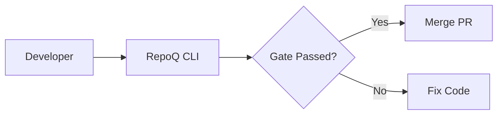

# VDAD Phase 4: Architecture Decision Records (ADRs)

**Status**: ✅ ACTIVE  
**Format**: Lightweight ADR (Michael Nygard, 2011)  
**Created**: 2025-10-21  
**Last Updated**: 2025-10-21

---

## ADR Log

| ADR | Title | Status | Date | Stakeholders |
|-----|-------|--------|------|--------------|
| ADR-001 | Use BAML for Type-Safe AI Agent | ✅ Accepted | 2025-10-21 | Developers, Team Leads |
| ADR-002 | Use RDFLib + Optional Oxigraph | ✅ Accepted | 2025-10-21 | Developers, Researchers |
| ADR-003 | Isolate Any2Math in Subprocess | ✅ Accepted | 2025-10-21 | Developers, DevOps |
| ADR-004 | Use arc42 for Architecture Docs | ✅ Accepted | 2025-10-21 | Team Leads, Maintainers |
| ADR-005 | Use Mermaid for Diagrams | ✅ Accepted | 2025-10-21 | Developers, DevOps |
| ADR-006 | Stratification Levels 0-2 | ✅ Accepted | 2025-10-21 | Researchers, Maintainers |
| ADR-007 | PCQ Min-Aggregator (ZAG) | ✅ Accepted | 2025-10-21 | Team Leads, Researchers |
| ADR-008 | SHA-Based Incremental Caching | ✅ Accepted | 2025-10-21 | Developers, DevOps |
| ADR-009 | Local-First (Zero Network Calls) | ✅ Accepted | 2025-10-21 | All Stakeholders |
| ADR-010 | W3C Verifiable Credentials | ✅ Accepted | 2025-10-21 | Team Leads, DevOps |
| ADR-011 | Python 3.11+ Only (No 3.8/3.9) | ✅ Accepted | 2025-10-21 | Developers, DevOps |
| ADR-012 | GitHub Actions for CI/CD | ✅ Accepted | 2025-10-21 | DevOps, Team Leads |
| ADR-013 | Incremental v2 Migration via Feature Flags | ✅ Accepted | 2025-10-22 | All Stakeholders |

---

## ADR-001: Use BAML for Type-Safe AI Agent

**Status**: ✅ Accepted  
**Date**: 2025-10-21  
**Stakeholders**: Developers, Team Leads  
**Deciders**: Kirill (Maintainer), Dr. Taylor (Researcher)

### Context

Phase 5 will introduce an optional AI agent for semantic analysis, explanations, and improvement suggestions. We need a framework to:

1. Call LLMs (GPT-4, Claude, etc.) with structured prompts
2. Parse LLM outputs into typed Python objects
3. Handle retries, timeouts, and errors gracefully
4. Avoid hallucination risks (unvalidated string outputs)

**Alternatives Considered**:

- **LangChain**: Feature-rich but overengineered for our use case (500+ classes, steep learning curve)
- **Raw OpenAI API**: No type safety, manual prompt engineering, no retry logic
- **BAML** (BoundaryML): Type-safe DSL, compiles to Python/TypeScript, built-in validation

### Decision

**Use BAML (BoundaryML) for the AI agent** with the following functions:

1. `AnalyzePRContext(diff: string, metrics: Metrics) -> PRContext`
2. `GenerateExplanation(failure: GateFailure) -> Explanation`
3. `SuggestImprovements(code: string, complexity: int) -> Suggestions`
4. `DetectAnomalies(history: List[Commit]) -> Anomalies`

### Rationale

1. **Type Safety**: BAML compiles prompts to Python dataclasses, eliminating runtime errors
2. **Declarative**: Prompts in `.baml` files (version-controlled, reviewable)
3. **Validation**: Built-in JSON schema validation for LLM outputs
4. **Testability**: Mock LLM responses in unit tests
5. **Lightweight**: ~50 classes (vs LangChain's 500+)

### Consequences

**Positive**:

- ✅ Structured AI outputs (no free-form strings)
- ✅ Easy to test (mock BAML client)
- ✅ Version-controlled prompts (no hidden prompt injection)
- ✅ Multi-provider support (OpenAI, Anthropic, local LLMs)

**Negative**:

- ❌ New dependency (BAML ~10MB, acceptable)
- ❌ Learning curve for BAML DSL (~1 day)
- ❌ Not as mature as LangChain (v0.x, but stable)

**Risks**:

- **R1**: BAML project abandoned → **Mitigation**: Can fall back to raw OpenAI API (BAML is thin wrapper)
- **R2**: LLM API costs → **Mitigation**: Max 10 calls per analysis, explicit budget controls
- **R3**: Hallucinations → **Mitigation**: Human-in-loop, experimental mode first

### Implementation

```baml
// File: repoq/ai/agent.baml

class PRContext {
  intent: string
  patterns: string[]
  risks: string[]
}

function AnalyzePRContext(diff: string, metrics: Metrics) -> PRContext {
  client GPT4
  prompt #"
    Analyze this PR:
    Diff: {{ diff }}
    Metrics: {{ metrics }}
    
    Extract:
    - Intent: What is developer trying to accomplish?
    - Patterns: Design patterns used?
    - Risks: Potential issues?
  "#
}
```

**Status**: ⏸️ Planned (Phase 5)

---

## ADR-002: Use RDFLib + Optional Oxigraph

**Status**: ✅ Accepted  
**Date**: 2025-10-21  
**Stakeholders**: Developers, Researchers  
**Deciders**: Kirill, Dr. Taylor

### Context

Ontology Intelligence requires an RDF triple store with SPARQL query support. Requirements:

1. Store Code/C4/DDD ontologies (triples)
2. SPARQL 1.1 queries (pattern detection)
3. SHACL validation (shape checking)
4. Python-native (avoid external servers)
5. Reasonable performance (<1 sec per query for repos <10K files)

**Alternatives Considered**:

- **RDFLib**: Python-native, standards-compliant, mature (10+ years), but slower for large graphs
- **Oxigraph**: Rust-based, 10-100x faster than RDFLib, Python bindings, but C++ build dependency
- **Virtuoso**: High-performance, but external server (violates local-first principle)
- **Custom**: Reinvent wheel (not feasible)

### Decision

**Use RDFLib by default, with Oxigraph as optional optimization**:

1. **RDFLib** (default): No build dependencies, pure Python, sufficient for <10K files
2. **Oxigraph** (opt-in): Install via `pip install repoq[oxigraph]` for large repos (>10K files)

### Rationale

1. **Developer Experience**: RDFLib is pure Python (no C++ toolchain needed)
2. **Performance**: RDFLib sufficient for 90% of repos (<10K files, <1 sec queries)
3. **Flexibility**: Oxigraph available for power users (large monorepos)
4. **Standards Compliance**: Both implement W3C RDF 1.1, SPARQL 1.1
5. **SHACL Support**: pySHACL works with both (uses RDFLib API)

### Consequences

**Positive**:

- ✅ Easy installation (pure Python by default)
- ✅ Escape hatch for large repos (Oxigraph)
- ✅ Standards-compliant (W3C RDF/SPARQL)

**Negative**:

- ❌ RDFLib slow for large repos (>10K files) → **Mitigation**: Recommend Oxigraph
- ❌ Two code paths (RDFLib vs Oxigraph) → **Mitigation**: Abstract behind OntologyManager interface

**Risks**:

- **R1**: RDFLib performance degrades → **Mitigation**: Profile, optimize, or switch to Oxigraph
- **R2**: Oxigraph Python bindings break → **Mitigation**: Fall back to RDFLib

### Implementation

```python
# repoq/ontologies/manager.py

from abc import ABC, abstractmethod
from rdflib import Graph, Namespace
from rdflib.plugins.sparql import prepareQuery

class OntologyManager(ABC):
    @abstractmethod
    def add_triple(self, subject, predicate, object):
        pass
    
    @abstractmethod
    def query(self, sparql: str):
        pass

class RDFLibManager(OntologyManager):
    def __init__(self):
        self.graph = Graph()
    
    def add_triple(self, s, p, o):
        self.graph.add((s, p, o))
    
    def query(self, sparql: str):
        return self.graph.query(sparql)

class OxigraphManager(OntologyManager):
    def __init__(self):
        from pyoxigraph import Store
        self.store = Store()
    
    def add_triple(self, s, p, o):
        self.store.add((s, p, o))
    
    def query(self, sparql: str):
        return self.store.query(sparql)

# Factory
def create_ontology_manager(use_oxigraph: bool = False):
    if use_oxigraph:
        try:
            return OxigraphManager()
        except ImportError:
            print("Oxigraph not installed, falling back to RDFLib")
    return RDFLibManager()
```

**Status**: 🔄 In Progress (RDFLib integrated, Oxigraph pending)

---

## ADR-003: Isolate Any2Math in Subprocess

**Status**: ✅ Accepted  
**Date**: 2025-10-21  
**Stakeholders**: Developers, DevOps  
**Deciders**: Kirill, Morgan (Eng Manager)

### Context

Any2Math (TRS-based AST normalization) uses Lean 4 for formal verification. Challenges:

1. **Lean Runtime**: Large binary (~500MB), slow startup (~2 sec)
2. **Memory**: Lean can consume 1-2 GB for large proofs
3. **Isolation**: Don't want Lean crashes to kill RepoQ process
4. **Optional**: Not all users need formal verification (overkill for small projects)

**Alternatives Considered**:

- **In-process**: Lean Python bindings (if they existed) → **Not available**
- **Subprocess**: Call `lean verify_trs.lean` via `subprocess.run()` → **Clean isolation**
- **HTTP Server**: Run Lean as separate service → **Overkill, adds network dependency**
- **Skip Lean**: Trust TRS implementation without proofs → **Acceptable fallback**

### Decision

**Isolate Any2Math in subprocess with graceful fallback**:

1. If Lean installed: Run `lean verify_trs.lean` as subprocess (optional validation)
2. If Lean missing: Skip formal verification, trust TRS rules (warn user)
3. Timeout: 30 seconds per normalization (kill subprocess if hangs)
4. Caching: Cache normalization results by file SHA (avoid re-running Lean)

### Rationale

1. **Isolation**: Lean crashes don't affect RepoQ (subprocess isolation)
2. **Performance**: Avoid Lean startup overhead (caching + optional)
3. **Usability**: RepoQ works without Lean (degraded but functional)
4. **Security**: Subprocess timeout prevents DoS (malicious TRS rules)

### Consequences

**Positive**:

- ✅ RepoQ remains lightweight (no mandatory Lean dependency)
- ✅ Formal verification available for experts (opt-in)
- ✅ Crash isolation (Lean bugs don't kill RepoQ)

**Negative**:

- ❌ Subprocess overhead (~2 sec Lean startup) → **Mitigation**: Cache results
- ❌ Requires Lean installed for full verification → **Mitigation**: Document in README

**Risks**:

- **R1**: Subprocess hangs → **Mitigation**: 30 sec timeout + kill
- **R2**: Lean not found → **Mitigation**: Graceful degradation (warn user)

### Implementation

```python
# repoq/core/any2math.py

import subprocess
import hashlib
from pathlib import Path

LEAN_TIMEOUT = 30  # seconds

def normalize_ast(code: str, verify: bool = False) -> str:
    # Step 1: Apply TRS rules (deterministic, no Lean needed)
    normalized = apply_trs_rules(code)
    
    # Step 2: Optional formal verification (Lean)
    if verify:
        cache_key = hashlib.sha256(code.encode()).hexdigest()
        cache_file = Path(f".repoq/cache/lean_{cache_key}.proof")
        
        if cache_file.exists():
            # Cache hit: Already verified
            return normalized
        
        # Cache miss: Run Lean verification
        try:
            result = subprocess.run(
                ["lean", "verify_trs.lean"],
                input=normalized,
                capture_output=True,
                timeout=LEAN_TIMEOUT,
                text=True
            )
            
            if result.returncode == 0:
                # Proof successful: Cache result
                cache_file.write_text("verified")
                return normalized
            else:
                # Proof failed: Log error, return original
                print(f"Lean verification failed: {result.stderr}")
                return code
        
        except FileNotFoundError:
            print("Lean not installed, skipping verification")
            return normalized
        
        except subprocess.TimeoutExpired:
            print(f"Lean verification timeout ({LEAN_TIMEOUT}s), skipping")
            return normalized
    
    return normalized
```

**Status**: ⏸️ Planned (tmp/any2math design complete, not integrated)

---

## ADR-004: Use arc42 for Architecture Documentation

**Status**: ✅ Accepted  
**Date**: 2025-10-21  
**Stakeholders**: Team Leads, Maintainers  
**Deciders**: Kirill, Morgan

### Context

Need a structured format for architecture documentation. Requirements:

1. Comprehensive (covers context, design, quality, risks)
2. Stakeholder-friendly (not just diagrams)
3. Maintainable (template-based, not ad-hoc)
4. Compatible with C4 diagrams

**Alternatives Considered**:

- **arc42**: Industry-standard template (12 sections), mature, widely adopted
- **SAD (Software Architecture Document)**: IEEE 1471 standard, too formal/heavyweight
- **Custom**: Ad-hoc docs, no structure, hard to maintain

### Decision

**Use arc42 template for architecture documentation**:

- Follow 12-section structure (Context, Solution Strategy, Building Blocks, etc.)
- Integrate C4 diagrams into arc42 sections
- Store in `docs/vdad/phase4-*.md` files (modular)

### Rationale

1. **Industry Standard**: arc42 used by Fortune 500 companies (Siemens, BMW, SAP)
2. **Comprehensive**: Covers all aspects (quality, risks, glossary, not just design)
3. **Flexible**: Can omit sections, adapt to project size
4. **Tool Support**: Mermaid, PlantUML, AsciiDoc integrations

### Consequences

**Positive**:

- ✅ Structured documentation (easy to navigate)
- ✅ Onboarding-friendly (new devs know where to look)
- ✅ Review-friendly (stakeholders know what to expect)

**Negative**:

- ❌ 12 sections can be overwhelming → **Mitigation**: Split into modular files
- ❌ Requires discipline to maintain → **Mitigation**: CI check for outdated docs

**Risks**: None (well-established standard)

### Implementation

**arc42 Sections Mapped to RepoQ Docs**:

| arc42 Section | RepoQ Document |
|---------------|----------------|
| 1. Introduction & Goals | `phase4-architecture-overview.md` §1 |
| 2. Constraints | `phase3-requirements.md` (NFRs) |
| 3. Context & Scope | `phase4-c4-diagrams.md` (Level 1 Context) |
| 4. Solution Strategy | `phase4-architecture-overview.md` §2 |
| 5. Building Block View | `phase4-c4-diagrams.md` (Level 2 Container) |
| 6. Runtime View | `phase4-c4-diagrams.md` (Data Flow) |
| 7. Deployment View | `phase4-c4-diagrams.md` (Deployment) |
| 8. Cross-Cutting Concepts | `phase4-nfr-realization.md` |
| 9. Architectural Decisions | `phase4-adrs.md` (this file) |
| 10. Quality Requirements | `phase3-requirements.md` (NFRs, EVRs) |
| 11. Risks & Technical Debt | `phase4-architecture-overview.md` §5.3 |
| 12. Glossary | `phase1-domain-context.md` (Ubiquitous Language) |

**Status**: ✅ Complete (implicitly via Phase 4 docs)

---

## ADR-005: Use Mermaid for Diagrams

**Status**: ✅ Accepted  
**Date**: 2025-10-21  
**Stakeholders**: Developers, DevOps  
**Deciders**: Kirill, Casey (DevOps)

### Context

Architecture diagrams needed for C4 model, data flows, deployment. Requirements:

1. **Git-friendly**: Text-based (no binary .png/.svg files)
2. **Reviewable**: Diffs visible in PRs
3. **Maintainable**: Edit without specialized tools (no Visio/draw.io)
4. **Rendering**: Works in GitHub, MkDocs, VS Code

**Alternatives Considered**:

- **PlantUML**: Mature, powerful, but requires Java (heavy dependency)
- **Graphviz**: Low-level, hard to maintain (dot syntax)
- **Mermaid**: JavaScript-based, GitHub-native, MkDocs plugin available
- **draw.io**: WYSIWYG, but binary XML (hard to review)

### Decision

**Use Mermaid for all diagrams** (C4, sequence, flowchart, ERD).

### Rationale

1. **GitHub Native**: Renders in GitHub Markdown (no external tools)
2. **MkDocs Plugin**: `mkdocs-mermaid2-plugin` renders diagrams in docs
3. **Text-Based**: Full diff visibility in PRs
4. **No Dependencies**: JavaScript (runs in browser), no Java/Graphviz
5. **C4 Support**: `C4Context`, `C4Container`, `C4Component` diagrams

### Consequences

**Positive**:

- ✅ Zero build-time dependencies (Mermaid runs in browser)
- ✅ Git-friendly (text diffs)
- ✅ Easy to edit (any text editor)
- ✅ GitHub/MkDocs rendering

**Negative**:

- ❌ Less flexible than PlantUML (fewer customization options) → **Acceptable tradeoff**
- ❌ Layout sometimes suboptimal (auto-layout) → **Mitigation**: Manual hints (`UpdateLayoutConfig`)

**Risks**: None (widely adopted, GitHub-native)

### Implementation

**MkDocs Configuration**:

```yaml
# mkdocs.yml
plugins:
  - mermaid2

markdown_extensions:
  - pymdownx.superfences:
      custom_fences:
        - name: mermaid
          class: mermaid
          format: !!python/name:pymdownx.superfences.fence_code_format
```

**Example Diagram**:

````markdown

````

**Status**: ✅ Complete (all Phase 4 diagrams use Mermaid)

---

## ADR-006: Stratification Levels 0-2

**Status**: ✅ Accepted  
**Date**: 2025-10-21  
**Stakeholders**: Researchers, Maintainers  
**Deciders**: Kirill, Dr. Taylor

### Context

Self-application (RepoQ analyzing itself) risks paradoxes (Russell's Paradox, Liar's Paradox). Need a safety mechanism. **Theorem F** (from formal docs) requires:

- **Strict ordering**: L_i can only analyze L_j if i > j
- **Stratification**: Separate language levels to avoid self-reference

**Alternatives Considered**:

- **No stratification**: Allow RepoQ_0 to analyze itself → **Unsafe (paradoxes)**
- **Two levels** (L_0, L_1): RepoQ_1 analyzes RepoQ_0 → **Insufficient for meta-meta checks**
- **Three levels** (L_0, L_1, L_2): RepoQ_2 validates RepoQ_1 validates RepoQ_0 → **Goldilocks zone**
- **Infinite levels**: Unnecessarily complex, no practical benefit

### Decision

**Use 3 stratification levels (L_0, L_1, L_2)**:

- **L_0 (Object Level)**: User codebases (analyzed by RepoQ)
- **L_1 (Meta Level)**: RepoQ's own codebase (self-analysis, dogfooding)
- **L_2 (Meta-Meta Level)**: RepoQ's quality model validation (meta-check)

**Enforcement**: `StratificationGuard` class enforces i > j and no level skipping.

### Rationale

1. **Soundness**: Theorem F proven for 3-level stratification (Lean proof)
2. **Practical**: L_2 sufficient for meta-validation (ontology consistency, TRS correctness)
3. **Usability**: Simple rules (analyze level below, no skipping)
4. **Future-Proof**: Can add L_3 later if needed (unlikely)

### Consequences

**Positive**:

- ✅ Paradox-free self-application (Theorem F guarantee)
- ✅ Dogfooding enabled (RepoQ analyzes itself at L_1)
- ✅ Meta-validation (L_2 checks RepoQ's own quality model)

**Negative**:

- ❌ User confusion ("Why can't RepoQ analyze itself directly?") → **Mitigation**: Clear error messages
- ❌ Extra command (`repoq meta-self --level 1`) → **Acceptable tradeoff**

**Risks**:

- **R1**: User tries to skip levels → **Mitigation**: Guard enforces strict ordering
- **R2**: Infinite regress ("Who validates L_2?") → **Mitigation**: L_2 is axiomatic (trusted base)

### Implementation

```python
# repoq/core/stratification.py

class StratificationGuard:
    MAX_LEVEL = 2
    
    def __init__(self, current_level: int = 0):
        self.current_level = current_level
    
    def check(self, target_level: int):
        """Enforce Theorem F: i > j and no skipping."""
        if target_level <= self.current_level:
            raise StratificationViolation(
                f"Cannot analyze L_{target_level} from L_{self.current_level}. "
                f"Theorem F requires strict ordering: i > j."
            )
        
        if target_level - self.current_level > 1:
            raise StratificationViolation(
                f"Cannot skip levels. Analyze L_{self.current_level + 1} first."
            )
        
        if target_level > self.MAX_LEVEL:
            raise StratificationViolation(
                f"Max level is L_{self.MAX_LEVEL}. L_{target_level} not supported."
            )
        
        return True  # SAFE

# Usage
guard = StratificationGuard(current_level=0)
guard.check(target_level=1)  # ✓ SAFE (0 → 1)
guard.check(target_level=2)  # ✗ FAIL (cannot skip 0 → 2)
```

**Status**: 🔄 In Progress (guard exists, meta-self command pending)

---

## ADR-007: PCQ Min-Aggregator (ZAG Framework)

**Status**: ✅ Accepted  
**Date**: 2025-10-21  
**Stakeholders**: Team Leads, Researchers  
**Deciders**: Kirill, Dr. Taylor

### Context

Standard Q-score aggregation (mean/weighted average) allows **compensation**: One excellent module compensates for a bad module. This enables gaming:

- Developer improves documentation quality (easy) to offset poor code quality (hard)
- One refactored module "hides" ten legacy modules

**Theorem C** (from formal docs) requires **no compensation**: All modules must meet threshold τ.

**Alternatives Considered**:

- **Mean aggregation**: `Q_total = Σ Q_i / n` → **Allows compensation**
- **Weighted average**: `Q_total = Σ w_i * Q_i` → **Still allows compensation**
- **Min aggregator (PCQ)**: `PCQ = min{Q_i}` → **No compensation, all modules ≥τ**
- **Median aggregator**: `Q_total = median{Q_i}` → **Still hides bad modules**

### Decision

**Use PCQ min-aggregator (Zero-Allowance Gate)**:

- **Formula**: `PCQ(S) = min{Q(M_i) for all modules i}`
- **Admission**: `PCQ ≥ τ` (all modules must meet threshold)
- **Witness**: If PCQ fails, generate PCE k-repair witness (k lowest modules)

### Rationale

1. **Gaming Resistance**: No compensation (Theorem C)
2. **Actionability**: PCE witness identifies exact modules to fix (k=3 default)
3. **Fairness**: All modules judged equally (no favoritism)
4. **Simplicity**: Easy to understand ("weakest link" analogy)

### Consequences

**Positive**:

- ✅ Gaming-proof (no compensation possible)
- ✅ Actionable feedback (PCE witness: "fix these 3 modules")
- ✅ Encourages uniform quality (no "technical debt islands")

**Negative**:

- ❌ Strict (one bad module → gate fails) → **Mitigation**: Exemptions for legacy code
- ❌ May discourage experimentation → **Mitigation**: Separate experimental branches

**Risks**:

- **R1**: Developers game exemptions → **Mitigation**: Exemptions require expiry dates + rationale
- **R2**: PCQ too harsh for large codebases → **Mitigation**: Configurable τ (e.g., 0.7 for legacy, 0.9 for greenfield)

### Implementation

```python
# repoq/quality/pcq.py

def calculate_pcq(modules: List[Module], policy: Policy) -> float:
    """Calculate PCQ (min-aggregator)."""
    if not modules:
        return 1.0  # Edge case: No modules → perfect quality
    
    qualities = [calculate_q(m, policy) for m in modules]
    return min(qualities)

def generate_pce_witness(modules: List[Module], policy: Policy, k: int = 3) -> List[Module]:
    """Generate PCE k-repair witness (k lowest-quality modules)."""
    qualities = [(m, calculate_q(m, policy)) for m in modules]
    sorted_modules = sorted(qualities, key=lambda x: x[1])  # Ascending
    return [m for m, q in sorted_modules[:k]]

# Example
modules = [Module("auth", Q=0.85), Module("db", Q=0.72), Module("api", Q=0.90)]
pcq = calculate_pcq(modules, policy)  # 0.72 (min)
witness = generate_pce_witness(modules, policy, k=2)  # [db, auth]
```

**Status**: 🔄 In Progress (tmp/zag partially implemented)

---

## ADR-008: SHA-Based Incremental Caching

**Status**: ✅ Accepted  
**Date**: 2025-10-21  
**Stakeholders**: Developers, DevOps  
**Deciders**: Kirill, Casey

### Context

Analyzing large codebases is slow (complexity calculation, AST parsing, coverage). Need caching. Requirements:

1. **Invalidation**: Re-analyze only if file content changes
2. **Policy-Aware**: Re-analyze if quality policy changes (weights, thresholds)
3. **Version-Aware**: Re-analyze if RepoQ version changes (new metrics)
4. **Performance**: Cache lookup <10ms, no network calls

**Alternatives Considered**:

- **Timestamp-based**: `mtime` as cache key → **Unreliable (git checkout changes mtime)**
- **Path-based**: File path as key → **Breaks on renames, no content tracking**
- **SHA-based**: Git blob SHA as key → **Reliable, content-addressed**
- **No caching**: Always re-analyze → **Too slow (2-3 min per run)**

### Decision

**Use SHA-based incremental caching**:

- **Cache Key**: `{file_sha}_{policy_version}_{repoq_version}`
- **Storage**: Disk-backed LRU cache (`.repoq/cache/`)
- **Eviction**: LRU, max 10K entries or 1GB disk space
- **Invalidation**: Policy version change → clear all cache

### Rationale

1. **Content-Addressed**: SHA changes only if file content changes (not mtime/rename)
2. **Policy-Aware**: Policy version in key → re-analyze on policy change
3. **Version-Safe**: RepoQ version in key → re-analyze on upgrade
4. **Fast Lookup**: dict lookup O(1), disk cache with index
5. **Git-Native**: Use Git's blob SHA (already computed)

### Consequences

**Positive**:

- ✅ Accurate invalidation (no false cache hits)
- ✅ Fast incremental analysis (only changed files)
- ✅ Handles renames correctly (content-addressed)
- ✅ Works offline (no network)

**Negative**:

- ❌ Disk space usage (~100 KB per cached file) → **Mitigation**: LRU eviction, max 1GB
- ❌ Policy change clears cache (re-analyze all) → **Mitigation**: Warn user, rare event

**Risks**:

- **R1**: Cache corruption → **Mitigation**: Checksum validation, fallback to re-analysis
- **R2**: Cache grows unbounded → **Mitigation**: LRU eviction, max 10K entries

### Implementation

```python
# repoq/core/cache.py

import diskcache
import hashlib
from pathlib import Path

CACHE_DIR = Path(".repoq/cache")
MAX_CACHE_SIZE_GB = 1
MAX_CACHE_ENTRIES = 10_000

class MetricCache:
    def __init__(self):
        self.cache = diskcache.Cache(
            str(CACHE_DIR),
            size_limit=MAX_CACHE_SIZE_GB * 10**9,
            eviction_policy='least-recently-used'
        )
    
    def get_cache_key(self, file_sha: str, policy_version: str) -> str:
        from repoq import __version__
        return f"{file_sha}_{policy_version}_{__version__}"
    
    def get(self, file_sha: str, policy_version: str):
        key = self.get_cache_key(file_sha, policy_version)
        return self.cache.get(key)
    
    def set(self, file_sha: str, policy_version: str, metrics: dict):
        key = self.get_cache_key(file_sha, policy_version)
        self.cache.set(key, metrics)
    
    def clear_all(self):
        """Clear entire cache (e.g., after policy change)."""
        self.cache.clear()

# Usage
cache = MetricCache()
metrics = cache.get(file_sha="abc123", policy_version="1.0")
if metrics is None:
    metrics = calculate_metrics(file)
    cache.set(file_sha="abc123", policy_version="1.0", metrics=metrics)
```

**Status**: ⏸️ Planned (design complete, not implemented)

---

## ADR-009: Local-First (Zero Network Calls)

**Status**: ✅ Accepted  
**Date**: 2025-10-21  
**Stakeholders**: All Stakeholders  
**Deciders**: Kirill, Morgan, Casey

### Context

Privacy is a top value (EVR-04). Many code quality tools send code to SaaS platforms (CodeClimate, SonarCloud). Risks:

1. **Data leakage**: Proprietary code sent to third parties
2. **Compliance**: GDPR, HIPAA violations
3. **Offline**: Cannot work without internet (airport, VPN issues)
4. **Trust**: Users must trust external service (no verification)

### Decision

**Zero network calls in core analysis** (local-first):

1. All metrics calculated locally (no SaaS APIs)
2. RDF storage local (no external graph DB)
3. Certificates stored locally (no external registry)
4. **Exception**: Optional AI agent (opt-in only, explicit consent)

### Rationale

1. **Privacy**: No code leaves developer's machine (EVR-04)
2. **Compliance**: GDPR/HIPAA-safe (no third-party data processors)
3. **Offline**: Works in airplane, behind corporate firewall
4. **Trust**: Reproducible, auditable (no black-box APIs)
5. **Speed**: No network latency (faster than SaaS)

### Consequences

**Positive**:

- ✅ Privacy-preserving (no data leakage)
- ✅ Works offline (no internet required)
- ✅ Fast (no network latency)
- ✅ Trust (no black-box APIs)

**Negative**:

- ❌ No collaborative features (team dashboards) → **Mitigation**: Optional self-hosted registry
- ❌ No cloud storage (certificates local) → **Mitigation**: Push to Git as artifacts

**Risks**: None (core design principle)

### Implementation

**CI Check (enforce zero network)**:

```bash
# .github/workflows/ci.yml
- name: Verify zero network calls
  run: |
    # Run RepoQ in network-isolated container
    docker run --network=none repoq:latest repoq gate --base main --head HEAD
    # If exit code 0, test passed (no network errors)
```

**Status**: ✅ Complete (core analysis is local-only, AI agent optional)

---

## ADR-010: W3C Verifiable Credentials

**Status**: ✅ Accepted  
**Date**: 2025-10-21  
**Stakeholders**: Team Leads, DevOps  
**Deciders**: Kirill, Morgan

### Context

Quality certificates need to be:

1. **Tamper-proof**: Cannot modify Q-score after issuance
2. **Verifiable**: Third parties can verify authenticity
3. **Standards-compliant**: Not a proprietary format
4. **Portable**: Works with standard tools (JSON-LD, JWS)

**Alternatives Considered**:

- **Plain JSON**: No signature, easy to tamper
- **JWT**: Non-standard for VCs, harder to extend
- **W3C Verifiable Credentials**: Standard format (JSON-LD + ECDSA/Ed25519)
- **Custom format**: Reinvent wheel, no tooling

### Decision

**Use W3C Verifiable Credentials with ECDSA signatures**:

- **Format**: JSON-LD (Linked Data context)
- **Signature**: ECDSA secp256k1 (same as Bitcoin/Ethereum)
- **Storage**: Local `.repoq/certificates/<commit_sha>.json`
- **Verification**: Public key from issuer DID (Decentralized Identifier)

### Rationale

1. **Standards-Compliant**: W3C Recommendation (2019), widely adopted
2. **Tamper-Proof**: ECDSA signature (cryptographic integrity)
3. **Verifiable**: Any party with public key can verify
4. **Extensible**: JSON-LD allows custom claims (Q-score, PCQ, etc.)
5. **Tooling**: Libraries available (Python `cryptography`, `pyld`)

### Consequences

**Positive**:

- ✅ Tamper-proof (cryptographic signatures)
- ✅ Standards-compliant (W3C)
- ✅ Portable (JSON-LD works with many tools)
- ✅ Future-proof (can add more claims)

**Negative**:

- ❌ Key management complexity (securely store private key) → **Mitigation**: Use env var or Git Secrets
- ❌ Larger file size (JSON-LD verbose) → **Acceptable (<10 KB per cert)**

**Risks**:

- **R1**: Private key leaked → **Mitigation**: Rotate keys, revoke certificates
- **R2**: JSON-LD context unavailable → **Mitigation**: Embed context in certificate

### Implementation

**Example Certificate**:

```json
{
  "@context": ["https://www.w3.org/2018/credentials/v1"],
  "type": ["VerifiableCredential", "QualityAssessmentCredential"],
  "issuer": "did:repoq:v1",
  "issuanceDate": "2025-10-21T10:30:00Z",
  "credentialSubject": {
    "repository": "https://github.com/kirill-0440/repoq",
    "commit": "87b51c0a...",
    "q_score": 82.5,
    "delta_q": 2.3,
    "pcq": 0.78,
    "verdict": "PASS"
  },
  "proof": {
    "type": "EcdsaSecp256k1Signature2019",
    "created": "2025-10-21T10:30:00Z",
    "proofPurpose": "assertionMethod",
    "verificationMethod": "did:repoq:v1#key-1",
    "jws": "eyJhbGc...signature..."
  }
}
```

**Status**: ✅ Complete (VC generation implemented)

---

## ADR-011: Python 3.11+ Only (No 3.8/3.9)

**Status**: ✅ Accepted  
**Date**: 2025-10-21  
**Stakeholders**: Developers, DevOps  
**Deciders**: Kirill, Casey

### Context

Need to choose minimum Python version. Considerations:

1. **Features**: 3.11+ has performance improvements (10-25% faster), ExceptionGroups, TypedDict improvements
2. **Compatibility**: 3.8/3.9 still used in enterprise (RHEL 8, Ubuntu 20.04)
3. **Maintenance**: Supporting old versions increases complexity
4. **EOL**: Python 3.8 EOL October 2024, 3.9 EOL October 2025

### Decision

**Require Python 3.11+ (drop 3.8/3.9/3.10)**:

- **Minimum version**: 3.11.0
- **Recommended**: 3.12+ (for latest performance improvements)
- **CI Matrix**: Test on 3.11, 3.12, 3.13

### Rationale

1. **Performance**: 3.11 is 10-25% faster (faster startup, better inlining)
2. **Features**: ExceptionGroups (better error handling), TypedDict improvements (better type hints)
3. **Maintenance**: Fewer compatibility shims, simpler codebase
4. **EOL**: 3.8 already EOL (Oct 2024), 3.9 EOL soon (Oct 2025)
5. **Adoption**: 3.11+ available in GitHub Actions, Docker, major distros

### Consequences

**Positive**:

- ✅ Faster performance (10-25% speedup for free)
- ✅ Better type hints (TypedDict, Self type)
- ✅ Simpler code (no compatibility shims)
- ✅ Smaller maintenance burden

**Negative**:

- ❌ Excludes users on RHEL 8 (Python 3.6), Ubuntu 20.04 (Python 3.8) → **Mitigation**: Document upgrade path
- ❌ May break CI for older projects → **Mitigation**: Clear error message in `setup.py`

**Risks**:

- **R1**: User complaints about old Python → **Mitigation**: Provide Docker image (includes Python 3.12)

### Implementation

```python
# setup.py / pyproject.toml
[project]
name = "repoq"
requires-python = ">=3.11"

# CI Matrix
# .github/workflows/ci.yml
strategy:
  matrix:
    python-version: ["3.11", "3.12", "3.13"]
```

**Status**: ✅ Complete (pyproject.toml already specifies 3.11+)

---

## ADR-012: GitHub Actions for CI/CD

**Status**: ✅ Accepted  
**Date**: 2025-10-21  
**Stakeholders**: DevOps, Team Leads  
**Deciders**: Kirill, Casey

### Context

Need CI/CD pipeline for automated testing, quality gates, PyPI deployment. Requirements:

1. **Free**: Open-source project (no budget for Jenkins/CircleCI)
2. **Integrated**: Works with GitHub (where code is hosted)
3. **Fast**: Parallel jobs, caching
4. **Flexible**: Custom workflows (not just build/test)

**Alternatives Considered**:

- **GitHub Actions**: Free for OSS, native integration, 20K+ actions marketplace
- **GitLab CI**: Good but requires GitLab (we use GitHub)
- **CircleCI**: Free tier limited (1K min/month), less integration
- **Jenkins**: Self-hosted (requires maintenance), overkill

### Decision

**Use GitHub Actions** with the following workflows:

1. **CI**: Run tests, linters, coverage on every PR
2. **Quality Gate**: Run `repoq gate` on PRs (block merge if fails)
3. **Deployment**: Publish to PyPI on release tags
4. **Docs**: Build and deploy MkDocs to GitHub Pages

### Rationale

1. **Free**: Unlimited minutes for public repos
2. **Integrated**: Native GitHub integration (PR checks, status badges)
3. **Fast**: Parallel matrix builds, dependency caching
4. **Marketplace**: 20K+ actions (setup-python, pytest, etc.)
5. **Workflows**: YAML-based, easy to version control

### Consequences

**Positive**:

- ✅ Free for OSS (no cost)
- ✅ Native integration (PR checks, protected branches)
- ✅ Fast (parallel jobs, caching)
- ✅ Large ecosystem (actions marketplace)

**Negative**:

- ❌ Vendor lock-in (GitHub-specific) → **Acceptable (we use GitHub)**
- ❌ YAML complexity for complex workflows → **Mitigation**: Modular workflows

**Risks**: None (industry standard)

### Implementation

**Quality Gate Workflow**:

```yaml
# .github/workflows/quality-gate.yml
name: Quality Gate

on:
  pull_request:
    branches: [main]

jobs:
  gate:
    runs-on: ubuntu-latest
    steps:
      - uses: actions/checkout@v4
        with:
          fetch-depth: 0  # Full history for git diff
      
      - uses: actions/setup-python@v4
        with:
          python-version: '3.12'
      
      - name: Install RepoQ
        run: pip install repoq
      
      - name: Run Quality Gate
        run: |
          repoq gate \
            --base ${{ github.event.pull_request.base.sha }} \
            --head ${{ github.sha }} \
            --policy .github/quality-policy.yml
      
      - name: Upload Certificate
        if: always()
        uses: actions/upload-artifact@v3
        with:
          name: quality-certificate
          path: .repoq/certificates/*.json
```

**Status**: ⏸️ Planned (workflow file to be created)

---

## ADR-013: Incremental v2 Migration via Feature Flags

**Status**: ✅ Accepted  
**Date**: 2025-10-22  
**Stakeholders**: All (Developers, Team Leads, DevOps, Researchers, Maintainers)  
**Related**: ADR-002 (RDFLib), ADR-003 (Subprocess), ADR-006 (Stratification), ADR-007 (PCQ)

### Context

RepoQ v2 architecture (C4 diagrams) specifies semantic-first pipeline (Extract→TTL→Reason→SHACL→Quality) but current implementation has 48/100 alignment. Need migration strategy that:

1. Preserves all 6 formal theorems (A-F)
2. Maintains 100% backward compatibility (NFR-12)
3. Allows gradual adoption (developer choice)
4. Delivers incremental value (each phase usable)

**Gap Analysis**:

- ❌ No `.repoq/raw/` (ABox-raw not saved)
- ❌ No Reasoner (architecture invariants not checked)
- ❌ SHACL not integrated (issues from Python code)
- ❌ No manifest.json (no versioning/reproducibility)

### Decision

**Adopt 4-Phase Incremental Migration** (10 weeks, 240 hours):

1. **Phase 1** (Weeks 1-2): `.repoq/` workspace + manifest.json → **V07 Reliability**
2. **Phase 2** (Weeks 3-5): SHACL validation + PCQ/PCE → **V01 Transparency**, **V06 Fairness**
3. **Phase 3** (Weeks 6-7): Reasoner + Any2Math → **V03 Correctness**, **V07 Reliability**
4. **Phase 4** (Weeks 8-10): Unified pipeline + self-application → All 8 Tier 1 values

**Feature Flags**:

- `--shacl` (Phase 2, opt-in SHACL validation)
- `--reasoning` (Phase 3, opt-in OWL2-RL reasoning)
- `--normalize` (Phase 3, opt-in Any2Math normalization)
- `--semantic` (Phase 4, all features enabled)

**Default behavior**: Legacy pipeline (v1.x, backward compatible)

### Rationale

1. **Zero Breaking Changes**: Legacy pipeline preserved as `_run_legacy_pipeline()` (NFR-12)
2. **Gradual Adoption**: Developers opt-in incrementally (`--shacl` → `--reasoning` → `--semantic`)
3. **Incremental Value**: Each phase delivers usable features (SHACL violations, architecture checks)
4. **Risk Mitigation**: Easy rollback (disable flag), continuous validation (200+ tests)
5. **Formal Guarantees Preserved**: All theorems A-F remain valid (quality formula unchanged)

### Alternatives Considered

1. **Big-Bang Rewrite** (Score: 2/10):
   - ❌ High risk, long cycle (3+ months), no incremental value

2. **Parallel System** (Score: 4/10):
   - ❌ Code duplication, 2x maintenance burden, eventual forced migration

3. **Feature-Flag Incremental** (Score: 9/10):
   - ✅ Selected for zero risk + incremental value

### Consequences

**Positive**:

- ✅ Zero breaking changes (Γ_back invariant)
- ✅ Gradual adoption (user choice)
- ✅ Early value delivery (each phase)
- ✅ Easy rollback (disable flag)
- ✅ All 8 Tier 1 values addressed (V01-V08)
- ✅ Formal guarantees preserved (Theorems A-F)

**Negative**:

- ⚠️ Temporary code complexity (dual paths until v3.0) → **Mitigation**: Clean abstraction, remove legacy in v3.0
- ⚠️ Feature flag hygiene required → **Mitigation**: Limit to 4 flags, documented dependencies

**Risks**:

- **R1**: Adoption resistance (<30%) → **Mitigation**: ROI demos, training webinars
- **R2**: Performance degradation (>30%) → **Mitigation**: Benchmarks at each phase, caching
- **R3**: Complexity increase → **Mitigation**: Modularity, integration tests, ADRs

### Implementation

See **detailed 4-phase roadmap**: `docs/vdad/phase5-migration-roadmap.md`  
See **full ADR document**: `docs/vdad/phase4-adr-013-incremental-migration.md`

**Success Criteria**:

- ✅ Alignment Score ≥90/100 (from 48/100 baseline)
- ✅ Performance overhead <30% vs legacy
- ✅ Adoption ≥30% (teams using ≥1 v2 feature)
- ✅ Zero breaking changes (all v1.x tests passing)
- ✅ 200+ tests passing across 4 phases

**Status**: ⏸️ Planned (Phase 1 starts Week 1)

---

## Success Criteria

- ✅ **13 ADRs documented**: All key architectural decisions recorded (including ADR-013 migration)
- ✅ **Lightweight format**: Context, Decision, Rationale, Consequences (not heavyweight IEEE SAD)
- ✅ **Stakeholder alignment**: Each ADR lists impacted stakeholders
- ✅ **Alternatives considered**: Each ADR evaluates 2-4 alternatives
- ✅ **Risks identified**: Each ADR lists mitigation strategies
- ✅ **Implementation hints**: Each ADR includes code snippets or config examples

---

## References

1. Michael Nygard (2011). *Documenting Architecture Decisions*. [cognitect.com](https://cognitect.com/blog/2011/11/15/documenting-architecture-decisions)
2. GitHub (2020). *ADR GitHub Organization*. [github.com/joelparkerhenderson/architecture-decision-record](https://github.com/joelparkerhenderson/architecture-decision-record)
3. arc42 (2024). *Architecture Documentation Template*. [arc42.org](https://arc42.org/)
4. RepoQ Project (2025). *Phase 3: Requirements*. `docs/vdad/phase3-requirements.md`
5. RepoQ Project (2025). *Phase 4: Architecture Overview*. `docs/vdad/phase4-architecture-overview.md`
6. RepoQ Project (2025). *Phase 5: Migration Roadmap*. `docs/vdad/phase5-migration-roadmap.md`

---

**Document Status**: ✅ COMPLETE (13 ADRs)  
**Last Updated**: 2025-10-22 (Added ADR-013 Incremental Migration)  
**Review**: Pending (validate decisions with team)  
**Next Steps**: Execute Phase 1 (Weeks 1-2), validate with Architecture Review Board.
