# VDAD Phase 4: Architecture Overview

**Status**: ✅ ACTIVE  
**VDAD Step**: Step 7 (Architecture Design)  
**Created**: 2025-10-21  
**Last Updated**: 2025-10-21

---

## Executive Summary

This document presents the **high-level architecture** for RepoQ, designed to satisfy all 31 requirements from Phase 3 (19 FR + 12 NFR). The architecture follows Domain-Driven Design (DDD) with 4 bounded contexts, 9 major components, and clear separation of concerns.

**Key Architectural Decisions**:
- **Python-native core** (no heavy external dependencies)
- **Embedded RDF storage** (RDFLib/Oxigraph, no external DB)
- **Subprocess isolation** (Lean runtime for Any2Math)
- **Incremental analysis** (caching by file SHA + policy version)
- **Stratified self-application** (L_0 → L_1 → L_2 with guard)
- **Opt-in AI agent** (BAML, Phase 5)

**Architecture Validation**:
- ✅ Satisfies all 8 Tier 1 values (Transparency, Gaming Protection, Correctness, Monotonicity, Speed, Fairness, Reliability, Actionability)
- ✅ Meets all 12 NFRs (Speed ≤2 min, Determinism, Coverage ≥80%, Zero network calls)
- ✅ Addresses all 4 EVRs (Transparency, Gaming Protection, Fairness, Privacy)

---

## 1. Architectural Principles

### 1.1 Core Principles

1. **Formal Correctness First** (P1)
   - Every metric, formula, guarantee is formally verified
   - 14 theorems proven (Theorems A-H, 15.1-15.3, Any2Math.A-C)
   - Lean mechanization for TRS properties (confluence, termination)

2. **Local-First, Privacy-Preserving** (P2)
   - All core analysis local (no network calls)
   - Self-hosted RDF storage (no external SaaS)
   - Opt-in AI only (explicit consent required)

3. **Performance Through Incremental Analysis** (P3)
   - Cache metrics by file SHA + policy version
   - Only re-analyze changed files (git diff)
   - Target: ≤2 min (P90) for <1K files

4. **Safe Self-Understanding** (P4)
   - Stratified self-application (L_0 → L_1 → L_2)
   - SelfApplicationGuard enforces i > j (strict ordering)
   - Dogfooding without paradoxes (Theorem F)

5. **Gaming-Resistant** (P5)
   - PCQ min-aggregator (all modules ≥τ, no compensation)
   - Any2Math normalization (eliminates syntactic gaming)
   - AI anomaly detection (Phase 5, optional)

6. **Constructive Feedback** (P6)
   - PCE k-repair witness (actionable fix path)
   - Detailed ΔQ breakdown (per-metric, per-file)
   - Exemptions for necessary complexity (inline/config)

---

## 2. High-Level Component Architecture

### 2.1 Component Diagram (9 Components)


### 2.2 Component Responsibilities

#### 2.2.1 CLI Layer
**Component**: CLI Commands  
**Responsibility**: User interface, command parsing, output formatting  
**Key Classes**: `GateCommand`, `VerifyCommand`, `MetaSelfCommand`, `ExportCommand`  
**Requirements**: FR-01, FR-03, FR-17, FR-18  
**Technology**: Click (Python CLI framework)

---

#### 2.2.2 Analysis Engine
**Component**: AnalysisOrchestrator  
**Responsibility**: Coordinate metric calculation, caching, incremental analysis  
**Key Classes**: `AnalysisOrchestrator`, `IncrementalAnalyzer`, `MetricCache`  
**Requirements**: FR-10, NFR-01, NFR-05  
**Sub-components**:
- **MetricCalculators**: Complexity (radon), Hotspots (git log), TODOs (regex), Coverage (coverage.py)
- **MetricCache**: SHA-based caching with LRU eviction
- **IncrementalAnalyzer**: Git diff parsing, delta-only analysis

**Cache Strategy**:
```python
cache_key = f"{file_sha}_{policy_version}_{repoq_version}"
if cache_key in cache:
    return cached_metrics
else:
    metrics = calculate_metrics(file)
    cache[cache_key] = metrics
    return metrics
```

---

#### 2.2.3 Quality Engine
**Component**: QualityCalculator + GateEvaluator  
**Responsibility**: Q-score calculation, admission predicate evaluation, PCQ/PCE  
**Key Classes**: `QualityCalculator`, `GateEvaluator`, `PCQAggregator`, `PCEWitnessGenerator`  
**Requirements**: FR-04, FR-05, FR-08, FR-11, NFR-02, NFR-04  

**Q-Score Formula**:
```python
Q(S) = Q_max - Σ(w_i * x_i) - Φ(x)
where:
  x = [complexity, hotspots, todos, coverage_gap]
  w = [20, 30, 10, 40]  # configurable weights
  Φ(x) = penalty for extreme outliers (optional)
```

**Admission Predicate**:
```python
def admission(base: State, head: State, policy: Policy) -> bool:
    H = hard_constraints_pass(head)  # tests≥80%, TODO≤100, hotspots≤20
    delta_q = head.q - base.q
    pcq = calculate_pcq(head.modules)
    return H and (delta_q >= policy.epsilon) and (pcq >= policy.tau)
```

---

#### 2.2.4 Ontology Engine
**Component**: OntologyManager  
**Responsibility**: RDF triple management, SPARQL queries, pattern detection, semantic inference  
**Key Classes**: `OntologyManager`, `RDFStore`, `SPARQLEngine`, `PatternDetector`  
**Requirements**: FR-12 (ontology-based exemptions), V06 (Fairness), V15 (Extensibility)  

**Three-Ontology Architecture**:
1. **Code Ontology** (O_Code): Functions, classes, calls, imports
2. **C4 Ontology** (O_C4): Components, containers, dependencies
3. **DDD Ontology** (O_DDD): Bounded contexts, aggregates, entities

**Pattern Detection**:
```sparql
# Detect MVC pattern
SELECT ?controller ?model ?view
WHERE {
  ?controller rdf:type code:Class .
  ?controller code:name ?name .
  FILTER(CONTAINS(?name, "Controller"))
  
  ?controller code:calls ?model .
  ?model rdf:type code:Class .
  FILTER(CONTAINS(?model.name, "Model"))
  
  ?controller code:renders ?view .
  ?view rdf:type code:Template .
}
```

---

#### 2.2.5 Normalization (Any2Math)
**Component**: TRS RewriteEngine + AST Normalizer  
**Responsibility**: Deterministic AST canonicalization, TRS verification  
**Key Classes**: `ASTNormalizer`, `TRSEngine`, `LeanProofBridge`  
**Requirements**: FR-06, FR-07, NFR-03 (Determinism)  

**TRS Rewrite Rules** (examples):
```python
# Rule 1: Remove redundant Pass statements
Pass → ε (empty)

# Rule 2: Normalize variable order in comprehensions
[x for x in a if p(x)] → [x for x in sorted(a) if p(x)]

# Rule 3: Canonicalize binary ops (commutative)
a + b → sort([a, b])[0] + sort([a, b])[1]

# Rule 4: Remove unnecessary parentheses
(a) → a  (if no precedence change)
```

**Lean Verification** (subprocess):
```bash
lean verify_trs.lean --check confluence termination idempotence
```

---

#### 2.2.6 Certificate & VC
**Component**: VC Generator  
**Responsibility**: W3C Verifiable Credentials, ECDSA signing, registry  
**Key Classes**: `VCGenerator`, `ECDSASigner`, `CertificateRegistry`  
**Requirements**: FR-19, V09 (Auditability)  

**VC Structure**:
```json
{
  "@context": ["https://www.w3.org/2018/credentials/v1"],
  "type": ["VerifiableCredential", "QualityAssessmentCredential"],
  "issuer": "did:repoq:v1",
  "issuanceDate": "2025-10-21T10:30:00Z",
  "credentialSubject": {
    "repository": "https://github.com/kirill-0440/repoq",
    "commit": "87b51c0...",
    "q_score": 82.5,
    "delta_q": 2.3,
    "verdict": "PASS",
    "pcq": 0.78,
    "policy_version": "v1.0.0"
  },
  "proof": {
    "type": "EcdsaSecp256k1Signature2019",
    "created": "2025-10-21T10:30:00Z",
    "proofPurpose": "assertionMethod",
    "verificationMethod": "did:repoq:v1#key-1",
    "jws": "eyJhbGc...signature..."
  }
}
```

---

#### 2.2.7 Self-Application Guard
**Component**: StratificationGuard  
**Responsibility**: Enforce safe self-analysis (L_0 → L_1 → L_2)  
**Key Classes**: `StratificationGuard`, `LevelTracker`, `MetaAnalyzer`  
**Requirements**: FR-16, FR-17, V11 (Safety)  

**Stratification Enforcement**:
```python
class StratificationGuard:
    def check(self, current_level: int, target_level: int):
        if target_level <= current_level:
            raise StratificationViolation(
                f"Cannot analyze L_{target_level} from L_{current_level}. "
                f"Theorem F requires strict ordering: i > j."
            )
        if target_level - current_level > 1:
            raise StratificationViolation(
                f"Cannot skip levels. Analyze L_{current_level + 1} first."
            )
        # SAFE: target > current and no skipping
        return True
```

---

#### 2.2.8 Configuration
**Component**: PolicyLoader  
**Responsibility**: Load, parse, validate `.github/quality-policy.yml`  
**Key Classes**: `PolicyLoader`, `YAMLParser`, `ConfigValidator`  
**Requirements**: FR-09, V06 (Fairness - configurable weights)  

**Policy Schema**:
```yaml
version: "1.0"

weights:
  complexity: 20
  hotspots: 30
  todos: 10
  coverage_gap: 40

thresholds:
  epsilon: 0.3        # ΔQ noise tolerance
  tau: 0.8            # PCQ threshold
  q_max: 100

hard_constraints:
  test_coverage_min: 0.80
  todo_count_max: 100
  hotspot_threshold: 20

exemptions:
  complexity:
    - path: "algorithms/*.py"
      max_complexity: 20
      reason: "Graph algorithms naturally complex"
  
  legacy:
    - path: "legacy_module/"
      expires: "2026-06-01"
      reason: "Gradual refactoring plan"

pcq:
  enabled: true
  module_type: "directory"  # or "layer", "bounded_context"
  
ai_agent:
  enabled: false  # opt-in only
  provider: "openai"
  api_key_env: "REPOQ_AI_API_KEY"
```

---

#### 2.2.9 AI Agent (Phase 5, Optional)
**Component**: BAML AIAgent  
**Responsibility**: Semantic analysis, improvement suggestions, anomaly detection  
**Key Classes**: `BAMLAgent`, `LLMClient`, `ConsentManager`  
**Requirements**: FR-15, V08 (Actionability), V12 (Learning)  
**Status**: ⏸️ Planned (Phase 5)

**BAML Functions** (4 functions):
```baml
// Function 1: Semantic Code Analysis
function AnalyzePRContext(diff: string, metrics: Metrics) -> PRContext {
  client GPT4
  prompt #"
    Analyze this PR:
    Diff: {{ diff }}
    Metrics: {{ metrics }}
    
    Extract:
    - Intent: What is developer trying to accomplish?
    - Patterns: Design patterns used?
    - Risks: Potential issues?
  "#
}

// Function 2: Explanation Generation
function GenerateExplanation(failure: GateFailure) -> Explanation {
  client GPT4
  prompt #"
    Gate failed:
    Reason: {{ failure.reason }}
    Metrics: {{ failure.metrics }}
    
    Generate human-friendly explanation:
    - Why it failed (avoid jargon)
    - What to fix (specific files/functions)
    - How to fix (concrete steps)
  "#
}

// Function 3: Improvement Suggestions
function SuggestImprovements(code: string, complexity: int) -> Suggestions {
  client GPT4
  prompt #"
    Code: {{ code }}
    Complexity: {{ complexity }}
    
    Suggest refactorings:
    - Extract helper functions
    - Simplify conditionals
    - Apply design patterns
  "#
}

// Function 4: Anomaly Detection
function DetectAnomalies(history: List[Commit]) -> Anomalies {
  client GPT4
  prompt #"
    Commit history: {{ history }}
    
    Detect suspicious patterns:
    - Sudden coverage spike (gaming?)
    - Trivial tests (assert True)
    - Whitespace-only commits
  "#
}
```

**Security Boundaries**:
- Read-only repository access (no writes)
- Max 10 LLM calls per analysis (cost control)
- Timeout: 30 seconds per function
- No external network except LLM API
- API key from env var (not committed)

---

## 3. Data Flow Architecture

### 3.1 Gate Evaluation Flow

```mermaid
sequenceDiagram
    participant User
    participant CLI
    participant Config
    participant Analyzer
    participant Cache
    participant Normalizer
    participant Ontology
    participant Quality
    participant Gate
    participant VC
    
    User->>CLI: repoq gate --base main --head HEAD
    CLI->>Config: Load quality-policy.yml
    Config-->>CLI: Policy(ε=0.3, τ=0.8, weights)
    
    CLI->>Analyzer: Analyze(base, head, policy)
    Analyzer->>Analyzer: Git diff (changed files)
    
    loop For each changed file
        Analyzer->>Cache: Get cached metrics
        alt Cache hit
            Cache-->>Analyzer: Cached metrics
        else Cache miss
            Analyzer->>Normalizer: Normalize AST
            Normalizer-->>Analyzer: Canonical AST
            Analyzer->>Analyzer: Calculate metrics
            Analyzer->>Cache: Store metrics
        end
    end
    
    Analyzer->>Ontology: Ingest code (optional)
    Ontology-->>Analyzer: Detected patterns
    
    Analyzer->>Quality: Calculate Q(base), Q(head)
    Quality-->>Analyzer: Q_base=75.2, Q_head=77.8
    
    Analyzer->>Gate: Evaluate admission predicate
    Gate->>Gate: Check hard constraints (H)
    Gate->>Gate: Check ΔQ ≥ ε (2.6 ≥ 0.3 ✓)
    Gate->>Gate: Calculate PCQ (min=0.78)
    Gate->>Gate: Check PCQ ≥ τ (0.78 < 0.8 ✗)
    Gate-->>CLI: FAIL (PCQ below threshold)
    
    Gate->>Gate: Generate PCE witness (k=3)
    Gate-->>CLI: Witness: [auth.py, login.py, session.py]
    
    CLI->>VC: Generate certificate (FAIL)
    VC-->>CLI: VC with signature
    
    CLI->>User: Exit code 1, detailed output, PCE witness
```



### 3.2 Self-Analysis Flow (meta-self)


---

## 4. Technology Stack

### 4.1 Core Dependencies

| Component | Technology | Rationale | Alternative Considered |
|-----------|-----------|-----------|------------------------|
| **CLI** | Click 8.x | Rich CLI features, well-tested | Typer (rejected: overkill), argparse (rejected: verbose) |
| **AST Parsing** | Python `ast` | Built-in, zero deps | LibCST (rejected: too heavy), astroid (rejected: complex) |
| **Complexity** | radon 6.x | Industry standard (McCabe) | pylint (rejected: slow), flake8 (rejected: linter, not metric) |
| **Coverage** | coverage.py 7.x | De facto standard | pytest-cov (rejected: wrapper, not needed) |
| **RDF** | RDFLib 7.x | Python-native, standards-compliant | Oxigraph (alternative: faster, but C++ dep) |
| **SPARQL** | RDFLib built-in | Integrated with RDFLib | Virtuoso (rejected: external server) |
| **SHACL** | pySHACL 0.25.x | W3C SHACL validation | Custom validator (rejected: reinventing wheel) |
| **VC Signing** | cryptography 42.x | Industry standard (ECDSA) | PyCryptodome (rejected: less maintained) |
| **Config** | PyYAML 6.x | YAML parsing standard | TOML (rejected: less flexible), JSON (rejected: no comments) |
| **Git** | GitPython 3.x | Git operations | subprocess (rejected: lower-level) |
| **Testing** | pytest 8.x | Industry standard | unittest (rejected: verbose), nose (rejected: unmaintained) |
| **Lean (optional)** | Lean 4 | Mechanized proofs | Coq (rejected: steeper curve), Isabelle (rejected: less momentum) |
| **AI Agent (Phase 5)** | BAML 0.x | Type-safe LLM | LangChain (rejected: overengineered), raw OpenAI (rejected: no types) |

### 4.2 Deployment Options

1. **Local Installation** (Primary)
   ```bash
   pip install repoq
   repoq gate --base main --head HEAD
   ```

2. **GitHub Actions** (CI/CD)
   ```yaml
   - uses: actions/setup-python@v4
   - run: pip install repoq
   - run: repoq gate --base ${{ github.event.pull_request.base.sha }} --head ${{ github.sha }}
   ```

3. **Docker** (Reproducibility)
   ```dockerfile
   FROM python:3.11-slim
   RUN pip install repoq
   ENTRYPOINT ["repoq"]
   ```

4. **Pre-commit Hook** (Local Validation)
   ```yaml
   # .pre-commit-config.yaml
   repos:
     - repo: https://github.com/kirill-0440/repoq
       rev: v1.0.0
       hooks:
         - id: repoq-gate
           args: [--base, origin/main, --head, HEAD]
   ```

---

## 5. Architecture Validation

### 5.1 Requirements Coverage

| Requirement | Component(s) | Validation |
|-------------|--------------|------------|
| **FR-01** | CLI, GateEvaluator | ✅ Detailed output implemented |
| **FR-02** | PCEWitnessGenerator | 🔄 In Progress (tmp/zag) |
| **FR-04** | PCQAggregator | 🔄 In Progress (tmp/zag) |
| **FR-06** | ASTNormalizer, TRSEngine | ⏸️ Planned (tmp/any2math) |
| **FR-08** | AdmissionPredicate | ✅ Implemented (simplified) |
| **FR-10** | IncrementalAnalyzer, MetricCache | ⏸️ Planned |
| **FR-14** | All components | ✅ Zero network calls |
| **FR-16** | StratificationGuard | 🔄 In Progress (tmp/meta-loop) |
| **FR-19** | VCGenerator | ✅ Implemented |
| **NFR-01** | IncrementalAnalyzer | ⏸️ Needs optimization (current: ~3 min) |
| **NFR-03** | ASTNormalizer | 🔄 Partial (needs Any2Math) |
| **NFR-04** | AdmissionPredicate | ✅ Proven (Theorem B) |
| **NFR-09** | All components | ✅ Validated (zero network) |
| **NFR-10** | Test suite | 🔄 Current: 64%, target: 80% |

**Coverage**: 31/31 requirements addressed in architecture (26% implemented, 19% in progress, 55% planned)

### 5.2 NFR Realization Strategies

See `phase4-nfr-realization.md` for detailed strategies for each NFR.

### 5.3 Architectural Risks

| Risk | Mitigation |
|------|-----------|
| **R1: Any2Math complexity** | Subprocess isolation, fallback to non-normalized mode |
| **R2: RDF performance** | Oxigraph (C++) as alternative to RDFLib (Python) |
| **R3: Cache invalidation bugs** | Policy version in cache key, comprehensive tests |
| **R4: Lean runtime unavailable** | Optional dependency, skip proofs if missing |
| **R5: PCE witness computation slow** | Greedy algorithm (O(n log n)), max k=8 limit |
| **R6: AI agent hallucinations** | Human-in-loop, experimental mode first, type-safe BAML |

---

## 6. Success Criteria (Phase 4)

- ✅ **High-level architecture**: 9 components documented
- ✅ **Component responsibilities**: Clear single responsibility per component
- ✅ **Data flow**: 2 sequence diagrams (gate, meta-self)
- ✅ **Technology stack**: Justified choices with alternatives considered
- ✅ **Requirements coverage**: 31/31 requirements mapped to components
- ⏭️ **Next**: C4 diagrams (Context, Container, Component) → `phase4-c4-diagrams.md`
- ⏭️ **Next**: ADR log (10+ decisions) → `phase4-adrs.md`
- ⏭️ **Next**: NFR realization (12 strategies) → `phase4-nfr-realization.md`
- ⏭️ **Next**: BAML AI agent spec → `phase4-baml-agent.md`

---

## References

1. Eric Evans (2003). *Domain-Driven Design*. Addison-Wesley — DDD bounded contexts
2. Simon Brown (2020). *The C4 Model*. [c4model.com](https://c4model.com) — Architecture diagrams
3. Martin Fowler (2019). *Software Architecture Guide*. [martinfowler.com](https://martinfowler.com/architecture/) — Component design
4. RepoQ Project (2025). *Phase 3: Requirements*. `docs/vdad/phase3-requirements.md` — 31 requirements
5. RepoQ Project (2025). *Phase 1: Domain Context*. `docs/vdad/phase1-domain-context.md` — 4 bounded contexts

---

**Document Status**: ✅ COMPLETE  
**Review**: Pending (validate architecture with team)  
**Next Steps**: Create C4 diagrams, ADR log, NFR realization, BAML spec in separate documents.
