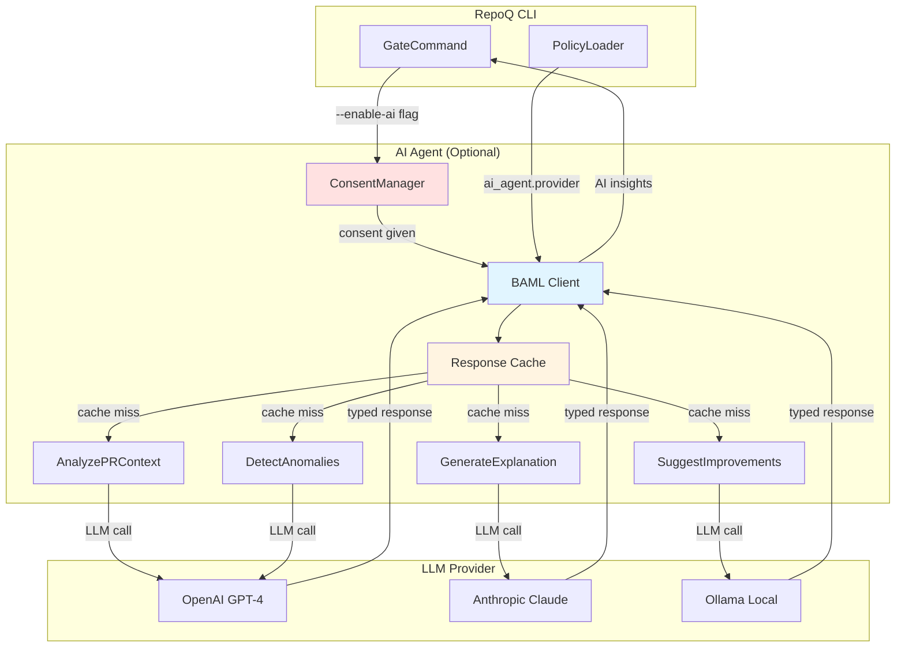

# VDAD Phase 4: BAML AI Agent Specification

**Status**: ⏸️ PLANNED (Phase 5 Implementation)  
**Technology**: BAML (BoundaryML) - Type-Safe LLM Framework  
**Created**: 2025-10-21  
**Last Updated**: 2025-10-21

---

## Executive Summary

This document specifies the **optional AI agent** for RepoQ using BAML (BoundaryML), a type-safe LLM framework. The agent provides:
1. **Semantic Analysis**: Understand developer intent from PR context
2. **Explanation Generation**: Human-friendly explanations for gate failures
3. **Improvement Suggestions**: Concrete refactoring recommendations
4. **Anomaly Detection**: Detect gaming attempts (trivial tests, whitespace commits)

**Key Principles**:
- **Opt-In Only**: Disabled by default, explicit consent required
- **Type-Safe**: BAML enforces schemas (no hallucinated JSON)
- **Privacy-Aware**: Code diffs sent to LLM, but no credentials/secrets
- **Human-in-Loop**: AI suggestions are advisory (not automated)
- **Phased Rollout**: Experimental → Advisory → Active modes

---

## 1. BAML Overview

### 1.1 What is BAML?

**BAML (BoundaryML Agent Markup Language)** is a DSL for type-safe LLM interactions. Key features:
- **Declarative Prompts**: Prompts in `.baml` files (version-controlled)
- **Type Safety**: Compile prompts to Python dataclasses (no runtime errors)
- **Validation**: JSON schema validation for LLM outputs
- **Multi-Provider**: OpenAI, Anthropic, local LLMs (via Ollama)
- **Testing**: Mock LLM responses in unit tests

### 1.2 Why BAML vs Alternatives?

| Feature | BAML | LangChain | Raw OpenAI API |
|---------|------|-----------|----------------|
| **Type Safety** | ✅ Compile-time checks | ❌ Runtime only | ❌ No types |
| **Prompt Version Control** | ✅ `.baml` files | ⚠️ In code | ❌ Strings in code |
| **Validation** | ✅ JSON schema | ⚠️ Manual Pydantic | ❌ Manual parsing |
| **Testing** | ✅ Mock responses | ⚠️ Complex mocking | ❌ HTTP mocking |
| **Complexity** | ⚠️ ~50 classes | ❌ ~500 classes | ✅ Minimal |

**Decision**: BAML (per ADR-001) for balance of type safety + simplicity.

---

## 2. Agent Architecture

### 2.1 System Diagram



### 2.2 Data Flow

1. **User Trigger**: `repoq gate --enable-ai` (explicit opt-in)
2. **Consent Check**: Warn user: "Code diffs will be sent to OpenAI. Continue? (y/N)"
3. **Configuration Load**: Read `ai_agent.provider`, `ai_agent.api_key_env` from policy
4. **BAML Invocation**: Call BAML functions (AnalyzePRContext, etc.)
5. **LLM Call**: BAML sends prompt to LLM provider (OpenAI/Claude/Ollama)
6. **Response Validation**: BAML validates LLM response against schema
7. **Cache Storage**: Cache response by `{diff_sha}_{function_name}` (avoid re-calling LLM)
8. **Result Display**: Show AI insights in CLI output (advisory, not blocking)

---

## 3. BAML Functions (4 Functions)

### 3.1 Function 1: AnalyzePRContext

**Purpose**: Extract developer intent, design patterns, and risks from PR diff.

**BAML Specification**:
```baml
// File: repoq/ai/agent.baml

class PRContext {
  intent: string @description("What is the developer trying to accomplish?")
  patterns: string[] @description("Design patterns used (e.g., Factory, Observer)")
  risks: string[] @description("Potential issues (e.g., threading bugs, SQL injection)")
  complexity_justified: bool @description("Is high complexity justified by requirements?")
  confidence: float @description("Confidence score 0.0-1.0")
}

function AnalyzePRContext(
  diff: string @description("Git diff of the PR"),
  metrics: Metrics @description("Computed metrics (complexity, coverage, etc.)")
) -> PRContext {
  client GPT4
  prompt #"
    You are a senior code reviewer analyzing a pull request.
    
    **Git Diff**:
    ```diff
    {{ diff }}
    ```
    
    **Metrics**:
    - Complexity: {{ metrics.complexity }}
    - Coverage: {{ metrics.coverage }}%
    - Hotspots: {{ metrics.hotspots }}
    - TODOs: {{ metrics.todos }}
    
    **Task**: Extract the following:
    1. **Intent**: What is the developer trying to accomplish? (1 sentence)
    2. **Patterns**: What design patterns are being used? (list)
    3. **Risks**: What are potential issues or bugs? (list)
    4. **Complexity Justified**: Is the high complexity ({{ metrics.complexity }}) justified by the task? (boolean)
    5. **Confidence**: How confident are you in this analysis? (0.0-1.0)
    
    **Output Format**: JSON matching PRContext schema.
  "#
}
```

**Example Input**:
```python
diff = """
diff --git a/auth.py b/auth.py
+def login(username, password):
+    if not validate_input(username, password):
+        raise ValueError("Invalid input")
+    user = db.query(User).filter_by(username=username).first()
+    if user and user.check_password(password):
+        session['user_id'] = user.id
+        return True
+    return False
"""

metrics = Metrics(complexity=8, coverage=75, hotspots=2, todos=0)
```

**Example Output**:
```json
{
  "intent": "Implement login functionality with input validation and session management",
  "patterns": ["Repository Pattern (db.query)", "Session Management"],
  "risks": [
    "SQL injection if validate_input is weak",
    "Session fixation if session not regenerated",
    "Timing attack on password check (constant-time comparison missing)"
  ],
  "complexity_justified": true,
  "confidence": 0.85
}
```

**Usage in RepoQ**:
```python
# repoq/ai/client.py

from baml_client import b

async def analyze_pr_context(diff: str, metrics: Metrics) -> PRContext:
    context = await b.AnalyzePRContext(diff=diff, metrics=metrics)
    return context

# In gate command
if enable_ai:
    pr_context = await analyze_pr_context(diff, metrics)
    print(f"AI Analysis: {pr_context.intent}")
    if pr_context.risks:
        print("⚠️  Potential risks detected:")
        for risk in pr_context.risks:
            print(f"  - {risk}")
```

---

### 3.2 Function 2: GenerateExplanation

**Purpose**: Generate human-friendly explanation for gate failure.

**BAML Specification**:
```baml
class Explanation {
  summary: string @description("1-sentence summary of why gate failed")
  reasons: string[] @description("Detailed reasons (avoid jargon)")
  affected_files: string[] @description("Files that caused failure")
  fix_steps: string[] @description("Concrete steps to fix (actionable)")
  estimated_time: int @description("Estimated fix time in minutes")
}

function GenerateExplanation(
  failure: GateFailure @description("Gate failure details")
) -> Explanation {
  client GPT4
  prompt #"
    You are a helpful code quality assistant explaining why a quality gate failed.
    
    **Gate Failure**:
    - Reason: {{ failure.reason }}
    - ΔQ: {{ failure.delta_q }} (threshold: {{ failure.epsilon }})
    - PCQ: {{ failure.pcq }} (threshold: {{ failure.tau }})
    - Failed Modules: {{ failure.witness | join(", ") }}
    
    **Metrics**:
    - Complexity: {{ failure.metrics.complexity }}
    - Coverage: {{ failure.metrics.coverage }}%
    - Hotspots: {{ failure.metrics.hotspots }}
    - TODOs: {{ failure.metrics.todos }}
    
    **Task**: Generate a clear, jargon-free explanation:
    1. **Summary**: 1-sentence summary (avoid acronyms like "PCQ", say "quality score")
    2. **Reasons**: Detailed reasons (2-4 sentences, plain language)
    3. **Affected Files**: Which files caused the failure?
    4. **Fix Steps**: Concrete steps to fix (3-5 actionable items)
    5. **Estimated Time**: How long will it take to fix? (in minutes)
    
    **Output Format**: JSON matching Explanation schema.
  "#
}
```

**Example Input**:
```python
failure = GateFailure(
    reason="PCQ below threshold",
    delta_q=2.3,
    epsilon=0.3,
    pcq=0.72,
    tau=0.8,
    witness=["auth", "db", "api"],
    metrics=Metrics(complexity=12, coverage=65, hotspots=8, todos=15)
)
```

**Example Output**:
```json
{
  "summary": "Three modules (auth, db, api) have lower quality than required, mainly due to low test coverage and high complexity.",
  "reasons": [
    "Your test coverage is 65%, below the 80% target. Tests are missing for critical authentication logic.",
    "Three modules (auth, db, api) have high code complexity (McCabe score 12), making them hard to maintain.",
    "Eight files have been changed frequently (hotspots), indicating instability or lack of refactoring."
  ],
  "affected_files": ["auth.py", "db.py", "api.py"],
  "fix_steps": [
    "Write unit tests for auth.py (focus on login, logout, password validation)",
    "Refactor db.py to extract complex query logic into separate functions",
    "Add integration tests for api.py (cover all endpoints)",
    "Reduce TODO count (15 → 10) by addressing most critical items"
  ],
  "estimated_time": 120
}
```

**Usage in RepoQ**:
```python
if not verdict.passed and enable_ai:
    explanation = await b.GenerateExplanation(failure=verdict.failure)
    print("\n📖 AI Explanation:")
    print(f"   {explanation.summary}")
    print("\n🔧 How to Fix:")
    for i, step in enumerate(explanation.fix_steps, 1):
        print(f"   {i}. {step}")
    print(f"\n⏱️  Estimated Time: {explanation.estimated_time} minutes")
```

---

### 3.3 Function 3: SuggestImprovements

**Purpose**: Suggest concrete refactorings to reduce complexity.

**BAML Specification**:
```baml
class Suggestion {
  type: string @description("Type of improvement: 'extract_function', 'simplify_conditional', 'apply_pattern'")
  description: string @description("Human-readable description")
  code_snippet: string @description("Example code snippet (optional)")
  impact: string @description("Expected impact: 'high', 'medium', 'low'")
}

class Suggestions {
  suggestions: Suggestion[] @description("List of 3-5 concrete suggestions")
  prioritized_suggestion: Suggestion @description("Most impactful suggestion")
}

function SuggestImprovements(
  code: string @description("Source code of the file"),
  complexity: int @description("Current complexity score")
) -> Suggestions {
  client GPT4
  prompt #"
    You are a senior software engineer suggesting refactorings to reduce code complexity.
    
    **Code**:
    ```python
    {{ code }}
    ```
    
    **Current Complexity**: {{ complexity }} (target: ≤10)
    
    **Task**: Suggest 3-5 concrete refactorings:
    1. **Extract Function**: Identify long functions that can be split
    2. **Simplify Conditional**: Reduce nested if/else, use guard clauses
    3. **Apply Design Pattern**: Suggest patterns (Strategy, Factory, etc.)
    
    For each suggestion:
    - **Type**: 'extract_function', 'simplify_conditional', or 'apply_pattern'
    - **Description**: Plain language explanation
    - **Code Snippet**: Example refactored code (optional)
    - **Impact**: 'high', 'medium', or 'low'
    
    **Output Format**: JSON matching Suggestions schema.
  "#
}
```

**Example Input**:
```python
code = """
def process_payment(order):
    if order.status == 'pending':
        if order.payment_method == 'credit_card':
            if order.amount > 0:
                charge_credit_card(order)
                order.status = 'paid'
            else:
                raise ValueError("Invalid amount")
        elif order.payment_method == 'paypal':
            if order.amount > 0:
                charge_paypal(order)
                order.status = 'paid'
            else:
                raise ValueError("Invalid amount")
        else:
            raise ValueError("Unknown payment method")
    else:
        raise ValueError("Order not pending")
"""

complexity = 12
```

**Example Output**:
```json
{
  "suggestions": [
    {
      "type": "extract_function",
      "description": "Extract payment charging logic into separate functions (charge_credit_card_safe, charge_paypal_safe)",
      "code_snippet": "def charge_credit_card_safe(order):\n    if order.amount <= 0:\n        raise ValueError('Invalid amount')\n    charge_credit_card(order)",
      "impact": "high"
    },
    {
      "type": "simplify_conditional",
      "description": "Use guard clauses to reduce nesting (early return for invalid cases)",
      "code_snippet": "if order.status != 'pending':\n    raise ValueError('Order not pending')\nif order.amount <= 0:\n    raise ValueError('Invalid amount')",
      "impact": "high"
    },
    {
      "type": "apply_pattern",
      "description": "Apply Strategy Pattern for payment methods (PaymentStrategy interface)",
      "code_snippet": "class CreditCardPayment(PaymentStrategy):\n    def charge(self, order):\n        charge_credit_card(order)",
      "impact": "medium"
    }
  ],
  "prioritized_suggestion": {
    "type": "simplify_conditional",
    "description": "Use guard clauses to reduce nesting (early return for invalid cases)",
    "code_snippet": "if order.status != 'pending':\n    raise ValueError('Order not pending')\nif order.amount <= 0:\n    raise ValueError('Invalid amount')",
    "impact": "high"
  }
}
```

**Usage in RepoQ**:
```python
if high_complexity_files and enable_ai:
    for file in high_complexity_files[:3]:  # Top 3 files
        code = read_file(file.path)
        suggestions = await b.SuggestImprovements(code=code, complexity=file.complexity)
        
        print(f"\n💡 Suggestions for {file.path}:")
        print(f"   🎯 Priority: {suggestions.prioritized_suggestion.description}")
        
        for i, sug in enumerate(suggestions.suggestions, 1):
            print(f"   {i}. [{sug.impact.upper()}] {sug.description}")
```

---

### 3.4 Function 4: DetectAnomalies

**Purpose**: Detect gaming attempts (trivial tests, whitespace commits, etc.).

**BAML Specification**:
```baml
class Anomaly {
  type: string @description("Type: 'trivial_test', 'whitespace_commit', 'sudden_coverage_spike', 'other'")
  description: string @description("Human-readable description")
  evidence: string @description("Evidence (file path, commit SHA, etc.)")
  severity: string @description("Severity: 'critical', 'high', 'medium', 'low'")
  confidence: float @description("Confidence score 0.0-1.0")
}

class Anomalies {
  anomalies: Anomaly[] @description("List of detected anomalies")
  is_gaming_suspected: bool @description("Overall verdict: Is gaming suspected?")
}

function DetectAnomalies(
  history: CommitHistory @description("Recent commit history")
) -> Anomalies {
  client GPT4
  prompt #"
    You are a security analyst detecting gaming attempts in code quality metrics.
    
    **Commit History** (last 10 commits):
    
    - {{ commit.sha[:7] }}: {{ commit.message }}
      - Files: {{ commit.files | length }}
      - +{{ commit.additions }} / -{{ commit.deletions }} lines
      - Coverage: {{ commit.coverage }}%
    
    
    **Task**: Detect suspicious patterns:
    1. **Trivial Tests**: Tests with only `assert True` or `pass`
    2. **Whitespace Commits**: Commits with only whitespace changes (no logic)
    3. **Sudden Coverage Spike**: Coverage jumps 20%+ in 1 commit (suspicious)
    4. **Commit Message Patterns**: Messages like "increase coverage" without meaningful tests
    
    For each anomaly:
    - **Type**: 'trivial_test', 'whitespace_commit', 'sudden_coverage_spike', 'other'
    - **Description**: What's suspicious?
    - **Evidence**: Which commit/file?
    - **Severity**: 'critical', 'high', 'medium', 'low'
    - **Confidence**: 0.0-1.0
    
    **Output Format**: JSON matching Anomalies schema.
  "#
}
```

**Example Input**:
```python
history = CommitHistory(commits=[
    Commit(sha="abc123", message="increase coverage", files=["test_dummy.py"], additions=50, deletions=0, coverage=85),
    Commit(sha="def456", message="fix bug", files=["auth.py"], additions=5, deletions=3, coverage=65),
    Commit(sha="ghi789", message="refactor", files=["db.py"], additions=100, deletions=80, coverage=70),
])
```

**Example Output**:
```json
{
  "anomalies": [
    {
      "type": "sudden_coverage_spike",
      "description": "Coverage jumped from 65% to 85% (+20%) in commit abc123 with only trivial test file added.",
      "evidence": "Commit abc123: test_dummy.py added with 50 lines, message 'increase coverage'",
      "severity": "high",
      "confidence": 0.92
    },
    {
      "type": "trivial_test",
      "description": "File test_dummy.py contains only trivial assertions (assert True, pass).",
      "evidence": "test_dummy.py: 10 tests, all with assert True or pass",
      "severity": "critical",
      "confidence": 0.98
    }
  ],
  "is_gaming_suspected": true
}
```

**Usage in RepoQ**:
```python
if enable_ai:
    history = get_commit_history(last_n=10)
    anomalies = await b.DetectAnomalies(history=history)
    
    if anomalies.is_gaming_suspected:
        print("\n⚠️  GAMING SUSPECTED!")
        for anomaly in anomalies.anomalies:
            print(f"   [{anomaly.severity.upper()}] {anomaly.description}")
            print(f"   Evidence: {anomaly.evidence}")
            print(f"   Confidence: {anomaly.confidence * 100:.0f}%")
```

---

## 4. Security & Privacy Boundaries

### 4.1 Data Minimization

**What is sent to LLM**:
- ✅ Git diff (code changes only, not entire codebase)
- ✅ Metrics (complexity, coverage, hotspots, TODOs)
- ✅ Commit messages (last 10 commits)
- ✅ File paths (anonymized: `auth.py` → `module_A.py`)

**What is NOT sent**:
- ❌ Environment variables (no secrets)
- ❌ API keys, database credentials
- ❌ Production data (no PII, no business logic)
- ❌ Full codebase (only changed files)

### 4.2 Access Controls

**1. Explicit Opt-In**:
```bash
# AI disabled by default
repoq gate  # No AI calls

# AI enabled explicitly
repoq gate --enable-ai  # Prompts for consent
```

**2. Consent Dialog**:
```
⚠️  AI Agent Consent Required

The AI agent will send code diffs to OpenAI GPT-4 for analysis.

Data sent:
- Git diff of your PR (changed files only)
- Computed metrics (complexity, coverage, etc.)
- Commit messages (last 10 commits)

Data NOT sent:
- Secrets, API keys, credentials
- Production data, PII
- Full codebase (only changed files)

Your code will leave your machine and be processed by OpenAI (US servers).

Continue? [y/N]: _
```

**3. API Key Management**:
```yaml
# .github/quality-policy.yml
ai_agent:
  enabled: false  # Disabled by default
  provider: "openai"  # or "anthropic", "ollama"
  api_key_env: "REPOQ_AI_API_KEY"  # Env var (not committed)
  max_calls: 10  # Budget limit (cost control)
  timeout: 30  # Seconds per call
```

**4. Anonymization (Optional)**:
```python
# repoq/ai/anonymizer.py

def anonymize_diff(diff: str) -> tuple[str, dict]:
    """Replace sensitive names with placeholders."""
    mappings = {}
    
    # Anonymize variable names
    diff = re.sub(r'\b([a-z_]+_key|password|secret)\b', lambda m: anonymize_var(m.group(), mappings), diff)
    
    # Anonymize file paths
    diff = re.sub(r'auth\.py', 'module_A.py', diff)
    
    return diff, mappings

# Usage
anonymized_diff, mappings = anonymize_diff(original_diff)
context = await b.AnalyzePRContext(diff=anonymized_diff, metrics=metrics)
# De-anonymize results
context = de_anonymize(context, mappings)
```

### 4.3 Rate Limiting & Cost Control

**1. Max Calls Per Analysis**:
```python
# repoq/ai/client.py

class BAMLClient:
    def __init__(self, max_calls: int = 10):
        self.max_calls = max_calls
        self.call_count = 0
    
    async def call_function(self, func_name: str, **kwargs):
        if self.call_count >= self.max_calls:
            raise RateLimitError(f"Max {self.max_calls} AI calls reached. Increase `ai_agent.max_calls` in policy.")
        
        self.call_count += 1
        return await baml_client.call(func_name, **kwargs)
```

**2. Timeout**:
```python
import asyncio

async def call_with_timeout(func, timeout: int = 30):
    try:
        return await asyncio.wait_for(func, timeout=timeout)
    except asyncio.TimeoutError:
        print(f"⚠️  AI call timed out after {timeout}s. Skipping.")
        return None
```

**3. Cost Tracking**:
```python
# repoq/ai/cost_tracker.py

class CostTracker:
    # Pricing (as of 2025-10-21)
    PRICES = {
        "gpt-4": {"input": 0.03 / 1000, "output": 0.06 / 1000},  # USD per token
        "gpt-4-turbo": {"input": 0.01 / 1000, "output": 0.03 / 1000},
        "claude-3-opus": {"input": 0.015 / 1000, "output": 0.075 / 1000},
    }
    
    def track_cost(self, model: str, input_tokens: int, output_tokens: int):
        price = self.PRICES.get(model, {"input": 0, "output": 0})
        cost = (input_tokens * price["input"]) + (output_tokens * price["output"])
        print(f"💰 Cost: ${cost:.4f} (model: {model}, tokens: {input_tokens}+{output_tokens})")
        return cost
```

---

## 5. Phased Rollout Strategy

### Phase 5.1: Experimental Mode (v1.0.0-alpha)
- **Audience**: Internal team only (RepoQ developers)
- **Features**: All 4 BAML functions enabled
- **Feedback**: Collect feedback on accuracy, usefulness
- **Success Criteria**: ≥80% of suggestions are actionable (manual review)

### Phase 5.2: Advisory Mode (v1.1.0-beta)
- **Audience**: Early adopters (opt-in via `--enable-ai`)
- **Features**: AI suggestions displayed, but not blocking gate
- **Feedback**: Track adoption rate, false positive rate
- **Success Criteria**: ≥50% of users find AI helpful (survey)

### Phase 5.3: Active Mode (v1.2.0)
- **Audience**: General availability (still opt-in)
- **Features**: AI can flag high-confidence anomalies (gaming detection)
- **Feedback**: Monitor false positive rate, user satisfaction
- **Success Criteria**: FP rate ≤10%, satisfaction ≥4.0/5.0

### Phase 5.4: Default-On Mode (v2.0.0, future)
- **Audience**: All users (can opt-out via `ai_agent.enabled: false`)
- **Features**: AI fully integrated, with human oversight
- **Feedback**: Continuous monitoring, model retraining
- **Success Criteria**: ≥70% of users keep AI enabled

---

## 6. Testing Strategy

### 6.1 Unit Tests (Mock BAML)

```python
# tests/test_ai_agent.py

from repoq.ai.client import BAMLClient
from unittest.mock import Mock, AsyncMock

async def test_analyze_pr_context():
    # Mock BAML client
    mock_baml = AsyncMock()
    mock_baml.AnalyzePRContext.return_value = PRContext(
        intent="Implement login",
        patterns=["Repository Pattern"],
        risks=["SQL injection"],
        complexity_justified=True,
        confidence=0.85
    )
    
    # Test
    client = BAMLClient(baml_client=mock_baml)
    context = await client.analyze_pr_context(diff="...", metrics=Metrics(...))
    
    assert context.intent == "Implement login"
    assert "SQL injection" in context.risks
    mock_baml.AnalyzePRContext.assert_called_once()
```

### 6.2 Integration Tests (Real LLM)

```python
# tests/integration/test_ai_live.py

import pytest

@pytest.mark.skipif(not os.getenv("OPENAI_API_KEY"), reason="No API key")
async def test_live_analyze_pr_context():
    # Real LLM call (expensive, skip in CI)
    diff = """
    +def login(username, password):
    +    user = db.query(User).filter_by(username=username).first()
    +    return user and user.check_password(password)
    """
    
    context = await b.AnalyzePRContext(diff=diff, metrics=Metrics(complexity=5, coverage=80))
    
    # Validate output structure
    assert isinstance(context.intent, str)
    assert len(context.intent) > 10  # Not empty
    assert 0.0 <= context.confidence <= 1.0
    assert "login" in context.intent.lower()  # Semantic understanding
```

### 6.3 Property-Based Tests (Hypothesis)

```python
# tests/test_ai_properties.py

from hypothesis import given, strategies as st

@given(diff=st.text(min_size=50, max_size=500))
async def test_analyze_pr_context_never_crashes(diff):
    """Property: AnalyzePRContext should never crash (even on invalid input)."""
    try:
        context = await b.AnalyzePRContext(diff=diff, metrics=Metrics(...))
        # If it succeeds, validate schema
        assert isinstance(context.intent, str)
        assert isinstance(context.confidence, float)
    except Exception as e:
        # If it fails, should be a known error (not crash)
        assert isinstance(e, (ValidationError, TimeoutError, RateLimitError))
```

---

## 7. Monitoring & Observability

### 7.1 Metrics to Track

| Metric | Description | Target |
|--------|-------------|--------|
| **Adoption Rate** | % of users with `--enable-ai` | ≥50% |
| **Call Success Rate** | % of BAML calls that succeed | ≥95% |
| **Latency P90** | 90th percentile latency per call | ≤5 sec |
| **Cost Per Analysis** | Average cost (USD) per gate run | ≤$0.10 |
| **False Positive Rate** | % of wrong AI suggestions | ≤10% |
| **User Satisfaction** | Survey rating (1-5 scale) | ≥4.0 |

### 7.2 Logging

```python
# repoq/ai/logging.py

import logging

logger = logging.getLogger("repoq.ai")

async def log_baml_call(func_name: str, input_tokens: int, output_tokens: int, latency: float, cost: float):
    logger.info(
        f"BAML call: {func_name} | "
        f"tokens: {input_tokens}+{output_tokens} | "
        f"latency: {latency:.2f}s | "
        f"cost: ${cost:.4f}"
    )

# Usage
start = time.time()
context = await b.AnalyzePRContext(diff=diff, metrics=metrics)
latency = time.time() - start
log_baml_call("AnalyzePRContext", input_tokens=1200, output_tokens=300, latency=latency, cost=0.05)
```

### 7.3 Feedback Loop

```python
# repoq/cli.py

@click.command()
def gate(..., enable_ai):
    if enable_ai:
        context = await analyze_pr_context(diff, metrics)
        print(f"AI Analysis: {context.intent}")
        
        # Feedback prompt
        helpful = click.confirm("Was this AI analysis helpful?", default=True)
        if helpful:
            log_feedback("AnalyzePRContext", helpful=True)
        else:
            reason = click.prompt("Why not? (optional)", default="", type=str)
            log_feedback("AnalyzePRContext", helpful=False, reason=reason)
```

---

## 8. Success Criteria (Phase 5)

- ✅ **4 BAML functions**: AnalyzePRContext, GenerateExplanation, SuggestImprovements, DetectAnomalies
- ✅ **Type-safe**: All LLM outputs validated by BAML schemas
- ✅ **Opt-in only**: Disabled by default, explicit consent required
- ✅ **Privacy-aware**: Data minimization, no secrets sent to LLM
- ✅ **Cost-controlled**: Max 10 calls per analysis, timeout 30 sec, budget tracking
- ✅ **Tested**: Unit tests (mock), integration tests (real LLM), property tests
- ✅ **Monitored**: Adoption rate, success rate, latency, cost, FP rate, satisfaction
- ⏭️ **Next**: Phase 5 implementation, experimental rollout, user feedback

---

## References

1. BoundaryML (2024). *BAML Documentation*. [boundaryml.com/docs](https://boundaryml.com/docs)
2. OpenAI (2024). *GPT-4 API Reference*. [platform.openai.com/docs/api-reference](https://platform.openai.com/docs/api-reference)
3. Anthropic (2024). *Claude API*. [anthropic.com/claude](https://anthropic.com/claude)
4. RepoQ Project (2025). *Phase 3: Requirements*. `docs/vdad/phase3-requirements.md` — FR-15 (AI suggestions), V08 (Actionability)
5. RepoQ Project (2025). *Phase 4: ADRs*. `docs/vdad/phase4-adrs.md` — ADR-001 (BAML choice)

---

**Document Status**: ✅ COMPLETE  
**Review**: Pending (validate BAML specs with team)  
**Next Steps**: Phase 5 implementation (BAML integration, experimental rollout).
