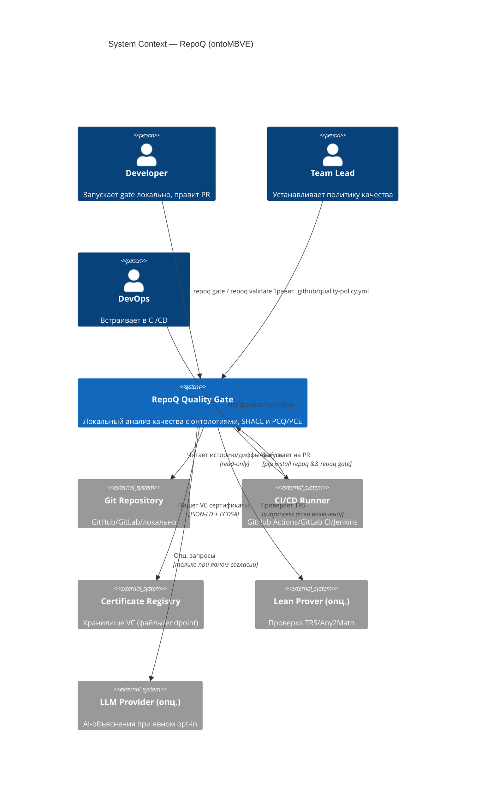
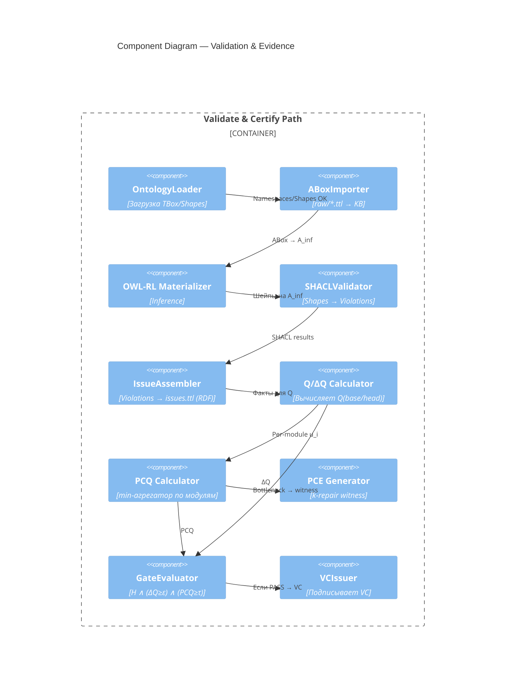
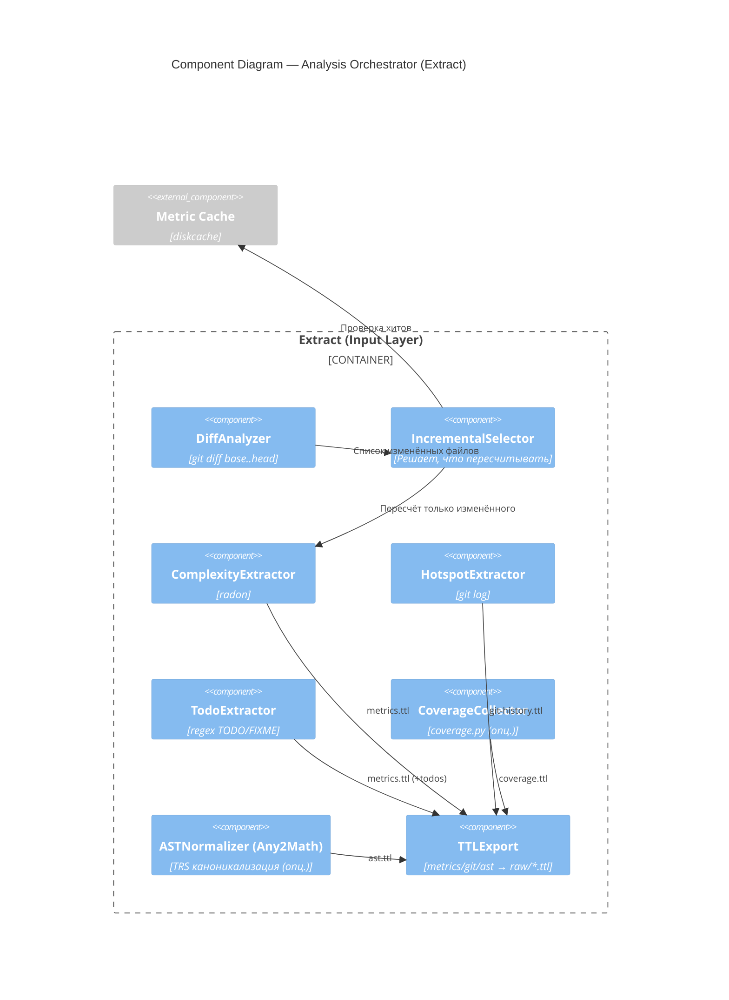

# VDAD Phase 4 — C4 Architecture (ontoMBVE‑aligned, v2)

**Status**: ✅ ACTIVE  
**Model**: C4 (Simon Brown)  
**Date**: 2025‑10‑23  
**Scope**: RepoQ Quality Gate — локальный анализ качества с формальными гарантиями  
**Why v2**: Вносит чёткое разделение Input→Reason→Validate→Certify и слои O/M/V/E, добавляет хранилище триплетов, SHACL‑валидацию, PCQ/PCE (ZAG), VC‑сертификаты и рабочее пространство `.repoq`. Основано на принятых SD/FR/NFR (Phase 3) и ценностях V01–V08 (Phase 2).

**References**:

- [Phase 3 Requirements](phase3-requirements.md)
- [Phase 2 Value Register](phase2-value-register.md)
- [Architecture Mapping (.repoq/ vs repoq/)](phase4-c4-architecture-mapping.md)

---

## Level 1 — System Context

Показывает RepoQ, внешних акторов и опциональные зависимости (Lean, LLM, реестр VC).



**Примечания**: Контекст/акторы и интеграции соответствуют v1, но акцент перенесён на валидацию через SHACL и выпуск VC (FR‑19) и на локальность анализа (FR‑14) из Phase 3.

**Refs**:

- [Phase 4 C4 Diagrams](phase4-c4-diagrams.md) (previous version)
- [Phase 3 Requirements](phase3-requirements.md)

---

## Level 2 — Container Diagram

Контейнеры выстроены по слоям ontoMBVE:
**O** (онтологии) → **M** (модель‑граф) → **V** (валидация) → **E** (доказательства/метрики).

```mermaid
C4Container
    title Container Diagram — RepoQ (O/M/V/E)

    Person(user, "User", "Dev/Lead/DevOps")
    System_Ext(git, "Git", "История, файлы, диффы")
    System_Ext(lean, "Lean (опц.)", "TRS-проверки")
    System_Ext(llm, "LLM (опц.)", "AI подсказки")
    System_Ext(vc_reg, "VC Registry", "Хранилище сертификатов")

    Container_Boundary(repoq, "RepoQ System") {

        %% CLI / Orchestration
        Container(cli, "CLI", "Python/Click", "Команды: analyze, validate, gate, witness, certify, report")

        Container(orch, "Analysis Orchestrator", "Python", 
          "Пайплайн: Extract → Reason → Validate → Gate/Certify")

        %% O/M layers
        Container(ont, "Ontology Pack (O)", "TTL/RDF", 
          "Code/C4/DDD + RBox аксиомы, shapes/*.ttl")
        Container(kb, "Triple Store (M)", "RDFLib/Oxigraph", 
          "ABox raw + inferred, SPARQL")
        Container(reasoner, "Reasoner (M)", "OWL RL / RDFS++", 
          "Материализация транзитивностей/цепочек свойств")

        %% V layer (validation)
        Container(shacl, "SHACL Validator (V)", "pySHACL", 
          "Проверка шейпов, генерация violations → issues.ttl")

        %% E layer (evidence)
        Container(gate, "Gate Logic (E)", "Python", 
          "ΔQ, hard constraints, ε/τ")
        Container(zag, "PCQ/PCE (ZAG) (E)", "Python", 
          "PCQ=min, PCE k-repair witness")
        Container(vcgen, "VC Generator (E)", "Python/cryptography", 
          "W3C VC JSON-LD + ECDSA")

        %% Workspace & cache
        Container(fs, "Workspace .repoq/", "FS", 
          "raw/*.ttl, validated/{facts,issues}.ttl, reports/*, certificates/*, manifest.json")
        Container(cache, "Metric Cache", "diskcache", "SHA-based")
        
        %% Optional bridges
        Container(any2math, "Any2Math Bridge (опц.)", "Python+Lean", 
          "TRS-каноникализация AST для детерминизма")
        Container(ai, "AI Agent (опц.)", "BAML", 
          "Объяснения/подсказки при opt-in")
    }

    %% Flows
    Rel(user, cli, "Запускает команды")
    Rel(cli, orch, "Управляет пайплайном")
    Rel(orch, git, "Чтение диффов/файлов/истории")
    Rel(orch, cache, "Кеш метрик", "FR-10")
    Rel(orch, fs, "Сохраняет raw/*.ttl, validated/*.ttl, reports/*")
    Rel(orch, ont, "Загружает TBox/Shapes")
    Rel(orch, kb, "Грузит raw в ABox, обновляет модель")
    Rel(kb, reasoner, "Выводит новые факты (inference)")
    Rel(kb, shacl, "Валидирует по shapes → violations")
    Rel(orch, gate, "ΔQ/ε/τ; H‑ограничения")
    Rel(gate, zag, "PCQ(min), PCE witness")
    Rel(gate, vcgen, "Выпуск VC")
    Rel(vcgen, fs, "Сохраняет VC")
    Rel(cli, vc_reg, "Публикация (опц.)")
    Rel(any2math, lean, "Проверки TRS", "опционально")
    Rel(orch, ai, "AI‑подсказки", "только с consent")

    UpdateLayoutConfig($c4ShapeInRow="3",$c4BoundaryInRow="1")
```

**Соответствие требованиям**:

- ΔQ/ε/τ и hard constraints — FR‑08/09
- Локальность анализа — FR‑14
- PCQ/PCE — FR‑04/05/11
- VC — FR‑19
- Кеш/инкрементальность — FR‑10

**Refs**: [Phase 3 Requirements](phase3-requirements.md)

---

## Level 3 — Component Diagrams

### 3.1 Validation & Evidence Line (M→V→E)



**Примечания**: Такой разрез закрывает ценности V01/V02/V04/V08 (прозрачность, анти‑гейминг, монотонность, практическая полезность) из Value Register.

**Refs**: [Phase 2 Value Register](phase2-value-register.md)

---

### 3.2 Analysis Orchestrator (Input → raw)



**Примечания**: Инкрементальность/кеш закрывает NFR‑01, а детерминизм анализа опирается на Any2Math/Lean (опция), что отражено в FR‑06/07.

**Refs**: [Phase 3 Requirements](phase3-requirements.md)

---

## Deployment View

### Локально

```text
Dev laptop
 ├─ Git (локальный clone)
 └─ RepoQ (pip)
     ├─ Extract → .repoq/raw/*.ttl
     ├─ Reason/Validate → .repoq/validated/{facts,issues}.ttl
     ├─ Gate/Certify → .repoq/certificates/<sha>.json
     └─ Reports → .repoq/reports/*
```

### CI/CD

```yaml
actions/checkout@v3 (fetch-depth: 0) 
→ pip install repoq 
→ repoq gate --base $BASE --head $HEAD
```

Артефакты: отчёт, VC, (опц.) комментарий в PR. Соответствует FR‑18/19.

**Refs**: [Phase 3 Requirements](phase3-requirements.md)

---

## OntoMBVE Mapping (слои → контейнеры)

| Layer | Container              | Purpose                                      |
|-------|------------------------|----------------------------------------------|
| **O** | Ontology Pack          | TBox/RBox definitions, SHACL shapes          |
| **M** | Triple Store + Reasoner| Digital Twin (ABox raw + inferred facts)     |
| **V** | SHACL Validator        | Constraint validation, violations generation |
| **E** | Gate/PCQ/PCE/VC        | Evidence layer: metrics, certificates, reports|

Такое разделение прямо поддерживает стратегические решения SD‑02/03/04/06 из Phase 3.

**Refs**: [Phase 3 Requirements](phase3-requirements.md)

---

## Трассировка требований и ценностей

| Value/Requirement | C4 Component                  | Implementation                     |
|-------------------|-------------------------------|------------------------------------|
| V01 (Transparency)| IssueAssembler, Reports       | Detailed RDF output, issues.ttl    |
| V02 (Anti-gaming) | PCQ/PCE (ZAG)                 | PCQ=min, k-repair witness          |
| V05 (Speed)       | Metric Cache, Incremental     | SHA-based cache (FR-10)            |
| V16 (Privacy)     | Local Analysis                | No network calls by default (FR-14)|
| FR-01/02/03       | SHACL Validator, Reports      | Validation + human reports         |
| FR-04/05/11       | PCQ/PCE Calculator            | Quality aggregation + witness      |
| FR-08/09          | Gate Logic                    | ΔQ/ε/τ thresholds                  |
| FR-19             | VC Generator                  | W3C Verifiable Credentials         |

**Refs**:

- [Phase 2 Value Register](phase2-value-register.md)
- [Phase 3 Requirements](phase3-requirements.md)

---

## Изменения относительно C4 v1 (кратко)

1. Добавлены явные контейнеры: **Triple Store**, **Reasoner**, **SHACL Validator**, **Workspace .repoq/**
2. Линия **Validate→Certify** выделена отдельно
3. **PCQ/PCE (ZAG)** включены в Gate Logic
4. Диаграммы увязаны с **ontoMBVE** и **FR/NFR/EVR** из Phase 3

**Refs**:

- [Phase 4 C4 Diagrams (v1)](phase4-c4-diagrams.md)
- [Phase 3 Requirements](phase3-requirements.md)

---

## Open Questions / ADR Links

### Critical Issues (must be resolved before production)

1. **OWL-RL Materializer Termination Guard**
   - **Issue**: Risk of infinite loop on cyclic ontologies
   - **Proposed Fix**: Add `MAX_ITERATIONS = 1000` guard
   - **Status**: ⚠️ Not implemented (Feature 3.5 required)
   - **ADR**: TBD (will create ADR-016: OWL-RL Reasoner Architecture)

2. **SHACL Severity Levels**
   - **Issue**: Distinguish `sh:Violation` vs `sh:Warning` vs `sh:Info`
   - **Proposed Fix**: Already supported in `SHACLValidator._parse_shacl_results()`
   - **Status**: ✅ Implemented
   - **ADR**: ADR-015 (SHACL Validation Strategy)

3. **Manifest Schema Versioning**
   - **Issue**: `manifest.json` needs `schema_version` field for backward compatibility
   - **Proposed Fix**: Add `"schema_version": "1.0"` field
   - **Status**: ⚠️ Not implemented (planned for v2.0.0-beta.5)
   - **ADR**: ADR-014 (Single Source of Truth)

### Architecture Decisions Needed

- **Q1**: Use Oxigraph vs Neo4j vs RDFLib for Triple Store?
  - Current: RDFLib (in-memory, works for <10MB graphs)
  - Proposed: Oxigraph for production (SPARQL performance)
  - Roadmap: Feature 4.1 (Neo4j Export)

- **Q2**: OWL-RL vs OWL-DL vs RDFS++ for reasoning?
  - Proposed: OWL-RL (decidable, terminating)
  - Risk: Cyclic ontologies → infinite loop
  - Mitigation: MAX_ITERATIONS guard

- **Q3**: Local AI agent vs external LLM API?
  - Current: External (OpenAI/Anthropic) with opt-in
  - Privacy concern: Send code snippets to LLM
  - Proposed: Local model (Ollama) for privacy-sensitive projects

---

## Related Documentation

- [Architecture Mapping (.repoq/ vs repoq/)](phase4-c4-architecture-mapping.md) — detailed implementation mapping
- [Phase 3 Requirements](phase3-requirements.md) — SD/FR/NFR specifications
- [Phase 2 Value Register](phase2-value-register.md) — V01–V08 values
- [Phase 1 Domain Context](phase1-domain-context.md) — domain model
- [ADR-014: Single Source of Truth](../adr/adr-014-single-source-of-truth.md)

---

**Document Version**: 2.0  
**Last Updated**: 2025-10-23  
**Status**: ✅ ACTIVE (official architecture reference)
