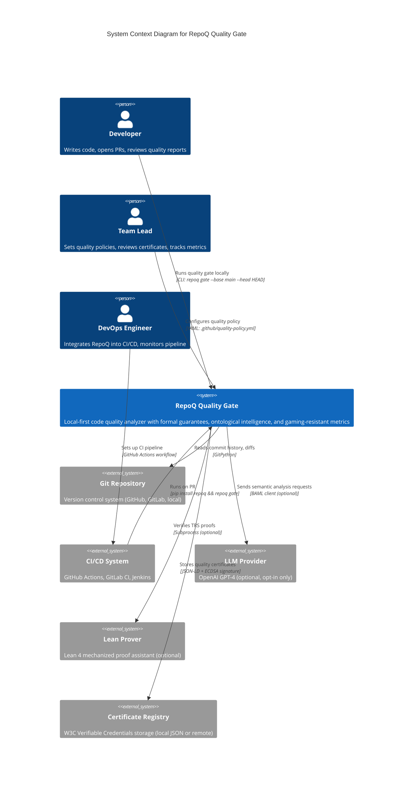
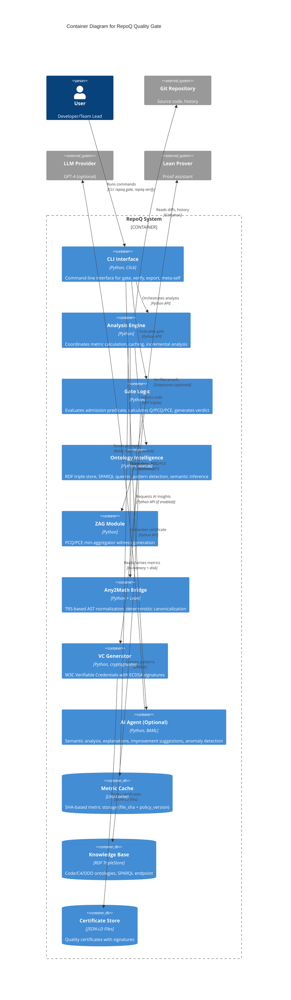
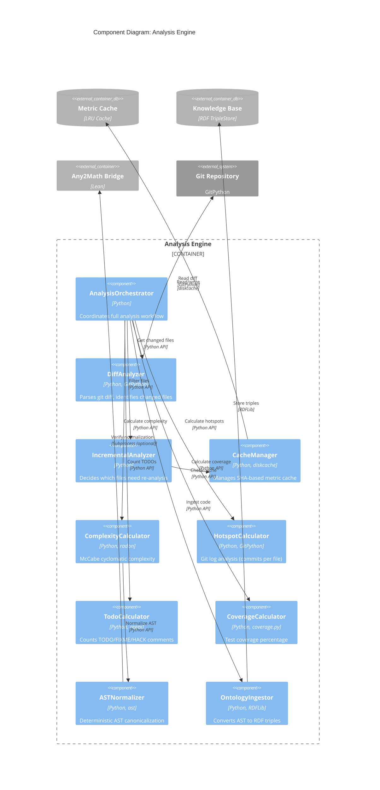
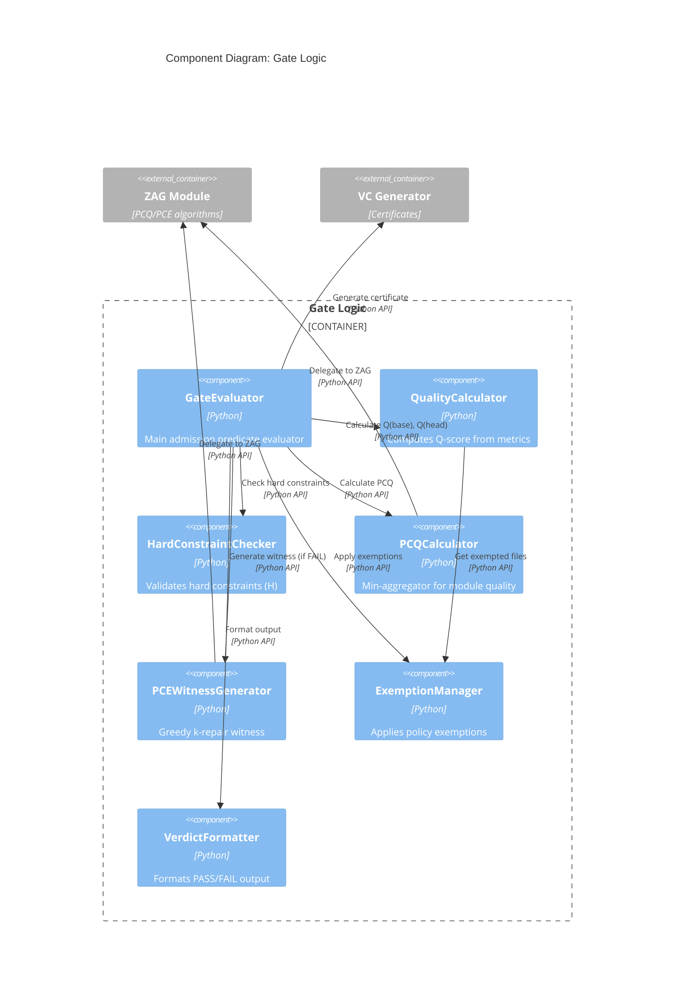

# VDAD Phase 4: C4 Architecture Diagrams

**Status**: ✅ ACTIVE  
**Model**: C4 Model by Simon Brown (https://c4model.com)  
**Created**: 2025-10-21  
**Last Updated**: 2025-10-21

---

## Overview

This document presents the **C4 architecture diagrams** for RepoQ using the C4 Model:
- **Level 1 (Context)**: System context — RepoQ + external actors
- **Level 2 (Container)**: Major components + data flows
- **Level 3 (Component)**: Internal structure of key containers

The C4 Model provides a hierarchical view of the system, from high-level context to detailed component interactions.

---

## Level 1: System Context Diagram

### Purpose
Shows RepoQ in its operating environment with external actors and systems.

### Diagram



### Key Relationships

1. **Developer ↔ RepoQ**
   - **Trigger**: `repoq gate --base main --head HEAD` (local CLI)
   - **Output**: Quality report (Q-score, ΔQ, PCQ, PCE witness), VC certificate
   - **Frequency**: Per commit or PR

2. **Team Lead ↔ RepoQ**
   - **Action**: Configure `.github/quality-policy.yml` (thresholds, weights, exemptions)
   - **Feedback**: Review gate decisions, certificate trail
   - **Frequency**: Weekly policy updates

3. **CI/CD ↔ RepoQ**
   - **Integration**: GitHub Actions workflow runs `repoq gate` on every PR
   - **Decision**: Merge blocked if gate fails (exit code 1)
   - **Artifacts**: Certificates published as workflow artifacts

4. **RepoQ ↔ Git**
   - **Read**: Commit history, diffs, file contents, blame info
   - **Write**: None (read-only analysis)

5. **RepoQ ↔ LLM** (Optional, Opt-In Only)
   - **Trigger**: User enables `ai_agent.enabled: true` in policy
   - **Data sent**: Code diffs, metrics (no credentials, no production secrets)
   - **Data received**: Semantic analysis, improvement suggestions, anomaly detection
   - **Security**: Explicit consent required, max 10 calls/analysis, 30sec timeout

6. **RepoQ ↔ Lean** (Optional, For Formal Verification)
   - **Trigger**: User enables `formal_verification: true` in policy
   - **Process**: Subprocess call to `lean verify_trs.lean`
   - **Output**: Proof of TRS confluence/termination/idempotence
   - **Fallback**: Skip if Lean not installed

7. **RepoQ ↔ Certificate Registry**
   - **Write**: JSON-LD + ECDSA-signed VCs (quality certificates)
   - **Read**: Past certificates for longitudinal analysis
   - **Storage**: Local `.repoq/certificates/` or remote endpoint

---

## Level 2: Container Diagram

### Purpose
Shows major containers (applications/data stores) within RepoQ and their interactions.

### Diagram



### Container Responsibilities

#### CLI Interface
- **Technology**: Python 3.11+, Click 8.x
- **Responsibility**: Parse commands, load config, display output
- **Commands**: `gate`, `verify`, `export`, `meta-self`, `report`
- **Input**: CLI args, `.github/quality-policy.yml`
- **Output**: Formatted text, JSON, certificates
- **Exit codes**: 0 (PASS), 1 (FAIL), 2 (ERROR)

#### Analysis Engine
- **Technology**: Python 3.11+, radon, coverage.py, GitPython
- **Responsibility**: Calculate base/head metrics, manage cache, incremental analysis
- **Metrics**: Complexity (McCabe), Hotspots (git log), TODOs (regex), Coverage (coverage.py)
- **Optimization**: SHA-based caching, LRU eviction, parallel file processing
- **Performance**: Target ≤2 min (P90) for <1K files

#### Gate Logic
- **Technology**: Python 3.11+
- **Responsibility**: Evaluate admission predicate, compute Q/ΔQ/PCQ, generate verdict
- **Formula**: `Q = Q_max - Σ(w_i * x_i)`, `Admission = H ∧ (ΔQ ≥ ε) ∧ (PCQ ≥ τ)`
- **Hard constraints**: Test coverage ≥80%, TODO ≤100, Hotspots ≤20
- **Output**: PASS/FAIL + detailed metrics + PCE witness (if FAIL)

#### Ontology Intelligence
- **Technology**: Python 3.11+, RDFLib 7.x, pySHACL 0.25.x
- **Responsibility**: RDF triple store, SPARQL queries, pattern detection
- **Ontologies**: O_Code (functions, classes, calls), O_C4 (components, dependencies), O_DDD (bounded contexts, aggregates)
- **Patterns**: MVC, Layered Architecture, Microservices, Plugin, Strategy
- **Inference**: Semantic relationships (e.g., "Controller depends on Model")
- **Validation**: SHACL shape validation

#### ZAG Module (Zero-Allowance Gate)
- **Technology**: Python 3.11+
- **Responsibility**: PCQ min-aggregator, PCE k-repair witness generation
- **Algorithm**: PCQ = min{Q(M_i) for all modules i}, PCE = greedy k-min selection
- **Guarantee**: Gaming-resistant (no compensation, all modules ≥τ)
- **Performance**: O(n log n) for PCE witness
- **Reference**: `tmp/zag/` (partially implemented)

#### Any2Math Bridge
- **Technology**: Python 3.11+ (AST), Lean 4 (proofs)
- **Responsibility**: TRS-based AST normalization, deterministic canonicalization
- **Rules**: Remove Pass, normalize var order, canonicalize binary ops, remove parens
- **Verification**: Lean subprocess checks confluence, termination, idempotence
- **Fallback**: Skip normalization if Lean unavailable
- **Reference**: `tmp/any2math/` (design complete, not integrated)

#### VC Generator
- **Technology**: Python 3.11+, cryptography 42.x (ECDSA)
- **Responsibility**: W3C Verifiable Credentials with ECDSA signatures
- **Format**: JSON-LD with `@context`, `credentialSubject`, `proof`
- **Signature**: ECDSA secp256k1 (same as Bitcoin/Ethereum)
- **Storage**: `.repoq/certificates/<commit_sha>.json`

#### AI Agent (Optional)
- **Technology**: Python 3.11+, BAML 0.x, OpenAI API
- **Responsibility**: Semantic analysis, explanations, suggestions, anomaly detection
- **Functions**: AnalyzePRContext, GenerateExplanation, SuggestImprovements, DetectAnomalies
- **Security**: Read-only, max 10 LLM calls, 30sec timeout, opt-in only
- **Status**: ⏸️ Planned (Phase 5)

#### Metric Cache
- **Technology**: Python dict + diskcache library
- **Structure**: `{file_sha}_{policy_version}_{repoq_version} → metrics`
- **Eviction**: LRU (least recently used), max 10K entries
- **Invalidation**: Policy version change triggers full cache clear
- **Persistence**: Disk-backed (`.repoq/cache/`)

#### Knowledge Base (RDF TripleStore)
- **Technology**: RDFLib 7.x (in-memory + Turtle serialization)
- **Schema**: Three ontologies (Code, C4, DDD) with shared vocabulary
- **Query Language**: SPARQL 1.1
- **Persistence**: `.repoq/ontology.ttl` (Turtle format)
- **Performance**: For large repos, consider Oxigraph (C++ backend)

#### Certificate Store
- **Technology**: JSON-LD files on disk
- **Location**: `.repoq/certificates/`
- **Filename**: `<commit_sha>.json` (e.g., `87b51c0a.json`)
- **Indexing**: SQLite index for fast lookup (optional)
- **Retention**: Configurable (default: keep all)

---

## Level 3: Component Diagram (Analysis Engine)

### Purpose
Shows internal components of the Analysis Engine (most complex container).

### Diagram



### Component Details

#### AnalysisOrchestrator
- **Responsibility**: Main entry point, coordinates all analysis steps
- **Flow**:
  1. Load policy from YAML
  2. Get changed files (DiffAnalyzer)
  3. Filter cached files (IncrementalAnalyzer)
  4. Calculate metrics in parallel (Complexity, Hotspots, TODOs, Coverage)
  5. Normalize ASTs (ASTNormalizer, optional)
  6. Ingest into ontology (OntologyIngestor, optional)
  7. Return aggregated metrics
- **Parallelization**: ThreadPoolExecutor for file-level parallelism

#### DiffAnalyzer
- **Responsibility**: Parse git diff, extract changed files
- **Algorithm**:
  ```python
  def get_changed_files(base_sha: str, head_sha: str) -> List[str]:
      repo = git.Repo(".")
      diff = repo.git.diff(base_sha, head_sha, name_only=True)
      return diff.split("\n")
  ```

#### IncrementalAnalyzer
- **Responsibility**: Decide which files need re-analysis
- **Logic**:
  ```python
  def needs_analysis(file_path: str, file_sha: str, policy_version: str) -> bool:
      cache_key = f"{file_sha}_{policy_version}_{REPOQ_VERSION}"
      return cache_key not in cache
  ```

#### CacheManager
- **Technology**: diskcache library (disk-backed LRU)
- **Structure**: `{cache_key → {complexity, hotspots, todos, coverage}}`
- **Eviction**: LRU, max 10K entries or 1GB disk space
- **Invalidation**: Policy version change → clear all

#### ComplexityCalculator
- **Technology**: radon library (McCabe cyclomatic complexity)
- **Formula**: `CC(func) = #edges - #nodes + 2`
- **Aggregation**: `complexity(file) = max{CC(func) for all funcs}`
- **Normalization**: If Any2Math enabled, normalize AST first

#### HotspotCalculator
- **Technology**: GitPython (git log analysis)
- **Algorithm**:
  ```python
  def hotspots(file_path: str, since: str = "90 days") -> int:
      repo = git.Repo(".")
      commits = list(repo.iter_commits(paths=file_path, since=since))
      return len(commits)
  ```
- **Threshold**: >20 commits/90 days = hotspot

#### TodoCalculator
- **Technology**: Regex matching
- **Patterns**: `TODO|FIXME|HACK|XXX|REFACTOR`
- **Aggregation**: `todos(file) = sum(matches per line)`
- **Exemptions**: Can whitelist specific files in policy

#### CoverageCalculator
- **Technology**: coverage.py (pytest-cov integration)
- **Process**:
  1. Run tests with `pytest --cov=. --cov-report=json`
  2. Parse `coverage.json`
  3. Extract per-file coverage
- **Aggregation**: `coverage_gap(file) = 100 - coverage_percent`

#### ASTNormalizer
- **Responsibility**: Deterministic AST canonicalization (Any2Math)
- **Rules**: See `phase4-architecture-overview.md` §2.2.5
- **Verification**: Optional Lean subprocess to check TRS properties
- **Fallback**: If Lean unavailable, skip verification (trust normalization)

#### OntologyIngestor
- **Responsibility**: Convert AST → RDF triples
- **Triples**:
  - `<func:my_function> rdf:type code:Function`
  - `<func:my_function> code:name "my_function"`
  - `<func:my_function> code:complexity "8"^^xsd:integer`
  - `<func:my_function> code:calls <func:helper>`
- **Ontology**: Uses `field33.context.jsonld` vocabulary

---

## Level 3: Component Diagram (Gate Logic)

### Purpose
Shows internal components of the Gate Logic container.

### Diagram



### Component Details

#### GateEvaluator
- **Responsibility**: Main orchestrator for gate evaluation
- **Algorithm**:
  ```python
  def evaluate_gate(base: State, head: State, policy: Policy) -> Verdict:
      q_base = q_calc.calculate(base, policy)
      q_head = q_calc.calculate(head, policy)
      delta_q = q_head - q_base
      
      hard = hard_checker.check(head, policy)
      pcq = pcq_calc.calculate(head, policy)
      
      passed = hard and (delta_q >= policy.epsilon) and (pcq >= policy.tau)
      
      witness = None if passed else pce_gen.generate(head, policy, k=3)
      
      verdict = Verdict(
          passed=passed,
          q_base=q_base,
          q_head=q_head,
          delta_q=delta_q,
          pcq=pcq,
          witness=witness
      )
      
      return verdict_formatter.format(verdict)
  ```

#### QualityCalculator
- **Formula**: `Q = Q_max - Σ(w_i * x_i)`
- **Inputs**: `x = [complexity, hotspots, todos, coverage_gap]`, `w = [20, 30, 10, 40]`
- **Exemptions**: Skip exempted files before aggregation

#### HardConstraintChecker
- **Constraints**:
  - `test_coverage ≥ 80%`
  - `todo_count ≤ 100`
  - `hotspot_threshold ≤ 20`
- **Output**: Boolean (all constraints passed?)

#### PCQCalculator
- **Formula**: `PCQ(S) = min{Q(M_i) for all modules i}`
- **Module Definition**: Directory-level or layer-level (configurable)
- **Gaming Resistance**: No compensation (one bad module → PCQ fails)

#### PCEWitnessGenerator
- **Algorithm**: Greedy k-min selection
- **Input**: Module qualities `[Q(M_1), Q(M_2), ..., Q(M_n)]`
- **Output**: k lowest modules (e.g., k=3 for actionable feedback)
- **Complexity**: O(n log n) (heapq.nsmallest)

#### ExemptionManager
- **Responsibility**: Load exemptions from policy, apply to metrics
- **Types**:
  - **Complexity exemptions**: Allow higher complexity for specific files (e.g., algorithms)
  - **Legacy exemptions**: Temporary exemptions with expiry dates
- **Validation**: Warn if exemption expired

#### VerdictFormatter
- **Formats**: Text (CLI), JSON (CI/CD), Markdown (reports)
- **Output**:
  ```
  ✅ PASS: Quality gate satisfied
  
  Q(base) = 75.2
  Q(head) = 77.8
  ΔQ = +2.6 (threshold: ε=0.3)
  PCQ = 0.82 (threshold: τ=0.8)
  
  Certificate: .repoq/certificates/87b51c0a.json
  ```

---

## Deployment View

### Local Development
```
┌─────────────────────────────────────────┐
│         Developer Workstation           │
│                                         │
│  ┌───────────────────────────────────┐ │
│  │  Git Repository (local clone)    │ │
│  └───────────────────────────────────┘ │
│              ▲                          │
│              │ git diff                 │
│  ┌───────────┴───────────────────────┐ │
│  │  RepoQ (pip install repoq)        │ │
│  │  - Analysis Engine                │ │
│  │  - Gate Logic                     │ │
│  │  - Ontology Intelligence          │ │
│  │  - Metric Cache (~/.repoq/cache/) │ │
│  │  - Certificate Store              │ │
│  └───────────────────────────────────┘ │
│              │                          │
│              ▼ exit code                │
│  ┌───────────────────────────────────┐ │
│  │  Terminal (PASS/FAIL output)     │ │
│  └───────────────────────────────────┘ │
└─────────────────────────────────────────┘
```

### CI/CD (GitHub Actions)
```
┌─────────────────────────────────────────┐
│        GitHub Actions Runner            │
│                                         │
│  ┌───────────────────────────────────┐ │
│  │  Checkout PR code                 │ │
│  └───────────────────────────────────┘ │
│              ▼                          │
│  ┌───────────────────────────────────┐ │
│  │  Setup Python 3.11                │ │
│  └───────────────────────────────────┘ │
│              ▼                          │
│  ┌───────────────────────────────────┐ │
│  │  pip install repoq                │ │
│  └───────────────────────────────────┘ │
│              ▼                          │
│  ┌───────────────────────────────────┐ │
│  │  repoq gate --base $BASE --head . │ │
│  │  - Reads .github/quality-policy.yml│ │
│  │  - Analyzes PR diff               │ │
│  │  - Generates certificate          │ │
│  └───────────────────────────────────┘ │
│              ▼                          │
│  ┌───────────────────────────────────┐ │
│  │  Upload certificate as artifact   │ │
│  └───────────────────────────────────┘ │
│              ▼                          │
│  ┌───────────────────────────────────┐ │
│  │  Set PR status (✅ PASS / ❌ FAIL)│ │
│  └───────────────────────────────────┘ │
└─────────────────────────────────────────┘
```

---

## Success Criteria

- ✅ **Level 1 (Context)**: System context diagram with 6 external actors/systems
- ✅ **Level 2 (Container)**: 9 containers + 3 data stores with clear responsibilities
- ✅ **Level 3 (Component)**: 2 detailed component diagrams (Analysis Engine, Gate Logic)
- ✅ **Deployment view**: Local + CI/CD deployment diagrams
- ✅ **All diagrams**: Mermaid format (git-friendly, no binary files)

---

## References

1. Simon Brown (2020). *The C4 Model for Visualising Software Architecture*. [c4model.com](https://c4model.com)
2. Mermaid Documentation (2024). *C4 Diagrams*. [mermaid.js.org/syntax/c4.html](https://mermaid.js.org/syntax/c4.html)
3. RepoQ Project (2025). *Phase 4: Architecture Overview*. `docs/vdad/phase4-architecture-overview.md`
4. RepoQ Project (2025). *Phase 3: Requirements*. `docs/vdad/phase3-requirements.md`

---

**Document Status**: ✅ COMPLETE  
**Review**: Pending (validate diagrams with team)  
**Next Steps**: ADR log, NFR realization, BAML spec in separate documents.
