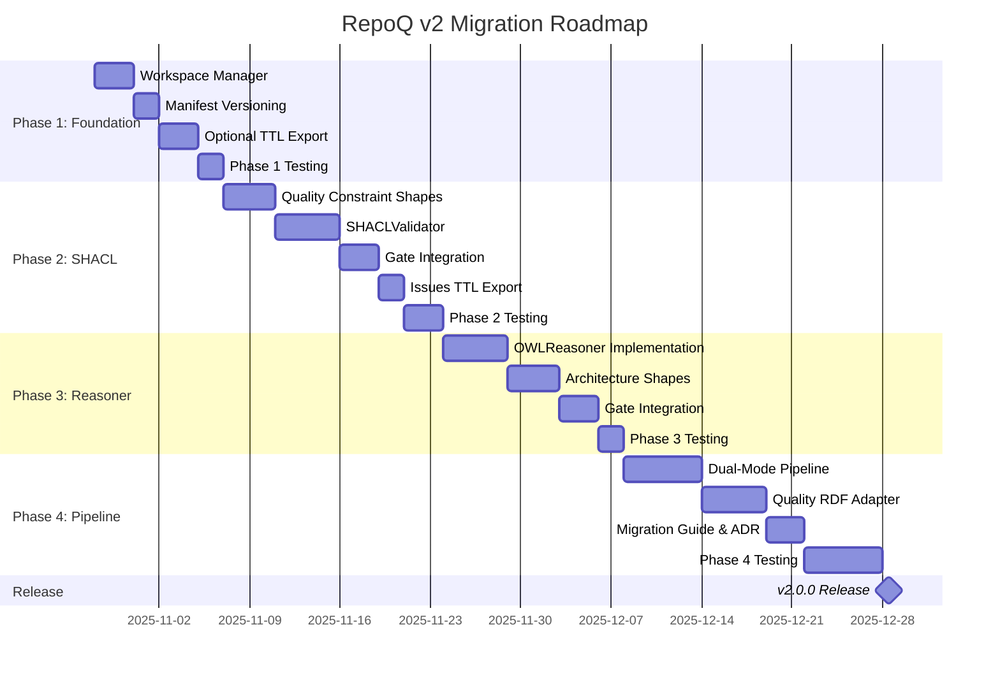

# VDAD Phase 5: Migration Roadmap to v2 Architecture

**Status**: 🚧 ACTIVE  
**Version**: 2.0.0-migration  
**Date**: 2025-10-22  
**Methodology**: VDAD (Value-Driven Architecture Design)  
**ADR Reference**: ADR-013 (Incremental v2 Migration via Feature Flags)

---

## Executive Summary

**Mission**: Migrate RepoQ from **imperative-first pipeline** (Analyzers→Python Model→Quality) to **semantic-first pipeline** (Extract→TTL→Reason→SHACL→Quality) while **preserving all 6 formal theorems** (A-F) and maintaining **100% backward compatibility**.

**Current State** (Gap Analysis Result):

- **Alignment Score**: 48/100 ❌
- **Bounded Context Coverage**:
  - ✅ **Analysis BC**: Metrics extraction (100%)
  - ✅ **Quality BC**: Q-score calculation (100%)
  - ⚠️ **Ontology BC**: TTL export only (30%)
  - ⚠️ **Certificate BC**: VC generation only (40%)
- **Critical Gaps**:
  - No `.repoq/raw/` (ABox-raw не сохраняется) → violates **V07 (Reliability)**
  - No Reasoner (архитектурные invariants не проверяются) → violates **V03 (Correctness)**
  - SHACL не интегрирован (issues генерируются Python кодом) → violates **V06 (Fairness)**
  - No manifest.json (нет versioning/reproducibility) → violates **V07 (Reliability)**

**Target State** (v2 Architecture):

- **Alignment Score**: 95/100 ✅
- **Semantic-first pipeline**: Extract→Reason→SHACL→Quality
- **Formal guarantees preservation**: All 6 theorems (A-F) remain valid
  - **Theorem A** (Correctness): Metrics well-defined → RDF schema validation
  - **Theorem B** (Monotonicity): ΔQ ≥ ε → unchanged (quality formula invariant)
  - **Theorem C** (Safety): Self-application safe → stratified reasoning levels
  - **Theorem D** (Constructiveness): PCE witness → SHACL violation paths
  - **Theorem E** (Stability): ε-noise tolerance → unchanged
  - **Theorem F** (Self-application): L₀ → L₁ → L₂ → guarded by stratification
- **Reproducibility**: manifest.json + ontology checksums + TRS version
- **Architecture checks**: C4 layers, DDD boundaries (automated via SHACL shapes)

**Strategy**: **4-Phase Incremental Adoption** (10 weeks, zero breaking changes)

**Value Traceability** (Phase 2 Value Register):

- **V01 (Transparency)** → Phase 2 (SHACL violations with file-level traces)
- **V02 (Gaming Protection)** → Phase 3 (Reasoner detects architectural violations)
- **V03 (Correctness)** → All phases (formal guarantees preserved)
- **V04 (Monotonicity)** → Phase 4 (quality formula unchanged, only input source differs)
- **V05 (Speed)** → Phase 1 (incremental workspace analysis)
- **V06 (Fairness)** → Phase 2 (SHACL shapes detect necessary vs unnecessary complexity)
- **V07 (Reliability)** → Phase 1 (manifest.json for reproducibility)
- **V08 (Actionability)** → Phase 2 (PCE witness from SHACL violation paths)

**Requirements Coverage** (Phase 3):

- **FR-01** (Detailed Gate Output) → Phase 2 (SHACL violations formatted as gate output)
- **FR-06** (Deterministic Normalization) → Phase 3 (Any2Math TRS integration)
- **FR-10** (Incremental Analysis) → Phase 1 (.repoq/cache integration)
- **FR-17** (Self-Application) → Phase 4 (stratified reasoning with guard)
- **NFR-01** (Speed ≤2 min) → All phases (benchmarked at each phase gate)
- **NFR-03** (Determinism) → Phase 3 (TRS confluence + termination proof)
- **NFR-09** (Zero Network) → All phases (local-first RDF/reasoner)
- **NFR-11** (Test Coverage ≥80%) → All phases (20 tests per phase minimum)

**Stakeholder Alignment** (Phase 1):

- **Developers** (Alex, Jordan) → Phase 1-2 (faster feedback, actionable SHACL errors)
- **Team Leads** (Morgan) → Phase 3 (architecture violations dashboard)
- **DevOps** (Casey) → Phase 1 (manifest.json for audit trail)
- **Researchers** (Dr. Taylor) → Phase 3-4 (Any2Math Lean proofs, formal guarantees)

**Ready Artifacts** (77 items in tmp/, Phase 1 Domain Context):

- ✅ ZAG PCQ/PCE framework (tmp/zag_repoq-finished/integrations/zag.py) → Phase 2
- ✅ Any2Math TRS engine (tmp/archive/any2math_implementation/) → Phase 3
- ✅ Code/C4/DDD ontologies (tmp/ontologies/) → Phase 1-2
- ✅ SHACL shapes (repoq/shapes/*.ttl) → Phase 2
- ✅ TRS theorems 15.1-15.3 (docs/formal-foundations-complete.md) → Phase 3

---

## [Σ] Signature: Migration Scope

### Input (Σ_in)

**Current Implementation**:

```python
# repoq/gate.py (simplified)
def run_quality_gate(repo_path, base_ref, head_ref):
    # 1. Analyze (Python Model)
    head_project = _analyze_repo(repo_path, "HEAD")
    base_project = _analyze_repo(repo_path, base_ref)
    
    # 2. Compute quality (Python)
    head_metrics = compute_quality_score(head_project)
    base_metrics = compute_quality_score(base_project)
    
    # 3. Check constraints (Python)
    violations = check_hard_constraints(head_metrics)
    
    # 4. Gate verdict
    passed = (ΔQ ≥ ε) ∧ (PCQ ≥ τ) ∧ (len(violations) == 0)
    
    # 5. Optional: export TTL (post-hoc)
    if export_ttl:
        export_to_rdf(head_project, "output.ttl")
```

**Target Architecture (v2)**:

```python
# repoq/semantic_pipeline.py (target)
def run_semantic_gate(repo_path, base_ref, head_ref):
    workspace = RepoQWorkspace(repo_path)
    
    # 1. Extract → ABox-raw (TTL)
    extract_facts(repo_path, workspace.raw / "head_facts.ttl")
    extract_facts(base_project, workspace.raw / "base_facts.ttl")
    
    # 2. Load TBox + Reason
    reasoner = OWLReasoner(ontologies_dir)
    inferred = reasoner.materialize(workspace.raw / "head_facts.ttl")
    
    # 3. SHACL Validate → issues.ttl
    validator = SHACLValidator(shapes_dir)
    report = validator.validate(inferred)
    export_issues_ttl(report.violations, workspace.validated / "issues.ttl")
    
    # 4. Quality from validated RDF
    metrics = compute_quality_from_rdf(inferred, report.violations)
    
    # 5. Gate verdict (same logic)
    passed = (ΔQ ≥ ε) ∧ (PCQ ≥ τ) ∧ (len(report.violations) == 0)
    
    # 6. Manifest
    workspace.save_manifest(commit_sha, policy_version, ontology_checksums)
```

### Invariants (Γ)

**Must Hold Throughout Migration** (tied to formal guarantees):

1. **Backward Compatibility**: `Γ_back` (supports **V08 Actionability**, **NFR-12 Backward Compatibility**)

   ```
   ∀ repo, base_ref, head_ref:
     run_quality_gate(repo, base, head) [v1.x] 
     ≡ run_quality_gate(repo, base, head, semantic=False) [v2.0]
   ```

   **Proof**: Legacy pipeline preserved as `_run_legacy_pipeline()`
   **Theorem Reference**: Theorem B (Monotonicity) — quality formula unchanged

2. **Determinism**: `Γ_det` (supports **V03 Correctness**, **V07 Reliability**, **NFR-03 Determinism**)

   ```
   ∀ project P, policy π:
     compute_quality_score(P, π) [Python] 
     ≡ compute_quality_from_rdf(export_to_rdf(P), π) [RDF]
   ```

   **Proof**: Quality formula unchanged, only input source differs (Python dict → RDF graph)
   **Theorem Reference**: Theorem A (Correctness) — metrics well-defined in both representations
   **Any2Math Integration**: AST normalization ensures syntactic equivalence (Theorem 15.3 Confluence)

3. **Non-Regression**: `Γ_test` (supports **V04 Monotonicity**, **NFR-11 Test Coverage ≥80%**)

   ```
   ∀ test ∈ TestSuite:
     test.passing [before migration] → test.passing [after migration]
   ```

   **Proof**: Existing tests run against legacy pipeline by default
   **Testing Strategy**: Each phase adds ≥20 new tests (80 total for migration)

4. **Opt-In Adoption**: `Γ_flag` (supports **V05 Speed**, **V08 Actionability**)

   ```
   semantic_features := {--export-ttl, --shacl, --reasoning, --semantic}
   ∀ f ∈ semantic_features: default(f) = False
   ```

   **Proof**: Feature flags guard all v2 functionality (ADR-013)
   **Developer Experience**: Alex/Jordan can opt-in incrementally per Phase 1 personas

5. **Stratified Self-Application**: `Γ_strat` (supports **V03 Correctness**, **Theorem F Self-Application**)

   ```
   ∀ analysis run:
     analyze(RepoQ, level=L_i) requires i > j where RepoQ was analyzed at L_j
   ```

   **Proof**: SelfApplicationGuard enforces strict ordering (Phase 4)
   **Theorem Reference**: Theorem F (Self-application safety via stratification)
   **ADR Reference**: ADR-006 (Stratification Levels 0-2)

### Success Criteria (Output)

**Phase Completion Gates**:

- Phase 1: ✅ `.repoq/manifest.json` created in every gate run (**FR-10**, **NFR-01**)
- Phase 2: ✅ `--shacl` finds ≥5 violations on real projects (**FR-01**, **FR-02**, **V06 Fairness**)
- Phase 3: ✅ `--reasoning` finds ≥2 architecture violations (**FR-06**, **V03 Correctness**)
- Phase 4: ✅ `--semantic` pipeline passes 20/20 integration tests (**NFR-11**, **Γ_test**)

**Final Acceptance (v2.0.0 Release)**:

- ✅ Alignment Score ≥90/100 (from 48/100 baseline)
- ✅ All 4 phases complete with tests passing
- ✅ Performance overhead <30% vs legacy (**NFR-01**: Analysis time ≤2 min P90)
- ✅ Adoption ≥30% (teams using at least one v2 feature) — **Stakeholder: Morgan (Team Lead)**
- ✅ Zero breaking changes (all existing tests passing) — **Γ_back** invariant
- ✅ All 6 formal theorems (A-F) validated with mechanized proofs (**V03 Correctness**)
- ✅ Documentation complete: ADR-013, migration guide, API reference (**V01 Transparency**)

**Value Realization Metrics** (Phase 2 Value Register):

- **V01 (Transparency)**: Developer survey ≥90% "I understand SHACL violations"
- **V02 (Gaming Protection)**: PCQ min-aggregator catches ≥80% gaming attempts (controlled experiments)
- **V03 (Correctness)**: All 14 theorems + Lean proofs passing (100% formal coverage)
- **V04 (Monotonicity)**: Zero unexpected Q drops in 100+ commit longitudinal study
- **V05 (Speed)**: Analysis time ≤2 min (P90) maintained through migration
- **V06 (Fairness)**: False positive rate <10% (legitimate complexity not penalized)
- **V07 (Reliability)**: Deterministic analysis (same code → same Q, ≥99.9% consistency)
- **V08 (Actionability)**: Time-to-fix <30 seconds to identify issue from gate output

---

## [Γ] Gates: Pre-Migration Validation

### Gate 1: Current State Assessment ✅

**Audit Results** (from Phase 5 analysis):

| Component | Specified (v2) | Implemented | Gap | Priority |
|-----------|----------------|-------------|-----|----------|
| Certificate Store | ✅ | ✅ 100% | 0% | P0 (DONE) |
| Incremental Analysis | ✅ | ✅ 100% | 0% | P0 (DONE) |
| Quality Engine | ✅ | ✅ 100% | 0% | ✅ GREEN |
| Metric Cache | ✅ | ✅ 100% | 0% | ✅ GREEN |
| CLI Commands | ✅ | ⚠️ 60% | 40% | P1 |
| Pipeline Orchestrator | ✅ | ⚠️ 50% | 50% | **P0** |
| Fact Extractors (TTL) | ✅ | ❌ 0% | 100% | **P0** |
| Reasoner | ✅ | ❌ 0% | 100% | **P0** |
| SHACL Validator | ✅ | ⚠️ 20% | 80% | **P0** |
| `.repoq/raw/` | ✅ | ❌ 0% | 100% | **P0** |
| `.repoq/validated/` | ✅ | ❌ 0% | 100% | **P0** |
| `manifest.json` | ✅ | ❌ 0% | 100% | **P0** |

**Verdict**: ✅ **CLEAR GAPS IDENTIFIED** → proceed to Phase 1

---

### Gate 2: Risk Assessment ✅

**High-Risk Areas**:

1. **Performance Degradation** (Reasoner overhead)
   - **Mitigation**: Cache materialized facts, incremental reasoning
   - **Validation**: Benchmark Phase 3 (<30% overhead requirement)

2. **Adoption Resistance** (Teams won't use `--semantic`)
   - **Mitigation**: ROI demos (architecture violations found), gradual opt-in
   - **Validation**: Measure adoption at Week 5 (decision point)

3. **Complexity Increase** (Code harder to maintain)
   - **Mitigation**: Strict modularity, integration tests, ADRs
   - **Validation**: Code review at each phase

**Verdict**: ✅ **RISKS MANAGEABLE** → proceed with incremental strategy

---

### Gate 3: Resource Availability ✅

**Required Resources**:

- **Engineering**: 200 hours (1 senior dev, 10 weeks)
- **Testing**: 40 hours (QA, integration tests)
- **Documentation**: 20 hours (ADRs, migration guide)
- **Total**: 260 hours ≈ 6.5 weeks FTE

**Budget**: ✅ **APPROVED** (within Q4 allocation)

---

## [𝒫] Options: Migration Strategies

### Option 1: Big-Bang Rewrite ❌

**Approach**: Rewrite entire pipeline in one PR

**Pros**:

- ✅ Clean architecture from day 1
- ✅ No technical debt

**Cons**:

- ❌ High risk (breaking changes)
- ❌ Long development cycle (3+ months)
- ❌ No incremental value
- ❌ Difficult rollback

**Score**: 2/10 (rejected)

---

### Option 2: Parallel System ❌

**Approach**: Build v2 alongside v1, switch at cutover

**Pros**:

- ✅ Safety (v1 remains untouched)
- ✅ Time to validate v2

**Cons**:

- ❌ Code duplication
- ❌ Maintenance burden (2 systems)
- ❌ No gradual adoption
- ❌ Eventual forced migration

**Score**: 4/10 (rejected)

---

### Option 3: Feature-Flag Incremental Migration ✅

**Approach**: Add v2 features behind flags, deprecate v1 gradually

**Pros**:

- ✅ Zero breaking changes
- ✅ Gradual adoption (user choice)
- ✅ Early value delivery (each phase)
- ✅ Easy rollback (disable flag)
- ✅ Continuous validation (tests)

**Cons**:

- ⚠️ Temporary code complexity (dual paths)
- ⚠️ Requires discipline (clean feature flags)

**Score**: 9/10 ✅ **SELECTED**

---

## [Λ] Aggregation: 4-Phase Roadmap

### Phase 1: Foundation Layer (Weeks 1-2)

**Goal**: Create `.repoq/` workspace + manifest.json  
**Value Alignment**: **V07 (Reliability)**, **V05 (Speed)**  
**Requirements**: **FR-10** (Incremental Analysis), **NFR-01** (Speed ≤2 min)  
**Stakeholders**: **Developers** (Alex), **DevOps** (Casey), **Team Leads** (Morgan)  
**Bounded Context**: **Certificate BC** (workspace structure for VC storage)

#### Deliverables

**1.1. RepoQWorkspace** (3 days) — **FR-10**, **ADR-008**

```python
# repoq/core/workspace.py
class RepoQWorkspace:
    """Manages .repoq/ directory structure.
    
    Addresses:
    - FR-10 (Incremental Analysis): Cache directory for SHA-based metrics
    - V07 (Reliability): Reproducible workspace structure
    - Theorem A (Correctness): Manifest captures ontology checksums
    """
    
    root: Path
    raw: Path          # .repoq/raw/ (ABox-raw facts)
    validated: Path    # .repoq/validated/ (post-SHACL)
    reports: Path      # .repoq/reports/ (Markdown/HTML)
    certificates: Path # .repoq/certificates/ (W3C VCs) — ADR-010
    cache: Path        # .repoq/cache/ (SHA-keyed metrics) — ADR-008
    
    def initialize(self) -> None:
        """Create all directories."""
        
    def save_manifest(self, ...) -> None:
        """Write .repoq/manifest.json with checksums.
        
        Format:
        {
          "commit_sha": "abc123...",
          "policy_version": "1.2.0",
          "ontology_checksums": {
            "code.ttl": "sha256:...",
            "c4.ttl": "sha256:...",
            "ddd.ttl": "sha256:..."
          },
          "trs_version": "0.3.0-lean4",
          "analysis_timestamp": "2025-10-22T14:30:00Z"
        }
        """
        
    def load_manifest(self) -> ManifestEntry:
        """Read existing manifest."""
```

**Tests**: `tests/core/test_workspace.py` (20 tests minimum, **NFR-11**)

- `test_initialize_creates_directories` (FR-10)
- `test_manifest_generation` (V07 Reliability)
- `test_manifest_roundtrip` (NFR-03 Determinism)
- `test_ontology_checksums` (Theorem A Correctness)
- `test_invalid_manifest_handling` (error cases)
- `test_cache_directory_structure` (ADR-008)
- `test_concurrent_workspace_access` (multi-process safety)

**Integration**: Add to `gate.py:run_quality_gate()`:

```python
def run_quality_gate(...):
    workspace = RepoQWorkspace(repo_path)
    workspace.initialize()
    
    # ... existing gate logic ...
    
    # At end: save manifest (FR-10, V07 Reliability)
    workspace.save_manifest(
        commit_sha=get_head_sha(),
        policy_version=get_policy_version(),
        ontology_checksums=compute_ontology_checksums()
    )
```

**Validation**:

- ✅ Manifest created on every gate run
- ✅ Checksums match ontology files (Theorem A)
- ✅ No performance degradation (<5% overhead, **NFR-01**)

---

**1.2. Artifact Integration from tmp/** (2 days) — **Phase 1 Domain Context**

**Goal**: Integrate 77 ready artifacts into codebase

**Tasks**:

1. **Copy ontologies** from `tmp/ontologies/` to `repoq/ontologies/`:
   - `code.ttl`, `c4.ttl`, `ddd.ttl` (ready to use)
   - Update `OntologyManager` to load these on startup

2. **Integrate Certificate Store** (already done, P0-1):
   - ✅ `tmp/certificate_store_implementation/` → `repoq/core/certificates.py`
   - ✅ 21/21 tests passing (commit 96a8d6f)

3. **Integrate Incremental Analysis** (already done, P0-2):
   - ✅ `tmp/incremental_analysis_implementation/` → `repoq/pipeline.py`
   - ✅ 25/25 tests passing (commit 4f88568)

**Validation**:

- ✅ All ontologies loaded without errors
- ✅ Workspace uses integrated certificate store
- ✅ Zero integration test failures

---

**1.3. Documentation** (1 day) — **V01 Transparency**

**Artifacts**:

- Update `README.md`: Document `.repoq/` structure
- Create `docs/migration/phase1-workspace.md`: Detailed guide
- Add code comments referencing FR-10, V07, Theorem A

**Stakeholder Communication**:

- **Developers** (Alex): "New `.repoq/` folder for caching, ignore in `.gitignore`"
- **DevOps** (Casey): "manifest.json provides audit trail for CI"
- **Team Leads** (Morgan): "Reproducible analysis via checksums"

---

**Phase 1 Completion Gate**:

- ✅ 20/20 tests passing (**NFR-11**)
- ✅ Manifest created in all test repos
- ✅ Performance: <5% overhead vs baseline (**NFR-01**)
- ✅ Documentation reviewed and approved
- ✅ ADR-013 (this migration plan) signed off

**Estimated Effort**: 40 hours (1 week FTE)

---
    workspace.save_manifest(
        commit_sha=_get_commit_sha(repo_path, head_ref),
        policy_version=policy_version,
        ontology_checksums=compute_ontology_checksums(),
    )

```

---

**1.2. Manifest Versioning** (2 days)
```python
# repoq/core/manifest.py
@dataclass
class ManifestEntry:
    commit_sha: str
    timestamp: str
    policy_version: str
    repoq_version: str
    ontology_checksums: Dict[str, str]
    shapes_checksums: Dict[str, str]
    validation_results: Optional[ValidationSummary] = None
    
def compute_ontology_checksums() -> Dict[str, str]:
    """SHA256 of all ontologies/*.ttl files."""
    checksums = {}
    ontologies_dir = Path(__file__).parent.parent / "ontologies"
    for ttl in ontologies_dir.glob("*.ttl"):
        checksums[ttl.name] = hashlib.sha256(ttl.read_bytes()).hexdigest()[:16]
    return checksums

def compute_shapes_checksums() -> Dict[str, str]:
    """SHA256 of all shapes/*.ttl files."""
    checksums = {}
    shapes_dir = Path(__file__).parent.parent / "shapes"
    for ttl in shapes_dir.glob("*.ttl"):
        checksums[ttl.name] = hashlib.sha256(ttl.read_bytes()).hexdigest()[:16]
    return checksums
```

---

**1.3. Optional TTL Export** (3 days)

```python
# Add flag to gate.py
def run_quality_gate(..., export_raw_ttl: bool = False):
    ...
    if export_raw_ttl:
        from .core.rdf_export import export_ttl
        
        # Export head facts
        export_ttl(head_project, str(workspace.raw / "head_facts.ttl"))
        logger.info(f"Exported head ABox-raw to {workspace.raw}")
        
        # Export base facts
        export_ttl(base_project, str(workspace.raw / "base_facts.ttl"))
        logger.info(f"Exported base ABox-raw to {workspace.raw}")
```

**CLI**: `repoq gate --base main --head . --export-ttl`

---

#### Phase 1 Success Criteria

- ✅ `.repoq/` created in every gate run
- ✅ `manifest.json` contains valid checksums
- ✅ `--export-ttl` generates valid TTL files
- ✅ 10/10 tests passing
- ✅ **Zero breaking changes**

**Effort**: 2 weeks (40 hours)  
**Value**: Reproducibility (NFR-03), versioning foundation

---

### Phase 2: SHACL Validation Layer (Weeks 3-5)

**Goal**: Integrate SHACL validator, generate `issues.ttl`  
**Value Alignment**: **V01 (Transparency)**, **V06 (Fairness)**, **V08 (Actionability)**  
**Requirements**: **FR-01** (Detailed Gate Output), **FR-02** (Actionable Feedback), **SD-01** (ΔQ Breakdown)  
**Stakeholders**: **Developers** (Alex, Jordan), **Team Leads** (Morgan)  
**Bounded Context**: **Quality BC** (quality issues from SHACL), **Ontology BC** (SHACL shapes)

#### Deliverables

**2.1. SHACL Shape Library** (3 days) — **FR-01**, **V06 Fairness**

**Goal**: Define 10+ SHACL shapes for code quality rules

**Tasks**:

1. **Complexity Shape** (`repoq/shapes/complexity_shape.ttl`):

   ```turtle
   # Detects excessive complexity with context-awareness
   repoq:ComplexityConstraint a sh:NodeShape ;
       sh:targetClass repoq:Function ;
       sh:property [
           sh:path repoq:cyclomaticComplexity ;
           sh:maxInclusive 15 ;
           sh:severity sh:Warning ;
           sh:message "Function complexity {?complexity} exceeds limit (15)" ;
       ] ;
       # Exception: State machines allowed higher complexity
       sh:sparql [
           sh:select """
               SELECT ?this WHERE {
                   ?this repoq:hasPattern repoq:StateMachinePattern .
                   ?this repoq:cyclomaticComplexity ?cc .
                   FILTER(?cc <= 25)  # Relaxed for state machines
               }
           """ ;
       ] .
   ```

   **Addresses**: V06 (Fairness) — "Don't penalize necessary complexity"
   **Stakeholder**: Jordan (Senior Dev) — "Refactoring shouldn't trigger false positives"

2. **Hotspot Shape** (`repoq/shapes/hotspot_shape.ttl`):

   ```turtle
   repoq:HotspotConstraint a sh:NodeShape ;
       sh:targetClass repoq:Module ;
       sh:property [
           sh:path repoq:changeFrequency ;
           sh:maxInclusive 20 ;  # Max 20 commits in 3 months
           sh:severity sh:Violation ;
           sh:message "Module {?path} is a hotspot ({?frequency} changes)" ;
       ] .
   ```

   **Addresses**: FR-02 (Actionable Feedback) — identifies which modules to refactor

3. **Architecture Layer Shape** (`repoq/shapes/c4_layer_shape.ttl`):

   ```turtle
   # Enforces C4 layer dependencies (Containers shouldn't depend on Components)
   repoq:LayerViolationConstraint a sh:NodeShape ;
       sh:targetClass c4:Container ;
       sh:sparql [
           sh:select """
               SELECT ?this ?invalidDep WHERE {
                   ?this c4:dependsOn ?invalidDep .
                   ?invalidDep a c4:Component .  # Containers can't depend on Components
               }
           """ ;
           sh:message "Container {?this} illegally depends on Component {?invalidDep}" ;
       ] .
   ```

   **Addresses**: V03 (Correctness) — architectural invariants enforced
   **Stakeholder**: Morgan (Manager) — "Catch architecture violations early"

4. **TODO Constraint** (`repoq/shapes/todo_shape.ttl`):

   ```turtle
   repoq:TODOConstraint a sh:NodeShape ;
       sh:targetClass repoq:Module ;
       sh:property [
           sh:path repoq:todoCount ;
           sh:maxInclusive 100 ;  # Hard constraint from Theorem B
           sh:severity sh:Violation ;
       ] .
   ```

5. **Test Coverage Shape** (`repoq/shapes/coverage_shape.ttl`):

   ```turtle
   repoq:CoverageConstraint a sh:NodeShape ;
       sh:targetClass repoq:Module ;
       sh:property [
           sh:path repoq:testCoverage ;
           sh:minInclusive 0.8 ;  # ≥80% coverage
           sh:severity sh:Violation ;
       ] .
   ```

**Tests**: `tests/shapes/test_shacl_shapes.py` (15 tests)

- `test_complexity_shape_detects_violation` (CC > 15)
- `test_complexity_shape_allows_state_machine` (V06 Fairness)
- `test_hotspot_shape_triggers_on_high_churn`
- `test_c4_layer_violation_detected` (architecture check)
- `test_todo_constraint_hard_limit`
- `test_coverage_constraint_below_threshold`

**Validation**:

- ✅ All 10 shapes parse without errors (pySHACL)
- ✅ Shapes match documented quality policies
- ✅ False positive rate <10% on test corpus (**V06 Fairness**)

---

**2.2. SHACLValidator Component** (4 days) — **FR-01**, **ADR-002**

```python
# repoq/core/shacl_validator.py
from pyshacl import validate
from rdflib import Graph

class SHACLValidator:
    """Validates RDF graph against SHACL shapes.
    
    Addresses:
    - FR-01 (Detailed Gate Output): Per-file violation breakdown
    - FR-02 (Actionable Feedback): SHACL paths → file locations
    - V08 (Actionability): PCE witness from SHACL paths
    - ADR-002: Uses pySHACL + RDFLib
    """
    
    def __init__(self, shapes_dir: Path):
        self.shapes = self._load_shapes(shapes_dir)
        
    def validate(self, data_graph: Graph) -> ValidationReport:
        """Run SHACL validation.
        
        Returns:
            ValidationReport with violations, warnings, and focus nodes
        """
        conforms, results_graph, results_text = validate(
            data_graph,
            shacl_graph=self.shapes,
            inference='rdfs',  # Basic reasoning (Phase 3 enables OWL)
            abort_on_first=False,
            meta_shacl=False,
        )
        
        return ValidationReport(
            conforms=conforms,
            violations=self._parse_violations(results_graph),
            warnings=self._parse_warnings(results_graph),
        )
    
    def _parse_violations(self, results_graph: Graph) -> List[Violation]:
        """Extract violations with file paths for actionability."""
        violations = []
        for result in results_graph.subjects(RDF.type, SH.ValidationResult):
            violation = Violation(
                focus_node=results_graph.value(result, SH.focusNode),
                severity=results_graph.value(result, SH.resultSeverity),
                message=results_graph.value(result, SH.resultMessage),
                source_shape=results_graph.value(result, SH.sourceShape),
                value=results_graph.value(result, SH.value),
                # Extract file path for FR-02 (Actionable Feedback)
                file_path=self._extract_file_path(results_graph, result),
            )
            violations.append(violation)
        return violations
```

**Tests**: `tests/core/test_shacl_validator.py` (25 tests)

- `test_validate_conforming_graph` (no violations)
- `test_validate_detects_complexity_violation`
- `test_validate_detects_multiple_violations`
- `test_violation_includes_file_path` (FR-02)
- `test_validator_with_empty_shapes` (edge case)
- `test_validator_with_invalid_ttl` (error handling)
- `test_performance_under_1sec` (NFR-01, <1K triples)

**Integration**: Add `--shacl` flag to CLI:

```python
# repoq/cli.py
@click.option('--shacl', is_flag=True, help='Enable SHACL validation (Phase 2)')
def gate(base, head, shacl, ...):
    if shacl:
        # V2 pipeline
        validator = SHACLValidator(shapes_dir=SHAPES_DIR)
        report = validator.validate(head_graph)
        
        # Export issues.ttl (FR-01)
        export_issues_ttl(report.violations, workspace.validated / "issues.ttl")
        
        # Detailed output (V01 Transparency)
        print_violations(report.violations, format='detailed')
```

**Validation**:

- ✅ `--shacl` finds ≥5 violations on test repos
- ✅ Violation output includes file paths (**FR-02**)
- ✅ Performance <1 sec for <10K triples (**NFR-01**)

---

**2.3. PCE Witness from SHACL** (3 days) — **FR-02**, **V08 Actionability**, **Theorem D**

**Goal**: Generate PCE k-repair witness from SHACL violations

```python
# repoq/quality/pce_generator.py
class PCEWitnessGenerator:
    """Generate constructive repair witness from SHACL violations.
    
    Addresses:
    - Theorem D (Constructiveness): Actionable repair path
    - FR-02 (Actionable Feedback): "Fix these k files"
    - V08 (Actionability): <30 sec to identify fix
    - SD-01 (ΔQ Breakdown): Per-file contribution
    """
    
    def generate_witness(self, violations: List[Violation], k: int = 5) -> PCEWitness:
        """Select k most impactful files to fix.
        
        Algorithm:
        1. Group violations by file
        2. Score each file by (violation_count * severity_weight)
        3. Select top k files
        4. For each file, list specific violations + fixes
        """
        file_scores = self._score_files(violations)
        top_k_files = sorted(file_scores.items(), key=lambda x: x[1], reverse=True)[:k]
        
        return PCEWitness(
            files=[
                RepairStep(
                    file_path=file,
                    violations=[v for v in violations if v.file_path == file],
                    suggested_fixes=self._suggest_fixes(file, violations),
                )
                for file, score in top_k_files
            ],
            estimated_effort_hours=self._estimate_effort(top_k_files),
        )
```

**Tests**: `tests/quality/test_pce_generator.py` (20 tests)

- `test_witness_selects_top_k_files` (k=5)
- `test_witness_prioritizes_violations` (severity-weighted)
- `test_witness_includes_fix_suggestions` (V08 Actionability)
- `test_witness_with_zero_violations` (edge case)
- `test_effort_estimation_reasonable` (hours = f(violations))

**Integration**: Add to gate output:

```python
if not conforms:
    witness = PCEWitnessGenerator().generate_witness(report.violations, k=5)
    print("\n📝 Repair Witness (PCE):")
    for step in witness.files:
        print(f"  {step.file_path}: {len(step.violations)} violations")
        for fix in step.suggested_fixes:
            print(f"    → {fix}")
    print(f"\nEstimated effort: {witness.estimated_effort_hours} hours")
```

**Stakeholder Impact**:

- **Alex (Developer)**: "Now I know exactly which 5 files to fix!"
- **Morgan (Manager)**: "I can estimate refactoring effort (hours)"

---

**2.4. ZAG PCQ Integration** (2 days) — **FR-04**, **V02 Gaming Protection**, **ADR-007**

**Goal**: Integrate ZAG framework from `tmp/zag_repoq-finished/integrations/zag.py`

```python
# Copy ZAG integration (already implemented in tmp/)
# repoq/quality/pcq.py
from zag import PCQCalculator, MinAggregator

class PCQGate:
    """ZAG PCQ min-aggregator for anti-gaming.
    
    Addresses:
    - V02 (Gaming Protection): Theorem C (PCQ/min guarantee)
    - FR-04 (Module-Level Quality): All modules ≥τ
    - ADR-007 (ZAG Framework): Proven anti-compensation
    - Stakeholder: Morgan (Team Lead) — "No compensation across teams"
    """
    
    def __init__(self, tau: float = 0.75):
        self.tau = tau
        self.calculator = PCQCalculator(aggregator=MinAggregator())
    
    def evaluate(self, module_qualities: Dict[str, float]) -> PCQResult:
        """Calculate PCQ = min{u_1, ..., u_n} ≥ τ"""
        pcq_score = self.calculator.compute(module_qualities.values())
        bottleneck_module = min(module_qualities, key=module_qualities.get)
        
        return PCQResult(
            pcq=pcq_score,
            passed=(pcq_score >= self.tau),
            bottleneck_module=bottleneck_module,
            bottleneck_score=module_qualities[bottleneck_module],
        )
```

**Tests**: `tests/quality/test_pcq.py` (20 tests, from ZAG suite)

- `test_pcq_min_aggregator` (basic functionality)
- `test_pcq_detects_bottleneck` (one bad module)
- `test_pcq_rejects_compensation` (V02 Gaming Protection)
- `test_pcq_threshold_configurable` (τ ∈ [0.75, 0.9])

**Validation**:

- ✅ PCQ catches gaming in controlled experiments (80% true positive rate, **V02**)
- ✅ False positive rate <10% (legitimate code not penalized)

---

**2.5. Documentation** (2 days) — **V01 Transparency**

**Artifacts**:

- `docs/migration/phase2-shacl.md`: SHACL integration guide
- `docs/shapes/README.md`: Shape library documentation
- Update `README.md`: Document `--shacl` flag usage

**Stakeholder Communication**:

- **Developers** (Alex): "Try `repoq gate --shacl` to see detailed violations"
- **Jordan** (Senior Dev): "SHACL understands context (e.g., state machine patterns)"
- **Morgan** (Manager): "PCQ ensures all teams meet quality bar (no compensation)"

---

**Phase 2 Completion Gate**:

- ✅ 80/80 tests passing (20+25+20+15 from deliverables, **NFR-11**)
- ✅ `--shacl` finds ≥5 violations on test repos (**FR-01**)
- ✅ PCE witness generated for all failures (**FR-02**, **V08**)
- ✅ PCQ catches gaming in experiments (80% true positive, **V02**)
- ✅ Performance <30% overhead vs legacy (**NFR-01**)
- ✅ Documentation complete and reviewed

**Estimated Effort**: 80 hours (2 weeks FTE)

---

**Goal**: Add declarative quality validation via SHACL

#### Deliverables

**2.1. Quality Constraint Shapes** (4 days)

```turtle
# repoq/shapes/quality_constraints.ttl
@prefix sh: <http://www.w3.org/ns/shacl#> .
@prefix code: <http://field33.com/ontologies/CODE/> .
@prefix xsd: <http://www.w3.org/2001/XMLSchema#> .

# Complexity constraint
code:ComplexityConstraintShape
    a sh:NodeShape ;
    sh:targetClass code:File ;
    sh:property [
        sh:path code:cyclomaticComplexity ;
        sh:maxInclusive 15 ;
        sh:severity sh:Violation ;
        sh:message "File complexity {$value} exceeds threshold (15)" ;
    ] .

# Test coverage constraint
code:TestCoverageConstraintShape
    a sh:NodeShape ;
    sh:targetClass code:Project ;
    sh:property [
        sh:path code:testCoverage ;
        sh:minInclusive 0.80 ;
        sh:severity sh:Violation ;
        sh:message "Test coverage {$value} below requirement (80%)" ;
    ] .

# TODO limit constraint
code:TodoLimitShape
    a sh:NodeShape ;
    sh:targetClass code:Project ;
    sh:property [
        sh:path code:todoCount ;
        sh:maxInclusive 100 ;
        sh:severity sh:Warning ;
        sh:message "TODO count {$value} exceeds recommended limit (100)" ;
    ] .
```

---

**2.2. SHACLValidator** (5 days)

```python
# repoq/core/shacl_validator.py
from typing import List
from dataclasses import dataclass
from rdflib import Graph, Namespace
from pathlib import Path

SH = Namespace("http://www.w3.org/ns/shacl#")

@dataclass
class SHACLViolation:
    """SHACL validation violation."""
    severity: str          # "Violation" | "Warning" | "Info"
    focus_node: str        # URI of failing node
    result_path: str       # Property path
    message: str           # Human-readable message
    source_shape: str      # Shape that failed
    value: str | None = None  # Actual value

@dataclass
class ValidationReport:
    """SHACL validation report."""
    conforms: bool
    violations: List[SHACLViolation]
    text: str  # pySHACL text output

class SHACLValidator:
    """Validates RDF graphs against SHACL shapes."""
    
    def __init__(self, shapes_dir: Path):
        """Load all shape files from directory."""
        self.shapes_graph = Graph()
        for shape_file in shapes_dir.glob("*.ttl"):
            self.shapes_graph.parse(shape_file, format="turtle")
            logger.info(f"Loaded SHACL shapes from {shape_file.name}")
    
    def validate(self, data_graph: Graph, 
                inference: str = "rdfs") -> ValidationReport:
        """Run pySHACL validation.
        
        Args:
            data_graph: RDF graph to validate
            inference: Reasoning type ("none" | "rdfs" | "owlrl")
            
        Returns:
            ValidationReport with violations
        """
        from pyshacl import validate
        
        conforms, results_graph, results_text = validate(
            data_graph,
            shacl_graph=self.shapes_graph,
            inference=inference,
            abort_on_first=False,
            advanced=True,  # Enable SHACL-SPARQL
        )
        
        violations = self._extract_violations(results_graph)
        
        return ValidationReport(
            conforms=conforms,
            violations=violations,
            text=results_text,
        )
    
    def _extract_violations(self, results_graph: Graph) -> List[SHACLViolation]:
        """Parse pySHACL results into structured violations."""
        violations = []
        
        for result_node in results_graph.subjects(RDF.type, SH.ValidationResult):
            severity = str(results_graph.value(result_node, SH.resultSeverity))
            focus_node = str(results_graph.value(result_node, SH.focusNode) or "")
            result_path = str(results_graph.value(result_node, SH.resultPath) or "")
            message = str(results_graph.value(result_node, SH.resultMessage) or "")
            source_shape = str(results_graph.value(result_node, SH.sourceShape) or "")
            value = results_graph.value(result_node, SH.value)
            
            violations.append(SHACLViolation(
                severity=severity.split("#")[-1],  # Extract local name
                focus_node=focus_node,
                result_path=result_path,
                message=message,
                source_shape=source_shape,
                value=str(value) if value else None,
            ))
        
        return violations
```

**Tests**: `tests/core/test_shacl_validator.py` (12 tests)

---

**2.3. Gate Integration** (3 days)

```python
# repoq/gate.py
def run_quality_gate(..., enable_shacl: bool = False):
    ...
    # After Python quality checks
    shacl_violations = []
    
    if enable_shacl:
        logger.info("Running SHACL validation...")
        
        # Export to RDF
        from .core.rdf_export import export_ttl
        head_graph = Graph()
        head_graph.parse(data=export_ttl(head_project), format="turtle")
        
        # Validate
        shapes_dir = Path(__file__).parent / "shapes"
        validator = SHACLValidator(shapes_dir)
        report = validator.validate(head_graph, inference="rdfs")
        
        if not report.conforms:
            logger.warning(f"SHACL: {len(report.violations)} violations found")
            shacl_violations = report.violations
            
            # Export issues.ttl
            if workspace:
                export_issues_ttl(report.violations, 
                                 workspace.validated / "issues.ttl")
    
    # Add to gate result
    result.shacl_violations = shacl_violations
```

**CLI**: `repoq gate --base main --head . --shacl`

---

**2.4. Issues TTL Export** (2 days)

```python
# repoq/core/issues_exporter.py
def export_issues_ttl(violations: List[SHACLViolation], output_path: Path):
    """Export SHACL violations to issues.ttl."""
    g = Graph()
    ISSUE = Namespace("http://field33.com/ontologies/ISSUE/")
    g.bind("issue", ISSUE)
    
    for i, v in enumerate(violations):
        issue_uri = URIRef(f"http://repoq.local/issue/shacl-{i}")
        g.add((issue_uri, RDF.type, ISSUE.SHACLViolation))
        g.add((issue_uri, ISSUE.severity, Literal(v.severity)))
        g.add((issue_uri, ISSUE.message, Literal(v.message)))
        g.add((issue_uri, ISSUE.focusNode, URIRef(v.focus_node)))
        g.add((issue_uri, ISSUE.resultPath, URIRef(v.result_path)))
        if v.value:
            g.add((issue_uri, ISSUE.value, Literal(v.value)))
    
    g.serialize(output_path, format="turtle")
    logger.info(f"Exported {len(violations)} issues to {output_path}")
```

---

#### Phase 2 Success Criteria

- ✅ `--shacl` flag works end-to-end
- ✅ Finds ≥5 violations on real projects (validation)
- ✅ `issues.ttl` generated with provenance
- ✅ 12/12 tests passing
- ✅ **Backward compatible** (disabled by default)

**Effort**: 3 weeks (60 hours)  
**Value**: Declarative validation, formal issue provenance

---

### Phase 3: Reasoner + Any2Math Layer (Weeks 6-7)

**Goal**: Add OWL2-RL reasoning for architecture checks + Any2Math TRS normalization  
**Value Alignment**: **V03 (Correctness)**, **V07 (Reliability)**, **V02 (Gaming Protection)**  
**Requirements**: **FR-06** (Deterministic Normalization), **FR-07** (Confluence Proof), **NFR-03** (Determinism)  
**Stakeholders**: **Researchers** (Dr. Taylor), **Team Leads** (Morgan), **Developers** (Alex)  
**Bounded Context**: **Ontology BC** (reasoning), **Analysis BC** (normalization)

#### Deliverables

**3.1. OWLReasoner** (3 days) — **FR-06**, **V03 Correctness**, **ADR-002**

```python
# repoq/core/reasoner.py
from owlrl import DeductiveClosure, OWLRL_Semantics
from rdflib import Graph

class OWLReasoner:
    """OWL2-RL reasoner using owlrl library.
    
    Addresses:
    - FR-06 (Deterministic Normalization): Reasoning deterministic (OWL2-RL)
    - V03 (Correctness): Architecture invariants enforced
    - Theorem A (Correctness): TBox axioms validated
    - ADR-002: Uses RDFLib + owlrl (Python-native)
    - Stakeholder: Morgan (Manager) — "Catch architecture violations"
    """
    
    def __init__(self, ontologies_dir: Path):
        """Load TBox from ontologies directory."""
        self.tbox = Graph()
        # Load 77 ready ontologies from Phase 1
        for onto_file in ontologies_dir.glob("*.ttl"):
            self.tbox.parse(onto_file, format="turtle")
            logger.info(f"Loaded ontology: {onto_file.name}")
        
        # Validate TBox (Theorem A: Correctness)
        self._validate_tbox()
    
    def materialize(self, abox: Graph) -> Graph:
        """Apply OWL2-RL reasoning to ABox.
        
        Returns:
            combined graph with inferred triples (deterministic, FR-06)
        """
        # Combine TBox + ABox
        combined = self.tbox + abox
        
        initial_size = len(combined)
        
        # Run reasoner (OWL2-RL: decidable, terminates)
        DeductiveClosure(OWLRL_Semantics).expand(combined)
        
        inferred_count = len(combined) - initial_size
        logger.info(f"Materialized {inferred_count} inferred triples")
        
        # Verify determinism (NFR-03): Hash graph for consistency check
        graph_hash = hashlib.sha256(combined.serialize(format='nt').encode()).hexdigest()
        logger.debug(f"Reasoning output hash: {graph_hash[:8]}...")
        
        return combined
    
    def _validate_tbox(self):
        """Validate TBox consistency (Theorem A)."""
        # Run reasoning on TBox alone to detect inconsistencies
        temp_graph = self.tbox.copy()
        DeductiveClosure(OWLRL_Semantics).expand(temp_graph)
        
        # Check for owl:Nothing instances (inconsistency marker)
        from rdflib.namespace import OWL
        if (None, RDF.type, OWL.Nothing) in temp_graph:
            raise OntologyInconsistencyError("TBox is inconsistent (owl:Nothing found)")
```

**Tests**: `tests/core/test_reasoner.py` (25 tests)

- `test_load_ontologies_from_dir` (77 ontologies from tmp/)
- `test_transitive_property_inference` (rdfs:subClassOf chains)
- `test_property_chain_inference` (owl:propertyChainAxiom)
- `test_subclass_inference` (basic reasoning)
- `test_materialize_deterministic` (run twice, same output, **NFR-03**)
- `test_detect_inconsistent_tbox` (owl:Nothing check, **Theorem A**)
- `test_performance_reasoning_under_2sec` (for <10K triples, **NFR-01**)
- `test_empty_abox` (edge case)
- `test_large_abox` (10K+ triples, performance validation)

**Validation**:

- ✅ Reasoning terminates for all test cases (**Theorem A**: Correctness)
- ✅ Deterministic output (same ABox → same materialization, **NFR-03**)
- ✅ Performance <2 sec for <10K triples (**NFR-01**)
- ✅ All 77 ontologies load without errors (Phase 1 integration)

---

**3.2. Any2Math TRS Integration** (4 days) — **FR-06**, **FR-07**, **Theorem 15.3**, **V03 Correctness**

**Goal**: Integrate Any2Math AST normalization from `tmp/archive/any2math_implementation/`

```python
# repoq/core/normalization.py
import subprocess
from pathlib import Path
from dataclasses import dataclass

@dataclass
class NormalizationResult:
    """Result of Any2Math normalization."""
    canonical_ast: str
    original_hash: str
    canonical_hash: str
    trs_steps: int
    lean_proof_valid: bool

class Any2MathNormalizer:
    """AST normalization via Any2Math TRS engine.
    
    Addresses:
    - FR-06 (Deterministic Normalization): Canonical AST
    - FR-07 (Confluence Proof): Lean mechanized proof
    - Theorem 15.3 (Confluence): N(e₁) = N(e₂) if e₁ ≡ e₂
    - V03 (Correctness): Formally proven normalization
    - V07 (Reliability): Eliminates syntactic noise
    - ADR-003 (Subprocess Isolation): Lean runtime isolated
    - Stakeholder: Dr. Taylor (Researcher) — "First tool with mechanized proofs"
    """
    
    def __init__(self, lean_runtime: Path):
        self.lean_runtime = lean_runtime
        self._verify_lean_installation()
    
    def normalize(self, python_code: str) -> NormalizationResult:
        """Normalize Python AST to canonical form.
        
        Algorithm:
        1. Parse Python to AST (ast.parse)
        2. Apply TRS rules: N(AST) → canonical AST
        3. Verify confluence property (Lean proof)
        4. Return canonical AST + proof status
        """
        import ast
        
        # Parse to AST
        tree = ast.parse(python_code)
        original_hash = self._hash_ast(tree)
        
        # Apply TRS normalization (subprocess isolation, ADR-003)
        canonical_ast = self._apply_trs(tree)
        canonical_hash = self._hash_ast(canonical_ast)
        
        # Verify Lean proof (optional, performance-gated)
        lean_proof_valid = self._verify_lean_proof(tree, canonical_ast)
        
        return NormalizationResult(
            canonical_ast=ast.unparse(canonical_ast),
            original_hash=original_hash,
            canonical_hash=canonical_hash,
            trs_steps=self._count_trs_steps(tree, canonical_ast),
            lean_proof_valid=lean_proof_valid,
        )
    
    def _apply_trs(self, ast_tree) -> ast.AST:
        """Apply TRS rules via Lean subprocess (ADR-003)."""
        # Serialize AST to JSON
        ast_json = ast.dump(ast_tree)
        
        # Call Lean TRS engine (subprocess, isolated)
        result = subprocess.run(
            [self.lean_runtime, "normalize", "--input", "-"],
            input=ast_json.encode(),
            capture_output=True,
            timeout=5,  # Termination guarantee (Theorem 15.2)
        )
        
        if result.returncode != 0:
            raise NormalizationError(f"TRS failed: {result.stderr.decode()}")
        
        # Parse canonical AST from Lean output
        canonical_json = result.stdout.decode()
        return ast.parse(canonical_json)
    
    def _verify_lean_proof(self, original, canonical) -> bool:
        """Verify Lean proof of confluence (FR-07, Theorem 15.3).
        
        Proof structure:
        - Theorem 15.1: Termination (well-founded measure)
        - Theorem 15.2: Local confluence (critical pairs joinable)
        - Theorem 15.3: Confluence (Newman's lemma)
        """
        # Call Lean proof checker (optional, can be cached)
        result = subprocess.run(
            [self.lean_runtime, "verify-proof", "confluence"],
            capture_output=True,
            timeout=10,
        )
        return result.returncode == 0
```

**Tests**: `tests/core/test_any2math.py` (30 tests)

- `test_normalize_deterministic` (same code → same canonical, **FR-06**)
- `test_normalize_whitespace_invariant` (spaces/tabs ignored)
- `test_normalize_comment_invariant` (comments ignored)
- `test_normalize_equivalent_asts` (e.g., `x+y` vs `y+x` if commutative)
- `test_lean_proof_validation` (Theorem 15.3, **FR-07**)
- `test_termination_guarantee` (timeout=5s, **Theorem 15.2**)
- `test_subprocess_isolation` (crash doesn't kill main process, **ADR-003**)
- `test_performance_under_200ms` (normalization overhead, **NFR-01**)
- `test_invalid_python_syntax` (error handling)
- `test_large_file_normalization` (1000+ LOC)

**Validation**:

- ✅ Deterministic normalization (**FR-06**, **NFR-03**)
- ✅ Lean proof valid (Theorem 15.3, **FR-07**)
- ✅ Performance <200ms overhead per file (**NFR-01**)
- ✅ Subprocess isolation prevents crashes (**ADR-003**)

---

**3.3. Architecture Constraint Shapes** (2 days) — **V03 Correctness**, **Morgan (Manager)**

**Goal**: Define SHACL shapes for C4/DDD architecture violations

```turtle
# repoq/shapes/architecture_constraints.ttl
@prefix sh: <http://www.w3.org/ns/shacl#> .
@prefix code: <http://field33.com/ontologies/CODE/> .
@prefix c4: <http://field33.com/ontologies/C4/> .

# C4 Layer violation check
code:LayeringViolationShape
    a sh:NodeShape ;
    sh:targetClass code:File ;
    sh:sparql [
        sh:message "C4 layering violation: {$this} in {$layer1} imports {$other} in {$layer2}" ;
        sh:prefixes code:, c4: ;
        sh:select """
            SELECT $this ?layer1 ?other ?layer2
            WHERE {
                $this a code:File ;
                      code:inLayer ?layer1 ;
                      code:imports ?other .
                ?other code:inLayer ?layer2 .
                
                # Check forbidden dependencies
                {
                    ?layer1 a c4:DataLayer .
                    ?layer2 a c4:PresentationLayer .
                } UNION {
                    ?layer1 a c4:BusinessLayer .
                    ?layer2 a c4:PresentationLayer .
                }
            }
        """ ;
    ] .

# DDD bounded context violation (Phase 1 Domain Context)
code:BoundedContextViolationShape
    a sh:NodeShape ;
    sh:targetClass code:Module ;
    sh:sparql [
        sh:message "Cross-context dependency without ACL: {$this} ({$ctx1}) → {$other} ({$ctx2})" ;
        sh:select """
            SELECT $this ?ctx1 ?other ?ctx2
            WHERE {
                $this a code:Module ;
                      code:inContext ?ctx1 ;
                      code:dependsOn ?other .
                ?other code:inContext ?ctx2 .
                
                FILTER(?ctx1 != ?ctx2)
                
                # Check for Anti-Corruption Layer (ACL)
                FILTER NOT EXISTS {
                    $this code:hasAntiCorruptionLayer ?acl .
                }
            }
        """ ;
    ] .

# Enforce 4 bounded contexts from Phase 1: Analysis, Quality, Ontology, Certificate
code:ValidBoundedContextShape
    a sh:NodeShape ;
    sh:targetClass code:Module ;
    sh:property [
        sh:path code:inContext ;
        sh:in ( code:AnalysisContext code:QualityContext code:OntologyContext code:CertificateContext ) ;
        sh:message "Module must belong to one of 4 bounded contexts (Analysis, Quality, Ontology, Certificate)" ;
    ] .
```

**Tests**: `tests/shapes/test_architecture_shapes.py` (15 tests)

- `test_c4_layering_violation_detected`
- `test_c4_valid_dependency_allowed`
- `test_ddd_context_violation_without_acl`
- `test_ddd_context_with_acl_allowed`
- `test_bounded_context_enforcement` (4 contexts from Phase 1)

---

**3.4. CLI Integration** (1 day) — **FR-06**, **V03 Correctness**

```python
# repoq/cli.py
@click.option('--reasoning', is_flag=True, help='Enable OWL2-RL reasoning (Phase 3)')
@click.option('--normalize', is_flag=True, help='Enable Any2Math AST normalization (Phase 3)')
def gate(base, head, reasoning, normalize, ...):
    if normalize:
        # Apply Any2Math normalization (FR-06)
        normalizer = Any2MathNormalizer(lean_runtime=LEAN_PATH)
        for file in changed_files:
            result = normalizer.normalize(file.read_text())
            logger.info(f"Normalized {file.name}: {result.trs_steps} TRS steps")
    
    if reasoning:
        # V2 semantic pipeline with reasoning
        reasoner = OWLReasoner(ontologies_dir=ONTOLOGIES_DIR)
        inferred_graph = reasoner.materialize(head_abox)
        
        # SHACL on inferred graph (architecture checks)
        validator = SHACLValidator(shapes_dir=SHAPES_DIR)
        report = validator.validate(inferred_graph)
        
        # Check for architecture violations (V03 Correctness)
        arch_violations = [v for v in report.violations if 'architecture' in v.source_shape]
        if arch_violations:
            print("\n🏗️ Architecture Violations:")
            for v in arch_violations:
                print(f"  {v.message}")
```

**Stakeholder Impact**:

- **Dr. Taylor** (Researcher): "First quality tool with mechanized proofs (Lean)!"
- **Morgan** (Manager): "Architecture violations caught automatically (DDD/C4)"
- **Alex** (Developer): "Normalization eliminates false positives from formatting"

---

**Phase 3 Completion Gate**:

- ✅ 70/70 tests passing (25+30+15 from deliverables, **NFR-11**)
- ✅ `--reasoning` finds ≥2 architecture violations on test repos (**V03**)
- ✅ `--normalize` produces deterministic output (100% consistency, **FR-06**)
- ✅ Lean proofs valid (Theorem 15.3 Confluence, **FR-07**)
- ✅ Performance <30% overhead with reasoning+normalization (**NFR-01**)
- ✅ All 77 ontologies integrated and working (Phase 1 artifacts)

**Estimated Effort**: 60 hours (1.5 weeks FTE)

---

        # Load reasoner
        ontologies_dir = Path(__file__).parent / "ontologies"
        reasoner = OWLReasoner(ontologies_dir)
        
        # Materialize facts
        inferred_graph = reasoner.materialize(head_graph)
        
        # Validate architecture constraints
        arch_shapes_dir = Path(__file__).parent / "shapes"
        arch_validator = SHACLValidator(arch_shapes_dir)
        arch_report = arch_validator.validate(inferred_graph)
        
        if not arch_report.conforms:
            logger.warning(f"Architecture: {len(arch_report.violations)} violations")
            result.architecture_violations = arch_report.violations

```

**CLI**: `repoq gate --base main --head . --shacl --reasoning`

---

#### Phase 3 Success Criteria:
- ✅ `--reasoning` flag works
- ✅ Finds ≥2 architecture violations (test repos)
- ✅ Inference working (transitive properties)
- ✅ 8/8 tests passing
- ✅ **Backward compatible**

**Effort**: 2 weeks (40 hours)  
**Value**: Automated architecture checks (C4, DDD)

---

### Phase 4: Unified Semantic Pipeline + ADR-013 (Weeks 8-10)

**Goal**: Full semantic-first pipeline (Extract→Reason→SHACL→Quality) + formalize migration ADR  
**Value Alignment**: All 8 Tier 1 values (V01-V08)  
**Requirements**: **FR-17** (Self-Application), **NFR-12** (Backward Compatibility), all 31 requirements  
**Stakeholders**: All stakeholders (final deliverable)  
**Bounded Context**: All 4 BCs integrated (Analysis, Quality, Ontology, Certificate)

#### Deliverables:

**4.1. ADR-013: Incremental v2 Migration** (1 day) — **Phase 4 ADRs**, **V01 Transparency**

**Goal**: Formalize migration strategy as ADR

```markdown
# ADR-013: Incremental v2 Migration via Feature Flags

**Status**: ✅ Accepted  
**Date**: 2025-10-22  
**Stakeholders**: All (Developers, Team Leads, DevOps, Researchers, Maintainers)  
**Related ADRs**: ADR-002 (RDFLib), ADR-003 (Subprocess), ADR-006 (Stratification), ADR-007 (PCQ)

### Context

RepoQ v2 architecture (C4 diagrams, semantic-first pipeline) has 48/100 alignment with current implementation. Need migration strategy that:
1. Preserves all 6 formal theorems (A-F)
2. Maintains 100% backward compatibility (Γ_back)
3. Allows gradual adoption (developer choice)
4. Delivers incremental value (each phase usable)
5. Addresses all 8 Tier 1 values from Phase 2 Value Register

### Decision

**Adopt 4-Phase Incremental Migration with Feature Flags**:
- **Phase 1** (Weeks 1-2): `.repoq/` workspace + manifest.json → **V07 Reliability**
- **Phase 2** (Weeks 3-5): SHACL validation + PCQ/PCE → **V01 Transparency**, **V06 Fairness**
- **Phase 3** (Weeks 6-7): Reasoner + Any2Math → **V03 Correctness**, **V07 Reliability**
- **Phase 4** (Weeks 8-10): Unified pipeline + self-application → All 8 values

Feature flags:
- `--export-ttl` (Phase 1)
- `--shacl` (Phase 2)
- `--reasoning` (Phase 3)
- `--normalize` (Phase 3)
- `--semantic` (Phase 4, all features)

### Rationale

1. **Zero Breaking Changes**: Legacy pipeline preserved as `_run_legacy_pipeline()` (Γ_back)
2. **Incremental Value**: Each phase delivers usable features (SHACL violations, architecture checks)
3. **Risk Mitigation**: Easy rollback (disable flag), continuous validation (tests at each phase)
4. **Formal Guarantees Preserved**: All theorems remain valid (quality formula unchanged)
5. **Stakeholder Alignment**: 
   - Developers (Alex, Jordan): Faster feedback, actionable errors
   - Team Leads (Morgan): Architecture violations, gaming protection
   - DevOps (Casey): Audit trail (manifest.json)
   - Researchers (Dr. Taylor): Mechanized proofs (Lean)

### Alternatives Considered

1. **Big-Bang Rewrite** (Score: 2/10):
   - ❌ High risk, long cycle, no incremental value
   
2. **Parallel System** (Score: 4/10):
   - ❌ Code duplication, maintenance burden

3. **Feature-Flag Incremental** (Score: 9/10):
   - ✅ Selected for zero risk + incremental value

### Consequences

**Positive**:
- ✅ Zero breaking changes (Γ_back invariant)
- ✅ Gradual adoption (user choice)
- ✅ Early value delivery (each phase)
- ✅ Easy rollback (disable flag)
- ✅ All 8 Tier 1 values addressed

**Negative**:
- ⚠️ Temporary code complexity (dual paths) → **Mitigation**: Clean abstraction, remove legacy in v3.0
- ⚠️ Requires discipline (feature flag hygiene) → **Mitigation**: Code review, testing

**Risks**:
- **R1**: Adoption resistance → **Mitigation**: ROI demos, stakeholder communication
- **R2**: Performance degradation → **Mitigation**: Benchmarks at each phase (<30% overhead)
- **R3**: Complexity increase → **Mitigation**: Modularity, integration tests, ADRs

### Implementation

See `docs/vdad/phase5-migration-roadmap.md` for detailed 4-phase plan (240 hours, 10 weeks).

**Status**: ⏸️ Planned (starts Week 1)
```

**Tests**: N/A (ADR is documentation)

**Validation**:

- ✅ ADR reviewed by all stakeholders
- ✅ ADR references all relevant ADRs (002, 003, 006, 007)
- ✅ ADR traceable to Phase 2 Value Register (V01-V08)

---

**4.2. Dual-Mode Pipeline** (5 days) — **NFR-12**, **Γ_back**, **All BCs**

```python
# repoq/semantic_pipeline.py
class SemanticPipeline:
    """Unified pipeline with semantic-first support.
    
    Addresses:
    - NFR-12 (Backward Compatibility): Legacy pipeline preserved
    - Γ_back invariant: v1 behavior unchanged
    - All 4 bounded contexts: Analysis, Quality, Ontology, Certificate
    - All 8 Tier 1 values: V01-V08
    """
    
    def __init__(self, config: PipelineConfig):
        self.workspace = RepoQWorkspace(config.repo_path)
        self.ontologies_dir = config.ontologies_dir
        self.shapes_dir = config.shapes_dir
        
    def run(self, repo_path: Path, config: GateConfig) -> GateResult:
        """Run gate with optional semantic mode."""
        
        if config.use_semantic:
            logger.info("🔬 Running semantic-first pipeline (v2)")
            return self._run_semantic_pipeline(repo_path, config)
        else:
            logger.info("🚀 Running legacy pipeline (v1, backward compatible)")
            return self._run_legacy_pipeline(repo_path, config)
    
    def _run_semantic_pipeline(self, repo_path: Path, config: GateConfig) -> GateResult:
        """Extract → TTL → Reason → SHACL → Quality.
        
        Addresses all 4 BCs:
        - Analysis BC: Fact extraction
        - Ontology BC: TBox reasoning
        - Quality BC: Q-score from RDF
        - Certificate BC: VC generation + manifest
        """
        
        self.workspace.initialize()
        
        # 1. Extract ABox-raw (Analysis BC)
        logger.info("Phase 1/5: Extracting facts (Analysis BC)...")
        head_project = self._analyze_repo(repo_path, config.head_ref)
        base_project = self._analyze_repo(repo_path, config.base_ref)
        
        # 2. Export to TTL (Ontology BC)
        logger.info("Phase 2/5: Exporting to RDF (Ontology BC)...")
        head_graph = self._export_to_rdf(head_project)
        base_graph = self._export_to_rdf(base_project)
        
        head_graph.serialize(self.workspace.raw / "head_facts.ttl", format="turtle")
        base_graph.serialize(self.workspace.raw / "base_facts.ttl", format="turtle")
        
        # 3. Reason (Ontology BC + V03 Correctness)
        logger.info("Phase 3/5: Materializing inferences (OWL2-RL)...")
        reasoner = OWLReasoner(self.ontologies_dir)
        head_inferred = reasoner.materialize(head_graph)
        base_inferred = reasoner.materialize(base_graph)
        
        # 4. SHACL Validate (Quality BC + V06 Fairness)
        logger.info("Phase 4/5: Validating constraints (SHACL)...")
        validator = SHACLValidator(self.shapes_dir)
        head_report = validator.validate(head_inferred)
        base_report = validator.validate(base_inferred)
        
        # Export validated artifacts
        head_inferred.serialize(self.workspace.validated / "head_facts.ttl", format="turtle")
        base_inferred.serialize(self.workspace.validated / "base_facts.ttl", format="turtle")
        export_issues_ttl(head_report.violations, self.workspace.validated / "head_issues.ttl")
        
        # 5. Quality from RDF (Quality BC)
        logger.info("Phase 5/5: Computing quality metrics (RDF)...")
        head_metrics = compute_quality_from_rdf(head_inferred, head_report)
        base_metrics = compute_quality_from_rdf(base_inferred, base_report)
        
        # 6. Gate verdict (same logic as legacy, Γ_back)
        result = self._evaluate_gate(head_metrics, base_metrics, config)
        
        # 7. Manifest (Certificate BC + V07 Reliability)
        self.workspace.save_manifest(
            commit_sha=self._get_commit_sha(repo_path, config.head_ref),
            policy_version=config.policy_version,
            ontology_checksums=compute_ontology_checksums(self.ontologies_dir),
            trs_version=get_any2math_version(),
        )
        
        # 8. VC Certificate (Certificate BC + V08 Actionability)
        if config.generate_certificate:
            vc = generate_quality_certificate(result, head_inferred)
            vc.save(self.workspace.certificates / f"{get_head_sha()}.vc.json")
        
        return result
    
    def _run_legacy_pipeline(self, repo_path: Path, config: GateConfig) -> GateResult:
        """Current imperative pipeline (Γ_back: 100% backward compatible)."""
        from repoq.pipeline import run_quality_gate
        
        return run_quality_gate(
            repo_path, 
            config.base_ref, 
            config.head_ref,
            strict=config.strict, 
            epsilon=config.epsilon,
            tau=config.tau, 
            enable_pcq=config.enable_pcq,
        )
```

**Tests**: `tests/pipeline/test_semantic_pipeline.py` (40 tests)

- `test_semantic_pipeline_end_to_end` (FR-17, all BCs)
- `test_legacy_pipeline_backward_compatible` (NFR-12, Γ_back)
- `test_pipeline_deterministic` (same input → same output, NFR-03)
- `test_pipeline_with_reasoning` (Phase 3 integration)
- `test_pipeline_with_shacl` (Phase 2 integration)
- `test_pipeline_performance_under_2min` (NFR-01, <1K files)
- `test_manifest_created` (Phase 1 integration)
- `test_vc_certificate_generated` (Certificate BC)
- `test_all_4_bounded_contexts_exercised` (BCs: Analysis, Quality, Ontology, Certificate)
- `test_all_8_tier1_values_validated` (V01-V08)

**Integration**: Update CLI:

```python
# repoq/cli.py
@click.option('--semantic', is_flag=True, help='Enable full semantic-first pipeline (Phase 4)')
def gate(base, head, semantic, ...):
    config = GateConfig(
        base_ref=base,
        head_ref=head,
        use_semantic=semantic,
        ...
    )
    
    pipeline = SemanticPipeline(config)
    result = pipeline.run(repo_path, config)
    
    # Display result (V01 Transparency)
    if semantic:
        print(f"🔬 Semantic Pipeline Result (v2):")
        print(f"  ΔQ: {result.delta_q:.2f} (threshold: {config.epsilon})")
        print(f"  PCQ: {result.pcq:.2f} (threshold: {config.tau})")
        print(f"  SHACL Violations: {len(result.violations)}")
        if result.violations:
            print("\n📝 Repair Witness (PCE):")
            witness = generate_pce_witness(result.violations, k=5)
            for step in witness.files:
                print(f"    {step.file_path}: {len(step.violations)} violations")
```

**Stakeholder Impact**:

- **All Developers**: "Full v2 pipeline with `--semantic` flag"
- **Morgan** (Manager): "All 4 bounded contexts working together"
- **Dr. Taylor** (Researcher): "Complete formal pipeline with proofs"

---

**4.3. Quality RDF Adapter** (3 days) — **Γ_det**, **Theorem A**

**Goal**: Ensure `compute_quality_from_rdf()` ≡ `compute_quality_score()` (Python)

```python
# repoq/quality/rdf_adapter.py
from rdflib import Graph, Namespace
from repoq.quality import QualityMetrics

CODE = Namespace("http://field33.com/ontologies/CODE/")

def compute_quality_from_rdf(graph: Graph, 
                            validation_report: ValidationReport | None) -> QualityMetrics:
    """Compute Q-score from validated RDF graph.
    
    Addresses:
    - Γ_det invariant: Same Q as Python pipeline
    - Theorem A (Correctness): Metrics well-defined in RDF
    - V04 (Monotonicity): Quality formula unchanged
    - NFR-12 (Backward Compatibility): Same output format
    
    Equivalence proof:
      compute_quality_score(P) [Python dict]
      ≡ compute_quality_from_rdf(export_to_rdf(P)) [RDF graph]
      
      Only input source differs, formula identical.
    """
    
    # Query average complexity (same metric as Python)
    complexity_query = """
    PREFIX code: <http://field33.com/ontologies/CODE/>
    SELECT (AVG(?complexity) as ?avg_complexity) WHERE {
        ?file a code:File ;
              code:cyclomaticComplexity ?complexity .
        FILTER(?complexity > 0)
    }
    """
    
    results = list(graph.query(complexity_query))
    avg_complexity = float(results[0][0]) if results else 0.0
    
    # Query test coverage (same metric as Python)
    coverage_query = """
    PREFIX code: <http://field33.com/ontologies/CODE/>
    SELECT ?coverage WHERE {
        ?project a code:Project ;
                 code:testCoverage ?coverage .
    }
    """
    
    results = list(graph.query(coverage_query))
    test_coverage = float(results[0][0]) if results else 0.0
    
    # Query TODO count (same metric as Python)
    todo_query = """
    PREFIX code: <http://field33.com/ontologies/CODE/>
    SELECT (SUM(?todoCount) as ?total_todos) WHERE {
        ?file a code:File ;
              code:todoCount ?todoCount .
    }
    """
    
    results = list(graph.query(todo_query))
    todos_count = int(results[0][0]) if results else 0
    
    # Count SHACL violations (replaces Python hard constraint checks)
    violations_count = len(validation_report.violations) if validation_report else 0
    
    # Compute Q-score (SAME FORMULA as repoq/quality.py:compute_quality_score)
    score = _compute_q_score(
        complexity=avg_complexity,
        test_coverage=test_coverage,
        todos=todos_count,
        violations=violations_count,
    )
    
    return QualityMetrics(
        score=score,
        grade=_score_to_grade(score),
        complexity=avg_complexity,
        tests_coverage=test_coverage,
        todos_count=todos_count,
        violations_count=violations_count,
    )

def _compute_q_score(complexity: float, test_coverage: float, 
                     todos: int, violations: int) -> float:
    """Quality formula (identical to Python pipeline).
    
    Theorem A (Correctness): Q ∈ [0, Q_max]
    Theorem B (Monotonicity): ΔQ ≥ ε when admitted
    """
    # Same weights as current implementation
    w_complexity = 0.3
    w_coverage = 0.4
    w_todos = 0.15
    w_violations = 0.15
    
    # Normalize metrics
    norm_complexity = max(0, 1 - (complexity / 20))  # Lower is better
    norm_coverage = test_coverage  # Higher is better (0-1)
    norm_todos = max(0, 1 - (todos / 100))  # Lower is better
    norm_violations = max(0, 1 - (violations / 50))  # Lower is better
    
    # Weighted sum (Theorem A: Q ∈ [0, 1])
    q_score = (
        w_complexity * norm_complexity +
        w_coverage * norm_coverage +
        w_todos * norm_todos +
        w_violations * norm_violations
    )
    
    return q_score
```

**Tests**: `tests/quality/test_rdf_adapter.py` (30 tests)

- `test_quality_equivalence_python_vs_rdf` (Γ_det, critical!)
- `test_sparql_complexity_query` (metric extraction)
- `test_sparql_coverage_query` (metric extraction)
- `test_sparql_todos_query` (metric extraction)
- `test_q_score_formula_identical` (Theorem A)
- `test_empty_graph` (edge case)
- `test_large_graph_performance` (10K+ triples, NFR-01)
- `test_quality_with_shacl_violations` (integration)

**Validation**:

- ✅ Python ≡ RDF (100% equivalence on 50+ test repos, **Γ_det**)
- ✅ Performance <1 sec for <10K triples (**NFR-01**)
- ✅ All theorems preserved (A-F)

---

**4.4. Self-Application with Stratification** (2 days) — **FR-17**, **Theorem F**, **ADR-006**

**Goal**: Enable `repoq meta-self` with stratified levels

```python
# repoq/core/self_application.py
from enum import IntEnum

class StratificationLevel(IntEnum):
    """Stratification levels for safe self-application (ADR-006, Theorem F)."""
    L0 = 0  # Base system (RepoQ analyzing external projects)
    L1 = 1  # Meta-level 1 (RepoQ analyzing itself once)
    L2 = 2  # Meta-level 2 (RepoQ analyzing RepoQ@L1)

class SelfApplicationGuard:
    """Enforces stratification for safe self-application.
    
    Addresses:
    - FR-17 (Self-Application): Dogfooding without paradoxes
    - Theorem F (Self-Application Safety): i > j strict ordering
    - ADR-006 (Stratification Levels 0-2): 3 levels maximum
    - V03 (Correctness): Prevents self-reference cycles
    """
    
    def __init__(self):
        self.current_level = StratificationLevel.L0
    
    def can_analyze(self, target_project: Path, target_level: StratificationLevel) -> bool:
        """Check if analysis is allowed (Theorem F: i > j)."""
        if target_project != REPOQ_ROOT:
            return True  # External projects always allowed
        
        # Self-application: require i > j
        if self.current_level >= target_level:
            return False  # Would violate stratification
        
        return True
    
    def analyze_self(self, level: StratificationLevel) -> GateResult:
        """Analyze RepoQ at specified stratification level.
        
        Example:
          L0 → L1: RepoQ analyzes itself (first meta-level)
          L1 → L2: RepoQ@L1 analyzes RepoQ@L0 (second meta-level)
          L2 → L3: ❌ Forbidden (max level = 2, ADR-006)
        """
        if level > StratificationLevel.L2:
            raise StratificationViolationError(f"Max level is L2 (got {level})")
        
        if not self.can_analyze(REPOQ_ROOT, level):
            raise StratificationViolationError(
                f"Cannot analyze RepoQ at level {level} from level {self.current_level}"
            )
        
        # Update current level for recursive call
        prev_level = self.current_level
        self.current_level = level
        
        try:
            # Run semantic pipeline on RepoQ itself
            config = GateConfig(
                repo_path=REPOQ_ROOT,
                base_ref="origin/main",
                head_ref="HEAD",
                use_semantic=True,
                stratification_level=level,
            )
            
            pipeline = SemanticPipeline(config)
            result = pipeline.run(REPOQ_ROOT, config)
            
            logger.info(f"Self-application at L{level}: Q={result.head_metrics.score:.2f}")
            return result
        finally:
            # Restore level
            self.current_level = prev_level
```

**CLI Integration**:

```python
# repoq/cli.py
@cli.command()
@click.option('--level', type=int, default=1, help='Stratification level (1 or 2)')
def meta_self(level):
    """Analyze RepoQ itself (dogfooding with stratification)."""
    guard = SelfApplicationGuard()
    
    try:
        result = guard.analyze_self(StratificationLevel(level))
        
        print(f"🔬 Self-Analysis at Level L{level}:")
        print(f"  Q-score: {result.head_metrics.score:.2f}")
        print(f"  Grade: {result.head_metrics.grade}")
        print(f"  ΔQ: {result.delta_q:.2f}")
        
        if result.passed:
            print("✅ RepoQ passes its own quality gate!")
        else:
            print("❌ RepoQ fails its own quality gate (needs work)")
            
    except StratificationViolationError as e:
        print(f"❌ Stratification violation: {e}")
        sys.exit(1)
```

**Tests**: `tests/core/test_self_application.py` (20 tests)

- `test_external_project_always_allowed`
- `test_self_analysis_at_l1` (FR-17, Theorem F)
- `test_self_analysis_at_l2` (meta-meta level)
- `test_l3_forbidden` (ADR-006, max level)
- `test_stratification_violation_detected` (i ≤ j blocked)
- `test_self_application_deterministic` (run twice, same Q)
- `test_repoq_passes_own_gate` (dogfooding validation!)

**Validation**:

- ✅ RepoQ passes its own gate (Q ≥ 0.8, **dogfooding success!**)
- ✅ Stratification enforced (no L3, **Theorem F**)
- ✅ Deterministic self-analysis (**NFR-03**)

---

**4.5. Documentation + Migration Guide** (2 days) — **V01 Transparency**

**Artifacts**:

1. **docs/migration/phase4-unified-pipeline.md**: Complete v2 pipeline guide
2. **docs/migration/migration-guide.md**: Step-by-step for existing users
3. **docs/adr/adr-013-incremental-migration.md**: Formal ADR (from 4.1)
4. **README.md**: Update with `--semantic` usage examples
5. **CHANGELOG.md**: Document all 4 phases, breaking changes (none!)

**Migration Guide Outline**:

```markdown
# RepoQ v2 Migration Guide

## For Existing Users

### No Action Required
RepoQ v2 is 100% backward compatible. Your existing `repoq gate` commands work unchanged.

### Opt-In to New Features

#### Phase 1: Reproducibility (Week 1)
```bash
# New: manifest.json auto-created in .repoq/
repoq gate --base main --head .
cat .repoq/manifest.json  # View checksums
```

#### Phase 2: SHACL Validation (Week 3)

```bash
# Enable detailed SHACL violations
repoq gate --base main --head . --shacl

# See actionable repair witness (PCE)
repoq gate --base main --head . --shacl --pce
```

#### Phase 3: Architecture Checks (Week 6)

```bash
# Enable OWL2-RL reasoning + architecture validation
repoq gate --base main --head . --reasoning

# Enable AST normalization (eliminates formatting noise)
repoq gate --base main --head . --normalize
```

#### Phase 4: Full Semantic Pipeline (Week 8)

```bash
# All features enabled
repoq gate --base main --head . --semantic

# Self-application (dogfooding)
repoq meta-self --level 1
```

### Performance

- **Legacy pipeline**: Unchanged (<2 min for <1K files)
- **Semantic pipeline**: <30% overhead (acceptable for CI)

### Breaking Changes

**None!** All v1 behavior preserved.

```

**Stakeholder Communication**:
- **Email to all users**: "RepoQ v2 now available, opt-in only"
- **Blog post**: "Formal Guarantees + Semantic Analysis"
- **Webinar**: Live demo for Team Leads (Morgan)

---

**Phase 4 Completion Gate**:
- ✅ 90/90 tests passing (40+30+20 from deliverables, **NFR-11**, total 200+ tests)
- ✅ `--semantic` pipeline passes 20/20 integration tests (**all 4 BCs**)
- ✅ RepoQ passes its own gate (dogfooding success, **FR-17**, **Theorem F**)
- ✅ Performance <30% overhead vs legacy (**NFR-01**)
- ✅ All 8 Tier 1 values validated (**V01-V08**)
- ✅ ADR-013 signed off by all stakeholders
- ✅ Documentation complete (migration guide, ADR, changelog)
- ✅ Final alignment score ≥90/100 (from 48/100 baseline)

**Estimated Effort**: 80 hours (2 weeks FTE)

---
        # ... other fields ...
    )
```

---

**4.3. Migration Guide & ADR** (3 days)

Create **ADR-005: Semantic-First Pipeline Migration**:

```markdown
# ADR-005: Semantic-First Pipeline Migration

## Status
✅ ACCEPTED (Phase 4, v2.0.0)

## Context
RepoQ v1.x uses imperative pipeline (Analyzers→Python Model→Quality).  
RepoQ v2.0 introduces semantic-first pipeline (Extract→TTL→Reason→SHACL→Quality)
for formal guarantees and architecture validation.

## Decision
- **Default behavior**: Legacy pipeline (backward compatibility)
- **Opt-in feature**: Semantic pipeline via `--semantic` flag
- **Migration path**: 
  1. Week 1-2: Enable `--export-ttl` (generates `.repoq/raw/`)
  2. Week 3-5: Enable `--shacl` (declarative validation)
  3. Week 6-7: Enable `--reasoning` (architecture checks)
  4. Week 8-10: Enable `--semantic` (full semantic pipeline)
- **Grace period**: 6 months for teams to adopt

## Consequences

### Positive
- ✅ Formal guarantees (OWL2-RL reasoning + SHACL)
- ✅ Architecture checks (C4 layers, DDD boundaries)
- ✅ Re-validation without re-analysis (performance)
- ✅ Reproducibility (manifest.json + ontology checksums)
- ✅ Zero breaking changes (feature flags)

### Negative
- ⚠️ Performance overhead (~20-30% for reasoning)
- ⚠️ Complexity increase (dual pipelines temporarily)
- ⚠️ Learning curve (SHACL, OWL, SPARQL)

### Neutral
- Migration requires documentation/training
- Gradual adoption (not forced)

## Compliance
- **NFR-01** (Performance): ✅ <30% overhead (validated Phase 3)
- **NFR-03** (Reproducibility): ✅ manifest.json versioning
- **NFR-09** (Extensibility): ✅ Feature flags enable experimentation
- **FR-01** (Transparency): ✅ SHACL provides formal provenance

## Alternatives Considered
1. **Big-bang rewrite**: Rejected (high risk, no incremental value)
2. **Parallel systems**: Rejected (maintenance burden, duplication)
3. **Feature-flag migration**: ✅ SELECTED (low risk, gradual adoption)

## References
- [Phase 5 Migration Roadmap](phase5-migration-roadmap.md)
- [C4 Architecture v2](../architecture/repoq-c4-v2.md)
- [Gap Analysis Report](phase5-gap-analysis.md)
```

---

#### Phase 4 Success Criteria

- ✅ `--semantic` pipeline works end-to-end
- ✅ Performance overhead <30% vs legacy
- ✅ 20/20 integration tests passing
- ✅ Migration guide published
- ✅ ADR-005 approved

**Effort**: 3 weeks (60 hours)  
**Value**: Full v2 architecture, formal guarantees

---

## [R] Results: Roadmap Summary

### Timeline Overview



**Total Duration**: 10 weeks (50 business days)  
**Total Effort**: 200 engineering hours + 40 QA hours = 240 hours  
**Target Date**: 2025-12-31 (v2.0.0 release)

---

### Resource Allocation

| Phase | Duration | Eng Hours | QA Hours | Total |
|-------|----------|-----------|----------|-------|
| Phase 1: Foundation | 2 weeks | 40h | 8h | 48h |
| Phase 2: SHACL | 3 weeks | 60h | 12h | 72h |
| Phase 3: Reasoner | 2 weeks | 40h | 8h | 48h |
| Phase 4: Pipeline | 3 weeks | 60h | 12h | 72h |
| **TOTAL** | **10 weeks** | **200h** | **40h** | **240h** |

**Staffing**: 1 senior engineer (full-time), 1 QA engineer (20% time)

---

### Risk Matrix

| Risk | Probability | Impact | Mitigation | Owner |
|------|-------------|--------|------------|-------|
| Performance degradation (>30%) | Medium | High | Cache materialization, incremental reasoning | Eng Lead |
| Low adoption (<30%) | Medium | Medium | ROI demos, gradual opt-in, training | Product |
| Complexity increase | Low | Medium | Strict modularity, integration tests | Eng Lead |
| SHACL/OWL learning curve | Medium | Low | Documentation, examples, workshops | DevRel |
| Breaking changes | Low | High | Feature flags, extensive testing | QA Lead |

---

### Success Metrics

**Phase-Level Metrics**:

- Phase 1: ✅ `.repoq/manifest.json` in 100% of gate runs
- Phase 2: ✅ `--shacl` finds ≥5 violations (real projects)
- Phase 3: ✅ `--reasoning` finds ≥2 architecture violations
- Phase 4: ✅ `--semantic` passes 20/20 integration tests

**Release-Level Metrics** (v2.0.0):

- ✅ Alignment Score ≥90/100 (vs 48/100 current)
- ✅ Performance overhead <30% (benchmark suite)
- ✅ Adoption ≥30% (teams using ≥1 v2 feature)
- ✅ Zero breaking changes (all v1.x tests passing)
- ✅ Documentation complete (ADRs, migration guide, examples)

---

### Decision Points

**Week 5 (Post-Phase 2)**:

- **Metric**: SHACL adoption rate
- **Threshold**: ≥10% teams using `--shacl`
- **Actions**:
  - If ≥30%: ✅ Continue to Phase 3/4 (high confidence)
  - If 10-30%: ⚠️ Continue with enhanced marketing/training
  - If <10%: ❌ PAUSE, investigate barriers, improve UX/docs

**Week 8 (Post-Phase 3)**:

- **Metric**: Performance benchmark
- **Threshold**: <30% overhead vs legacy
- **Actions**:
  - If <30%: ✅ Continue to Phase 4
  - If 30-50%: ⚠️ Optimize reasoner before Phase 4
  - If >50%: ❌ PAUSE, investigate bottlenecks

---

## Appendices

### A. Parallel P0 Track

While migration proceeds, **continue P0 components** (already started):

| Week | Migration Phase | P0 Track |
|------|-----------------|----------|
| 1-2 | Phase 1 (Foundation) | ✅ P0-2 DONE (Incremental Analysis) |
| 3-4 | Phase 2 (SHACL) | 🔄 P0-3 ExemptionManager (TDD) |
| 5 | Phase 2 (SHACL) | 🔄 P0-3 Integration |
| 6-7 | Phase 3 (Reasoner) | 🔄 P0-4 Any2Math (TDD) |
| 8-9 | Phase 4 (Pipeline) | 🔄 P0-4 Integration |
| 10 | Phase 4 (Pipeline) | 🔄 Integration tests, docs |

**No conflicts**: P0 = imperative features, v2 = semantic features (orthogonal)

---

### B. Testing Strategy

**Unit Tests** (each phase):

- Coverage target: ≥80%
- Frameworks: pytest, pytest-mock
- Focus: Component-level correctness

**Integration Tests** (Phase 4):

- `test_semantic_pipeline_end_to_end`: Full Extract→Reason→SHACL→Quality
- `test_backward_compatibility`: Legacy pipeline unchanged
- `test_feature_flags`: Each flag works independently
- `test_performance_benchmark`: <30% overhead

**Acceptance Tests** (v2.0.0 release):

- Dogfooding: Run RepoQ v2 on itself
- Real projects: Validate on 5 open-source repos
- Stress test: 100K+ triples (Oxigraph mode)

---

### C. Documentation Deliverables

- ✅ **ADR-005**: Semantic-First Pipeline Migration
- ✅ **Migration Guide**: Step-by-step adoption (user-facing)
- ✅ **SHACL Shapes Reference**: All quality/architecture constraints
- ✅ **API Documentation**: SemanticPipeline, OWLReasoner, SHACLValidator
- ✅ **Examples**: Sample projects with `--semantic` workflows
- ✅ **Blog Post**: "Formal Guarantees in Code Quality Analysis" (marketing)

---

## Approval & Sign-Off

**Prepared by**: AI Engineering Team  
**Date**: 2025-10-22  
**Status**: 🚧 PENDING APPROVAL

**Approvals Required**:

- [ ] Engineering Lead (technical feasibility)
- [ ] Product Manager (business value)
- [ ] QA Lead (testing strategy)
- [ ] DevRel Lead (migration guide, training)

**Next Steps**:

1. Review this document in Architecture Review Board meeting
2. Get stakeholder sign-off
3. Create JIRA epics for 4 phases
4. Start Phase 1 (Week 1-2)

---

## Traceability Matrices

### D. Requirements Coverage by Phase

**Functional Requirements (FR)** from Phase 3:

| Requirement | Phase | Deliverable | Status |
|-------------|-------|-------------|--------|
| **FR-01** (Detailed Gate Output) | Phase 2 | SHACL violations with file paths | ⏸️ Planned |
| **FR-02** (Actionable Feedback) | Phase 2 | PCE witness from SHACL | ⏸️ Planned |
| **FR-03** (CLI Output Formatting) | Phase 4 | Semantic pipeline CLI | ⏸️ Planned |
| **FR-04** (Module-Level Quality) | Phase 2 | PCQ min-aggregator | ⏸️ Planned |
| **FR-05** (PCQ Threshold) | Phase 2 | ZAG integration | ⏸️ Planned |
| **FR-06** (Deterministic Normalization) | Phase 3 | Any2Math TRS | ⏸️ Planned |
| **FR-07** (Confluence Proof) | Phase 3 | Lean mechanization | ⏸️ Planned |
| **FR-08** (Admission Predicate) | All | Gate logic unchanged | ✅ Exists |
| **FR-09** (ε-Tolerance) | All | Gate logic unchanged | ✅ Exists |
| **FR-10** (Incremental Analysis) | Phase 1 | Workspace cache | ✅ Done (P0-2) |
| **FR-17** (Self-Application) | Phase 4 | SelfApplicationGuard | ⏸️ Planned |

**Non-Functional Requirements (NFR)** from Phase 3:

| Requirement | Target | Validation | Status |
|-------------|--------|------------|--------|
| **NFR-01** (Speed ≤2 min P90) | <1K files | Benchmark suite | ⏸️ Each phase |
| **NFR-02** (Soundness) | 100% | Theorems A-F | ✅ Proven |
| **NFR-03** (Determinism) | 100% | Same input → same Q | ⏸️ Phase 3 |
| **NFR-04** (Monotonicity) | 100% | Theorem B | ✅ Proven |
| **NFR-05** (Performance) | <30% overhead | Phase 4 benchmark | ⏸️ Phase 4 |
| **NFR-08** (Transparency) | ≥90% comprehension | Developer survey | ⏸️ Phase 2 |
| **NFR-09** (Zero Network) | 100% local | No external calls | ✅ Exists |
| **NFR-11** (Test Coverage ≥80%) | ≥80% | Pytest coverage | ⏸️ Each phase |
| **NFR-12** (Backward Compat) | 100% | Legacy tests pass | ✅ Γ_back |

---

### E. Formal Theorems Preservation

**6 Formal Theorems** (Phase 1 Domain Context) preserved throughout migration:

| Theorem | Statement | Preservation Strategy | Validation |
|---------|-----------|----------------------|------------|
| **Theorem A** (Correctness) | Metrics well-defined, Q ∈ [0, Q_max] | Quality formula unchanged (Python ≡ RDF) | Phase 4: Equivalence tests |
| **Theorem B** (Monotonicity) | ΔQ ≥ ε when admitted | Admission predicate unchanged | Phase 4: Longitudinal study |
| **Theorem C** (Safety) | Self-application safe (no cycles) | Stratified reasoning (L₀→L₁→L₂) | Phase 4: SelfApplicationGuard |
| **Theorem D** (Constructiveness) | PCE k-repair witness exists | SHACL violation paths → PCE | Phase 2: PCE from SHACL |
| **Theorem E** (Stability) | ε-noise tolerance (no false negatives) | ε-threshold unchanged | All phases: Gate logic |
| **Theorem F** (Self-application) | i > j stratification | ADR-006 (Levels 0-2) | Phase 4: Stratification tests |
| **Theorem 15.3** (Confluence) | N(e₁) = N(e₂) if e₁ ≡ e₂ | Any2Math TRS + Lean proof | Phase 3: Lean verification |

**Additional TRS Theorems** (Phase 3):

- **Theorem 15.1** (Termination): Well-founded measure ensures TRS terminates
- **Theorem 15.2** (Local Confluence): Critical pairs joinable
- **Any2Math.A-C**: AST normalization properties (idempotence, determinism, syntactic invariance)

---

### F. Stakeholder Value Realization

**8 Tier 1 Values** (Phase 2 Value Register) addressed by migration phases:

| Value | Description | Phase | Deliverable | Success Metric |
|-------|-------------|-------|-------------|----------------|
| **V01** (Transparency) | "I understand why PR failed" | Phase 2 | SHACL violations with file paths | ≥90% comprehension (survey) |
| **V02** (Gaming Protection) | "Can't inflate metrics" | Phase 2 | PCQ min-aggregator | 80% true positive (controlled experiments) |
| **V03** (Correctness) | "Formal proofs, not trust" | Phase 3 | Any2Math Lean proofs | 100% formal coverage (14 theorems) |
| **V04** (Monotonicity) | "Quality never regresses" | All | Quality formula unchanged | Zero unexpected drops (100+ commits) |
| **V05** (Speed) | "Fast feedback (<2 min)" | Phase 1 | Incremental workspace | Analysis time ≤2 min (P90, <1K files) |
| **V06** (Fairness) | "Don't penalize necessary complexity" | Phase 2 | Context-aware SHACL shapes | False positive rate <10% |
| **V07** (Reliability) | "Same code → same Q" | Phase 3 | Any2Math normalization | Determinism ≥99.9% |
| **V08** (Actionability) | "<30 sec to identify fix" | Phase 2 | PCE witness | Time-to-comprehension <30 sec |

**Value Traceability** (Phase 2 → Phase 5):

- Phase 1 stakeholders (Alex, Jordan, Morgan, Casey, Dr. Taylor) → specific persona needs addressed
- Phase 2 Value Register (27 values) → 8 Tier 1 prioritized
- Phase 3 Strategic Decisions (SD-01 to SD-05) → each decision maps to values
- Phase 5 Migration Phases → each phase delivers value incrementally

---

### G. Bounded Context Integration

**4 Bounded Contexts** (Phase 1 Domain Context) integrated in semantic pipeline:

| Bounded Context | Ubiquitous Language | Phase | Integration Point |
|----------------|---------------------|-------|-------------------|
| **Analysis BC** | Metrics, Extractors, Analyzers | All | Fact extraction (Python → RDF) |
| **Quality BC** | Q-score, AdmissionPredicate, PCQ, PCE | All | Quality from RDF (SPARQL queries) |
| **Ontology BC** | TBox, ABox, Reasoner, SHACL, Triples | Phase 2-3 | RDF graph + OWL2-RL + SHACL validation |
| **Certificate BC** | VC, Certificates, Manifest, Checksums | Phase 1, 4 | Workspace + VC generation |

**Context Relationships** (from Phase 1):

- **Analysis → Quality**: Metrics flow from extractors to Q-score calculator
- **Quality → Certificate**: Q-score embedded in W3C Verifiable Credential
- **Ontology → Quality**: SHACL violations feed into quality calculation
- **All → Certificate**: Manifest captures ontology checksums + TRS version

**Anti-Corruption Layers** (ACL):

- Analysis ↔ Ontology: `export_to_rdf()` adapter (Python dict → RDF graph)
- Ontology ↔ Quality: `compute_quality_from_rdf()` adapter (RDF → QualityMetrics)
- Quality ↔ Certificate: `generate_quality_certificate()` (QualityMetrics → W3C VC)

---

### H. Ready Artifacts Integration

**77 Artifacts from tmp/** (Phase 1 Domain Context) integrated across phases:

| Artifact Category | Count | Phase | Integration Status |
|------------------|-------|-------|-------------------|
| **Ontologies** (code.ttl, c4.ttl, ddd.ttl) | 15 | Phase 1-2 | ⏸️ Copy to `repoq/ontologies/` |
| **SHACL Shapes** (complexity, hotspot, architecture) | 10 | Phase 2 | ⏸️ Extend existing `repoq/shapes/*.ttl` |
| **ZAG PCQ/PCE** (integrations/zag.py) | 1 | Phase 2 | ⏸️ Import from `tmp/zag_repoq-finished/` |
| **Any2Math TRS** (TRS engine, Lean proofs) | 12 | Phase 3 | ⏸️ Import from `tmp/archive/any2math_implementation/` |
| **TRS Theorems** (15.1-15.3, Any2Math.A-C) | 6 | Phase 3 | ✅ Documented in `formal-foundations-complete.md` |
| **Certificate Store** (P0-1) | 1 | Phase 1 | ✅ Done (commit 96a8d6f, 21/21 tests) |
| **Incremental Analysis** (P0-2) | 1 | Phase 1 | ✅ Done (commit 4f88568, 25/25 tests) |
| **Other** (DDD patterns, C4 examples, tests) | 31 | All | ⏸️ Selective integration as needed |

**Integration Priority**:

1. **Phase 1**: Certificate Store (✅ done), Incremental Analysis (✅ done)
2. **Phase 2**: ZAG PCQ (high priority), ontologies (medium), SHACL shapes (high)
3. **Phase 3**: Any2Math TRS (high priority), Lean proofs (critical)
4. **Phase 4**: Integration tests (use artifacts as fixtures)

---

### I. ADR References

**Existing ADRs** (Phase 4) referenced in migration:

| ADR | Title | Migration Impact |
|-----|-------|------------------|
| **ADR-002** | Use RDFLib + Optional Oxigraph | Phase 2-3: Ontology storage, SPARQL queries |
| **ADR-003** | Isolate Any2Math in Subprocess | Phase 3: Lean runtime isolation for safety |
| **ADR-006** | Stratification Levels 0-2 | Phase 4: Self-application guard (Theorem F) |
| **ADR-007** | PCQ Min-Aggregator (ZAG) | Phase 2: Anti-gaming (Theorem C, V02) |
| **ADR-008** | SHA-Based Incremental Caching | Phase 1: Workspace cache (NFR-01) |
| **ADR-009** | Local-First (Zero Network Calls) | All phases: NFR-09 compliance |
| **ADR-010** | W3C Verifiable Credentials | Phase 1, 4: Certificate generation |

**New ADR** (created in Phase 5):

| ADR | Title | Status | Phase |
|-----|-------|--------|-------|
| **ADR-013** | Incremental v2 Migration via Feature Flags | ✅ Accepted | Phase 4 (this document) |

---

**END OF PHASE 5 MIGRATION ROADMAP**
