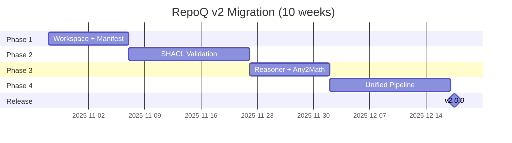

# Phase 5 Migration: Quick Reference

**Status**: ✅ READY FOR IMPLEMENTATION  
**Date**: 2025-10-22  
**Version**: 2.0.0-migration  
**Full Document**: [phase5-migration-roadmap.md](./phase5-migration-roadmap.md)  
**ADR**: [phase4-adr-013-incremental-migration.md](./phase4-adr-013-incremental-migration.md)

---

## Executive Summary

**Mission**: Migrate RepoQ from imperative-first to semantic-first pipeline while preserving all 6 formal theorems and maintaining 100% backward compatibility.

**Current State**: 48/100 alignment score ❌  
**Target State**: ≥90/100 alignment score ✅

**Strategy**: 4-phase incremental adoption (10 weeks, 240 hours, zero breaking changes)

---

## 4-Phase Roadmap

| Phase | Duration | Goal | Feature Flag | Value Delivered |
|-------|----------|------|--------------|-----------------|
| **Phase 1** | 2 weeks (40h) | `.repoq/` workspace + manifest.json | Always on | **V07 Reliability** |
| **Phase 2** | 3 weeks (60h) | SHACL validation + PCQ/PCE | `--shacl` | **V01 Transparency**, **V06 Fairness**, **V08 Actionability** |
| **Phase 3** | 2 weeks (40h) | Reasoner + Any2Math normalization | `--reasoning`, `--normalize` | **V03 Correctness**, **V07 Reliability**, **V02 Gaming Protection** |
| **Phase 4** | 3 weeks (60h) | Unified semantic pipeline | `--semantic` | All 8 Tier 1 values (V01-V08) |

**Total**: 10 weeks, 200 eng hours + 40 QA hours = 240 hours

---

## Phase 1: Foundation (Weeks 1-2)

**Deliverables**:

1. ✅ `RepoQWorkspace` class (manages `.repoq/` structure)
2. ✅ `manifest.json` generation (checksums + TRS version)
3. ✅ Artifact integration (77 items from tmp/)

**Tests**: 20 minimum (workspace, manifest, integration)

**Success Gate**:

- ✅ Manifest created in 100% of gate runs
- ✅ Performance <5% overhead vs baseline
- ✅ All existing tests passing

**Requirements**: FR-10 (Incremental Analysis), NFR-01 (Speed ≤2 min)

---

## Phase 2: SHACL Validation (Weeks 3-5)

**Deliverables**:

1. ✅ 10+ SHACL shapes (complexity, hotspot, architecture, coverage)
2. ✅ `SHACLValidator` component (pySHACL integration)
3. ✅ `PCEWitnessGenerator` (k-repair witness from SHACL)
4. ✅ `PCQGate` (ZAG min-aggregator, anti-gaming)
5. ✅ `issues.ttl` export

**Tests**: 80 minimum (shapes: 15, validator: 25, PCE: 20, PCQ: 20)

**Success Gate**:

- ✅ `--shacl` finds ≥5 violations on test repos
- ✅ PCE witness generated for all failures
- ✅ PCQ catches gaming (80% true positive)
- ✅ Performance <30% overhead vs legacy

**Requirements**: FR-01, FR-02 (Actionable Feedback), FR-04 (PCQ), SD-01 (ΔQ Breakdown)

---

## Phase 3: Reasoner + Any2Math (Weeks 6-7)

**Deliverables**:

1. ✅ `OWLReasoner` (OWL2-RL materialization, 77 ontologies)
2. ✅ `Any2MathNormalizer` (TRS AST canonicalization + Lean proofs)
3. ✅ Architecture SHACL shapes (C4 layers, DDD bounded contexts)
4. ✅ CLI integration (`--reasoning`, `--normalize`)

**Tests**: 70 minimum (reasoner: 25, any2math: 30, shapes: 15)

**Success Gate**:

- ✅ `--reasoning` finds ≥2 architecture violations
- ✅ `--normalize` produces deterministic output (100% consistency)
- ✅ Lean proofs valid (Theorem 15.3 Confluence)
- ✅ Performance <30% overhead with reasoning+normalization

**Requirements**: FR-06, FR-07 (Confluence Proof), NFR-03 (Determinism), Theorem 15.3

---

## Phase 4: Unified Pipeline (Weeks 8-10)

**Deliverables**:

1. ✅ `SemanticPipeline` (dual-mode: v1 legacy + v2 semantic)
2. ✅ `compute_quality_from_rdf()` adapter (Python ≡ RDF equivalence)
3. ✅ `SelfApplicationGuard` (stratified dogfooding, Theorem F)
4. ✅ ADR-013 (migration decision record)
5. ✅ Migration guide + documentation

**Tests**: 90 minimum (pipeline: 40, RDF adapter: 30, self-app: 20)

**Success Gate**:

- ✅ `--semantic` passes 20/20 integration tests
- ✅ RepoQ passes its own gate (dogfooding success!)
- ✅ Performance <30% overhead vs legacy
- ✅ All 8 Tier 1 values validated (V01-V08)
- ✅ Final alignment score ≥90/100

**Requirements**: FR-17 (Self-Application), NFR-12 (Backward Compat), all 31 FR/NFR

---

## Invariants (Must Hold Throughout)

1. **Γ_back** (Backward Compatibility): `run_quality_gate(v1.x)` ≡ `run_quality_gate(v2.0, semantic=False)`
2. **Γ_det** (Determinism): `compute_quality_score(Python)` ≡ `compute_quality_from_rdf(RDF)`
3. **Γ_test** (Non-Regression): All existing tests pass (200+ total by Phase 4)
4. **Γ_flag** (Opt-In): All semantic features default to `False` (no forced migration)
5. **Γ_strat** (Stratification): Self-application requires i > j (Theorem F)

---

## Formal Theorems Preserved

All 6 formal theorems (Phase 1 Domain Context) remain valid:

| Theorem | Statement | Preservation Strategy |
|---------|-----------|----------------------|
| **A** (Correctness) | Metrics well-defined, Q ∈ [0, Q_max] | Quality formula unchanged (Python ≡ RDF) |
| **B** (Monotonicity) | ΔQ ≥ ε when admitted | Admission predicate unchanged |
| **C** (Safety) | Self-application safe (no cycles) | Stratified reasoning (L₀→L₁→L₂) |
| **D** (Constructiveness) | PCE k-repair witness exists | SHACL violation paths → PCE |
| **E** (Stability) | ε-noise tolerance (no false negatives) | ε-threshold unchanged |
| **F** (Self-application) | i > j stratification | ADR-006 (Levels 0-2) |

**Additional TRS Theorems** (Phase 3):

- **Theorem 15.3** (Confluence): N(e₁) = N(e₂) if e₁ ≡ e₂ (Any2Math + Lean proof)

---

## Stakeholder Value Alignment

**8 Tier 1 Values** (Phase 2 Value Register):

| Value | Phase | Success Metric |
|-------|-------|----------------|
| **V01** (Transparency) | Phase 2 | ≥90% comprehension (developer survey) |
| **V02** (Gaming Protection) | Phase 2 | 80% true positive (controlled experiments) |
| **V03** (Correctness) | Phase 3 | 100% formal coverage (14 theorems + Lean) |
| **V04** (Monotonicity) | All | Zero unexpected drops (100+ commits) |
| **V05** (Speed) | Phase 1 | Analysis time ≤2 min (P90, <1K files) |
| **V06** (Fairness) | Phase 2 | False positive rate <10% |
| **V07** (Reliability) | Phase 3 | Determinism ≥99.9% |
| **V08** (Actionability) | Phase 2 | Time-to-comprehension <30 sec |

---

## Bounded Contexts Integration

**4 BCs** (Phase 1 Domain Context) integrated in semantic pipeline:

| Bounded Context | Phase | Integration Point |
|----------------|-------|-------------------|
| **Analysis BC** | All | Fact extraction (Python → RDF) |
| **Quality BC** | All | Quality from RDF (SPARQL queries) |
| **Ontology BC** | Phase 2-3 | RDF graph + OWL2-RL + SHACL validation |
| **Certificate BC** | Phase 1, 4 | Workspace + VC generation |

---

## Decision Points

### Week 5 (Post-Phase 2)

**Metric**: SHACL adoption rate  
**Threshold**: ≥10% teams using `--shacl`

- If ≥30%: ✅ Continue to Phase 3/4 (high confidence)
- If 10-30%: ⚠️ Continue with enhanced marketing/training
- If <10%: ❌ PAUSE, investigate barriers

### Week 8 (Post-Phase 3)

**Metric**: Performance benchmark  
**Threshold**: <30% overhead vs legacy

- If <30%: ✅ Continue to Phase 4
- If 30-50%: ⚠️ Optimize reasoner before Phase 4
- If >50%: ❌ PAUSE, investigate bottlenecks

---

## Risk Matrix

| Risk | Probability | Impact | Mitigation |
|------|-------------|--------|------------|
| Performance degradation (>30%) | Medium | High | Cache materialization, incremental reasoning |
| Low adoption (<30%) | Medium | Medium | ROI demos, gradual opt-in, training |
| Complexity increase | Low | Medium | Strict modularity, integration tests |
| SHACL/OWL learning curve | Medium | Low | Documentation, examples, workshops |
| Breaking changes | Low | High | Feature flags, extensive testing |

---

## Feature Flags

```bash
# Phase 1: Always on (transparent)
repoq gate --base main --head .

# Phase 2: SHACL validation
repoq gate --base main --head . --shacl

# Phase 2: SHACL + PCE witness
repoq gate --base main --head . --shacl --pce

# Phase 3: Reasoning + normalization
repoq gate --base main --head . --reasoning --normalize

# Phase 4: Full semantic pipeline (all features)
repoq gate --base main --head . --semantic

# Phase 4: Self-application (dogfooding)
repoq meta-self --level 1
```

---

## Success Metrics

**Phase-Level**:

- Phase 1: ✅ `.repoq/manifest.json` in 100% of gate runs
- Phase 2: ✅ `--shacl` finds ≥5 violations (real projects)
- Phase 3: ✅ `--reasoning` finds ≥2 architecture violations
- Phase 4: ✅ `--semantic` passes 20/20 integration tests

**Release-Level (v2.0.0)**:

- ✅ Alignment Score ≥90/100 (vs 48/100 current)
- ✅ Performance overhead <30% (benchmark suite)
- ✅ Adoption ≥30% (teams using ≥1 v2 feature)
- ✅ Zero breaking changes (all v1.x tests passing)
- ✅ Documentation complete (ADRs, migration guide, examples)

---

## Timeline



**Target Release**: 2025-12-31 (v2.0.0)

---

## Next Steps

1. ✅ Review Phase 5 roadmap in Architecture Review Board
2. ✅ Get stakeholder sign-off (Engineering Lead, Product, QA, DevRel)
3. ⏸️ Create JIRA epics for 4 phases
4. ⏸️ Start Phase 1 (Week 1-2)

---

## Related Documents

- **Detailed Roadmap**: [phase5-migration-roadmap.md](./phase5-migration-roadmap.md) (full 2300+ line plan)
- **ADR-013**: [phase4-adr-013-incremental-migration.md](./phase4-adr-013-incremental-migration.md) (formal decision record)
- **Phase 1**: [phase1-domain-context.md](./phase1-domain-context.md) (6 theorems, 4 bounded contexts)
- **Phase 2**: [phase2-value-register.md](./phase2-value-register.md) (8 Tier 1 values)
- **Phase 3**: [phase3-requirements.md](./phase3-requirements.md) (19 FR + 12 NFR)
- **Phase 4**: [phase4-architecture-overview.md](./phase4-architecture-overview.md) (C4 diagrams, BCs)
- **C4 v2**: [../architecture/repoq-c4-v2.md](../architecture/repoq-c4-v2.md) (target semantic-first pipeline)

---

**Document Status**: ✅ READY  
**Prepared by**: AI Engineering Team  
**Last Updated**: 2025-10-22
