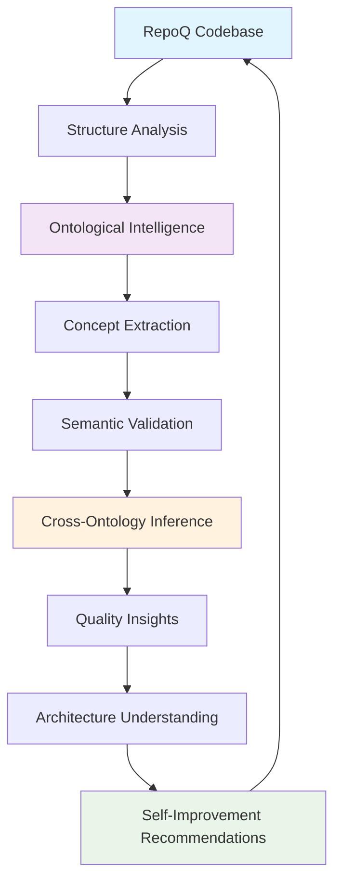

# Ontological Meta-Quality Loop (RepoQ)

> **Purpose:** Make RepoQ self-reflective in a *safe* and *auditable* way: analyze itself, reason ontologically about its own architecture, and use these insights to improve quality monotonically via CI gates.

---

## 1) What is the Meta-Quality Loop?

**Meta-Quality Loop** = RepoQ applying its own analyzers to *RepoQ’s* codebase and writing results into a **meta knowledge graph** (JSON-LD/RDF), then enforcing **policies** (SHACL + VC quality certificates + ZAG PCQ/PCE) so each accepted change *cannot* degrade quality.



**Safety:** We use **stratified self-application** with levels 0..3 — RepoQ-on-RepoQ is allowed only for levels ≤2.

---

## 2) Safe Self-Application (stratified)

```python
class SelfApplicationGuard:
    ANALYSIS_LEVELS = {
        0: "syntax_only",
        1: "structure_safe",
        2: "semantic_limited",
        3: "full_semantic"  # external use only
    }
    @staticmethod
    def is_safe(level: int) -> bool:
        return level in (0, 1, 2)
```

**Policy:** If `analyze_target == self`, then `level <= 2`. Enforced by SHACL (see `shapes/meta_loop.ttl`).

---

## 3) Ontological Intelligence (Code / C4 / DDD)

We map code-level facts (files, classes, imports) to architecture (C4) and domain (DDD) concepts, and validate design using SHACL/SPARQL rules.

- **Code Ontology** → syntax semantics (modules/classes/functions/metrics).
- **C4 Ontology** → system/containers/components/code.
- **DDD Ontology** → bounded contexts, entities, value objects, services.

Artifacts:
- `ontologies/code.ttl`, `ontologies/c4.ttl`, `ontologies/ddd.ttl`
- `ontologies/meta_context.jsonld` (JSON-LD context for cross-ontologies)
- `ontologies/mappings.yaml` (cross-ontology mappings)
- `sparql/inference_construct.rq` and `sparql/quality_checks.rq`

---

## 4) TRS Framework (Term Rewriting)

We include machine-readable TRS rule sets and a minimal engine (for experiments) to ensure **normal forms** of SPDX, SemVer, RDF fragments, metric expressions, and JSON-LD contexts:

- Rules: `trs/spdx.json`, `trs/semver.json`, `trs/rdf.json`, `trs/metrics.json`, `trs/jsonld.json`
- Engine: `repoq/trs/engine.py` (educational, safe; supports basic pattern → replacement style)

Formal properties targeted:
- **Confluence** (critical pairs joinable, by construction & tests)
- **Termination** (well-founded measures per domain)
- **Soundness** (domain-preserving transformations)

---

## 5) SHACL Policies & Shapes

- `shapes/meta_loop.ttl`:
  - `mq:SelfApplicationPolicy` — forbids level ≥3 for self-analysis.
  - `mq:ArchitecturalRules` — basic layering violations (example).
  - `mq:QualityCertShape` — extends VC certificate checks (assurance level, gates attached).

---

## 6) CLI Add-ons (optional)

- `repoq/cli_meta.py`
  - `repoq meta-self --level 2` — safe self-analysis that emits meta JSON-LD and runs SHACL.
  - `repoq trs-verify` — runs TRS confluence/termination heuristics tests on packaged rules.
  - `repoq infer-ontology` — applies SPARQL CONSTRUCT to derive C4/DDD facts from code level.

These commands are designed to be merged into your existing CLI, or run standalone via `python -m repoq.cli_meta`.

---

## 7) Tests

- `tests/test_trs_idempotence.py` — verifies idempotence fixes (e.g., max(A,A)→A).
- `tests/test_self_policy.py` — SHACL validation that prevents unsafe self-analysis.

---

## 8) How to integrate into your repo

1. Copy **this pack** to the repo root (or merge files).  
2. Reference `ontologies/meta_context.jsonld` in your JSON-LD output.  
3. Add a job in CI that runs:
   ```bash
   python -m repoq.cli_meta meta-self --level 2 --out out/meta_quality.jsonld      --validate-shapes shapes/meta_loop.ttl --sparql sparql/quality_checks.rq
   ```
4. Gait PRs by SHACL failures and by ΔQ≥ε (as per your gate).  
5. (Optional) Emit VC certificates for self-analysis and attach `assuranceLevel` based on ZAG validation.

---

## 9) Limitations / Next steps

- The TRS engine here is **educational** (string-pattern style), not an industrial theorem prover.  
- Ontologies are **minimal** for bootstrapping; extend them or link to your canonical vocabularies.  
- For production, integrate a robust reasoner (Jena/RDFLib + SHACL-SPARQL) and keep golden datasets.
